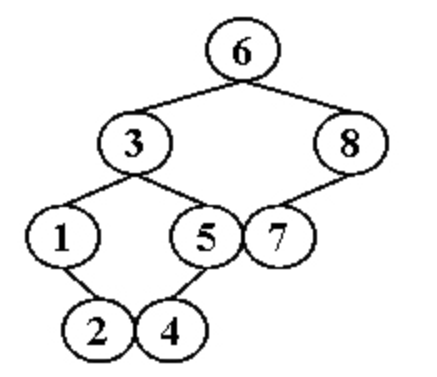

参考书籍：C语言程序设计 何钦铭（第三版）

<hr>

# 一、 数据表达与组织

## 1.1 常量、变量、运算、表达式

**C语言标识符** ：由 `字母` 、 `数字` 、 `下划线` 组成，且必须是 `字母` 或 `下划线` 开头，且 **区分大小写**

标识符分为：

- **关键字（保留字）** ： 如 `typedef` 、`int` 、 `if` 、 `return` 等
- **用户定义的标识符** ： 如定义的函数名等


<br>


**C语言中的数据类型：**

- **整型** 
    - 有符号整形 (`int` 、 `short` 、 `long` 、 `long long` )：int占4字节
    - 无符号整形 ( `unsigned int` 等)
- **字符型 (char)** ：表示单个字符，用单引号占一字节，本质是该字符表示的ASCII值（整型）
    - 'A'：65 ， 'a'：97
- **浮点型(实型)**
    - 单精度float
    - 双精度double    `%08.3f\n` 表示显示8位数（包含小数点）， 不足8位用0填充，且保留3位小数
- **布尔(_Bool)**
    - 1表示 `true` ，0表示 `false` 


<br>


**关于字符串：**

c语言中没有字符串类型，但有字符串的概念，同时 `string.h` 中也有着相关操作字符串的函数

字符串（常量）是以NULL结尾的0个或多个字符组成的序列，常量所以不可修改，并用双引号，例如 `"Hello!"` ， `"123abc\n"`

字符串结尾默认有个空字符 `'\0'`

字符串常量与指针关系密切

因为字符串常量的值，实际上表示的是 **存储这些字符的内存空间的地址** ，更准确地说是 **字符串常量中第 1 个字符的地址** ，而 **不是这些字符本身**

因此，在 C 语言中不能直接进行字符串赋值，常通过声明一个指向 char 类型的指针并将其初始化为一个字符串常量的方式来访问一个字符串：

```c
char *msg = "Hello World!";
 
// 上面的语句也可以拆分成下面两句
char *msg;
msg = "Hello World!";　　　　// 这句话看起来像是字符串赋值，其实不是，只是涉及到指针操作

// 可以进行遍历
while(*msg != '\0'){
	printf("%c ",*msg++);
}
```


<br>


**关于字符数组：**

在 C 语言中，除了字符串常量外， **其他所有字符串都必须存储于字符数组或动态分配的内存中**

定义和普通数组一样，只不过存放的元素是char类型的

```c
// 声明并初始化一个字符数组 下面两个效果一样
char str[] = {'H','e','l','l','o'};    
char str[] = "Hello World!";

// 可以进行修改 将小写变大写
for(int i = 0; i < strlen(str); i++){
	if( str[i] <= 'z' && str[i] >= 'a')
		str[i] = str[i] - 32;
}
```


<br>


**字符串常量和字符数组的区别：**

- 字符串常量是一个字符数组，但是内容和长度在初始化时就已经固定了， **不可更改** ；可以通过一个指向字符串常量第一个元素的指针来访问该字符串常量；

- 字符数组是一个用于存放字符的数组，字符数组的值是 **可以更改的** 


<br>


**关于常量和变量：**

基本数据类型在程序中的具体对象主要是两种形式：

- **常量（constant）** ：程序运行中不能被改变的量

- **变量（variable）** ：程序运行中可以被改变的量

```c
// 声明一个变量
类型说明符 变量名A, 变量名B = B的初始值;
```


<br>


**运算：**

- **算术运算** ：`+` 、 `-` 、`*` 、`/（整除）` 、`%（只用于int）`（当双目运算符两边类型不同时，会自动进行类型转换）
- **赋值运算** ：`=` 左边必须是变量，右边计算完后会自动转化为左边的类型，再赋予左边
- **关系运算** ： `>` 、`<` 、 `!=` 等
- **位运算** ： 按位取反，按位与，左移右移等（操作数的移位不改变原操作数的值，除非通过赋值）

**（重要）运算符的优先级（数字越小越优先）和结合性（没写就是左到右，操作数两边的优先级相同时，先与左边的运算符结合）：**

1. 括号 `[]` 和 `<>` 、成员选择 `.` 和 `->` 
2.  `逻辑非!`     **右到左**
3. `单目-` ， `按位取反~` ， `自增++ 自减--` ，`指针取值*` ， `取地址&` ， `强制类型转换` ， `sizeof`    **右到左**
4. 乘，除，取模
5. 加，减
6. 左移<< ， 右移>> 
7. 大于，小于，大于等于，小于等于
8. 等于，不等于
9. 按位与&
10. 按位异或^
11. 按位或|
12. 逻辑与&&
13. 逻辑或||
14. 三目条件运算符 `?:`    **右到左**
15. 赋值运算符一类，包括 `=` ，`+=` 等    **右到左**
16. `,` 运算符

总结：

- 同一优先级的运算符，运算次序由结合方向所决定

- 简单记： `！> 算术运算符 > 关系运算符 > && > || > 赋值运算符`

- 成员选择比++高，也比*高

-  `*p++` 先*再++ ，虽然++高，但它是后增

    


<br>


**表达式：** 由运算符和操作数组成的有意义的运算式子

- 常量表达式：a

- 算术表达式：a+b

- 赋值表达式：a=1    **计算右边的值，再赋予左边，左边的值就是整个赋值表达式的值**

- 关系表达式：a>b    **关系表达式的值是整型，1或者0**

- 逻辑表达式：a&&b    **可以是任何类型，非0表示真，0表示假**

- 条件表达式：`a?b:c`

- 复合表达式

- 逗号表达式：`a,b` 按顺序执行，整个逗号表达式中每个语句都会被计算到，整个逗号表达式的值为最后一个表达式的值。作为条件的时候，非0真，0假

    ```c
    // 执行时a的值会自增1，b的值也会自增1，最终将b自增后的值赋给变量z
    // 此时z的值为5，也就是最终整个逗号表达式的结果。
    int a = 3,b = 4,z = 0;
    z = ++a,++b;	
    ```

    


<br>


## 1.2 一维和二维数组，字符数组和字符串

**一维数组：**

```c
类型名 数组名[数组长度];

// 初始化
int a[10] = {1, 2};	// a[0]的值是1, a[1]的值是2，其余元素默认是0
```

- 数组名是地址，是存放数组内存空间的首地址
- 数组长度是常量，下标从0~n-1
- 数组中的元素在内存中连续存放，数组名和下标可以唯一确定数组元素


<br>


**一维数组和指针：**

```c
int *p;
int a[10];
 
p = a;    //表示数组首元素的首地址, 等同于&a[0]; 类型匹配,左右两边都是int*型
p = &a;	  //类型不匹配。p的类型是是int*而&a的类型是是int (*)[10] (指向int数组的指针，也即指向整个数组的首地址)
p = &a[0];    //类型匹配

int a[] = {1, 3, 4};
int *p = &a[-1];	// 可以这样 此时*(p+1) = p[1] = a[0] = 1, -1相当于起点偏移 但p[0]还是随机值
```

- a数组名， **只能做右值** ，表示数组元素的首地址，也就是a[0]的首地址
- a[0]，数组的第一个元素，做左值表示第0个元素对应的内存空间，做右值表示第0个元素的值
- &a，常量，只能做右值，表示整个数组的首地址
- &a[0]，[]的优先级要高于&，所以a先和[]结合再取地址，&a[0]做右值时等同于a，表示数组首元素的地址，但是意义不相同


<br>


**二维数组：**

```c
类型名 数组名[行长度][列长度];

// 初始化 按行
int a[4][3] = {{1, 2, 3}, {}, {4, 5}};
int a[4][3] = {1, 2, 3, 0, 0, 0, 4, 5};
```

- 二维数组在内存汇总按行/列优先存放
- 如果初始化时对全部元素赋值，或者分行赋值时列出了全部行，可以忽略行长度
- **一维长度可忽略，二维长度必须有**


<br>


1. 可以在赋值语句中通过赋值运算符 `=` 对字符数组整体赋值 **错误**

    ```
    在赋值语句中通过=对字符数组整体赋值，则就需要用到字符数组名，而对字符数组名进行操作时其会退化为常量指针，而进行赋值时左值必须是可以修改的变量。初始化可以，赋值不行
    ```

    

2. 


<br>


### 计算多维数组中 aij 的地址

**当数组 `a[m][n]` 按行优先**

```
Loc(a[i][j]) = 首地址 + [已经满多少行 + 当前列数] * 每个元素多少字节
```

**当数组 `a[m][n]` 按列优先**

```
Loc(a[i][j]) = 首地址 + [已经满多少列 + 当前行数] * 每个元素多少字节
```


**例题：**

设 `A[5][4][3]` 在内存中首地址为1000，每个元素占2个存储单元，按行优先存储，求`A[4][3][2]`的首地址（A的下标从0开始）

```
三维数组看做层号、行号、列号
那么A[4][3][2]中4、3、2分别对应这个点的层数、行号、列号
4说明之前有4层是满的(0123) 也就是4*(4*3) =  48
3说明之前有3行是满的(012) 也就是3*(3) = 9
2说明之前有2个元素 也就是2
位置为4*(4*3)+3*3+2=59

因此A[4][3][2]的首地址就是1000 + 59*2 = 1118
```


<br>


### 二维数组: 指针、下标表示的关系

**对于 `a[2][3]`**

- 数组名a也是指向第一个数组元素，且二维数组的数组元素在计算机内的内存存放也是连续的
- 和一维不一样的是：a+1的值不是 `&a[0][1]` ，而是`&a[1][0]` (即a+1跳过的不是一个单元，而是一行单元，a+1指向的是第二行第一个元素的地址）
- **若要表示 `a[i][j]` 的地址，应该是 `*(a+i)+j`**

但是注意一、二维数组名一样，虽然a+1的值等于第二行第一个元素的地址，但是使用指针运算符引用 `*(a+1)` 得到值依然只是一个地址。

有说明语句`int a[4][5];`，则`a[2]+3`表示__。 (2分)

`a`数组行下标为`2`、列下标为`3`的元素的地址

```c
*((*a+3)+1)  就是*(*a+4) 就是a[0][4]
*(*(a+2)+3)  a[2][3]
```


<br>


**字符数组**

```c
char str[10];
char t[6] = {'H', 'I'};	// 没赋初始值的元素为0，也就是'\0'

char a[10] = "123"; 	// 正确 定义的时候初始化
char a[10]; a = "123"; 	// 错误  a是数组名 是指针常量 不能赋值
strcpy(a, "123"); 	// 正确 使用strcpy函数复制字符串 且比较要用strcmp
```

- 如果初始化时对所有元素都赋初值，可以忽略数组长度


<br>


### putchar() 和 getchar()

- putchar()：
    - 输出 **单个字符** ，可以填数字，也可以填字符，返回值都是字符
- getchar()：
    - 不带任何参数，用于读取用户从键盘输入的 **单个字符**

```c
// 返回结果 A65
char sum = putchar('A');	// 这个时候就会打出A
printf("%d",sum);	// 输出A的ASCII值

int ch = getchar();	//实际变量ch中放的是读到的那个字符的ASCII码值
putchar(ch);	//putchar接收到一个参数（ASCII码值），输出相对应的字符
```

补充：

- puts()：
    - 将字符串输出到屏幕。输出时只有遇到 `\0` 才停止


<br>


### sizeof() 和 strlen()

- sizeof()：
    - 计算的是分配的数组所 **占的内存空间的大小** ，不受里面存储的内容影响
    - sizeof()算 **字符长度** ， `\n` 、 `\123 、 `\0 都算， **可以看做长度加1** 
- strlen()：
    - **获取字符的个数， 字符串长度**
    - 遇到 `\0` 停止
    - 要求参数是 `char*` (也就是字符数组)类型（string类型可以用 `.size()` ）
    - 需要导入`cstring` 头文件

几个重要的知识点： 

- sizeof(数组名)，表示整个数组的大小
- strlen()从首元素开始数，没有字符串结束标志 `\0` 就是随机值

```c
char str[5] = "abc";
int a = sizeof(str);    // 5
int b = strlen(str);    // 3

char str[] = "abc";
int a = sizeof(str);    // 4
int b = strlen(str);    // 3

char str[]="abc\ndef\0g\123h";
int a = sizeof(str);    // 12 注意\123是一个字符
int b = strlen(str);    // 7

char *s="1234\0 12234";
int a = sizeof(s);	// 8 结果是指针变量的大小
int b = strlen(s);	// 4
```

补充：

- C++中的 `.length()` 只能用于获取字符串长度 (效果和strlen()一样)
- C++中的 `.size()` 除了可以获取字符串长度，还能获取 `vector` 长度


<br>


### strcpy():

声明：

```c
char *strcpy(char *A, const char *s)
```

参数：

- A：目标数组
- s：要复制的字符串常量

返回值：

- 指向最终的目标字符串 A 的指针


<br>


### char * 与 char a[ ]

```c
char  a[10] = "ZJU";	// a是数组名 也是一个指针常量不允许修改，a代表了字符串的首地址
char  *s = a;	// s是指向字符类型的指针 s的值是a[0]的地址 这个地址单元中的数据是一个字符

for(int i = 0; i < strlen(a); i++)
    printf("%c", s[i]);	// 也可以写*s++ (其中++优先于*)

printf("%c", *a);	// 相当于输出a[0]

sizeof(a);	// 输出10 数组空间大小
sizeof(s);	// 输出4 指针的大小（64位结果为8 32位结果为4）
```

- 可以s = a，但不能a = s


<br>


## 习题

1. 【878,2016】已知 ‘9’ 的 ASCII 码是 57，‘a’ 的 ASCII 码是 97，‘A’ 的 ASCII 码是 65。

    以下程序结果是：`a5`

    ```c
    int main() {
        char a[40] = "a\065\0b";
        puts(a);
        return 0;
    }
    ```

    - 八进制转义格式为 `\0hh` ， 即为\0后面为两个数

    - 十六进制转义格式为 `\xhhh` ，即为\0后面为三个数

    - `\065` 发生了转义， 八进制数065转义为十进制数 `53` ，也就是ASCII值为53的字符，也就是 `5` , 后面的 `\0` 为结束符

    

2. 【878，2016】设有如下函数，期望返回一个字符串:

    ```c
    char *p(int n)
    {   ______________________________
        return s+n;
    }
    ```

    该函数内的下划线处填入以下哪个选项时，将 **不能** 正确得到函数返回的字符串？(2分)	**B**

    ```c
    A. char *s="abcdefghij";
    B. char s[]="abcdefghij";
    C. static char s[]="abcdefghij";
    D. char *s; s=(char *)malloc(10); strcpy(s,"abc123");
    ```

    - a中字符串常量是单独有空间存储的
    - b是局部变量，函数返回的指针所指向的是 **栈内** 。而栈内空间在函数调用结束后就被重新利用了，即你指针所指的空间内的数据可能被覆盖或者清空了
    - cd动态分配

    

3. 若有 `char w; int x; float y; double z;` 则表达式 `w*x+z-y` 值的数据类型为 **double**
   
    ```
    计算表达式时，首先要将各个变量强制转化为最高的存储类型
    ```
    
    
    
4. 以下选项中属于非线性结构的是 A

    ```
    A. 广义表
    B. 队列
    C. 优先队列
    D. 栈
    ```

    广义表(Lists，又称列表)是一种非连续性的数据结构，是线性表的一种推广。即广义表中放松对表元素的原子限制，**容许它们具有其自身结构**

    

5. 【878，2019】有以下定义，正确的是  **s1的长度要大于s2的长度**

    ```c
    char s1[ ]="abcdefg";
    char s2[ ]={'a', 'b', 'c', 'd', 'e', 'f', 'g'};
    ```

    - s1是字符串的定义，结尾有个 `\0`
    - s2是字符数组的定义，没有 `\0` ，因此s2的长度比s1要少1

    

6. 【878，2016】设有以下语句，则变量 `c` 的十进制数是： `char a = 3, b = 6, c; c = a^b<<4-2;` **27**

    ```
    运算符优先级应该是减大于左移大于异或，a是0011，b是0110，b先左移两位变为011000，再和a异或得到11011，也就是27
    ```

    

7. `char a[]="ABC\\xyz\007\xFF";` 则 `sizeof(a)` 为 `10`

    ```c
    \007表示八进制7，\xFF表示十六进制FF；
    char a[10]={'A','B','C','\\','X','Y','Z','\007','\xFF','\0'};
    
    \后面的数要么是八进制，要么是十六进制，不可以是十进制
    \101    --------------101是八进制
    \x41    ---------------41是十六进制
    
    注意char 取值范围是：[-128,127]
    -0表示-128(特殊规定)
    补码存储char
    源码存储unsigned char
    unsigned char 取值范围是：[0,255]
     
    char a=-129;  
    printf("%d",a); //会输入多少？？ 结果为 127 ，为什么呢？  
     
    char a=255;
    printf("%d",a);
    结果是-1
    ```
    
    
    
8. 下列能使puts（s）语句正确的输出ABCDE字符串的程序段的是 `C`

    ```c
    A. char s[5]={"ABCDE"};
    B. char s[5]={'A','B','C','D','E'};
    C. char *s;s="ABCDE";
    D. char *s; scanf("%s",s)
    ```

    - char数组最后一位必须是'\0'作为结束符才能正常输出
    - C也反映了“ABCDE”的实质，就是返回一个字符指针而已
    - D，因为这里s只是一个字符指针，读一个字符就结束了

    

9. 【878，2020】下列程序段的输出结果是： `puter`

    ```cpp
    char *s[]={"Zhejiang", "University", "Computer", "Science"};	// 字符指针数组
    printf("%s", *(s+2)+3);	// 改成a[2]+3也可以
    ```

    

10. 


<br>


**字符串**

字符串常量是用 **双引号** 括起来的字符序列，以 `'\0'` 为结束符

字符串"happy"由6个字符组成，有效长度是5

C语言中字符串作为特殊的一维字符数组来处理

```c
// 以下等价
char s[3] = {'g', '0', '\0'};
char s[3] = {"go"};
char s[3] = "go";

char s[80];	// 80不影响, 因为遇到\0就结束了
s[0] = 'g';
s[1] = 'o';
s[2] = '\0';

char *s = "name";
cout << *(s+1);	// 结果是a
cout << s+1; 	// 结果是ame
```


<br>


## 1.3 指针与数组，结构与数组

#### 指针（重中之重）

C语言中，专门用来存放变量地址的变量称为 **指针**

```c
类型名 *指针变量名

// p是一个指针,指向一个int型的变量a（或者说p存放的是int型变量a的地址） a就是一个int型的变量
int a = 3;
int* p = &a;

// 这是一样的
int a = 3;
int* p;
p = &a;

// 如果a是数组名可以这么用, 因为数组名就是地址
int* p = a;

// 就是n
*&n;
```

- 指针本身也是变量，只不过他存放的内容是别人的地址
- `*` 除了定义指针，还用于访问指针指向的变量，也称为 **间接访问运算符**
- *p：a的值
- p：a的地址


<br>


**取地址符合间接访问运算（重要）**

```c
int a = 3, *p;
p = &a;     // p指向a的地址 *p的值和a的值是一样的
printf("a=%d, *p=%d\n", a, *p); // 3 3

*p = 10;    // 修改p所指向的变量的值, 相当于对a赋值
printf("a=%d, *p=%d\n", a, *p); // 10 10

a = 5;
// *p = *p+1或者++*p也是一样的效果
(*p)++; // 将指针所指向的变量+1, 相当于将a+1
printf("a=%d, *p=%d\n", a, *p); // 6 6

// *p++ 先取*p的值,再将p的值(也就是a的地址)+1, 导致p不再指向a
// *p++和*(p++)没有区别 虽然后++优先级高于*，应该先p++,后取值，但因为是后++, 所以先执行*p, 然后等赋值完成以后，p再++
*p++;
printf("a=%d, *p=%d\n", a, *p); // 6 114514
```


<br>


**赋值运算**

只能将一个指针的值（也就是地址）赋给另一个相同类型的指针

```c
int a = 3, *p1, *p2;
p1 = &a;
    
p2 = p1;	// 此时p1和p2都指向a, *p2、*p1、a访问同一个内存单元

// 赋初值
int *p = 1000; // 错误
int *p = 0;	// 正确 此处0就是ASCII的NULL 定义了一个空指针
```


<br>


#### 指针、数组和地址间的关系

数组名本身就是地址，也就是指针的值，在访问内存方面，数组和指针几乎是相同的

数组名可以看做特殊的固定地址

```c
int a[10], *p;

p = a + 1; // 正确
a = a + 1; // 错误
```

- a+i就是距数组a的基地址的第i个偏移
- ***(a+i) 和 a[i] 等价**
- **数组和指针的本质区别** ：数组a是指针常量，不是指针变量
- 如果p指向int型的变量，则p+1就指向int型的下一个变量的内存地址，p的值加上1个int类型的长度（2字节）
- 如果p和q都是指向数组元素的指针，p-q是int型的值， **表示在p和q之间的元素个数**
- 指针的算术运算中：只有2个相同类型的指针相减和指针加上或减去一个整数是合法的，其他都是非法的


<br>


#### 二维数组和指针的转换（重要）

```c
int a[2][3]={1,2,3,4,5,6};
int *p=a;	// 会报错 error: cannot convert 'int [2][3]' to 'int*' in assignment
int (*p)[3] = a;	// 定义了一个指针p, 指向一个类型为int[3]的数组。[]的优先级高于*，()是必须要加的，如果写作int *p[3] 那么应该理解为int *(p[3]) p 就成了一个指针数组, 而不是二维数组指针

// 此时**(p+1)和a[1][0]等价 都是4
// 此时*(*(p+1)+2)和a[1][2]等价 都是6
```

- 此时和一维数组的情况类似
- p是指针，*p是指针取出的值，此处是一个 int数组。也就是说 `*p` 和 `a[0]` 是一致的
- `*(p+1)` 也是一个 int 类型的数组, *(p+1) 和 a[1] 是一致的
- `*(p+1)+1`，相当于把指向 `a[1]` 的指针移动一位，表示 `a[1][1]` 的地址
- 再取值 `*(*(p+1)+1)` 就是 `a[1][1]` 的值

也就是说：

- `p` 和 `p+1` 类型相同是 **指向数组** 的指针
- `*p` 和 `*(p+1) ` 类型相同是 **指向元素** 的指针
- `**p` 和 `**(p+1)`以及 `*(*(p+1)+1) `类型相同是取出的 **数值**
- 二维数组取值公式： ` *(*(p+m)+n)` 相当于 `a[m][n]` ， 此处a是二维数组，p是数组指针，m行号，n列号
- `a[i][j]= *(a[i]+j) = *(*(a+i)+j)`


<br>


#### 指针数组和二维数组指针的区别：

```c
int *(p[10]);  // 指针数组 可以去掉括号直接写作 int *p[10];
int (*p)[10];  // 二维数组指针，不能去掉括号
```

- `int *p[10]` ： 先找到声明符p，然后向右看，有[ ]说明p是个数组，再向左看，是int*，说明数组中的每个元素是int \*，所以这是一个存放int指针的数组。

    指针数组是一个数组，只是每个元素保存的都是指针，以上面的 p 为例，在32位环境下它占用 4×10 = 40 个字节的内存。

- `int(*p)[10]` ：先找到声明符p，被括号括着，先看括号内的(优先级高)，向右看，没有，向左看是*，说明p是个指针，什么指针？再看括号外面的，先向右看，有[ ] 是个数组，说明a是个指向数组的指针，再向左看，是int，说明数组的每个元素是int。所以，这是一个指向存放int的数组的指针。 

    二维数组指针是一个指针，它指向一个二维数组，以上面的 p为例，它占用 4 个字节的内存。
    
    

<br>


#### 数组名作为函数的参数

```c
// 传参时，传的其实是a的基地址，加上[]其实是习惯
int add(int a[], int n){	// int a[]等价于int *a
    int ans = 0;
    for(int i = 0; i < n; ++i)
        ans += a[i];
    return ans;
}	

// 调用
add(b, 10);		// 从b[0]加到b[9]
add(&b[7], k-7);	//从b[7]加到b[k-1] 
add(b+7, 2*k);	// 从b[7]加到b[2*k+6] 
```

- 第二个，从b[7]开始，注意项数是不变的
- 第三个，将b的地址偏移7，也就是从b[7]开始，b[7]传参变成a，函数执行过程中所有地址都会偏移7


<br>


## 1.4 指针与结构，单向链表

#### 结构

自己定义的，包含的分量称为结构成员，可以是任意类型的

```c
// 结构体数组的初始化
struct sturdent{
    int num;
    char name[10];
}sturdents[50];
```

- 结构的定义以分号结束，结构的定义整体是一条语句
- 在嵌套定义时，必须先定义成员的结构类型
- 关键字struct和结构名必须一起用，整体为数据类型名
- 只有相同结构类型的变量直接才可以直接赋值
- 结构体内可以定义函数


<br>


**结构体数组**

对数组元素的成员的引用 数组下标和结构成员操作符组合实现

```c++
sturdents[2].num
```


<br>


#### 结构指针

结构指针就是指向结构类型变量的指针

```c++
struct stundent s1 = {27, "chen"}, *p;
p = &s1;

// 访问成员的两种方式 等价的
(*p).num = 28;	// *p表示p指向的结构变量, 点的优先级高于*, 因此需要括号
p->num = 28;
```

- 对象或结构体用 `.`
- 指针用 `->` 


<br>


**结构指针作为函数参数**

```c++
// 定义
int update_score(struct student *p, int n){
    ...
}

// 使用
update_score(sturdents, n);
```

- 将结构数组的数组名（也就是结构体指针）传给形参p，在函数中就可以通过结构指针p对结构数组中的数据进行间接访问操作了
- 优点：使用结构指针作为参数只需要传一个地址，就可以操作结构体数组


<br>


#### 单向链表（单链表）

下面是一个定义的例子

```c++
// 定义一个Node结构体
struct Node{
    int key;
    struct Node *next;
};

// 创建一个Node结点 c写法
struct Node *p;
p = (struct Node*)malloc(sizeof(struct Node));

// ---------- 分割线 ---------- // 

// 可以typedef起别名
typedef struct Node{
    int key;
    node *next;
    
    // 结构体内定义一个初始化的函数
    node(int _val) : key(_val), next(NULL) {}
}node;

// 创建一个Node结点 c++写法
node* p = new LinkNode(x);
```

- next分量又是该结构类型的指针，称为结构的递归定义（c++在递归定义时可以不加struct）
- 链表相对于数组的优点：不用事先定义大小，可以动态分配，可以方便的插入新元素


<br>


**单链表的基本操作**

1. 遍历

    ```c++
    for(p = l; p; p = p->next){
        ...
    }
    ```

    - 结点在内存中不连续，因此不能用p++


2. 插入结点

    ```c++
    // 将p插到q的后面
    p->next = q->next;
    q->next = p;
    ```

    

3. 删除结点

    ```c++
    // 删除p后面的结点q
    p->next = q->next;
    free(q);
    ```

    

<br>


## 习题

1. 【878，2019】对于以下变量的定义，正确的赋值是： **D**

    ```c
    int *p[3], a[3];
    
    A. p = a
    B. *p = a[0]
    C. p = &a[0]
    D. p[0] = &a[0]	// 和p[0] = a; 一个效果
    E. a = p[0];
    ```

    - p是指针数组名，p的类型是 `int**` 
    - `p[0]` 是指针，类型是 `int*` 
    -  `&a[0]` 在此处等同于 `a` ，都是数组首个元素的地址

    

2. 下面程序的输出是 **12**

    ```c
    int a[12] = {1, 2, 3, 4, 5, 6, 7, 8, 9, 10, 11, 12}, *p[4];
    for(int i = 0; i < 4; i++ )
    	p[i] = &a[i * 3];
    printf("%d\n", p[3][2]);
    ```

    - p是指针数组，数组中的每个元素都是指针

    - 可以看到p[0] = &a[0]，p[1] = &a[3]， p[2] = &a[6]，p[3] = &a[9]

    - 而 `p[3][2]` 根据数组和指针的转换，相当于 `*(p[3] + 2)` 也就是p[3]的值（a[9]的地址）往后移动2个单位（a[11]的地址）的值

    ```c
    p[2]相当于*(p+2)
    p[3][2]相当于*(p[3] + 2)
    ```

     

3. 下列程序的输出结果是 **efgh**

    ```c
    char *fun(char *t){
    	char *p = t;
    	return (p+strlen(t)/2);
    }
    
    int main(){
    	char *str = "abcdefgh";
    	str = fun(str);
    	puts(str);
    }
    ```

    - strlen(t)/2就是t的长度除以2

    - 相当于返回p+4，指针向后移动4位，就是从下标4开始后面的值

    ```c
    char str[] = "abcdefgh";	// str字符数组, 内容可以修改
    char *str = "abcdefgh";		// str是指向字符串的指针, 内容不可修改
    ```
    
    
    
4. 设有如下定义的链表，则值为7的表达式是 **(++p)->n**

    ```c
    struct st{
    	int n;
    	struct st *next;
    }a[3] = {5, &a[1], 7, &a[2], 9, NULL}, *p=&a;	// 这里应该是*p=a比较合理
    ```

    - p指向的是a数组的首地址，++p就是第二个元素，第二个元素的n成员就是7

    ```c
a       表示数组元素的首地址，同时也可做为数组的指针使用	a+1 为数组的第二个元素地址
    &a      表示整个数组的首地址							 &a+1 跳过整个数组后的地址
    &a[0]   表示数组第一个元素的地址						&a[0]+1 同a+1
    ```
    
    

5. 【878，2016】如果有变量定义`char **pp[10];`，那么下面说法正确的是：**D**

    ```c
    A. pp是指向字符指针的指针变量
    B. pp是字符指针
    C. pp[4]是字符指针
    D. pp是数组名
    ```

    - 首先看元素：数组中的元素类型是char**，也就是指针的指针，那么pp是指向（指针的指针）的指针，他是3重指针，也是数组名

    

6. 【878，2017】程序的输出结果是： **cb**

    ```c
    char *s="adc";
    while (*s++) // 遍历字符串 优先级是*大于自增 且在判定完再加1
    	if (*s)     // 只要*s不为空
    		putchar(*s-1);  // 输出前一个字符 dc各自输出前一个字符就是cb
    ```

    

7. 【878，2017】程序的输出结果是：**IRST**

    ```c
    char *c[3]={"FIRST", "SECOND", "THIRD"};
    printf("%s", *c+1);	// 等同于c[0]+1
    
    // 效果类似于
    char *a = "FIRST";
    printf("%s", a+1);
    ```

    - 输出 `*(c+1)` 的结果就是 `SECOND`

    

8. 【878，2017】对于下列数组 `a`, 能正确输出 1~6 某个值的语句是 **A**

    ```C
    int a[3][2]={1,2,3,4,5,6};
    
    A. printf("%d", *(a[1]+3));	// a[1][3]的值 6 看作在a[1][0]的基础上向后走3格？
    B. printf("%d", a[1]+3);	// a[1][3]的地址
    C. printf("%d", *(a[3]+1));	// a[3][1]的值, 但是非法
    D. printf("%d", a[3]+1);	// 同理 a[3][1]的地址
    ```

    

9. 【878，2017】不正确的赋值或赋初值方法是： **C**

    ```c
    char str[]="string";
    char str[7]={'s', 't', 'r', 'i', 'n', 'g'};
    char str[10]; str="string";
    char str[7]={'s', 't', 'r', 'i', 'n', 'g', '\0'};
    ```

    - `char str[10];` 是定义了一个含有十个元素的数组，而且这十个元素在内存中是以连续的存储单元存放的。其中str是该数组的数组名字，也是数组的首地址，数组名是一个指针常量，不能被赋值，不能进行自增自减
    - 这里"string"返回一个指针地址，是连续空间的首地址，‘s’的地址
    - str++也是不对的，str是常量
    - 字符串初始化是合法的，赋值是不行的

    

10. 【878，2017】对于下面定义，赋值不正确的是 **D**

    ```c
    struct Student {
         long num;
         char name[20];
    } st1, st2={101,"Tom"}, *p=&st1;
    
    A. st1=st2
    B. *p=st2
    C. p->num=st2.num
    D. p->name=st2.name
    ```

    - 字符数组不能直接赋值字符数组

    

11. 【878，2018】对于数组 `int a[3][2]`，哪个能正确访问到 `a` 中的元素？**A**

    ```c
    A. a[-1][3]
    B. a[2][2]
    C. a[3][1]
    D. a[0][-1]
    ```
    
    - 对于二维数组 `int a[M][N]` 来说，`arr[i][j]` 的地址是 `(*arr) + i*N + j`，取值就再套一个*
    - 因此A选项 `a[-1][3]` 相当于a+1的值，也就是第二个元素的值，也就是相当于 `a[0][1]`

    

12. 【878，2018】如果 `int a[5], *p = &a[2];`，那么哪个与 `p[1]` 等价？ **a[3]**

        p指向的是a[2]的地址，故p[1]为*p+1, 指向a[3]


13. 【878，2018】对于定义 `char *s, str[10]= "hello";`，下面哪个语句是正确的？ **C**

    ```c
    A. strcpy(s, str);	// 第一个参数需要是字符数组 第二个参数可以是字符数组或者字符串常量
    B. str=s;	// 2边类型都不一样
    C. printf("%s", str+2);
    D. s=str[0]; // 2边类型都不一样
    ```

    

14. 【878，2018】下列程序的输出结果为：`abc:9:3`

    ```c
    char s[]="abc\0d123";
    printf("%s:%d:%d", s, sizeof(s), strlen(s));
    ```
    
     - 字符串以 `\0` 作为结尾
     - sizeof为总空间+1，也就是8+1=9，`\0` 占一个空间
     - strlen遇到 `\0` 停止


15. 【878，2018】对于下面的定义，++p->c的值是多少？ `'b'`

    ```c
    struct S{
         int n;
         char c;
    } st[5] = {1,'A',2,'a',3,'B',4,'b'}, *p = st+1;
    ```

    - 取成员的优先级比++高，p就是st[1]，取成员的结果是 `'a'` ，再++得到结果

    

16. 【878，2018】下列表达式哪个是无意义的？ `A`

    ```c
     A. "Flower"-"Flow"
     B. 'F'-'A'
     C. "Flower"+2
     D. 'A'+3/2
    ```

     -  B是字符之前的距离，结果是5
     - C是字符串从2开始的内容，结果是字符串ower
     - D是字符A的ASCII值+1，也就是65+1，结果是66

    

17. 【878，2019】对于以下定义，表达式 `(x+y)%2+a/(int)b` 的值为 **4** （但我感觉是4.6）
          

       ```c
       int x=3, y=2;
       float a=3.6, b=1.8;
       ```

       - 自动类型转换和强制类型转换
       - 也就是1+3.6结果是4.6

       

18. 【878，2019】对于变量定义 `int *p[3], a[3];` 正确的赋值是 **D**

       ```c++
       A. p = a
       b. *p = a[0]
       C. p = &a[0]
       D. p[0] = &a[0]
       ```

       - p是一维数组名，p是指针的指针，p[0]是一维指针，a是一维指针，a[0]是数
       - D写成p[0] = a也是对的
       - *p就是p[0]

       

19. 【878，2019】经过如下定义时的初始化 `int a[ ][3] = { {1,4}, {3,2}, {4,5,6}, {0} }`，`a[2][1]` 的值是 **5**

    ```c
    // 编译器会自动将没定义的按0填充，相当于
    int a[][3] = {{1, 4, 0}, {3, 2, 0}, {4, 5, 6}, {0, 0, 0}};
    
    // a[2][1] 就是从{4, 5, 6}中取第二个元素 就是5
    ```

    

20. 【878，2019】以下定义中，哪个p不是指针？ **都是指针**

       ```cpp
       char **p; // 指向（指向char的指针）的指针
       char (*p)[10]; // 代表了一个指针，指向一个大小为10的字符数组 注意和下面这个的区别
       char *p[6];	// 代表了一个大小为10的数组，数组的每个元素都是一个字符指针。p是char** 类型的，p中的每个元素是char*类型的
       ```

       

21. 【878，2020】设变量定义为 `char a[20], *p=a;` 下面赋值语句中正确的是 **A**

      ```c++
      A. p= "Zhejiang";
      B. a= "Zhejiang";
      C. *p= "Zhejiang";
      D. a[20]= "Zhejiang";
      ```

      - D选项，a[20]是一个字符怎么能容纳一个字符串？况且a[20]也是不存在的！
      - B选项，a是指针，但是它已经指向在堆栈中分配的20个字符空间，现在这个要让a又指向数据区中的"Zhejiang"常量，这里的指针a出现混乱，不允许！
      - C选项，*p等号右边的得是一个地址

      

22. 【878，2020】设有变量定义： `int a[2][3]={0,1,2,3,4,5};` 下面 4 个表达式中最大的是：**B**

      ```cpp
      A. a[1][2]-2
      B. a[0][3]+1
      C. a[2][-3]
      D. *(*a+3)
      ```

      -  **关键** ： `A[i][j]` 在此处就是第 `i*3+j + 1` 个元素
      - `A[1][2]` 的值是5
      - `A[0][3]` 的值是3
      - `A[2][-3]` 的值是3
      - `*(*a+3)` 就是 `A[0][3]`

    

23. 【878，2020】设 `x`、`y`、`z` 均为 `int` 类型，若表达式 `x||y&&z` 的值为 1，则 **D**

      ```
      A. 若 x 为 0，则 y 和 z 必均为 1
      B. 若 y 和 z 均为 1，则 x 必为 0
      C. x、y、z 必都为 1
      D. 若 x 为 0，则 y 和 z 均不为 0
      ```

      - 由于xyz都是int类型的，所以只要两个不为0的数与或者或都是1

          

24. 【878，2016】则以下表达式中值为 2 的是：	**D**

    ```c
    struct dent {
        int no;
        int *m;
    };
    int a = 1, b = 2, c = 3;
    struct dent s[3] = {{101, &a}, {102, &b}, {103, &c}};
    
    int main()
    {   struct dent *p = s;
        ……
    }
    
    A. *(*(p+1))->m
    B. *(p++)->m
    C. (*p).m+1
    D. *(++p)->m
    ```

    - A选项会报，B选项为1，C选项为1的地址+1，D选项为正确选项。

    

25. 【878，2017】 `while (!x&&!y)` 语句中的表达式 `!x&&!y` 等价于 **B**

    ```C
    A. x=0 && y=0
    B. !(x || y)
    C. !( x==0 || y==0)
    D. !( x==0 && y==0)
    ```

    - 只有x和y都是0，表达式的值才为1，只有B满足
    - 而由于摩根公式 ： (非a)且(非b) = 非（a或b），所以选择B
    - 选项A是赋值运算符而非关系运算符

    

26. 【878，2020】对于以下变量定义，赋值错误的是： **B**

    ```c++
    struct node {
        char s[10];
        int i;
    } p[5];
    char *t= "abc";
    
    A. p[0].i=2;
    B. (p+2)->s=t;
    C. (*p).i=*(t+1)-'a';
    D. *(p->s)= *(t+1);
    ```

    - B 选项 不能把 `char*` 类型赋值给字符数组
    - C选项 t+1是 `bc` ，t+1看做一个整体记为s， `*(t+1)` 就是 `*s` 就是 `*(s+0)` 就是 `s[0]` 就是 `b`

    

27. 【878，2001】设 `char s[10], *p` 则下列最正确的语句为：

    ```C
    A. p = s + 4;
    B. *p = s[0];
    C. s = "graduate";
    D. *s - *p;
    ```

    - A：指针p指向s向后移动4位的位置
    - C：s是数组名，常量不能赋值
    - D：表达式不作为语句

28. 输出结果为 `5  7`

    ```c++
    int a[]={1,3,5,7,9};
    int *b=a+2;
    printf("%d  ",*b++);
    printf("%d",*b);
    ```

    - 优先级是先*再++，先输出a[2]的值，随后再b++，移动到第三个元素，再输出a[3]

    

29. 运行下列程序后b的变量是 `257`

    ```c
    unsigned char a=0;
    int b=1;
    do{
        b++;
        a--;
    }while(a!=0);
    ```

    - unsigned的取值范围是0~255；
    - 0-1=255
    - b = 2,a = 255
    - b = 3,a = 254
    - 当a = 0时循环停止，此时b是257

    

30. 下列那个用法是正确的： `D`

    ```c
    struct st{
    	char name[10];
    	int score;
    }a[3],	*p=a;
    
    A. p->name="name"   // 不可以对字符数组这样赋值
    B.*p.name='B'    // 首先.的优先级高于* , p.name表示的是一个字符数组指针，不可以这么赋值
    C.(*p)->name[0]='c'   // *p等价于a[0]; 这个引用结构体中的变量是用.而不是->;
    D.*(*p).name='D';  // .的优先级大于*，所以这里等于name[0]='D';
    ```

    

31. 对于以下变量定义，表达式 `B` 不符合c语言语法

    ```c
    struct node{
    	int len;
    	char* pk;
    }x={2,"right"},*p=&x;
    
    A:p->pk;  
    B:*p.pk; 
    C:*p->pk; 
    D:*x.pk
    ```

    - 优先级：*小于.小于->
    - p是指针，只用 `->`

    

32. 已知 `char *t={"how","are","you"};` 则t是B

    ```
    A. 指向“how”的指针变量
    B. 指向字符指针的指针常量
    ```

    - 数组名是常量。字符指针指向的是字符串

    

33. 输出的结果是： `ef`

    ```c
    char s[] = "abc\0def\0ghi", *p = s;
    cout << p+5;
    ```

    - `\0` 是一个字符
    - p+5的结果是从e开始的后面的字符串 但读到0时认为字符串结束了

    

34. 


<br>

<br>

<br>


# 二、语句和流程控制

## 2.1分支控制（if、switch）

**if的一般形式：**

```c
if(表达式1) 语句1;
else if(表达式2) 语句2;
else 语句三;
```


<br>


**switch的一般形式：**

```c
switch(表达式){
    case 常量表达式1: 
        语句1; 
        break;
        
    ...
        
    case 常量表达式n:
        语句n;
        break;
    default:
        表达式n+1;
        break;
}
```

- 先求解switch()中的表达式
- 根据表达式的结果，找到对应的case，执行对应的语句段。 **并继续执行下面所有的代码（包括default），直到遇到break或者语句结束**
- 如果case都不满足，就执行default，default可以省略，表示什么都不做

示例：

```c
char grade = 'B'; /* 局部变量定义 */
switch (grade)
{
    case 'A':
        printf("很棒！\n");
        break;
    case 'B':
    case 'C':
        printf("做得好！\n");
        break;
    case 'D':
        printf("您通过了！\n");
        break;
    case 'F':
        printf("最好再试一下！\n");
        break;
    default:
        printf("无效的成绩！\n");
}
printf("您的成绩是 %c！\n", grade);
```


<br>


<br>


## 2.2 循环控制(for、while、do-while)

**for的一般形式：**

```c
// 从哪儿开始；到哪儿结束；步子迈多大
for(表达式1; 表达式2; 表达式3){
	循环体
}
```

执行顺序：

1. 执行表达式1（只在开始时执行1次）
2. 执行表达式2，判断，满足则执行循环体，否则跳出循环
3. 执行循环体内的语句
4. 执行表达式3，更新循环变量
5. 重复2-4，知道循环条件不再满足


<br>


```c
int i;
for(i = 0; i < 10; i++ );  // for后面的;表示的是空语句
    
// 在i=9结束之后, 会继续执行i++使得i变为10, 进入下次循环时, 由于不满足表达式2，循环终止
// 最后i的值为10
printf("%d", i);   
```


<br>


补充：

```c
// 最后i的值为：5
for(i=1; i++ <4; );

// 就是*s !='\0' 就是null 用0也是可以的
for(i=0;*s++;i++)
```


<br>

 


**while的一般形式：**

```c
while(表达式){
	循环体
}
```

- 当表达式值为真时，就执行循环里面的语句
- 当表达式为假时，终止循环执行while的下一条语句


<br>


【2016，878】最后k和s的值为：`-1 6`

```c
int k = 4, s = 0;
while(k--)s+=k;
```

- 第一轮：3 3
- 第二轮：2 5
- 第三轮：1 6
- 第四轮：0 6
- 最后：-1 6 ，  while判断完就结束了


<br>


**do-while的一般形式：**

```c
do{
	循环体
}while(表达式);
```

- 先执行循环体一次，然后判断条件
- 因此 **至少会执行一次循环体**


## 习题

1. 【878，2017】执行下列程序后，s的值是 **6**

    ```c
    int i=5, s=0; 
    
    while(i--)
    	if (i%2) continue; 	// 奇数会continue
    	else s+=i;	// 偶数会加到s上
    ```

    

2. 【878，2019】语句 `for(int i=0,j=10; i=j=10; i++,j--);` 的执行次数是 无限次

    ```
    因为中间的句子是赋值语句, 恒为1
    ```

    

3. 【878，2020】执行完以下语句段后，s的值是

    ```cpp
    int main( )
    {   
        int i=5, s=0;
        do{
            if (i%2) // 是奇数
                continue; // 跳过下面的 直接来到while的判断
            else
                s+=i;
            
        } while (--i);
        
        return 0;
    }
    
    /*
    i=5,s=0 初始
    i=4
    i=4,s=4
    i=3
    i=2,s=6
    i=1,s=6
    */
    ```

    

4. 【878，2016】程序输出结果是： `6#4#`

    ```c
    int k=2, s=0; 
    switch(k) { 
        case 2: 
            s++; 
            k++;
        case 1: 
            s++; 
        case 3: 
            s+=1; 
        switch(s){ 
            case 2: 
                s+=2; 
                break; 
            default: 
                k++; 
                break; // 跳出当前switch
        } 
        default: 
            s+=3; 
    } 
    
    printf("%d#%d#", s, k);
    ```

    - 找到对应的case之后会执行下面的所有代码，包括default

5. 


<br>

<br>

<br>


# 三、程序结构和函数

## 3.1 C程序结构

主函数main() + 若干函数

- 一个C语言程序总是从main函数开始执行的，而不论main函数在整个程序中的位置如何
- 可以用 `//` 对程序进行注释，注释不被编译，不生成目标程序，不影响程序运行结果
  


<br>


## 3.2 函数的定义、参数传递和调用

函数是一个完成特定工作的独立程序模块，分为：

- 库函数
- 自定义函数


一般形式：

```c
函数类型 函数名(形参表){
	函数实现过程
}
```

- 返回值要和函数类型一致
- 每个形参前的类型都必须写


<br>


### 形参和实参

- 从主函数开始，遇到某个函数，就暂停主函数，先执行对应的函数
- 进行函数调用时，实参的 **值** 会依次传给形参，这就是参数传递
- 形参必须是变量，为了接受从实参传来的值
- 实参可以是常量、变量、表达式，当实参是变量时，和对应的形参是两个不同的变量
- **参数传递是值传递，单向的，形参的值在函数中的改变不会影响实参**
- return 只能返回一个值


<br>


## 3.3 函数的递归调用


<br>


## 3.4 变量的存储类别、作用域、全局变量、局部变量

### 局部变量和全局变量：

定义在函数内部的变量称为 **局部变量** ，有效作用范围只在函数内部，形参是局部变量

- 定义在 `main()` 中的变量也是局部变量，作用域只在 `main()` 中，只不过它的生命周期和全局变量一样长而已

定义在函数外的称为 **全局变量** ， 有效作用范围是从定义到程序的结束，对范围内的所有函数都起作用

- 当局部变量和全局变量重名时，在局部以局部变量为主

    


<br>


### 变量生存周期和静态局部变量:

主函数中的所有局部变量一开始就分配存储单元

其他函数只有函数被调用时，形参和局部变量才分配对应的存储单元，函数调用结束，存储单元会被系统回收，因此局部变量也称为 **自动变量**

变量从定义开始分配存储单元到运行结束存储单元被回收，整个过程称为 **变量生存周期**

对于全局变量，生存周期为整个程序执行周期


<br>


**静态局部变量**

存放在静态存储区，不会像普通局部变量因为函数调用结束而被系统回收， **生存周期会持续到程序结束，再次调用还能用上次的值**

```c
static int i = 1;
```

- **局部变量** 如果没有赋初值，在存储单元中是 **随机值**
- **静态变量、全局变量** 如果没有赋初值，将 **自动赋值0** 
- **赋初值只在第一次调用时起作用，之后每次都用上次的值**
- **静态局部变量的生存周期从函数的第一次调用开始，贯穿整个程序**
- 但作用域仍然只在对应函数中，主函数中也不能用


<br>


```c
static int a;
int b;

void func(void){
	static int c;
	int d;
}
```

- a与b都是全局变量，二者的区别是，b可以被别的文件使用，a只能在本文件中使用，这是static对全局变量的作用。
- c和d的区别是，d是一个自动变量，func函数执行完后，d会自动被释放。但c却不会被释放，下一次调用func函数时，c的值会保留上次的值继续使用。


<br>


### 变量的存储类别

保存变量的数据区分为：

- 动态存储区（堆栈）：保存自动变量（局部变量），如果不对它们进行初始化，那么他们可能是任意的随机值
- 静态存储区：保存全局变量、静态局部变量，他们在分配的时候都被系统默认初始化为0


<br>


## 习题

1. 在C语言中，若对函数类型没有显式说明，则函数的隐含类型为 **int** （不是void哦）

2. 实参和其对应的形参各占用独立的存储单元 **正确**

3. 【878，2016】编译运行下列程序的输出结果是： **无法确定**

    ```c
    #include <stdio.h>
    
    void fun(int a, int b, int c) { c = a * b; }
    
    int main() {
        int c;
        fun(4, 3, c);
        printf("c: %d", c);
        return 0;
    }
    ```

    - 由于函数并未改变c的值，所以c为初始值，然而c为局部变量且没有赋初值，故无法确定

        实参只是将值传递给形参，形参在调用函数内的变化，并不会影响到原来的实参，这两个是独立存在的

        

4. 程序输出结果是：==2#4#6#==

    ```c
    int x = 1;
    
    int f(int x) {
        static int k = 0;
        return (k++) + x;
    }
    
    int main() {
        int k;
        for (k = 1; k < 4; k++) printf("%d#", f(k + x));
    }
    ```

5. 如果所有的变量按照下面的程序进行定义和声明，那么在main()函数中所有可用的变量为 ==a,b,z==

    ```c
    void fun(int x)
    {
        static int y;
        ...
        return;
    }
    int z;
    void main( )
    {
        int a,b;
        fun(a);
        ...
    }
    ```

    - 编译器一般不对普通局部变量进行初始化，也就是说它的值在初始时是不确定的，除非对其显式赋值，普通局部变量存储于进程栈空间，使用完毕会立即释放。

    - 静态局部变量使用static修饰符定义，即使在声明时未赋初值，编译器也会把它初始化为0。且静态局部变量存储于进程的全局数据区，即使函数返回，它的值也会保持不变。

        

6. 【878，2018】调用下列函数 `f(f(3))` 的返回值是什么？ ==0==

    ```c++
    int f(int k) {
        int s;
        static int a = 1;
        for (s = 0; a < k; a++) { s = s + a; }
        return s;
    }
    ```

    - a是局部静态变量，在f(3)结束的时候a的值变为3， 且f(3)=3。 
    - `f(f(3))` 执行到for的时候，s赋值为0，a的值为3，不小于k，跳出循环，故返回的值为0。

    

7. 【878，2020】下列程序的输出结果是： ==1 5==

    ```c++
    void fun(int n, int *m)
    {   n=n+2;
        *m += n;
    }
    int main( )
    {   int a=1,b=2;
        fun(a,&b);
        printf("%d %d",a,b);
        return 0;
    }
    ```

    - a 传进去的是值，函数不会影响到a
    - b 传进去的是地址，所以会受到影响

    

    

8. 【878，2017】对于下列递归函数, 调用 `f(16)` 后的输出结果是 ==121==

    ```c
    void f(int x) {
        if (x==0) 
            return;
        else {
            f(x/3); 
            printf("%d",x%3); 
        }
    }
    ```

    - f(16)变为f(5) 和输出 1，再变为f(1)和输出2再输出1，再变为输出121

    

9. 【878，2016】下列程序的输出结果是 ==2#4#6#==

    ```c
    int x=1;
    
    int f(int x) {
        static int k=0;
        return (k++) + x;
    }
    
    int main() {
        int k;
        for(k=1; k<4; k++)
            printf("%d#", f(k+x));
    } 
    ```

    - 循环变量k从1到3，循环执行3次
    - 第一次 执行f(2)，打印2#， 静态局部k变为1
    - 第二次 执行f(3)，打印4#，静态局部k变为2
    - 第三次 执行f(4)，打印6#， 静态局部k变为6

10. 


<br>

<br>

<br>

# 四、输入/输出和文件

## 4.1 标准输入和输出

### 4.1.1 标准输入 scanf()

引入头文件：

```c
#include<stdio.h>
```

一般格式为：

```c
scanf(格式控制字符串, 参数1, …… , 参数n)
    
例如：
scanf("x=%lf", &x);

scanf("%d%d", &n, &m); // 可以正确读入20 30，因为scanf在处理输入时，如果格式占位符不是%c，它就会将空白字符（空格符、制表符和换行符）都视为一次输入的终止标记
scanf("%c %c", &n, &m);// 如果是%c,需要加上空格，否则m会变为空格
```

- 格式控制字符串用 **双引号** ， 包含：
    - `格式控制说明(格式占位符)` ：例如 `int型` 需要 `%d` ，`long long型` 需要 `%lld` ,  `float` 需要 `%f` ， `double` 需要 `%lf`
    - `普通字符` ：原样输入的字符，一般会尽量避免在scanf中使用普通字符
- 参数是变量的地址
- 参数和格式控制说明要一一对应


补充：

```cpp
scanf(" %c %c", &n, &m); // 第一个%c前还要加一个空格, 为了防止读入换行符\n （清空缓冲区）
```


<br>


### 4.1.2 标准输出 printf()

引入头文件：

```c
#include<stdio.h>
```

一般格式为：

```c
printf(格式控制字符串, 参数1, …… ，参数n)
    
// 输出浮点型时的格式控制
%+a.bf    
%-a.blf
a:输出数据的宽度 不足补空格
b:小数位
+: 右对齐 不写默认是右对齐
-: 左对齐
printf("%3.3lf\n",1.3345);    //有效小数位数是 3 位 最后一位5没有打印,四舍五入往前进了一位
```

- 格式控制字符串用 **双引号** ， 包含：
    - `格式控制说明(格式占位符)` ：例如 `int型` 需要 `%d` ， `float` 和 `double` 需要 `%f`
    - `普通字符` ：原样输出的字符
- 参数是输出的数据，可以是常量、变量、表达式
- 参数和格式控制说明要一一对应


<br>


格式占位符：

| **%d or %i** |   **于有符号整型**   |
| ------------ | :------------------: |
| %o           |    八进制输出整数    |
| %x           |   十六进制输出整数   |
| **%c**       |     **用于字符**     |
| %u           |    用于无符号整型    |
| **%f or %F** |   **用于单浮点数**   |
| **%lf**      | **用于双精度浮点数** |
| **%s**       |    **用于字符串**    |


<br>


| 常用的转义字符 |                   效果                   |
| :------------: | :--------------------------------------: |
|       \n       |                   换行                   |
|       \r       | 换行(回到当前行首)，判断按键是否是回车键 |
|       \t       |                 水平制表                 |


<br>


### 习题：

1. `printf("%x\n",(0x19<<1)&0x17); `  输出`12`

      ```c
    %x 输出16进制，式子里也是16进制的位运算
    0x19就是:0001 1001
    左移一位:0011 0010
    0x17就是:0001 0111
    与一下输出就是12
    ```

      

2. 语句 `printf("%%d%d", 123)` 将输出 `%d123`

       ```c
    开头%d%d将会输出字符串%d
    后面的%d正常输出
       ```

   ​    

3. c语言中 `scanf（"%2d%*2d%2d", &a,&b）;` 若要输入`123456789` 则变量a和b分别为 `12和56`

     ```c
    scanf可以指定输入的宽度，比如scanf（"%2d",&a）就是把输入数据的前两位赋值给a。
    scanf可以用“*”跳过指定的宽度，比如scanf（“%2d%*2d%2d”，&a，&b）；
    就是把输入数据的前两位12赋值给a，然后跳过34两位，最后把下面两位56赋给b。
    scanf函数遇到空格和非法输入时结束，并且可以指定输入宽度。
    
    fprintf(fp,"%3c",'1')
    输入到文件中是_ _ 1，左边补齐2位空字符
    ```

     


<br>


## 4.2 文本文件和二进制文件

### 4.2.1 文件的定义：

C语言中的文件类似于数组、结构等，是一种数据组织方式，是C语言程序处理的对象

C语言把文件看作数据流，并按一维方式组织存储（像磁带）


<br>


### 4.2.2 文本文件、二进制文件

**文本文件/字符文件** ： 以字符ASCII码值进行存储和编码的文件，内容就是字符

**二进制文件** ： 存储二进制数据的文件

C语言的 **目标文件（.o）** 和 **可执行文件（.exe）** 是二进制文件，包含给计算机识别的机器代码


<br>


## 4.3 文件打开、关闭、读写和定位

**文件缓冲系统：**

进行文件操作时，在程序和文件之间的一个内存缓冲区，来进行数据交换

缓冲文件系统中，系统 **自动分配** 一块文件缓冲区（内存单元），且数据处理只考虑文件缓冲区即可，内存和磁盘之间是操作系统的事


<br>


### 4.3.1 文件处理步骤

1. 定义文件指针  `FILE *fp` ，fp为指向文件结构的指针， 注意不能用fp++和*fp
2. 打开文件：文件指针指向磁盘文件缓冲区
3. 文件处理：对文件进行读写操作
4. 关闭文件


<br>


### 4.3.2 打开文件

打开文件操作由 `fopen()` 实现

```c
FILE *fp;
fp = fopen("文件名", "文件打开方式");
```

- 成功，返回包含文件缓冲区等信息的FILE结构地址，赋给文件指针fp；
- 否则（文件不存在，被其他软件打开，本身错误等等）返回一个 **NULL** 的FILE指针
- 文件名是字符串，指明文件的路径：默认是当前的文件夹，否则就是完整路径，例如 `c:\\abc.txt` 此处用了转义符

关于文件打开方式：

（下面是 **文本文件（ASCII）** 的文件打开方式）：

| 使用方式 |           含义           |
| :------: | :----------------------: |
|    r     |   打开文件， **只读**    |
|    w     | **新建** 文件， **只写** |
|    a     |   打开文件， **追加**    |
|    r+    |     打开文件，读/写      |
|    w+    |   **新建** 文件，读/写   |
|    a+    |   打开文件，读/写/追加   |

- 只有w是新建，其他都是打开
- +代表功能的增加
- 对应的换成二进制文件只要加个b，例如从 `w+` 变为 `wb+`
- 文件打开的实质是将磁盘文件和文件缓冲区对应
- 打开之后，对文件的读写操作只需要使用文件指针，且已经打开，操作方式就已经被确定，关闭之前都不能改变
- 可以同时打开多个文件，但不允许同一个文件在关闭之前被再次打开
- 以a打开文件时，文件指针指向文件最后位置


<br>


例如打开文件abc.txt，只读的两种方式：

```c
fp = fopen("abc.txt", "r");	// 字符串常量代表文件

char *p = "abc.txt";	// 字符指针表示文件
fp = fopen(p, "r");

if((fp = fopen("abc.txt", "r")) == NULL){
   	文件出错;
    exit(0);	//exit(0) 是系统标准函数, 关闭所有打开的文件并终止程序。0表示正常结束, 其他表示非正常结束
}
```

补充：

- `exit(0)` ：正常运行程序并退出程序
- `exit(1)` ：非正常运行程序导致退出程序
- `return()` ：返回函数，如果是主函数，则退出函数并返回一值


<br>


### 4.3.3 关闭文件

数据写入文件，首先是先写到文件缓冲区，缓冲区满（512B）才真正写到磁盘

在写满之前程序中止，这部分数据就会丢失

文件关闭可以强制使缓冲区中的数据写入磁盘

关闭文件操作由 `fclose()` 实现

```c
fclose(文件指针);
```

- 返回值为整数，0表示正常关闭，失败返回-1（EOF）
- fclose() 将释放文件缓冲区单元和FILE结构，解除文件和文件指针的关联
- 文件使用结束完要及时关闭文件


<br>


### 4.3.4 文件读写

标准库stdio.h中的一些函数

#### 字符方式文件读写 fgetc() 和 fputc()

对于文本文件，操作的数据都是ASCII字符文本


```c
// 从fp指向的文件中读一个字符到ch
// 成功, 返回写入文件的字符的ASCII码, fp就会自动移到下一个位置。 失败, 返回EOF
// 补充：类似getchar(), 从键盘中读一个字符
ch = fgetc(fp);	

// 将ch写到fp所指的文件
// 成功返回ch, 失败返回EOF(值为-1) 
// 补充：类似putchar(), 将ch显示在屏幕
fputc(ch, fp);	
```

- 文件缓冲区中的位置会随着fgetc()和fputc()而自动改变
- 实际上是对文件缓冲区进行读写
- 不要在程序中用fp++来改变文件缓冲区的位置，fp指向的是文件结构

实现从A文件写数据到B文件：

```c
#include<stdio.h>
#include<stdlib.h>

int main(void){
    FILE *fp1, *fp2;
    char ch;
    
    // 打开两个文件
    if((fp1 = fopen("a.txt", "r")) == NULL){
        printf("a错误！\n");
        exit(0);
    }
    if((fp2 = fopen("b.txt", "w")) == NULL){
        printf("b错误！\n");
        exit(0);
    }
    
    // 进行复制 
    while(!feof(fp1)){  // feof()判断是否到了文件尾
        ch = fgetc(fp1);
        if(ch != EOF)   // 因为feof()在末尾之后再一个循环才会变成true 例如最后一个字符是'a'，此时feof是false，再读一次返回EOF，feof才是true
            fputc(ch, fp2);
    }
    
    // 关闭文件
    if(fclose(fp1)){
        printf("a 无法关闭！\n");
        exit(0);
    }
    if(fclose(fp2)){
        printf("b 无法关闭！\n");
        exit(0);
    }
    
    return 0;
}
```


<br>


#### 字符串方式文件读写  fgets() 和 fputs()

读写文件时以字符串为单位

```c
fgets(s, n, fp);	// 从文本中读字符串
```

- s不能为字符串常量
- fp是文件指针
- n为读取的字符个数， **最多读取n-1个字符** ，并存入s指向的内存地址开始的n-1个连续单元
- 到指定个数、遇到换行符、EOF时，自动加上一个 `\0` ，换行符会保留，EOF不会保留
- 成功返回字符串指针
- 失败返回空指针，此时s中的内容不确定


```c
fputs(s, fp); 	// 向文件中写入字符串
```

- s可以是字符数组名、字符型指针变量、字符串常量
- fp是文件指针
- 写入的时候字符串结束符 `\0` 不写入
- 成功返回最后一个字符
- 事变返回EOF


<br>


#### 格式化方式读写 fscanf() 和 fprintf()


```c
fscanf(文件指针, 格式化字符串, 输入表);
fprintf(文件指针, 格式化字符串, 输入表);

// 从文件中读入整形n, 浮点型x
fp = fopen("a.txt", "r");
fscanf(fp, "%d%f", &n, &x);

// 将n和x写入文件
fp = fopen("b.txt", "w");
fprintf(fp, "%d%f", n, x);
```

- 类似于scanf()和printf()
- 格式转化计算机会自动完成


<br>


#### 其他相关函数：

和文件定位相关的函数：

- `rewind()` ：回到文件的首地址 `rewind(FILE *fp);`
- `fseek() ` ：控制文件读写指针移动 `fseek(fp, offset, from);` from可取012，表示开头、现在和末尾
- `ftell()` ：获取当前文件读写指针的位置，即相对开头的位移量 `ftell(文件指针)` 一般用于返回文件长度

检测文件指针状态的函数：

- `feof()` ： 判断是否读到了EOF，成功返回true，未到文件末尾返回0
- `ferror()` ： 用于检查调用输入输出函数时出现的错误。
- `clearerr()`


<br>

例子：

```C
/*
 * 把文本文件input.txt中的所有字母修改成另一个字母并输出到output.txt中
 * 规则：
 *      a变z, A变Z, 其余都变成它前一个字母, 大小写不变
 * 例如：
 *      "An.13zyaZ" 变为 "Zm.13yxzY"
 */

#include <stdio.h>
#include <stdlib.h>

int main() {
    FILE *fp1, *fp2;
    char c1, c2;
    if((fp1 = fopen("D:\\input.txt", "r")) == NULL || NULL){
        printf("不能打开input.txt！");
        // exit(0);
        return 0;
    }

    if((fp2 = fopen("D:\\output.txt", "w")) == NULL || NULL){
        printf("不能打开output.txt！");
        // exit(0);
        return 0;
    }

    // 写法一：如果这么写
    c1 = fgetc(fp1);
    while(!feof(fp1)){  // 或者c1 != EOF 
        
		// 这里就是处理字符的逻辑
        
        fputc(c2, fp2);
        c1 = fgetc(fp1);	// 就要有这个
    }
    
    // 写法二:
    while((c1 = fgetc(fp1)) != EOF){
        
        // 这里就是处理字符的逻辑

        fputc(c2, fp2);
        // c1 = fgetc(fp1); 这个就要去掉
    }

    // 关闭两个文件
    fclose(fp1);
    fclose(fp2);
    
    fp1 = NULL;
    fp2 = NULL;

    return(0);
}
```


<br>

### 习题

1. 【PTA】 `printf("%d %d %d", NULL, '\0', EOF);` 的结果是： **0 0 -1** 

    ```
    0 、'\0' 、NULL在数值上都是0, NULL代表空指针
    ```

    

2. 如果二进制文件a.dat已经存在，现在要求写入全新数据，应该用 **"wb"** 方式

3. `FILE *fp;` ，则文件指针指向的是 **文件类型结构**

4. 缓冲文件系统的文件缓冲区位于 **内存缓冲区中**

5. 文件的三大特征： **名称、大小、类型**

6. `fopen()` 的返回值是 **指向文件缓冲区的首地址的文件结构类型指针**

7. 缓冲文件系统和非缓冲文件系统的区别： **系统是否为文件自动分配一块文件缓冲区（内存单元）**

8. 【878，2017】想以可读可写而不清空原文件的方式打开 `D` 盘中的一个文件 `abc.txt`，下面函数调用正确的是 **C**

    ```c
    A. fopen("D:\user\abc.txt","r+");
    B. fopen("D:\user\abc.txt","w+");
    C. fopen("D:\\user\\abc.txt","r+");
    D. fopen("D:\\user\\abc.txt","w+");	// 会清空原文件
    ```

    

9. 以下`scanf`函数调用语句中不正确的是 **C**

    ```c
    struct pupil {
        char name[20];
        int age;
        int sex;
    } pup[5], *p=pup;
    
    scanf("%s", pup[0].name);
    scanf("%d", &pup[0].age);
    scanf("%d", p->age);	// 这个不是地址
    scanf("%d", &(p->sex));
    ```

    

10. 【878，2018】如果函数 `void fcopy( FILE *t, FILE *s )` 将文件 `s` 的内容拷贝到 `t`，则下面哪个是正确的调用？ `C`

    ```c
    FILE *fp1, *fp2;
    fp1 = fopen("D:\\user\\abc1.txt","r");
    fp2 = fopen("D:\\user\\abc2.txt","w");
    
    A. fcopy( fp1, fp2 );
    B. fcopy( stdin, stdout );
    C. fcopy( fp2, stdin );
    D. fcopy( stdin, fp1 );
    ```

    - 这题的意思就是看看哪个不报错
    - fcopy() 将第二个参数的内容拷贝到第一个参数
    - stdin是读，stdout是写，fp1是只读，fp2是新建，写
    - 只有c是不报错的

    

11. 【878，2016】运行下列程序，得到文件的内容是： **in_C_is_fun** 

       ```c
       void fun(char fname, char st) {
           FILE *myfile;
           int i;
           myfile = fopen(fname, "w" );
           for (i=0; i<strlen; i++)
               fputc(st[i], myfile);
           fclose(myfile);
       }
       
       int main() {
           fun("f", "Programming");
           fun("f_", "in_C_is_fun");
           return 0;
       }
       ```

       - w 新建、写文件，若文件存在则文件长度清为0，故文件中只有第二个字符串

       

12. 【PTA】已知函数的调用形式 `fread(buffer, size, count, fp);` 其中buffer代表的是 **D**

      ```C
      A. 一个文件指针，指向要读的文件
      B. 一个整数变量，代表要读入的数据项总数
      C. 一个存储区，存放要读的数据项
      D. 一个指针，指向要读入数据的存放地址
      
      // size是要读写的字节数 count是要进行读写多少个size字节数据项 fp是指文件型指针。
      ```

      

13. 【PTA】利用函数fseek可实现的操作是 **A**

      ```
      A. 以上答案均正确
      B. 文件的随机读写
      C. 改变文件指针fp的值
      D. 文件的顺序读写
      ```

      

14. 以下可作为函数fopen中第一个参数的正确格式是

      ```C
      A. c:\user\text.txt
      B. "c:\user\text.txt"
      C. c:user\text.txt
      D. "c:\\user\\text.txt"
      ```

      

15. 如果二进制文件a.dat已经存在，现在要求写入全新数据，应以 **wb** 方式打开

16. 缓冲文件系统的文件缓冲区位于 **内存数据区中**

17. 【PTA】直接使文件指针重新定位到文件读写的首地址的函数是 **rewind()**

18. 【PTA】函数fgetc的作用是从指定文件读入一个字符，该文件的打开方式可以是 **读或者读写**

19. 【PTA】若以“a+”方式打开一个已存在的文件，则以下叙述正确的是 **B**

      ```
      A. 以上各种说法都不正确
      B. 文件打开时，原有文件内容不被删除，位置指针移到文件末尾，可作添加和读操作
      C. 文件打开时，原有文件内容被删除，只可作写操作
      D. 文件打开时，原有文件内容不被删除，位置指针移到文件开头，可作重写和读操作
      ```

      

20. 【PTA】`fgets(s,n,fp);` 语句用来从fp所指示的文本文件中读取字符串s，该语句最多读取 **n-1** 个字符。

     

21. 【PTA】文件指针指向文件缓冲区中文件数据的存取位置 **错误**

     ```
     文件指针是指向一个文件的指针，确切的是存放了用文件这个结构体所定义的对象的起始地址，文件指针的移动是指在文件之间来移动。
     ```

     

22. 


<br>

<br>

<br>


# 五、编译预处理和命令行参数

## 5.1 宏定义和宏函数

### 5.1.1 宏定义

通常用于符号常量定义，实现简单函数，或者为了书写更方便

目的为了增强代码可读性，减少函数调用成本

**格式：**

```c
#define 宏名 宏定义字符串
```

- 在编译预处理中起作用（编译时，将代码中有宏名的地方用宏定义字符串来 **替换** ），不是真正的C语句
- 末尾没有分号（有分号的话分号也会替换进去）
- 宏名中间无空格，宏定义字符串随意，回车符作为结尾
- 如果一行太长，可以用 `\` 下一行继续写

**可宏嵌套定义：**

```
#define PI 3.14
#define S PI*r*r
```


<br>


### 5.1.2 宏函数

```c
#define MAX(a, b) a>b?a:b

x = MAX(x, y);
```

**和函数调用的区别：**

- 宏定义在编译预处理时完成，进行替换。**宏定义只做替换，不做计算**
- 函数调用在程序执行时才进行，并且传参，**计算表达式后返回**

**为了防止出错，要加括号：**

```c
// y会变成x+y*x+y 出错
#define SQR(x) x*x
y = SQR(x+y);

// 替换时括号会保留 这样就不会出错
# define SQR(x) (x) * (x)
```

**配合逗号表达式：**

```c
// 这样会出错
#define ALERT(str)  {putchar('\a');puts(str);}
// 替换的结果为 if(1) {putchar('\a');puts(str);}; 多了一个分号
if(1) ALERT("hhh");

// 正确 整个逗号表达式中每个语句都会被计算到 
#define ALERT(str)  {putchar('\a'),puts(str);}
// 替换的结果为 if(1) {putchar('\a'),puts(str);};
if(1) ALERT("hhh");
```


<br>


## 5.2 typedef关键字

typedef 的作用是起别名

```c
// 一般用法
typedef  旧名字  新名字;

// 例子
typedef int *INTEGER;
INTEGER a, *b;	// 等价于int* a,*b;
```

- 相当于给int*起了个别名叫INTEGER
- a是 `int` 型的指针变量
- b是指向「指向整型的指针」的指针


<br>


和数组一起用

```c
typedef int arr[5];
arr a;	//定义了一个有5个int型变量的数组a
```


<br>


### 5.2.1 和宏定义的区别

- typedef 仅限于为数据类型定义符号名称，#define 不仅可以为类型定义别名，也能为数值定义别名
- 宏定义只是简单的字符串替换，由预处理器来处理
- 而 typedef 是在编译阶段由编译器处理，它并不是简单的字符串替换，而给原有的数据类型起一个新的名字，将它作为一种新的数据类型
  


<br>


## 5.3 命令行参数和使用

C语言源程序经过编译和连接生成可执行文件（可执行程序/可执行命令）后，可以在操作系统环境中用命令方式来执行

例如用命令 `test` 来执行当前目录下的 `text.exe`

而一个命令行中可以包括命令和参数（也可没用，用空格分开），这些参数就是 **命令行参数**

```
命令 参数1 参数2 
```

C语言中主函数可以有两个参数：

```c
int main(int argc, char *argv[]){}
```

- argc 为命令行参数（包括命令）的个数
- argv 以字符串常量方式存每个命令行参数：argv[0]是命令，argv[1]是参数1……
- argv实际上还是指针，指向数组的首地址，*argv是命令行参数，可以修改 `*(argv++)`
- 可以取其他名字，这两个是约定俗成


<br>


例如：

echo.c:

```c++
#include<stdio.h>

int main(int argc, char *argv[]){
	// 打印命令行参数
	for(int k = 1; k < argc; k++)
		printf("%s", argv[k]);
		
	return 0;
}
```

命令行下输入：

```
echo are you ok？
```

输出

```
are you ok？
```


<br>


## 5.4 习题

1. 【878,2016】如果有宏定义 `#define MUL(x,y) (x*y);` 那么表达式 `MUL(MUL(2+3,6),4+2)-7` 的值是：**75**

    宏展开时， **从内到外** 例外：遇到“#”开头的宏就不再往内检查，从该层开始往外展开。

    ```c
    MUL(MUL(2+3,6),4+2)-7
    MUL((2+3*6),4+2)-7
    ((2+3*6)*4+2)-7
    ```

    

1. 【878，2016】假如下面程序的源程序文件名是 `echo.c`，编译链接后的可执行程序文件名是 `echo.exe`，那么执行命令 `echo How Are You?` 的输出是：**oe?d!**

    ```c
    #include <stdio.h>
    int main(int argc, char *argv[])
    {   int k, i=0;
        static char s[10]= "Good!";
        for(k = 1; k <argc; k++)  s[i++] = *(argv[k]+k);
        printf("%s", s); 	
        return 0;
    }
    ```

    - argv[1]的内容是 `How` ， argv[2]的内容是`Are` ， argv[3] 的内容是 `You?`
    - `*(argv[k]+k)` 就是 `argv[k][k]`

    

1. 【878，2002】执行 `find -nx ould text.txt` 时，`*++argv[1]` 的值 `n`

    ```
    argv[]是输入字符串
    argv[0]或者argv是输入的第一个字符串 就是find
    而*++argv[1]就是第二个字符串的下标为1的字符的值
    ```

    

1. 


<br>


<hr>


<br>


# 六、基本算法设计与程序实现

## 简单排序算法

### 插入排序


<br>


### 选择排序


<br>


### 冒泡排序


<br>


## 二分查找

指针和数组的应用

```c
#include <stdio.h>

int a[10] = {1, 2, 3, 4, 5, 6, 7, 8, 9, 10};
int x, m;

// 二分查找 用循环实现了递归
int Bsearch(int *p, int n, int x){
    int low = 0, high = n - 1, mid;
    
    while(low <= high){
        mid = (low + high) / 2;
        if(x == p[mid])
            break;
        else if(x < p[mid])
            high = mid - 1;
        else 
            low = mid+1;
    }
    if(low <= high) return mid;
    return -1;
}

int main(){
    printf("查找X:");
    scanf("%d", &x);
    
    m = Bsearch(a, 10, x);
    
    if(m >= 0)
        printf("Index is %d\n", m);
    else 
        printf("Not Found\n");
        
    return 0;
}
```

- a作为实参，在函数中就能访问a数组中的元素，并且也能改变单元的内容
- 可以采用数组形式，也可采用指针形式，例如 `p[mid]` 等价于 `*(p+mid)`


<br>

<br>

<br>


# 填空题

## 2016

### 4-4 先序中序建树

给定一棵树的先序遍历序列为 { 1 2 3 4 6 7 5 }，后序遍历序列为 { 2 6 7 4 5 3 1 }，建树


<br>


### 5-1 约瑟夫环问题

一群猴子要选新猴王。新猴王的选择方法是：让 `n` 只候选猴子围成一圈，从某位置起顺序编号为 1~`n` 号。从第 1 号开始报数（从 1 到 4），凡报到 4 的猴子即退出圈子，接着又从紧邻的下一只猴子开始同样的报数。如此不断循环，最后剩下的一只猴子就选为猴王。以下程序采用单循环链表模拟了这个过程，`KingOfMonkey` 函数返回猴王编号。请在空缺处填上正确的代码。

```c++
// 约瑟夫环问题

typedef struct node    
{   int number; /*猴子的编号*/
    struct node *next; /*指向下一只猴子的指针*/
} linklist;

int steps = 4; /*报数到这个定数(正整数)，确定下一只出局的猴子*/
linklist *CreateCircle(int n); /*创建有n个编号的无头结点单循环链表*/
int KingOfMonkey(int n, linklist *head);

int main()
{   linklist *head;
    int n;
    scanf("%d",&n); 
    if (n>0){    
        head = CreateCircle(n);
        printf("%d\n", KingOfMonkey(n,head));
    }
    return 0;
}

linklist *DeleteNext(linklist *p) /* 删除单循环链表的p所指的下一个结点 */
{   linklist *s;
    if ( p && p->next!=p ) { 
        s=p->next;	// 此处为空
        p->next = s->next;
        free(s);  
        return p->next;
    }else if (p){
        free(p);  
        return NULL;
    }else 
        return NULL;
}

int KingOfMonkey(int n,linklist *head)
{   linklist *p = head;
    int i, j;       
    for(j=1; j<=n-1; j++){   
        for(i=2; i<steps; i++)  p=p->next;
        p=DeleteNext(p);	// 此处为空
    }   
    return p->number;	// 此处为空
} 
```


<br>


### 5-2 有理数加法

假如有理数类型定义如下：

```c++
typedef struct
{   int n; /*numerator,分子，允许是负数*/
    int d; /*denominator，分母，大于0；且n和d没有大于1的公因子*/
} RATIONAL;
```

下面是两个有理数的加法函数 `AddR()` 以及相关的另两个函数代码，请对程序填空。

```c++
unsigned int gcd( int x, int y); /*求最大公因子*/
RATIONAL Simplify(RATIONAL a); /*有理数约简，如6/9约简为2/3*/
RATIONAL AddR(RATIONAL a, RATIONAL b) /*有理数相加，如：1/2+2/3=7/6 */
{   RATIONAL t;
    a = Simplify(a); b = Simplify(b);
    t.n = a.n*b.d+b.n*a.d;	// 此处为空
    t.d = a.d * b.d;
    return Simplify(t);
}
RATIONAL Simplify(RATIONAL a) /*化简有理数*/
{   RATIONAL t;
    int divisor = gcd(a.n, a.d);	// 此处为空
    t.n =  a.n / divisor;
    t.d = a.d / divisor;
    return t;
}
unsigned int gcd(int x, int y) /*y>0; 求|x|与y的最大公因子*/
{   int r;
    if ( x < 0 ) x = -x;
    while(1)
    {   r = x % y;
        if (r == 0) return y;
        x = y;
        y = r;	// 此处为空
    }
}
```


<br>


### 5-3 拓扑排序

下列代码的功能是对一个给定的图`G`执行拓扑排序，其中`TopNum[]`从 1 开始记录拓扑序。请完成程序填空。

```c++
void Topsort( Graph G )
{   Queue Q;
    Vertex V, W;
    NodePtr ptr;
    int counter = 0;
    Q = CreateEmptyQueue(G->NumV); /*初始化队列*/
    for ( V=0; V<G->NumV; V++ )
        if ( Indegree[V] == 0 ) /*Indegree[V]记录V的入度*/
            Enqueue(V, Q);
    while ( !IsEmpty(Q) ){
        V = Dequeue( Q );
        TopNum[V] = ++counter;	// 此处为空 这里TopNum[]记录是顺序
        for ( ptr=G->List[V]; ptr; ptr=ptr->Next) {
            W = ptr->Vert;
            if (--Indegree[w]==0)	// 此处为空
                Enqueue(W, Q);
        }
    }
    if (count<G->NumV)	// 此处为空
        printf("错误：此图存在环\n");
    DisposeQueue(Q);
}
```


<br>


## 2017

### 5-1 简单选择排序

下列程序读入10个整数，并将其从小到大排序后输出。请填空补全代码。

```c
void sort(int a[],int n){   
    int i, k, index, temp;
    for (k=0; k<n-1; k++)  {            
        index=k ; 
        for(i=k+1;i<n;i++) 
            if (a[i]<a[index])  
                index = i;    // 此处为空
        if (k!=index )  {	              
            temp=a[index]; 
            a[index]=a[k];
            a[k]=temp;    // 此处为空
        }
    }   
}

int main(){
    int a[10], i;
    for (i=0;i<10;i++) 
        scanf("%d",&a[i]); 
    
    sort(a,10);	// 此处为空
    for (i=0;i<10;i++) 
        printf("%d ",a[i]);
    return 0;
}
```


<br>


### 5-2 堆排序

```c++
#define leftchild(i) ( 2*(i)+1 )
void PercDown( ElementType A[], int i, int N )
{  int child;
   ElementType Tmp;
   for ( Tmp = A[i]; leftchild(i) < N; i = child ) {
      child = leftchild(i);
      if ((child+1 <= N-1)&&(A[child]<A[child + 1]))	// 此处为空
         child ++;
      if (Tmp < A[child])	// 此处为空
          A[i] = A[child];
      else  break;
   }
   A[i] = Tmp;
}

void Heapsort( ElementType A[ ], int N ) 
{  int i; 
   for ( i = N/2; i >= 0; i -- ) 
        PercDown( A, i, N ); 
   for ( i = N-1; i > 0; i -- ) { 
        Swap( &A[0], &A[i] ); 
       	PercDown( A, 0, i ); 	// 此处为空
   } 
}
```


<br>


## 2018

### 4-1 下列程序的输出结果是

`-1 2 6 7 3 1 5 4`

```c
void func( int i, int a[], int n )
{   int j, temp;
    temp = a[i];
    for ( j = i; j>0 && a[j-1]>temp; j-- ) { a[j]=a[j-1]; }
    a[j] = temp;
}

int main()
{   int a[] = {6, -1, 7, 2, 3, 1, 5, 4}, i, n;
    n = sizeof(a)/sizeof(int);
    for( i = 1; i < n/2; i++ ) { func(i, a, n); }
    for( i = 0; i < n; i++ )  { printf("%d ", a[i]); }
    return 0;
}

// 第一轮 -1 6 7 2 3 1 5 4 
// 第二轮 -1 6 7 2 3 1 5 4 
// 第三轮 -1 2 6 7 3 1 5 4 
```


<br>


### 4-2 运行下列程序后输出是

`299`

```c
#define IsD(c)  ( (c)>='0' && (c)<='9' )	// 是数字
#define IsA(c)  ( (c)>='a' && (c)<='f' )	// 是小写字母

int main()
{   char s[] = "-12-bB-3";
    int n = 0, flag = 1, i;
    for ( i = 0; i < sizeof(s); i++ ) 
        if ( IsD(s[i]) )  n = n*16+s[i]-'0';
        else if( IsA(s[i]) ) n = n*16+10+s[i]-'a';
        else if( s[i]== '-' ) flag = -flag;
        else break;
    printf("%d", n);
    return 0;
}

// flag其实没起作用
// 读到1时，n的值变为1
// 读到2时，n的值变为18
// 读到b时，n的值变为18*16+10+1=299
// 读到B时，break
```


<br>


### 4-3 运行下列程序后输出是

 `u#ience#5#4`

```c++
int main()
{  
    char *s[] = {"computer", "science"}, *p; 
    char format[] = "%d#%c"; 
    p = *s;
    printf("%c#", (++p)[3]);  // "omputer"中取[3] 单个字符
    printf("%s#", s[1]+2);	// "ience"
    printf(format, strlen(format), "123456"[2]+1);	// format换进去 单个字符
    return 0;
}
```

- `(++p)[3])` 相当于 `*((++p)+3)` 相当于 `*(p+4)` 相当于 `p[4]`


<br>


### 4-4 下列程序的输出结果是

`First:12 Next:13`

```c++
#define  s(x,y)  x^=y^=x^=y     // x^=y^=x^=y的作用是将x和y的值对调
int  func( int a[], int n )	// 函数的作用是统计逆序对的数量 
{   int i, j, k = 0;
    for ( i = 0; i < n; i++ ) 
        for ( j = i+1; j < n; j++ ) 
            if ( a[i] > a[j] ) k++; 
    return k;
}

int main()
{   int a[7] = {5,1,7,4,3,6,2};
    printf("First:%d ", func(a,7));	// 4+4+2+1+1 = 15
    s(a[1],a[2]);	// 交换a[1]和a[2]的值后
    printf("Next:%d", func(a,7));	// 4+5+2+1+1 = 13
    return 0; 
}
```


<br>


### 4-5 后序中序建树

给定一棵二叉树的后序遍历结果是 { 6, 5, 8, 2, 9, 1, 7, 3, 4 }，中序遍历结果是 { 6, 5, 1, 2, 8, 9, 4, 3, 7 }。


<br>


### 5-1 删除链表中的逆序结点

有关链表结构定义：

```c
typedef struct node {
    int data;
    struct node *next;
} NodeT;
```

下列函数将不带头结点的单链表中的逆序结点删除，形成从小到大的非递减序列。例如：若当前链表 h 为 3->5->2->6->1->4->7，将删除逆序结点 2、1、4，形成链表 3->5->6->7。

```c++
NodeT *order( NodeT *h )
{  
    NodeT *p, *t;

    p = h;
    while ( p!=NULL ) {
        t = p->next;
        if (t == NULL) break;	// 此处为空
        else if ( p->data <= t->data ) 
             p = p->next;	// 此处为空
        else {
            p->next = t->next;	// 此处为空
            free(t);
        }
    }
    return h;
}
```


<br>


### 5-2 求任意两点的最短路径

函数 `SP` 用于求给定图 `Graph` 中任意两点间的最短路径。二维数组 `Graph->G` 存放的是图的邻接矩阵，`D` 用于保存最短路径长度（即 `D[i][j]` 保存顶点 `i` 到 `j` 之间的最短路径长度），`Path` 用于存储路径。图类型 `MGraph` 的定义如下：

```c
typedef struct GNode *PtrToGNode;
struct GNode{
	int Nv;  /* 顶点数 */
	int Ne;  /* 边数   */
	WeightType G[MaxVertexNum][MaxVertexNum]; /* 邻接矩阵 */
};
typedef PtrToGNode MGraph; /* 以邻接矩阵存储的图类型 */
```

请完成程序填空。

```c
void SP( MGraph Graph, WeightType D[][MaxVertexNum], Vertex Path[][MaxVertexNum] )
{
    Vertex i, j, k;

    for ( i=0; i<Graph->Nv; i++ )
        for( j=0; j<Graph->Nv; j++ ) {
            D[i][j] = Graph->G[i][j];
            Path[i][j] = -1;
        }
    for( k=0; k<Graph->Nv; k++ )
        for( i=0; i<Graph->Nv; i++ )
            for( j=0; j<Graph->Nv; j++ )
                if(D[i][k]+D[k][j]<D[i][j]) {	// 此处为空
                    D[i][j] = D[i][k]+D[k][j]; 	// 此处为空
                    Path[i][j] = k;	// 此处为空 存储前驱？
                }
}
```


<br>


## 2019

### 4-1 下列程序的输出结果是：

`  -5, -12,  -7`

```c
// 实现z = y - x
void sub(int x, int y, int *z)
{   *z =*z + y - x;   }	

int main()
{   int a=0, b=0, c=0;
    sub(10, 5, &a);	// -5
    sub(7, a, &b);	// -12
    sub(a, b, &c);	// -7
    printf("%4d,%4d,%4d\n", a, b, c);	// %4d 输出4位 用空格补齐
}
```


<br>


### 4-2 为使得t=4，要求a、b的关系是

`a>0&&a<b`

但我觉得应该是 `a>0&&a!=b`

```c
int main()
{   int a,b,s,t;
    scanf("%d,%d",&a,&b);  s = 1; t = 0;
    if(a > 0) s = s + 1;    // 需要, s变成2
    if(a > b) t = s + t;    // 这一步有没有其实不影响啊
    else if(a == b) t = t+1;// 不需要
    else t = 2 * s;     // 需要, t变成4
    printf("t=%d\n",t);    // 要求输入t=4
    return 0;
}
```


<br>


### 4-3 完全二叉搜索树

给定一系列数字 { 78，29，13，43，51，37，64，97，85 }，请将其填入一棵完全二叉树，且使得该树同时为二叉搜索树。


<br>


### 4-4 Dijkstra 

使用Dijkstra算法求下图从顶点1到其他顶点的最短路径


手动模拟：


顶点序列：2、4、3、6、5、7；

距离序列：5、7、11、17、18、20。


<br>


### 5-1 字符串加密

对一段明文（字符串）`s`，采用换位法进行加密的方法是：密钥是一个 `k`（≤20）个元素的整数数组，所有元素是正整数 1 至 `k` 的一个任意排列，根据密钥，以 `k` 个字符为一段，依次替换为秘钥指定的顺序。比如：如果秘钥数组为 `[1,3,2,5,4]`，明文 `abcdefghij01234`，则将明文分为 `abcde`、`fghij`、`01234` 三段，将每段按照 `12345` 顺序转换为秘钥指定的顺序 `13254`, 因此得到的三段密文为：`acbed`、`fhgji`、`02143`。因此，最后所得密文为：`acbedfhgji02143`。

（1）下列函数 `move()` 将字符串 `s` 从 `start` 位置开始的 `k` 个字符转换为秘钥 `key` 规定的顺序,请将函数空缺部分填写完整。

```c++
void move(char s[],int start, int k, int *key)
{   char t[20];
    int i;
    for (i=0;i<k;i++)    t[i]= s[start+ key[i] -1];	// 此处为空 实现了根据key[]在组内调整顺序
    for (i=0;i<k;i++)    s[start+i]=t[i];	// 此处为空	将这一组填回到s[]中
} 
```

（2）下列函数 `cryptoText()` 调用上述 `move()` 函数，将字符串 `s` 按照每 `k` 个字符一段进行换位加密，采用的秘钥为 `key`，假设 `s` 的长度是 `k` 的倍数。同时在 `main()` 中通过具体的 `s` 和 `key` 调用 `cryptoText()` 进行测试。请正确填写其中两次函数调用的调用参数。

```c++
void cryptoText(char *s, int k, int *key)
{   int i;
    for (i=0;s[i]!='\0';i=i+k)
        move(s,i,k,key);	// 此处为空
}

int main()
{   char s[]="abcdefghijk0123";
    int key[]={1,3,2,5,4};
    cryptoText(s,5,key);    	// 此处为空
 	printf("%s\n",s);
    return 0;
}
```


<br>


### 5-2 级数求和

用 `sin(x)=x−(x^3/3!)+(x^5/5!)−(x^7/7!)+⋯` 计算 sin(*x*) 的值，直到最后一项的绝对值小于 10^−5^ 时为止，输出 sin(*x*) 的值并统计累加的项数。请将函数空缺部分填写完整。

```c++
int main()
{   int n=1,count=1;	// count统计项数
    float x;
    double sum, term;
    scanf("%f", &x );
    sum=x;
    term=x;
    do {
        term = -term*((x*x)/((n+1)*(n+2)));	// 此处为空 当前项
        sum = sum+term;
        n = n+2;
        count++;	//  此处为空
    } while (fabs(term)>=1e-5);	// 此处为空 注意绝对值fabs()
    printf("sin(%f)=%f, total term#: %d\n",x,sum,count);
    return 0;
}
```


<br>


### 5-3 调整为最大堆

```c++
#define leftchild(i) ( 2*(i)+1 )

void BuildMaxHeap( ElementType A[], int N )
{  int i, j, child;
   ElementType Tmp;

   for ( i = (N-1)/2; i >= 0; i-- ) {
      j = i;
      for ( Tmp = A[j]; leftchild(j) < N; j = child ) {	// Tmp暂存当前子树的根
         child = leftchild(j);
         // 如果右孩子更大 选右孩子
         if (A[child] < A[child+1])	// 此处为空  
            child ++;
         // 将更大的孩子放上来
         if (Tmp < A[child])	// 此处为空
             A[j] = A[child];
         else  break;
      }
      A[j] = Tmp;	// 此处为空
   }
}
```


<br>


## 2020 

### 4-1 程序输出结果是：

`0, -7, 5, 15, 60, `

```c
#include <stdio.h>
int main()
{   int m=0, sum=0;
    char c, oldc='+';
    do {c=getchar();
        if(c<='9'&&c>='0')  m=10*m+c - '0';
        else { if(oldc=='+') sum += m;
           else if(oldc=='-')sum -= m;
           else sum *= m;
           m=0;
           oldc=c;
           printf("%d, ", sum);
        }
    }  while(c!='=');
}

// 输入-7+12*3/4=<回车> 

// 读入'-' sum还是0 将oldc变为- 输出"0, "
// 读入'7' m变成7 
// 读入'+' sum减去7变成-7  m更新为0 oldc更新为'+' 输出"-7, "
// 读入1、2 m变成12
// 读入'*' sum变为-7+12=5 m更新为0 oldc更新为'*' 输出"5, "
// 读入3 m变成3
// 读入/ sum变成5*3=15 m更新为0 oldc更新为'/' 输出"15, "
// 读入4 m变成4
// 读入'=' sun变为15*4=60 m更新为0 输出"60, "
// 判断c == “=” 循环结束
```


<br>


### 4-2 程序运行结果是：

`Thisk!!`

函数 `f(char *s, char c)` 的功能是从字符串中 `过滤空格、\t、\n和c`

```c
#include <stdio.h>
void f(char *s, char c)
{   int i,j;
    for(i=0, j=0; s[i]!='\0';i++)
        if (s[i]!=' ' && s[i]!='\t' && s[i]!='\n' && s[i]!=c)  
            s[j++]=s[i];
    s[j]= '\0';
}
int main()
{   char s[20]= "This\took\n!!";
    f(s,'o');
    printf("%s\n", s);
}
```


<br>


### 4-3 程序运行结果是：

`8 6 4 2`

```c
#include <stdlib.h>
#define LEN sizeof(struct line)
struct line
{   int num ;
    struct line  *next;
};
int main( )
{   int k ;
    struct line *p , *head ;
    head=NULL;	// 新建一个虚拟头结点
    for(k=1; k<10; k++){
        if (k%2==1) continue;	// 奇数就跳过
        p=(struct line *) malloc (LEN) ;	// 偶数生成结点 采用头插法
        p->num=k;
        p->next=head;
        head=p;
    }
 	// 打印链表
    while(p!=NULL){
        printf("%d ", p->num) ;
        p=p->next;
    }
    return 0;
}
```


<br>


### 4-4 希尔排序手工


<br>


### 4-5 DFS和最小生成树手工


<br>


### 5-2 文件操作

下列程序将 C 语言源程序 exam.c 中的注释内容（`/*` 和 `*/` 之间的部分）除去，并输出到文件 exam.out 中。请将空缺的部分补上。

```c++
#include <stdio.h>
void delcomm(FILE *fp1,FILE *fp2)     
{   int i=0;
    char c;
    while((c=fgetc(fp1))!=EOF)	// 此处有空
        if (c=='\n')  fprintf(fp2,"\n");
        else
            switch(i){
                 case 0:
                    if(c=='/') i=1;
                    else fprintf(fp2,"%c",c);  
                    break;
                case 1:
                    if(c=='*') i=2;
                    else {
                        fprintf(fp2,"/%c",c);  
                        i=0;
                    }
                    break;
                case 2:
                    if(c=='*') i=3;
                    break;
                case 3:
                    i=(c=='/')? 0:2;	// 此处为空
                    break;
            }
}
int main()
{
    FILE *fp1,*fp2;
    fp1=fopen("exam.c","r");
    fp2=fopen("exam.out","w");
    delcomm(fp1,fp2);	// 此处有空
    fclose(fp1); fclose(fp2);
    return 0;
}
```


<br>


### 5-3 括号匹配

```c++
int Match( char expr[] ) 
{   char Stack[MAXS];
    int top;
    int i, ret;
    top = -1; i = 0; ret = 1;
        while (expr[i]!='\0') {
        if (expr[i]=='(' || expr[i]=='[')
            Stack[++top]=expr[i];	// 此处为空
        else if (expr[i]==')' || expr[i]==']') {
            if (top==-1)  { 	// 此处为空
                ret = 0; break; 
            }
            else  {
                if  ((Stack[top]=='(' && expr[i]!=')') 
                      || (Stack[top]=='[' && expr[i]!=']')) { 
                    ret = 0; break; 
                }
                else
                    top--;	// 此处为空
            }
        }
        i++;
    }
    if (top!=-1)  ret = 0;	// 此处为空
    return ret;
}
```


<br>

<br>

<br>

# 函数题

### 2016、有序链表的并集与去重 (9分)

给定两个带头结点的严格降序的链表 `L1` 和 `L2`，要求你求两个链表的并集，其中元素仍然严格降序排列，且必须排除重复元素；重复的元素必须链成另一个降序排列的链表。完成去重合并后，并集链表的表头为 `L1`，重复元素链表的表头为 `L2`。

例如：`L1`→头结点→13→10→9→5；`L2`→头结点→15→10→5→2。

则合并后：`L1`→头结点→15→13→10→9→5→2；`L2`→头结点→10→5。

(这里把L1L2从下面指向头结点更好理解)

**函数接口定义：**

```c++
void ListUnion( List L1, List L2 )
```

其中`List`结构定义如下：

```c++
// 给struct Node*起别名为PtrToNode
typedef struct Node *PtrToNode;

// 定义结构体Node, 它包含2个成员：int型的key, 指向node类型的指针Next
struct Node {
    int Key;
    PtrToNode Next;
};

// 给PtrToNode起别名为List
typedef PtrToNode List;
```

要求算法额外空间复杂度为O(1)，时间复杂度为O(n)。

**裁判测试程序样例：**

```c++
#include <stdio.h>
#include <stdlib.h>

typedef struct Node *PtrToNode;
struct Node {
    int Key;
    PtrToNode Next;
};
typedef PtrToNode List;

List Read(); /* 细节在此不表 */
void Print( List L ); /* 细节在此不表；空链表将输出NULL */

// 构造函数 声明
void ListUnion( List L1, List L2 );

int main()
{
    List L1, L2;
    L1 = Read();
    L2 = Read();
    ListUnion(L1, L2);
    Print(L1);
    Print(L2);
    return 0;
}

/* 你的代码将被嵌在这里 */
```

**输入样例：**

```
4
13 10 9 5
4
15 10 5 2
```

**输出样例：**

```
15 13 10 9 5 2
10 5
```

#### 代码：

```c++
// 合并两个链表 并集降序并删除重复元素 重复元素单独形成一个降序链表
void ListUnion(List L1,List L2){
    
    // a,b为遍历两个链表的指针 tempa、tempb是a、b的前一个元素, 用于插入
    List a,b,tempa,tempb;
    a = L1->Next;
    b = L2->Next;
    tempa = L1;
    tempb = L2;
    
    // 只要ab不为空
    while(a!=NULL&&b!=NULL){
        // 当b较大时
        if(a->Key < b->Key){
            // 将b取下 
            tempb->Next = b->Next;
            
            // 将b插到a的前面
            tempa->Next = b;
            b->Next = a;
            
            // 更新b为tempb的后一个元素 a向后移动一位
            b = tempb ->Next;
            tempa = tempa->Next;
        }
        // 当ab相等时
        else if(a->Key == b->Key){
            // a、b、tmpa、tmpb均向后移动一位 重复元素在两个链表中各存在一次
            tempa = tempa->Next;
            a = a->Next;
            tempb = tempb->Next;
            b = b->Next;
        }
        // 如果a比较大时
        else if(a->Key > b->Key){
            // a向后移动
            a = a->Next;
            tempa = tempa->Next;
        }
    }
    
    if(b != NULL){
        //cout << tempa->data <<endl;
        // 将b接到tmpa的后面 tmpb后面为空
        tempa->Next = b;
        tempb ->Next = NULL;
    }
}
```


<br>


### 2017、2020、二叉搜索树中不小于X的元素（8分）

给定一棵二叉搜索树 `T` 和一个整数`X`，要求编写函数，按**非递增序**打印出 `T` 中所有不小于 `X` 的元素。

**函数接口定义：**

```c++
void Print_NLT( Tree T, int X );
```

其中 `Tree` 定义为：

```
typedef struct TreeNode *Tree;
struct TreeNode {
    int Element;
    Tree  Left;
    Tree  Right;
};
```

**裁判测试程序样例：**

```c++
#include <stdio.h>
#include <stdlib.h>

typedef struct TreeNode *Tree;
struct TreeNode {
    int Element;
    Tree  Left;
    Tree  Right;
};

Tree BuildTree(); /* details omitted */
void Output( int X ); /* details omitted */

void Print_NLT( Tree T,  int X );

int main()
{
    Tree T;
    int X;

    T = BuildTree();
    scanf("%d", &X);
    Print_NLT( T, X );
    printf("End\n");

    return 0;
}

/* 请在这里填写答案 */
```

**输出样例1（针对图1）：**

```out
92 91 90 85 81 80 End
```


**输出样例2（针对图2）：**

```
End
```


#### 代码：

```c++
void Print_NLT( Tree T,  int X ){
    if(T==NULL){
        return;
    }
    Print_NLT(T->Right,X);
    if(T->Element>=X){
        printf("%d ",T->Element);
    }
    Print_NLT(T->Left,X);
}
```


<br>


### 2018、二叉搜索树中的最近公共祖先 (8分)

在一棵树`T`中两个结点`u`和`v`的最近公共祖先(LCA)，是树中以`u`和`v`为其后代的深度最大的那个结点。现给定某二叉搜索树(BST)中任意两个结点，要求你找出它们的最近公共祖先。

**函数接口定义：**

```c++
int LCA( Tree T, int u, int v );
```

其中`Tree`的定义如下：

```c++
typedef struct TreeNode *Tree;
struct TreeNode {
    int   Key;
    Tree  Left;
    Tree  Right;
};
```

函数`LCA`须返回树`T`中两个结点`u`和`v`的最近公共祖先结点的键值。若`u`或`v`不在树中，则应返回`ERROR`。

**裁判测试程序样例：**

```c++
#include <stdio.h>
#include <stdlib.h>

#define ERROR -1
typedef struct TreeNode *Tree;
struct TreeNode {
    int   Key;
    Tree  Left;
    Tree  Right;
};

Tree BuildTree(); /* 细节在此不表 */
int LCA( Tree T,  int u, int v );

int main()
{
    Tree T;
    int u, v, ans;

    T = BuildTree();
    scanf("%d %d", &u, &v);
    ans = LCA(T, u, v);
    if ( ans == ERROR ) printf("Wrong input\n");
    else printf("LCA = %d\n", ans);

    return 0;
}

/* 你的代码将被嵌在这里 */
```

**输入样例1 （对于下图给定的树）：**



```
2 7
```

**输出样例1：**

```out
LCA = 6
```

**输入样例2 （对于例1中的树）：**

```in
1 9
```

**输出样例2：**

```
Wrong input
```

#### 代码

```c
// 判断树T中是否有值为x的结点
int fd(Tree T, int x) {
    if (!T)
        return 0;
    if (T->Key == x)
        return 1;
    
    // 递归左右子树
    if (T->Key < x)
        return fd(T->Right, x);
    if (T->Key > x)
        return fd(T->Left, x);
}

// 找到最近的公共祖先
int LCA(Tree T, int u, int v) {
    // 树本身为空或者树中没有uv都是error的情况
    if (!T)
        return ERROR;
    if ((!fd(T, u)) || (!fd(T, v)))
        return ERROR;
    
    // 根结点就是uv中的一个的情况 根就是结果
    if ((u == T->Key) || (v == T->Key))
        return T->Key;
    
    // uv在根节点的两侧 根就是结果
    if ((u > T->Key && v < T->Key) || (u < T->Key && v > T->Key))
        return T->Key;
    
    // 说明uv都在左边或者右边，就对左或右子树进行递归
    if (u > T->Key)
        return LCA(T->Right, u, v);
    if (u < T->Key)
        return LCA(T->Left, u, v);
}
```


<br>


### 2020、重排链表（8分）

给定一个非空的、至少有 2 个结点的链表 `L→L1→L2→...→Ln−1→Ln` ，要求你编写函数 `List Rearrange( List L )`，将链表重新排列为 `L→Ln→L1→Ln−1→L2→...`

例如：给定 L 为 1→2→3→4→5→6，则返回的链表应该为 6→1→5→2→4→3。

函数接口定义：

```c++
List Rearrange( List L )
```

其中 `List` 的定义如下：

```c
typedef struct Node *PtrToNode;
struct Node {
     int   Key;
     PtrToNode  Next;
};
typedef PtrToNode List;
```

函数须返回重排列后的链表的头指针。要求算法额外空间复杂度为 *O*(1)，时间复杂度为 *O*(*n*)。

裁判测试程序样例：

```c++
#include <stdio.h>
#include <stdlib.h>

typedef struct Node *PtrToNode;
struct Node {
    int Key;
    PtrToNode Next;
};
typedef PtrToNode List;

List Read(); /* 细节在此不表 */
void Print( List L ); /* 细节在此不表 */

List Rearrange( List L );

int main()
{
    List L;
    L = Read();
    L = Rearrange( L );
    Print(L);
    return 0;
}

/* 你的代码将被嵌在这里 */
```

输入样例：

```
6
1 2 3 4 5 6
```

输出样例：

```
6 1 5 2 4 3 
```

#### 代码

```c++
List Rearrange( List L ){
    List p,q,r,s;
    p=q=L;
    while(q->Next!=NULL&&q->Next->Next!=NULL){
        p=p->Next;
        q=q->Next;
        if(q->Next!=NULL) q=q->Next;//q走两步
    }
//    printf("%d\n",p->Key);
    q=p->Next;
    p->Next = NULL;
    while(q!=NULL){//链表后半段逆置
        r=q->Next;//保存下一个节点
        q->Next = p->Next;
        p->Next = q;
        q = r;
    }
    s = L;
    q=p->Next;
    p->Next = NULL;
    List head = q;
   // printf("%d\n",q->Key);
    while(s!=NULL){
        r=s->Next;
        s->Next = q->Next;//
        q->Next = s;//
        q=s->Next;
        s = r;
    }
    return head;
}
```


<br>

<br>

<br>

# 补充

### 常见的ASCII值

```c
'\0' 、 NULL = 0
'0' = 48
'a' = 97
'A' = 65
```


### 从源文件到可执行文件

```
预处理 -> 编译 -> 汇编 -> 链接
```

- 预处理：根据预处理命令将源代码转换为新的 c 程序，不过通常以 i 为扩展名
- 编译（compile）：将得到的 i 文件翻译成汇编代码，通常以 s 为扩展名
- 汇编：将汇编文件翻译为机器指令，并打包成可重定位目标程序的 o 文件 obj
- 链接：将引用的其它 o 文件加到汇编后的 o 文件中，处理后得到最终的可执行文件 exe
  


<br>


### 关于字符串和转义字符

编译时出现错误，以下叙述中正确的是 **D**

```
void main(){
	char a, b, c, *p;
	a='\'; b='\xbc'; c='\0xab'; p="\0127";
	printf(“%c %c %c %c\n”, a, b, c, *p);
}

A. 程序中只有a='\';语句不正确
B. b='\xbc';语句不正确
C. p="\0127";语句不正确
D. a='\';和c='\0xab';语句都不正确
```

- a少一个单引号，错误
- 关于b和c，转义字符\h、\hh、\hhh斜杠后面的是1-3位八进制数，该转义字符为ASCII码等于该值的字符；转义字符\xh、\xhh的\x后面的是1-2位十六进制数，该转义字符为ASCII码等于该值的字符。所以b= ‘\xbc’是对的，相当于b=0xbc，
- c= ‘\0xab’是错的，没有这个表示方法。
- p=“\0127”是对的，这里\012是一个转义字符，相当于八进制的12，查ASCII表可知是换行符\n，所以p相当于p= “\n7”。所以a和c变量是错的，答案选D。


二叉树两个结点之间的最远距离称为二叉树的直径，求直径

直径 = max(左树深度+右树深度)

```c
int GetTreeHeight(tree root, int &ans){
    if(!root) return 0;
    
    int leftheight = GetTreeHeight(root->left, ans);
    int rightheight = GetTreeHeight(root->right, ans);
    
    ans = max(leftheight+leftheight, ans);
    
    return max(leftheight + leftheight) + 1;
}

int FindRadOfTree(tree root){
    int ans = 0;
    GetTreeHeight(root, ans);
    return ans;
}
```


二叉树采用二叉链表表示，输出二叉树中最长的根路径

计算深度同时记录最深的结点，用非递归先序遍历找到p，此时路径都在栈中


给定一个整数x，以及一个可能的查找的关键字序列{K[0],..., K[N-1]}，请设计算法判别一个序列是否是一个可能的二叉排序树上进行的查找序列。（例如:{1,4,2,3}就是查找3的序列，对应二叉排序树如图。而{2,4,1,3}就不可能是。)要求算法时间复杂度为O(N)。

先构造树，再判断是否是bst


给定链表表示的二叉树,判断其是否为完全二叉树。
答案1:使用队列，在遍历中利用完全二叉树“若某结点无左子女就不应有右子女”的原则进行判断。


```
bool JudgeComplete(BiTree T){ 
	if(!T) return true;
	Queueln(Q,T);//初始化队列，根结点指针入队
	while (!QueueEmpty(Q)){
		T=QueueOut(Q);//出队
		if (T->lchild && !tag) 
			QueueIn(Q,T->lchild);	// 左子女入队
		else if 
			(T->lchild) return flase;
			//前边已有结点为空，本结点不空
		else tag=1;//首次出现结点为空
        if (T->rchild && !tag) Queueln(Q,T->rchild);	//右子女入队
        else if (T->rchild) return false;
        else tag=1;
    }
	return true;
}
```


给定n个村庄之间的交通图，若村庄i和j之间有道路，则将顶点i和j用边连接,边上的Wij表示这条道路的长度,现在要从这n个村庄中选择一个村庄建一所医院,问这所医院应建在哪个村庄,才能使离医院最远的村庄到医院的路程最短?

答案:
·先用Floyd求任意2点间最短路;
·对每个村庄,求它到其他村庄的最短路中最长的;·找所有n条最长路中最短的，那个村庄就建医院。


给定现有城镇道路统计表,表中列出了每条道路直接连通的城镇以及距离。现有一镇受灾，指定另一镇救援,要求设计算法使得救援队以最快速度到达。另外，救援队每经过一镇，可以得到一个单位的救援物资。要求在最快到达的同时带去最多的救援物资。

```
修改Dijkstra:
if(T[v].Dist + Cvw < T[w].Dist ) i
Decrease( T[w].Dist to T[v]+Cvw)T[w].Path = v;
T[w].Count = T[v].Count + 1;
}
else if( ( T[v].Dist + Cvw ==T[w].Dist )
&& ( T[v].Count + 1 >T[w].Count ) ) {T[w].Count = T[v].Count + 1;
T[w].Path = v; /* DO NOT forget this *l
}
```


## 程序填空题：

### 计算给定二叉树的宽度

下列代码的功能是计算给定二叉树`T`的宽度。二叉树的宽度是指各层结点数的最大值。函数`Queue_rear`和`Queue_front`分别返回当前队列`Q`中队尾和队首元素的位置。

```c++
typedef struct TreeNode *BinTree;
struct TreeNode
{
   int Key;
   BinTree  Left;
   BinTree  Right;
};
 
int Width( BinTree T )
{
   BinTree  p;
   Queue Q;
   int Last, temp_width, max_width;
 
   temp_width = max_width = 0;
   Q = CreateQueue(MaxElements);
   Last = Queue_rear(Q);
   if ( T == NULL) return 0;
   else {
      Enqueue(T, Q);
      while (!IsEmpty(Q)) {
         p = Front_Dequeue(Q); 
         temp_width++;(3分);	// 此处为空 
         if ( p->Left != NULL )  Enqueue(p->Left, Q);
         if ( p->Right != NULL ) Enqueue(p->Right, Q);(3分);	// 此处为空  
         if ( Queue_front(Q) > Last ) {
            Last = Queue_rear(Q);
            if ( temp_width > max_width ) max_width = temp_width;
            	temp_width = 0;(3分);	// 此处为空
         } 
      } 
      return  max_width;
   } 
} 
```


<br>


本题要求编写函数实现带头结点的单链线性表的就地逆置操作函数。L是一个带头结点的单链表，函数ListReverse_L(LinkList &L)要求在不新开辟节点的前提下将单链表中的元素进行逆置，如原单链表元素依次为1,2,3,4，则逆置后为4,3,2,1。

```c++
void ListReverse_L(LinkList &L)
{
    LNode *res, *temp;
    res = L->next;
    temp = L->next;
    L->next = NULL;
    while(temp != NULL)
    {
        temp = res->next;
        res->next = L->next;
        L->next = res;
        res = temp;
    }
}
```


<br>


**7-2 两个有序链表序列的交集 (20 分)**

已知两个非降序链表序列S1与S2，设计函数构造出S1与S2的交集新链表S3。

```c++
#include <bits/stdc++.h>
using namespace std;
 
typedef int ElemType;
struct LNode
{
    ElemType data;
    LNode *next;
    LNode(int data = 0, LNode *next = NULL) : data(data), next(next) {}
};
typedef LNode *LinkList;
 
void InitList(LinkList &link)
{
    link = new LNode();
    return ;
}
 
void InsertList(LinkList a, LinkList b, LinkList un)
{
    LinkList t = un;
    while(a && b)
    {
        if(a->data == b->data)
        {
            un->next = a;
            b = b->next;
            a = a->next;
            un = un->next;
            un->next = NULL;
        }
        else if(a->data < b->data)
            a = a->next;
        else if(b->data < a->data)
            b = b->next;
    }
    return ;
}
 
void Delete(LinkList a)
{
    LNode *temp = a->next;
    while(temp)
    {
       LNode *t = temp;
       temp = temp->next;
       delete t;
    }
}
 
int main()
{
    ios::sync_with_stdio(false);
    LinkList Link_a, Link_b, Link_insert;
    InitList(Link_a);
    InitList(Link_b);
    InitList(Link_insert);
    LNode *a = Link_a, *b = Link_b, *un = Link_insert;
    int x;
    while(cin >> x && x != -1)
    {
        LNode *p = new LNode(x);
        a->next = p;
        a = a->next;
    }
 
    while(cin >> x && x != -1)
    {
        LNode *p = new LNode(x);
        b->next = p;
        b = b->next;
    }
 
    a = Link_a->next;
    b = Link_b->next;
    InsertList(a, b, un);
 
    LNode *temp = Link_insert;
    Link_insert = Link_insert->next;
    if(Link_insert)
    {
        while(Link_insert)
        {
            if(Link_insert->next != NULL)
                cout << Link_insert->data << " ";
            else
                cout << Link_insert->data << endl;
            Link_insert = Link_insert->next;
        }
    }
    else
        cout << "NULL" << endl;
 
    Delete(Link_a);
    Delete(Link_b);
    //Delete(temp);
    return 0;
}
 
```


<br>


7-1 是否同一棵二叉搜索树 (25 分)

给定一个插入序列就可以唯一确定一棵二叉搜索树。然而，一棵给定的二叉搜索树却可以由多种不同的插入序列得到。例如分别按照序列{2, 1, 3}和{2, 3, 1}插入初始为空的二叉搜索树，都得到一样的结果。于是对于输入的各种插入序列，你需要判断它们是否能生成一样的二叉搜索树。

```c++
#include <bits/stdc++.h>
using namespace std;
 
struct node
{
    int data;
    node *lchild, *rchild;
    node(int data = 0, node *lchild = nullptr, node *rchild = nullptr) : data(data), rchild(rchild), lchild(lchild) {}
};
typedef node *Root;
typedef node *Node;
int N, L;
int a;
 
Node &Find(int data, Node &treenode)
{
    if(treenode == nullptr)
        return treenode;
 
    if(data < treenode->data)
        return Find(data, treenode->lchild);
 
    if(data > treenode->data)
        return Find(data, treenode->rchild);
}
 
void dfs(Node treenode)
{
    if(treenode == nullptr)
        return ;
    dfs(treenode->lchild);
    printf("%d\n", treenode->data);
    dfs(treenode->rchild);
}
 
Root buildtree()
{
    scanf("%d", &a);
    Root root = new node(a);
    for(int i = 1; i < N; i++)
    {
        scanf("%d", &a);
        Node &treenode = Find(a, root);
        treenode = new node(a);
    }
    return root;
}
 
void deleteTree(Node treenode)
{
    if(treenode == nullptr)
        return ;
    deleteTree(treenode->lchild);
    deleteTree(treenode->rchild);
    delete treenode;
}
 
bool isiDenticalTree(Node treenode1, Node treenode2)
{
    if(treenode1 == nullptr && treenode2 == nullptr)
        return true;
    if(treenode1 == nullptr && treenode2 != nullptr)
        return false;
    if(treenode1 != nullptr && treenode2 == nullptr)
        return false;
 
    if(treenode1->data != treenode2->data)
        return false;
 
    if(isiDenticalTree(treenode1->lchild, treenode2->lchild) && isiDenticalTree(treenode1->rchild, treenode2->rchild))
        return true;
 
    return false;
}
 
int main()
{
    while(scanf("%d", &N) && N)
    {
        scanf("%d", &L);
 
        Root root = buildtree();
        //dfs(root);
        for(int i = 0; i < L; i++)
        {
            Root root1 = buildtree();
            if(isiDenticalTree(root, root1))
                printf("Yes\n");
            else
                printf("No\n");
            deleteTree(root1);
        }
    }
    return 0;
}
```


7-2 是否完全二叉搜索树 (30 分)

将一系列给定数字顺序插入一个初始为空的二叉搜索树（定义为左子树键值大，右子树键值小），你需要判断最后的树是否一棵完全二叉树，并且给出其层序遍历的结果。

1. 如果当前访问的节点的左右孩子是情况3，说明不是完全二叉树，直接返回false。
2. 如果当前访问的节点的左右孩子是情况1，继续访问其他节点。
3. 如果当前访问的节点的左右孩子是情况2或者情况4，那么就做一个判断（接下来访问的所有节点必须全部是叶子节点）。
    具体代码看下面程序中的Pan(BinTree BST)函数。

```c++
#include<stdio.h>
#include<stdlib.h>
typedef struct TNode* BinTree;
struct TNode{
    int Data;
    BinTree Left;
    BinTree Right;
};
BinTree Insert( BinTree BST, int x )
{
    if(!BST){
        BST=(BinTree)malloc(sizeof(struct TNode));
        BST->Data=x;
        BST->Left=BST->Right=NULL;
    }
    else{
        if(x>BST->Data) BST->Left=Insert( BST->Left, x );
        else if(x<BST->Data) BST->Right=Insert( BST->Right, x );
    }
    return BST;
}
void Out(BinTree BST)
{
    int i,front=0,tail=0,p=0;
    BinTree a[30],x;
    a[++tail]=BST;
    while(tail!=front){
        x=a[++front];
        if(p==0) {
            printf("%d",x->Data);
            p=1;
        }
        else printf(" %d",x->Data);
        if(x->Left) a[++tail]=x->Left;
        if(x->Right) a[++tail]=x->Right;
    }
}
void Pan(BinTree BST)
{
    int i,front=0,tail=0,q=0;
    BinTree a[30],x;
    a[++tail]=BST;
    while(tail!=front){
        x=a[++front];
        if(!x->Left&&x->Right){
        	printf("\nNO");
        	return;
		}
        if(x->Left&&x->Right){
			a[++tail]=x->Left;
			a[++tail]=x->Right;
		}
        if(!x->Right&&x->Left){
			a[++tail]=x->Left;
			q=1;
		}
		if(!x->Right&&!x->Left) q=1;
		while(q==1&&tail!=front){
			x=a[++front];
			if(x->Left||x->Right){
				printf("\nNO");
        		return;
			}
		}
    }
    printf("\nYES");
}
int main()
{
    int n,i,x;
    BinTree BST=NULL;
    scanf("%d",&n);
    for(i=0;i<n;i++){
        scanf("%d",&x);
        BST=Insert(BST, x);
    }
    Out(BST);
    Pan(BST);
    return 0;
}

```


<hr>


## 函数题：

### 6-1 邻接矩阵存储图的深度优先遍历 

试实现邻接矩阵存储图的深度优先遍历。

**函数接口定义：**

```c++
void DFS( MGraph Graph, Vertex V, void (*Visit)(Vertex) );
```

其中`MGraph`是邻接矩阵存储的图，定义如下：

```c++
typedef struct GNode *PtrToGNode;
struct GNode{
    int Nv;  /* 顶点数 */
    int Ne;  /* 边数   */
    WeightType G[MaxVertexNum][MaxVertexNum]; /* 邻接矩阵 */
};
typedef PtrToGNode MGraph; /* 以邻接矩阵存储的图类型 */
```

函数`DFS`应从第`V`个顶点出发递归地深度优先遍历图`Graph`，遍历时用裁判定义的函数`Visit`访问每个顶点。当访问邻接点时，要求按序号递增的顺序。题目保证`V`是图中的合法顶点。

**裁判测试程序样例：**

```c++
#include <stdio.h>
 
typedef enum {false, true} bool;
#define MaxVertexNum 10  /* 最大顶点数设为10 */
#define INFINITY 65535   /* ∞设为双字节无符号整数的最大值65535*/
typedef int Vertex;      /* 用顶点下标表示顶点,为整型 */
typedef int WeightType;  /* 边的权值设为整型 */
 
typedef struct GNode *PtrToGNode;
struct GNode{
    int Nv;  /* 顶点数 */
    int Ne;  /* 边数   */
    WeightType G[MaxVertexNum][MaxVertexNum]; /* 邻接矩阵 */
};
typedef PtrToGNode MGraph; /* 以邻接矩阵存储的图类型 */
bool Visited[MaxVertexNum]; /* 顶点的访问标记 */
 
MGraph CreateGraph(); /* 创建图并且将Visited初始化为false；裁判实现，细节不表 */
 
void Visit( Vertex V )
{
    printf(" %d", V);
}
 
void DFS( MGraph Graph, Vertex V, void (*Visit)(Vertex) );
 
 
int main()
{
    MGraph G;
    Vertex V;
 
    G = CreateGraph();
    scanf("%d", &V);
    printf("DFS from %d:", V);
    DFS(G, V, Visit);
 
    return 0;
}
 
/* 你的代码将被嵌在这里 */
```

**样例：**


**输入样例：**

```undefined
5
```

**输出样例：**

```typescript
DFS from 5: 5 1 3 0 2 4 6
```

**代码：**

```c++
void DFS(MGraph Graph, Vertex V, void(* Visit)(Vertex))
{
    Visit(V);
    Visited[V] = true;
    for(int i = 0; i < Graph->Nv; i++)
    {
        if(Visited[i] || Graph->G[V][i] == INFINITY)
            continue;
        if(Graph->G[V][i] != INFINITY)
            DFS(Graph, i, Visit);
    }
}
```


<br>


### 6-2 邻接表存储图的广度优先遍历

试实现邻接表存储图的广度优先遍历。

**函数接口定义：**

```c++
void BFS ( LGraph Graph, Vertex S, void (*Visit)(Vertex) );
```

其中`LGraph`是邻接表存储的图，定义如下：

```objectivec
/* 邻接点的定义 */
typedef struct AdjVNode *PtrToAdjVNode; 
struct AdjVNode{
    Vertex AdjV;        /* 邻接点下标 */
    PtrToAdjVNode Next; /* 指向下一个邻接点的指针 */
};
 
/* 顶点表头结点的定义 */
typedef struct Vnode{
    PtrToAdjVNode FirstEdge; /* 边表头指针 */
} AdjList[MaxVertexNum];     /* AdjList是邻接表类型 */
 
/* 图结点的定义 */
typedef struct GNode *PtrToGNode;
struct GNode{  
    int Nv;     /* 顶点数 */
    int Ne;     /* 边数   */
    AdjList G;  /* 邻接表 */
};
typedef PtrToGNode LGraph; /* 以邻接表方式存储的图类型 */
```

函数`BFS`应从第`S`个顶点出发对邻接表存储的图`Graph`进行广度优先搜索，遍历时用裁判定义的函数`Visit`访问每个顶点。当访问邻接点时，要求按邻接表顺序访问。题目保证`S`是图中的合法顶点。

**裁判测试程序样例：**

```c++
#include <stdio.h>
 
typedef enum {false, true} bool;
#define MaxVertexNum 10   /* 最大顶点数设为10 */
typedef int Vertex;       /* 用顶点下标表示顶点,为整型 */
 
/* 邻接点的定义 */
typedef struct AdjVNode *PtrToAdjVNode; 
struct AdjVNode{
    Vertex AdjV;        /* 邻接点下标 */
    PtrToAdjVNode Next; /* 指向下一个邻接点的指针 */
};
 
/* 顶点表头结点的定义 */
typedef struct Vnode{
    PtrToAdjVNode FirstEdge; /* 边表头指针 */
} AdjList[MaxVertexNum];     /* AdjList是邻接表类型 */
 
/* 图结点的定义 */
typedef struct GNode *PtrToGNode;
struct GNode{  
    int Nv;     /* 顶点数 */
    int Ne;     /* 边数   */
    AdjList G;  /* 邻接表 */
};
typedef PtrToGNode LGraph; /* 以邻接表方式存储的图类型 */
 
bool Visited[MaxVertexNum]; /* 顶点的访问标记 */
 
LGraph CreateGraph(); /* 创建图并且将Visited初始化为false；裁判实现，细节不表 */
 
void Visit( Vertex V )
{
    printf(" %d", V);
}
 
void BFS ( LGraph Graph, Vertex S, void (*Visit)(Vertex) );
 
int main()
{
    LGraph G;
    Vertex S;
 
    G = CreateGraph();
    scanf("%d", &S);
    printf("BFS from %d:", S);
    BFS(G, S, Visit);
 
    return 0;
}
 
/* 你的代码将被嵌在这里 */
```

**样例：**


**输入样例：**

```undefined
2
```

**输出样例：**

```typescript
BFS from 2: 2 0 3 5 4 1 6
```

**代码：**

```c++
void BFS(LGraph Graph, Vertex S, void (* Visit)(Vertex))
{
    int *que = (int *)malloc((Graph->Nv + 100) * sizeof(int));
    int front = 0, rear = 0;
 
    que[rear++] = S;
    Visited[S] = true;
    while(front != rear)
    {
        int temp = que[front++];
 
        Visit(temp);
 
        PtrToAdjVNode to = Graph->G[temp].FirstEdge;
        while(to != NULL)
        {
            if(Visited[to->AdjV])
            {
                to = to->Next;
                continue;
            }
 
            que[rear++] = to->AdjV;
            Visited[to->AdjV] = true;
            to = to->Next;
        }
    }
}
```

