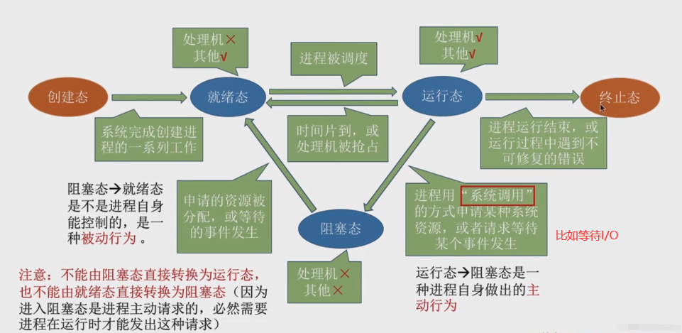

# 第一章 计算机系统概述

## 重点:

以选择题为主

## 1.1 OS基本概念

### 1.1.1 概念、特征

**操作系统** ： 是对计算机资源（软硬）进行管理的系统软件

**操作系统的基本特性 ：** 

- **并发 ：** 

    两个或多个事件在同一时间间隔内发生

    通过 **分时** 实现

    需要硬件支持，例如多流水线、多处理机

- **共享 ：** 

    资源可以供多个并发的进程使用

    **临界资源** ： 一段时间内只允许一个进程访问的资源，只能互斥式共享，例如栈、变量、表格

    允许被同时（微观上还是分时共享的）访问的资源，例如磁盘

- **虚拟：**

    **时分复用技术** ：处理器的分时共享

    **空分复用技术** ：虚拟存储器

- **异步：**

    走走停停，速度不可知

其中并发和共享是最基本的特性，他们互为存在的条件


<br>


### 1.1.3 操作系统的功能

**管理功能：**

- **处理机管理**

    也就是对进程的管理，主要任务是 合理共享

    控制、同步、通信、死锁、处理机调度等

- **存储器管理**

    内存分配和回收、地址映射、内存保护和共享、内存扩充

- **文件管理**

    文件存储空间管理、目录管理、文件读写和保护

- **设备管理**

    缓冲管理、设备分配、设备处理、虚拟设备


<br>


**作为用户和硬件的接口：**

- **命令接口**

    利用操作命令来组织和控制作业执行

    - **联机控制方式（交互式命令接口）** ： 说一句，做一句
    - **脱机控制方式（批处理命令接口）** ： 按清单上的做 

- **程序接口（即系统调用）**

    来请求操作系统服务

    由一组 **系统调用（广义指令）** 组成，系统调用是OS为应用程序使用内核功能提供的接口，只能通过用户程序间接使用


<br>


### 1.1.4 习题

#### 选择题

1. 操作系统与用户通信接口通常不包括：`缓存管理指令`

    ```
    其余选项 shell、命令解释器、广义指令
    
    广义指令就是程序接口
    命令解释器属于命令接口的联机控制方式
    shell是命令解释器
    ```

    

2. 不属于多道程序设计的基本特性是： `顺序性`

    ```
    引入多到程序设计后，失去了封闭性和顺序性
    顺序性是单道程序设计的特点
    ```

    


<br>


## 1.2 OS发展历程

1. **手工操作**

    **无操作系统**

    用户独占全机

    CPU等手工操作，利用不充分

2. **批处理**

    **有操作系统**

    对作业的处理成批进行

    - **单道批** ：内存中只有一道程序

        为了解决人机矛盾和CPU、I/O速度不匹配矛盾产生

        自动性，逐个运行

        **顺序性**

    - **多道批** ：内存中有多道程序

        为了提高资源利用率和系统吞吐率

        **宏观上并行，也就失去了顺序性**

        **微观上串行，轮流占用CPU**

3. **分时操作系统**

    解决了多道批的用户交互差的问题

    将时间分为时间片

    **同时性**

    **交互性**

    **独立性**

    **及时性（时间短，但还是不够短）**

4. **实时操作系统**

    **任务很紧急的情况** 

    - 硬实时：飞行器控制
    - 软实时：飞机订票

    特点是 **及时性** 、 **可靠性**

    


<br>


### 1.2.7 习题

#### 选择题

1. 【2016】中断技术使得多道批处理系统的I/O设备可与CPU并行工作 `正确`

    ```
    多道批
    当一个程序进入到I/O的时候，CPU不会傻傻的等待，而是去运行另一道程序，此时I/O和CPU并行
    ```

    

2. 【2018】下列关于多任务操作系统的叙述中：

    ```
    具有并发和并行的特点	正确，多任务系统要在同一时间内运行多个应用程序
    需要运行在多CPU的硬件平台上	错误，并不一定要多CPU，单CPU多核也可以
    ```

    


<br>


## 1.3 OS运行环境

### 1.3.1 处理器运行模式

CPU运行两种程序：

- 操作系统的 **内核程序**

    访问需要特权指令，不允许用户直接用

    例如 `I/O` 、 `置中断` 、 `存取保护的寄存器` 、 `写程序状态字寄存器` 等

- 用户的 **应用程序**

    可以用非特权指令，用户直接用，只能访问用户的地址空间

CPU运行状态：

- 用户态（目态），可以通过 **访管/trap/陷入指令** 进入管态（ **所以肯定是在用户态运行！** 
- 核心态（管态）

操作系统内核包括：

1. **时钟管理**

    计时、时间片、时钟中断实现进程切换等等

2. **中断机制**

    保护和恢复现场的功能属于内核

3. **原语**

    最底层，最接近硬件

    **原子性** ，必须一气呵成

4. **系统控制的数据结构及处理**

    例如PCB、FCB、消息队列、缓冲区、内存分配表等


<br>


### 1.3.2 中断和异常

对资源占有权的释放离不开中断


<br>


### 1.3.3 系统调用

系统调用就是提出请求给操作系统

可视为特殊的公共子程序

和资源相关的操作都是通过系统调用，由操作系统代为完成，包括：

- 设备管理
- 文件管理
- 进程控制
- 进程通信
- 内存管理

**执行系统调用的过程主要包括以下操作：**

1. 传递系统调用参数
2. 执行响应的服务程序
3. 执行陷入/访管指令
4. 返回用户态


<br>


### 1.3.4 习题

#### 选择题

1. 核心态到用户态的转换是操作系统完成的，用户态到和心态的转换是 `硬件` 完成的

    ```
    选了中断处理程序，但中断处理程序一般也在核心态执行
    ```

2. 只能在核心态下运行的指令时 `广义指令`

    ```
    广义指令就是系统调用命令
    题目说运行，那么系统调用只能工作在核心态
    用户态下是调用广义指令，然后核心态代为执行
    ```

    

3. CPU处于核心态下可以执行的指令时 `除访管指令的全部指令`

    ```
    和心态可以执行任何指令，但是访管指令时只有用户态能用的
    ```

    

4. 【2012】不可能在用户态发生的事件是 `进程切换`

    ```
    看其他选项：
    系统调用，用户态和核心态都有
    外部中断, 用户态和核心态都有
    缺页，访问虚存时缺页，用户态->内核态
    
    进程切换, 只发生在核心态，因为涉及处理机调度和资源
    ```

    

5. 【2015】处理外部中断时，应该由操作系统保存的是 `通用寄存器的内容`

    ```
    外部中断处理过程
    PC的值由中断隐指令自动保存，通用寄存器的内容由操作系统保存
    ```

    

6. 【2016】访存时缺页属于 `异常` ， 存储保护错属于 `异常`

    ```
    中断和指令无关，异常来自于当前执行的指令
    
    访虚存时缺页和当前执行的指令有关
    ```

    

7. 【2018】定时器产生时间中断后，由时钟中断服务程序更新的部分内容是：

    ```
    内核中时钟变量的值、当前进程占用CPU的时间、当前进程在时间片内的剩余执行时间
    
    和时间有关的都对，全选
    ```

    

8. 【2020】下列和中断相关的操作中，由操作系统完成的是：

    ```
    提供中断服务、初始化中断向量表、保存中断屏蔽字
    
    保存中断程序的断点（PC中的内容）是由硬件自动完成的
    ```

    


<br>


## 1.4 OS结构

#### 分层法

最底层0为硬件，最高层N为用户接口，每层只能调用它的上一层的功能和服务（单项依赖），像个靶子那样的

优点：

- 便于调试和验证
- 易扩充和维护

缺点：

- 合理定义 困难
- 销量较差，要穿很多层的话，都有各自的通信机制


<br>


#### 模块化

按功能划分为若干有一定独立性的模块，各模块通过接口通信（模块-接口法），像是树型结构

好的模块是高内聚，低耦合的

优点：

- 正确性、可理解性、可维护性高
- 各模块一起设计，无法建立在一个已经验证的模块的基础上


<br>


#### 宏内核

也称单内核、大内核

主要功能模块作为一个紧密联系的整体运行在核心态

windows、Android、ios、macos、linux等


<br>


#### 微内核

最基本的功能保留在内核，其余放到用户态执行

移出内核的操作系统代码根据 **分层原理** 划分成若干服务程序，独立运行，借助微内核提供的消息传递机制进行通信

一个模块的崩溃只会使这个模块崩溃，而不会使整个系统崩溃

操作系统分为：

- 微内核：包含硬件处理相关、客户和服务器的通信
- 多个服务器：（我理解为同一个功能，比如进程管理，核心代码在内核，不太核心的放在服务器上）

**采用C/S模式** 

采用 **机制与策略分离** 的原理来构造OS结构， 机制部分和硬件相关的放入微内核，绝大部分放到微内核外的服务器实现

微内核基本功能：

- 进程（线程）管理
- 低级存储器管理
- 中断和陷入处理

优点：

- 扩展性和灵活性
- 可靠性和安全性
- 可移植性
- 更好地支持分布式

缺点：

- 性能问题，因为要频繁切换用户态和核心态， **不够高效** 


<br>


#### 外核

保持多个虚拟机彼此不发生冲突

优点：

- 减少了映射层


<br>


## 1.5 OS引导

操作系统也是程序，启动操作系统的过程：

1. **激活CPU**

    CPU读取 **ROM中的boot程序** ，执行BIOS的指令（将指令寄存器设置为BIOS的第一条指令）

2. **硬件自检**

3. **加载带有OS的硬盘**

    BIOS读取Boot Sequence，将控制权交给顺序第一的存储设备，CPU将 该**存储设备引导扇区的内容加载到内存**

4. **加载主引导记录MBR**

    一个一个找引导硬盘， **MBR的作用就是告诉CPU操作系统在哪个硬盘的哪个分区**

5. **扫描硬盘分区表、加载硬盘活动分区**

    MBR中有硬盘分区表，记录了活动分区和非活动分区， **找到含操作系统的活动分区并加载** ，控制权交给活动分区

6. **加载分区引导记录PBR**

    读取活动分区的第一个扇区（称为分区引导记录PBR），为了找到并激活活动分区根目录下用于引导OS的程序（启动管理器）

7. **加载启动管理器**

8. **加载操作系统**


<br>


## 1.6 虚拟机

虚拟机就是隐藏了物理特性，逻辑上的计算机，分为两类：

- **第一类虚拟机管理程序（裸金属架构）** ： **运行在裸机上**

    有多道程序功能，向上层提供若干虚拟机（都是裸机的复制品）

    虚拟机作为用户态的进程，不能执行敏感指令（虚拟机的操作系统以为自己是内核态，实际上使用户态）

    - 如果是 **支持虚拟化的机器** ，虚拟机的操作系统执行敏感指令，虚拟机管理程序能其 **正确执行**， 用户执行，虚拟机管理程序将 **模拟**
    - 不支持虚拟化的机器， **都模拟**

- **第二类虚拟机管理程序（寄居架构）** ： **运行在宿主OS上**

    运行在硬件上的是宿主OS，虚拟机更像一个伪装成有CPU和设备的进程，被称为客户OS

    虚拟磁盘只是宿主OS中的一个文件夹
    
    **VMware**

注 ： 软件、硬件都可以实现虚拟机


<br>


### 1.6.2 习题

#### 选择题

1. 采用微内核结构，不宜放在微内核中的有：

    ```
    文件系统服务，在文件服务器中
    
    其余选项
    进程间通信机制，最频繁，放内核
    低级I/O，和硬件相关，放内核
    低级进程管理和调度， 属于调度功能的机制部分，放内核
    中断和陷入处理，放内核
    ```

    

2. 操作系统的引导程序位于 `硬盘`

    ```
    装有操作系统的硬盘的活动分区的引导扇面中的引导程序（也就是启动管理器），用于引导操作系统
    
    另外还有用于启动设备的引导程序，位于ROM中的自举程序（BIOS的组成部分）
    ```

    

3. 计算机启动的过程是：

    ```
    1. CPU加电
    2. 执行JMP指令跳转到BIOS
    3. 等级BIOS中断例程入口地址
    4. 硬件自检
    5. 进行操作系统引导
    
    关键：先BIOS再自检
    ```

    

4. 多台虚拟机可同时运行在同一物理机器上，实现了真正的并行 `错误`

    ```
    实现了真正并行的是多核处理机
    多个虚拟机就相当于多个程序
    ```


<br>

### 并发性和并行性

- 并发：同一个时间间隔内发生，微观只有一道，宏观看有多道
- 并行：同一时刻有多个同时发生，例如多处理器

### 特权指令和非特权指令

- 核心态：能运行除访管指令外的全部指令
- 用户态：只能运行非特权指令

### 访管指令

访管指令能产生一个访管中断，将操作系统转为核心态，访管中断处理程序将按系统调用的操作数和参数转移到相应的例行子程序，完成后回到断点


# 第二章 进程与线程

## 重点：

进程必考

- 选择题

- 综合题：信号量机制实现同步和互斥

## 2.1 进程与线程

### 2.1.1 进程的概念和特征

进程（动态的） ： 程序实体的运行过程，系统进行资源分配的独立单位，动态，为了实现OS的并发性和共享性引入的概念

进程控制块PCB ： 用来描述和控制进程，是进程存在的唯一标志

进程实体（进程映像，静态的） ：

- 程序段
- 相关数据
- PCB

进程的特征：

- 动态性
- 并发性
- 独立性
- 异步性


<br>


### 2.1.2  进程的状态与转换（重要）

进程的状态（前三种是基本状态）：

- **运行态**

- **就绪态：**

    进程获得了 **除处理机外的一切资源** ，就绪队列

- **阻塞态（等待态）：**

    等待某一事件（等待非处理机的资源，等待I/O等）而暂停运行，有处理器也不能运行。根据原因放在多个阻塞队列

    **只能由运行态进入**

- **创建态：**

    创建的过程中，结束到就绪态

    申请空白PCB、写入控制和管理进程的信息、分配资源、转入就绪队列

    如果资源不能得到满足，仍然处于创建态

- **结束态：**

    先设为结束态，再回收资源

补充：

- 运行态到阻塞态（比如等待I/O）： **主动**
- 阻塞态到就绪态（资源到手)  ： **被动**




<br>


### 2.1.3  进程的组织（先跳过）


<br>


### 2.1.4  进程控制（先跳过）


<br>


### 2.1.5  进程的通信

进程的空间是私有的，不能访问其他进程的地址空间

PV操作属于低级通信，高级通信有：

- 共享存储（文件、存储区）

- 消息传递

    直接

    间接（ **信箱** ），有发送和接受原语

- 管道通信


<br>


### 2.1.6 线程和多线程模型

引入进程的目的 ： 为了更好地实现多道程序的并发执行，提高资源利用率和系统吞吐量

引入线程的目的 ： 减少程序在并发执行时付出的时空开销，提高并发性能

**进程是资源分配的单位，线程是调度和分派的单位**

线程 ： 

- 系统调度的基本单位
- 同个进程的所有线程共享全部资源
- 线程切换开销少，同一个进程内的线程切换不会切换进程
- 支持多处理机系统

线程的状态：

- 运行态
- 就绪态
- 阻塞态


<br>


#### 用户级线程ULT（线程库支持的线程）

用户在用户空间用 线程库 编写的多线程程序

**内核意识不到线程的存在**

调度仍然以 **进程** 为单位

**优点：**

- 线程切换不需要切换到内核空间，开销少
- 调度算法可以根据情况设置
- 和操作系统平台无关

**缺点：**

- 一个线程阻塞，同个进程的所有线程都阻塞
-  **只有一个线程能用处理机** ， 不能发挥多处理机的优势

**线程库：** 分为有无内核支持两种

-  Pthreads
- Windows API
- Java 线程 API


<br>


#### 内核级线程KLT（内核支持的线程）

在内核的支持下运行，内核空间为每个线程设置一个线程控制块

**优点：**

- 能用多处理机
- 一个阻塞，不影响其他
- 线程切换快，开销少
- 内核本身也可用多线程技术

**缺点：**

- 统一进程中切换线程， **需要从用户态切换到核心态** （用户程序的线程在用户态，线程管理在核心态），系统开销大


<br>


#### 组合方式

用户级线程通过 **时分复用内核级线程** 实现

有ULT和KLT的优点，克服了缺点


<br>


#### 多线程模型

- **多对一**

    多个用户线程映射到一个内核线程

    **优** ：销量高

    **缺** ： 一个阻塞其他也阻塞，不能用多处理机 

- **一对一**

    **优** ： 一个阻塞，运行调度另一个运行，并发能力强

    **缺** ： 每有一个用户线程就要创建一个内核线程，开销大

- **多对多**


### 2.1.8 习题

#### 选择题

1. 一个进程实体由PCB、共享正文段、数据堆段和数据栈段组成，则

    ```
    正文段：二进制代码和全局变量
    数据堆段：动态分配的内存
    数据栈段：临时变量、实参传递
    
    所以：
    函数调用实参传递值：数据栈段
    ```

    

2. 系统动态DLL库中的系统线程，被不同的进程调用，他们是 `相同` 的线程

    ```
    程序代码多次创建产生不同的进程
    而同一个系统进程（线程）可以用系统调用的方法被不同的进程（线程）多次使用
    ```

    

3. 进程创建完进入 `就绪队列`

    ```
    创建完进程会分配除了CPU的所有东西，所以进入的就绪队列，而不是阻塞队列
    ```

    

4. 不是多线程系统的特长： `键盘驱动器位每个运行的应用设置一个线程，来响应该应用的键盘输入`

    ```
    键盘只有一个，而且是人在输入，速度慢，只需要一个线程就可以了
    ```

    

5. 两个合作进程无法利用 `高级语言中的全局变量` 来交换数据

    ```
    全局变量是对同一个进程内部而言的
    ```

    

6. 同一进程内的线程切换，系统开销小 `错误`

    ```
    内核级线程，统一进程内的线程切换需要从用户态切换到核心态，系统开销大
    
    内核级线程的程序实体可以再内核态运行 	正确，当内核级线程运行在内核态时，说明京城也在内核态
    多处理器系统，核心可以调度同一进程的多个线程并行执行	争取，内核级线程调度再线程一级，内核可以调度统一进程的多个线程在CPU上并行
    ```

    

7. 跨进程的用户级线程调度也不需要内核参与 `错误`

    ```
    跨进程了，切换需要切换到内核态
    ```

    

8. 采用轮转调度算法，进程中设置内核级线程和用户级线程的效果完全不同 `正确`

    ```
    轮转说明要经常切换
    
    内核级切换要到核心
    用户级同一进程的线程切换不用到核心
    ```

    

9. 【2014】关于管道通信：

    ```
    读和写都可能被阻塞
    
    其余选项：
    双向数据传输
    仅受磁盘大小限制
    一个管道只能有一个读和写操作
    ```

    

10. 【2020】父子进程共享虚拟地址空间 `错误`

    ```
    创建子进程的时候会给它分配虚拟地址空间
    
    父子进程可以并发
    ```

    

11. 


<br>


## 2.2 处理机调度

### 2.2.1 调度的概念

**调度的层次：**

（操作次数由高到低）

- **作业调度（高级）**

    从外存选一个或多个作业放入内存，分配资源，创建进程

    每个作业一次调入、一次调出

- **内存调度（中极）**

    目的 ：提高内存利用率和系统吞吐量

    暂时不能运行的调入外存， 挂起态

    实现挂起态->就绪态

- **进程调度（低级）**

    给就绪队列的进程分配处理机


<br>


### 2.2.2 调度的目标

就是为了性能指标优秀

#### CPU利用率

```
CPU利用率 = CPU工作时间 / (CPU工作时间 + CPU空闲等待时间)
```


#### 系统吞吐量

```
单位时间内完成的作业数量
```


#### 周转时间

```
周转时间 = 作业完成时间 - 作业提交时间
带权周转时间 = 周转时间 / 作业实际运行时间

以上两个可以n个作业求平均值
```


#### 等待时间

```
进程等待处理机的时间之和
作业在就绪队列中等待所花的时间
```


#### 响应时间

```
响应时间 = 系统首次响应 - 用户提交请求
```


<br>


### 2.2.3 调度的实现

#### 调度器（调度程序）

- **排队器** ：维护就绪队列

- **分派器** ：从就绪队列中选进程

- **上下文切换器** ：进程切换时，

    第一次：保存当前进程的上下文到它的PCB，装入分派程序的上下文使得分派程序运行

    第二次：移出分派程序的上下文，将新进程的CPU现场信息装入对应寄存器

上下文切换的时候需要大量load和store寄存器的内容，现在用 **硬件** 来实现

一般有 **两组寄存器（内核用和用户用）** ，上下文切换只需要 **修改指针** 


<br>


#### 调度的时机、切换和过程

**不能调度：**

- **处理中断** 的过程中
- 进程在操作系统 **临界区** （因为加了锁）
- 其他 **完全屏蔽中断的原子操作** 中（加锁、解锁、中断现场保护、恢复等），原子操作连中断都能屏蔽，更别说进程切换了

**应当调度：**

- 满足调度条件，且当前进程不能继续运行（比如等I/O）时
- 中断处理、自陷结束时，返回现场前，如果有 **请求调度标志** ，立刻调度

进程的切换在调度完成后立刻发生，保存当前断点现场（存入当前进程的内核堆栈，并更新堆栈指针），恢复要调度进程的现场（从内核堆栈中），更新空间指针、重设PC等，开始新的进程


<br>


#### 进程调度方式

- **非抢占式：**

    **优** ： 简单、开销少

    适合 **批处理系统** ，不能用与 **实时和分时**

- **抢占式：**

    **优** ： 吞吐量和响应销量好

    优先级、短进程、时间片等


<br>


#### 闲逛进程（idle）

**没有就绪进程时会启动** ，优先级最低

内容是 **测试中断**

只需要CPU不要其他资源， **不会阻塞**


<br>


#### 用户级、内核级线程调度

- **用户级线程调度：**

    内核给 **进程** 时间控制

    线程切换只需要少量机器指令， **开销少**

- **内核级线程调度：**

    内核选择一个特定 **线程** 运行，时间片过会强制挂起该线程

    切换需要完整的上下文切换、修改内存映像、使Cache失效， **开销大**


<br>


### 2.2.4 经典调度算法（重点）

#### 先来先服务FCFS

适用于 **作业** 和 **进程** 调度

每次从就绪队列中选择一个 **最早的** 进程来分配处理机

**特点：**

- **不可剥夺**

- 简单，效率低

- **对短作业不利**

- **有利于CPU繁忙型**


<br>


#### 短作业优先SJF

适用于 **作业** 和 **进程** 调度

每次从就绪队列中选择 **估计运行时间最短** 的作业，调入内存运行

特点：

- 对长作业不利 **饥饿现象**（和死锁不同，死锁是环形等待）
- 没考虑急迫程度
- 估计执行时间不一定可靠
- **平均等待时间、平均周转时间最少**


<br>


#### 时间片轮转

适用于 **进程** 调度，主要用于 **分时系统**

按FCFS组成就绪队列，分配时间片， **当时间片完但进程未完成时，插到就绪队列的最后面，进程完成也会等当前时间片用完再去下个进程**

- **时间片足够大** ： 退化成 **FCFS** 
- **时间片小** ： **频繁切换** ，开销大

时间片的长度应该考虑：

- 响应时间
- 就绪队列长度
- 系统处理能力


<br>


#### 优先级

适用于 **作业** 和 **进程** 调度

用 **优先级（静态或动态）** 描述作业的急迫程度

每次从就绪队列中选择 **优先级最高** 的进程来分配处理机

- 抢占式
- 非抢占式

一般来说：

- 系统进程 > 用户进程
- 交互型进程 > 非交互型
- **I/O型 > 计算型** ， **因为I/O比较费时间，早点开始I/O整体效率高**


<br>


#### 高响应比优先

```
响应比Rp = （等待 + 要求服务） / 要求服务
```

- 作业等待时间相同时，短作业响应比高，此时接近于SJF
- 要求服务时间相同时，等待时间越长，响应比越高。此时接近于FCFS
- 长作业的等待时间长，也可以获得处理机， **克服了饥饿现象** 


<br>


#### 多级队列

设置多个队列，每个队列设置不同调度算法，也可自由设计优先级

多处理机中，可以给每个处理机设置一个就绪队列，实现各自不同的调度算法


<br>


#### 多级反馈队列

时间片 + 优先级的进化

动态调整进程优先级和时间片

- 多个就绪队列，又不同的优先级。优先级高的队列时间片小
- 每个队列FCFS，如果完成就走，没完成就一级头出来到二级的尾
- 有更高级的进程要处理机时，交出处理器，然后到当前的队尾


<br>


#### 调度算法的特点图


### 2.2.5 进程切换

- **上下文切换**

    保存当前进程的断点（保存到PCB中），恢复另一个进程的特点

    上下文 ： 当前CPU寄存器和PC的内容

- **上下文切换的消耗**

    要很多CPU时间

    一般是设置寄存器组，只要修改指针就可以了

- **上下文切换和模式切换**

    **上下文切换** ： 进程变了

    **模式切换** ： 用户态和核心态的切换，实际上可能还是同一个进程

- **调度和切换：**

    **调度** ：一般说的资源，分配给哪个进程，是决策

    **切换** ：一般说的进程，是执行

    一般先调度再切换


<br>


### 2.2.7 习题（还有几个计算）

#### 选择题

1. 一个作业8点到系统，预计运行1h，若10点开始执行作业，则响应比 `3`

    ```
    响应比 = 响应时间 / 要求服务时间 = （等待 + 要求服务）/ 要求服务 = （2 + 1）/ 1 = 3
    ```

    

2. 在动态优先级中，随着进程执行时间的增加，优先级应降低 `正确`

    ```
    执行时间变长，优先级降低，要让别人来用
    等待时间变长，优先级升高，该给我用了
    ```

    

3. 中断向量地址是中断服务例行程序的入口地址 `错误`

    ```
    中断向量存放中断服务例行程序的入口地址
    因此中断向量地址是地址的地址
    ```

    

4. 若某单处理器多进程系统中有多个就绪态进程，则在进程处于临界区时不能进行处理机调度 `错误`

    ```
    进程在操作系统内核程序临界区中不能进行调度与切换（对）
    进程处于临界区时不能进行处理机调度（错）
    
    访问打印机也是临界区，此时当然能把CPU让给其他进程
    ```

    

5. 


<br>


## 2.3 同步与互斥 

同步和互斥解决操作系统的异步性可能引起的问题

### 2.3.1 基本概念

- **临界资源**

    一次只允许一个进程使用的资源，需要互斥的进行访问

- **临界区（临界段）**

    进程中访问临界资源的那段代码

- **同步（直接制约关系）**

    次序

- **互斥（间接制约关系）**

同步机制应当遵循的原则：

- **空闲让进**
- **忙则等待**
- **有限等待**
- **让权等待** ：不能进入临界区时，让出处理机


<br>


### 2.3.2 实现临界区互斥的基本方法（先跳过）

#### 软件实现

设置是否有进程在临界区的 **标志**

1. 单标志法
2. 双标志先检查
3. 双标志后检查
4. Peterson算法


<br>


#### 硬件实现

也称为 **低级方法** 或 **元方法**

1. 中断屏蔽方法
2. 硬件指令方法


<br>


### 2.3.3 互斥锁

进程进入临界区获得锁

退出临界区释放锁

```c
acquire(){
	while(!available)
        忙等待
    available = false;	// 获得锁
}

release(){
    available = true;	// 释放锁
}
	
```

acquire()和release()必须是 **原子操作** ，一般用 **硬件** 实现

互斥锁常用于 **多处理机**

缺点：

- **当只有一个处理机时，会忙等待**

    


<br>


### 2.3.4 信号量

两个标准原语：

- P操作：wait(S)，申请
- V操作：signal(S)，释放

信号量分为两种：

1. **整型：**

    信号量S表现为 **资源数目**

    会不停的循环询问

    不存在让权等待，会处于 **忙等** 状态

    ```c++
    // P操作 申请资源
    wait(S){
    	while(S <= 0); // 会不断查询, 只要没有多的资源就会停在这
    	S=S-1;
    }
    
    // V操作 释放资源
    signal(S){
        S=S+1;
    }
    ```

    

2. **记录型：**

    **不存在忙等**

    ```c++
    typedef struct{
        int value;
        struct process *L;
    }semaphore;
    
    // P操作 申请资源
    void wait(semaphore S){
        S.value--;
        if(S.value < 0){
            该进程加入S的等待队列L;
            block(S.L) // 自我阻塞, 主动放弃处理机;
        }
    }
    
    // V操作 释放资源
    void  signal(semaphore S){
        S.value++;
        if(S.value <= 0){	// 如果有等待该资源的进程
            取出S的等待队列的头：进程P
                wakeup(P);	// 唤醒进程P
        }
    }
    ```


<br>


#### 实现同步

- 同步，信号量初始为0

```c++
semaphore S = 0;	// 公共信号量S

P1(){
    …
	语句X;
	V(S);	// 使S+1 并将P2唤醒
    …
}

P2(){
    …
	P(S);	// S为0时会被阻塞
	语句y;
    …
}
```

实现了先x后y的进程同步


<br>


#### 实现互斥

- 互斥，信号量初始为1
- 用PV紧紧夹住临界区

```cpp
semaphore S = 1;	// 公共信号量

p1(){
    …
    p(S);	// 访问临界区之前先加锁
    P1的临界区;
    V(S);	// 访问结束 解锁
    …
}

p2(){
    …
    p(S);
    P2的临界区;
    V(S);
    …
}
```


<br>


#### 实现前驱

- 为每一个有向边设置一个初始为0的信号量
- P操作看作检查上一个操作是否完成
- V操作看作本操作已经完成


<br>


### 2.3.5 管程、条件变量（先跳过）


<br>


### 2.3.6 经典同步问题（重点）

#### 生产者-消费者问题

**问题描述：**

- 有一个初始为空，大小为n的缓冲区（临界资源）
- 生产者每次生产一个商品放到缓冲区， 消费者每次从缓冲区取出一个商品
- 不满才能放，不空才能拿

**分析：**

- 生产者和消费者 **互斥** 地访问缓冲区
- 先生产才能消费，又存在 **同步** 关系

**代码：**

```c++
// 简单生产者消费者问题
semaphore mutex = 1;    // 互斥信号量 用来访问临界资源
semaphore empty = n;    // 空缓冲区数量, 初始为n
semaphore full = 0;     // 满缓冲区数量, 初始为0

// 生产者
producer(){
    while(1){
        生产商品;
        P(empty);	// 申请空缓冲区 实现同步
        
        P(mutex);	//PV夹紧 实现互斥的访问临界区
        放进缓冲区;
        V(mutex);
        
        V(full);	// 放出一个满的缓冲区 实现同步
    }
}

// 消费者
consumer(){
    while(1){
        P(full);	// 申请满缓冲区 实现同步
        
        P(mutex);	//PV夹紧 实现互斥的访问临界区
        从缓冲区中取出商品;
        V(mutex);
        
        V(empty);	// 放出一个满的缓冲区 实现同步
        消费商品;
    }
}
```


**复杂的生产者消费者问题：**

**问题描述：**

- 桌上有一个盘子，一次只能往盘子中放一个水果
- 爸爸放苹果，妈妈放橘子，女儿吃苹果，儿子吃橘子
- 盘子为空才可以放，有自己需要的水果才能吃

**分析：**

- 爸爸和妈妈是互斥关系
- 爸爸和女儿、妈妈和儿子构成两对同步关系
- 可以看做两对生产者-消费者共用一个大小为1的缓冲区
- 爸爸-女儿和妈妈-儿子 **必须连续执行** ，保证盘子为空再释放盘子

**代码：**

```c++
semaphore plate = 1;    // 盘子 用来互斥
semaphore apple = 0;    // 苹果 用来同步
semaphore orange = 0;   // 橘子 用来同步

dad(){
    while(1){
        P(plate);   // 这里互斥为什么不夹紧呢？为了防止妈妈和儿子能申请到盘子之后然后阻塞
        V(apple);   // 放出苹果
    }
}

daughter(){
    while(1){
        P(apple);   // 申请苹果
        V(plate);
    }
}

// 妈妈和儿子类似
```


<br>


#### 读者-写者问题

**问题描述：**

- 允许多个读者同时读
- 一次只能有一个写者写
- 写者完成写之前不允许其他读者和写者参与
- 当前没有其他人在操作时，才能写

**分析：**

- 写者和任何其他进程都是互斥的
- 读者和写者是互斥的，读者和其他读者是同步的

**代码：**

```c++
/*
读进程优先
只要有一个读进程在, 就不能写, 其他读进程可以继续参与
存在写进程饥饿现象
*/

int count = 0;          // 当前读者的数量
semaphore mutex = 1;    // 实现更新count变量的互斥
semaphore rw = 1;       // 实现读者和写者的互斥

writer(){
    while(1){
        P(rw);  // 互斥访问文件 PV夹紧
        写文件;
        V(rw);
    }
    
}

reader(){
    while(1){
        P(mutex);   // 互斥访问count PV夹紧
        if(count == 0)  // 如果当前读者是第一个读者
            P(rw);      // 阻止写者写, 实现读者和写者的互斥
        count++;
        V(mutex);
        
        读文件;
        
        P(mutex);   // 互斥访问count PV夹紧
        count--;
        if(count == 0)  // 如果这是最后一个读者
            V(rw);  // 允许写者写
        V(mutex);
    }
}

--------------------------------------------------------------------------------

/*
写进程优先
当一个写进程进来, 阻止其他进程读, 先让写进程写, 没有写进程的时候, 读进程再进来读
*/

int count = 0;      // 当前读者的数量
semaphore mutex = 1;    // 实现更新count变量的互斥
semaphore rw = 1;    // 实现写者和其他进程的互斥
semaphore w = 1;    // 实现写优先(也是实现互斥)

writer(){
    while(1){
        P(w);   // 申请优先级 让后面的读进程阻塞
        P(rw);  // 互斥访问文件 PV夹紧
        写文件;
        V(rw);
        V(w);   // 释放优先级
    }
}

reader(){
    while(1){
        P(w);       // 申请优先, 如果当前没有写进程就能继续 
        P(mutex);   // 互斥访问count PV夹紧
        if(count == 0)  // 如果当前读者是第一个读者
            P(rw);      // 阻止写者写, 实现读者和写者的互斥
        count++;
        V(mutex);
        V(w);       // 释放优先级
        
        读文件;
        
        P(mutex);   // 互斥访问count PV夹紧
        count--;
        if(count == 0)  // 如果这是最后一个读者
            V(rw);  // 允许写者写
        V(mutex);
    }
}
```

此处的写优先是相对而言的，也称为 **读写公平法**

**特点：**

- 多了一个 **计数器count**


<br>


#### 哲学家进餐问题

**问题描述：**

- 一个圆桌上坐着5名哲学家，每个哲学家面前有一碗米饭，两个哲学家之间有一根筷子
- 哲学家思考的时候无动作，饥饿的时候会尝试拿起左、右筷子。拿到2根筷子开始进餐，否则就等待
- 哲学家进餐完成后会放下筷子继续思考

**分析：**

- 筷子相邻的两个哲学家拿筷子构成互斥关系，需要对每个筷子设置一个互斥信号量
- 容易造成 **死锁或饥饿现象** 
- 为了避免死锁，需要指定规则

**代码：**

```c++
/*
为了避免死锁:
当哲学家左右两边的筷子都可用时，才允许拿起筷子
此外还可以有设置同时进餐的人数、奇数先拿左边，偶数先拿右边等
*/

semaphore chopstick[5] = {1,1,1,1,1};   // 筷子信号量组 筷子的数量
semaphore mutex = 1;    // 实现取筷子的互斥

Pi(){
    do{
        P(mutex);
        P(chopstick[i]);    // 取左右两边的筷子
        P(chopstick[(i + 1) % 5]);
        V(mutex);
        
        吃饭;
        
        V(chopstick[i]);    // 释放左右两边的筷子
        V(chopstick[(i + 1) % 5]);
        
        思考;
        
    }while(1);
}
```

特点：

- 贪心的话会造成死锁
- **避免死锁** 是哲学家进餐问题的精髓


<br>


#### 吸烟者问题

**问题描述：**

- 有三个抽烟者和一个供应者，完成抽烟需要A、B、C三个物品，三个抽烟者各自有一个，而供应者无限量
- 供应者每次提供两个物品的组合，拥有全部物品的人就可以抽烟，抽完给供应者信号，供应者再提供另外两个物品的组合
- 让抽烟者 **轮流抽烟**

分析：

- 抽烟者彼此是 **互斥关系** （此处用if实现轮流吸烟）
- 每个抽烟者和供应者都是 **同步关系**

代码：

```c++
/*
吸烟者1拥有A, 吸烟者2拥有B, 吸烟者3拥有C
同时拥有ABC才能吸烟
*/

int num = 0;    // 轮次数 为了实现轮流
semaphore offer1 = 0;   // 计作B和C的组合 其余类似
semaphore offer2 = 0;
semaphore offer3 = 0;
semaphore finish = 0;   // 抽烟动作是否完成 实现抽烟者和供应者的同步

// 供应者
supplier(){
    while(1){
        num++;  // 轮次数处理
        num = num / 3;
        
        // 根据轮次数来确定提供什么
        if(num == 0)
            V(offer1);
        else if(num == 1)
            V(offer2);
        else
            V(offer3);
            
        P(finish);  // 申请吸烟完成信号 有吸烟完成时进入下一次循环
    }
}

// 吸烟者1
smoker1(){
    while(1){
        P(offer1);  // 申请B+C的组合
        
        吸烟;
        
        V(finish);  // 释放吸烟完成信号
    }
}

// 吸烟者2和3类似
```


<br>


### 2.3.8 习题


<br>


## 2.4 死锁

### 2.4.1 死锁的概念

因为并发性，多个进程因竞争资源而造成的一种僵局

产生死锁的原因：

1. 竞争不可剥夺资源
2. 进程推进顺序非法（包括信号量使用不当）

**死锁产生的必要条件：**

1. **互斥条件**

    某资源一次只能被一个进程使用

2. **不剥夺条件**

    资源只能在使用完主动释放

3. **请求并保持条件**

    被阻塞的时候不释放已经拿在手里的资源

4. **循环等待条件**

    且需要的资源只有一个，当同类资源大于1时，哪怕资源分配图有圈也不会死锁

死锁必须满足这四个，有一个不满足就不会有死锁


<br>


### 2.4.2 死锁的预防

**破坏死锁的必要条件**

1. **破坏互斥**

    允许资源共享

    实际上不可行

2. **破坏不剥夺**

    允许抢占

    实现复杂，反复抢占会增加系统开销

3. **破坏请求并保持**

    **预先静态分配** ，在运行前申请玩他需要的全部资源，全满足了才执行，且一直归他用

    会浪费资源，也会导致 **饥饿**

4. **破坏循环等待**

    **顺序资源分配法** ，给资源编号，必须按编号递增顺序请求资源，同类资源一次申请完

    限制了新设备的增加、造成资源的浪费


<br>


### 2.4.3 死锁的避免

**避免进入不安全状态**

**不安全不一定会死锁，但安全一定不会死锁**

当无法找到一个安全序列，就成为不安全


<br>


#### 银行家算法（重点）

几个矩阵：

- Max： 最大需求

- Allocation： 已经分配

- Need： 还需要

- Resource： 总资源数

- work： 当前可用资源

```
一般来说，先求出
还需要Need( = 最大需求Max - 已经分配Allocation)
当前可用矩阵work( = 总资源Resource - 已经分配Allocation)
```


<br>


### 2.4.4 死锁的检测和解除

**允许死锁发生，采用方法检测和解除死锁**

#### 资源分配图

用圆表示一个进程Pi，用一个框表示一类资源，框中圆的个数为该资源的个数


<br>


#### 死锁定理

```
系统状态S死锁 = S的资源分配图不可完全简化
```


<br>


#### 死锁解除

1. **资源剥夺法**

    挂起某些死锁进程，剥夺它们的资源给其他进程用

2. **撤销进程法**

    撤销部分进程并剥夺资源

3. **进程回退法**

    将部分进程回退到足以避免死锁的状态， **进程自愿释放资源而非剥夺**

    要求保存历史信息


<br>


### 2.4.6 习题

#### 选择题


<br>


# 第三章 内存管理

## 3.1 内存管理概念

内存管理基本来说就是操作系统对内存的划分和动态分配

### 3.1.1 内存管理基本原理和要求

内存管理的基本功能：

- **内存空间的分配和回收**

- **地址转换：**

    逻辑地址转换为物理地址

- **内存扩充：**

    虚拟存储技术

- **内存共享：**

    多个合作进程访问统一块数据，对共享内存的受控访问

- **存储保护：**

    各道作业各自的存储空间，互不干扰


<br>


#### 程序的链接和装入

- **编译** ：源代码变为若干目标模块

- **链接** ：将多个目标模块和需要的库函数链接成一个完整的装入模块

    - **静态链接**

        运行前链接完，不再拆开

    - **装入时动态链接**

        边装入边连接

        **优** ： 便于修改和更新；便于目标模块的共享

    - **运行时动态链接**

        运行模块时才连接

        **优** ： 装入快，省内存

- **装入** ： 将装入模块装入内存运行

    - **绝对装入：**

         只适用于 **单道** ，逻辑地址就是实际内存地址

    - **可重定位装入：**

        **静态重定位** ，进入内存后不能移动，也不能再申请空间

    - **动态运行时装入：**

        **动态重定位** ，程序可在内存移动，只有真正运行时才做地址转换

        需要 **重定位寄存器**

        **优** ：运行前值装入部分代码就可执行，运行时动态申请内存；便于程序段共享


<br>


#### 进程的内存映像

- **代码段：**

    只读，可共享

- **数据段：**

    包括全局和静态变量

- **PCB：**

    放在系统区

- **堆：**

    存放动态分配的变量

    malloc动态向高增长

- **栈：**

    实现函数调用

    从最大地址往低地址增长


<br>


#### 内存保护

保护操作系统不受用户进程影响、保护用户进程之间不相互影响

两种方法：

- CPU中设置一对上下限寄存器，存放用户作业在主存中的上下限
- 采用 **重定位寄存器（基地址寄存器，有最小物理地址**） 和 **限长寄存器（界地址寄存器，有最大逻辑地址）** ，特权指令才能加载，只有操作系统内核内修改
    - 重定位寄存器通过逻辑地址 **加** 寄存器中的值得到物理地址
    - 界地址寄存器通过逻辑地址 **比** 寄存器中的值判断是否越界


<br>


#### 内存共享

 只有只读的区域才能共享

**可重入代码（纯代码）** ： 允许多个进程同时访问不允许进程修改，实际上为每个进程分配一个 **私有数据区**

内存映射文件可以实现内存共享


<br>


#### 内存分配和回收

为了提高内存利用率：

连续分配 —> 离散分配（页、段、段页）


<br>


#### 逻辑地址和物理地址

编译后，每个目标模块从0开始编制，称为 **该块的相对地址（逻辑地址）**

链接成一个完整的可执行目标程序时，地址组成一个统一的 **逻辑地址空间（虚拟地址空间）** ， 32位系统：0~2^32 - 1

物理地址是真正的地址，是地址转换（地址重定位）的最终地址

操作系统通过 **内存管理部件MMU** 将进程的逻辑地址转化为物理地址

逻辑地址通过 **页表** 映射到物理内存


<br>


### 3.1.3 连续分配管理方式

为每一个用户程序分配一个连续的内存空间

- **单一连续分配**

    分为系统区（通常低地址）和用户区

    用户区只有一道程序

    **优** ： 简单、无外部碎片、无需内存保护

    **缺** ： 只能单用户、单道、**内部碎片** 、存储空间利用率低

- **固定分区分配**

    用户空间划分为若干固定区域（可相等也可不等），每个区域装一道作业

    **缺** ： 可能放不进分区、 **内部碎片** 、存储空间利用率低

- **动态分区分配（可变分区分配）**

    **外部碎片** （可以 **紧凑** ，但需要 **动态重定位寄存器** ，且 **费时** ）

    分配策略有：

    - 首次适应
    - 临近适应
    - 最佳适应
    - 最坏适应

    


<br>


### 3.1.4 基本分页（先跳过）


<br>


### 3.1.5 基本分段（先跳过）


<br>


### 3.1.6 段页式（先跳过）


<br>


### 3.1.8 习题（先跳过）


<br>


## 3.2 虚拟内存管理

### 3.2.1 虚拟内存的基本概念

基本分页、基本分段这些 **传统的内存管理策略** 都是 **同时将多个进程保存在内存，为了多道程序设计**

- **一次性** ：一次性全部装入内存再运行
- **驻留性** ：在运行结束之前都将留在内存，当等待I/O被阻塞时可能处于长期等待

**虚拟内存技术** ：实现了 **内存-外存** 的两级存储器结构，并用局部性原理实现高速缓存


<br>


#### 局部性原理

- **时间上** ：执行和数据在用过之后可能会再次执行，将最近使用的质量和数据保存到高速缓存中
- **空间上** ： 程序访问了某个存储单元，他周围的单元也将被访问，预取机制将附近的也保存到高速缓存
- 用于高速缓存技术：cache、快表、虚拟内存


<br>


当前程序只需要少量页面装到内存就可运行，而后缺页就从外存掉入，感觉上的内存会比实际的大的多，这就是 **虚拟存储器**（装入、请求、置换功能对用户透明）

虚拟内存建立在 离散 分配的内存管理方式上，有三种方式：

- **请求分页**
- **请求分段**
- **请求段页式**

需要：

- 一定量的内外存
- **页表（段表）机制**
- **中断机构** ，缺页发生中断
- **地址变换机构** ，逻辑地址到物理地址


<br>


### 3.2.2 请求分页管理方式

只需要一部分页面在内存就可以运行，缺页通过调页功能调入

#### 页表机制

请求页表项：

- **状态位P** ：是否已在内存
- **访问字段A** ： 记录一段时间内访问的次数
- **脏位M** ：如果修改过，页面置换时要写回外村
- **外存地址** ：通常是物理块号

#### 缺页中断机构

发生缺页时，产生缺页中断，缺页的进程阻塞，

- 内存有空闲块时分配一个块，将要调入的页装入块，并修改页表中的对应页表项
- 没有空闲块，则根据选择算法淘汰某页（修改过要写回外存）

注意：

- 缺页中断属于 内部异常 ，质量执行期间处理而非指令执行完
- 一条指令期间可能有多次缺页中断

#### 地址变换机构

1.  **先查快表** ，查到就修改页表项的访问为（写指令需要修改修改位），用 **物理块号和页内地址形成物理地址**
2.  **快表没有就查页表** ，看状态位判断是否在内存
    - 在内存中就将该页写入快表（快表满要进行替换）
    - 不在内存就缺页中断，从外存中调入


<br>


### 3.2.3 页框分配

#### 驻留集

操作系统决定给一个进程读多少页（也就是分配多少页框）

一个进程分配的物理页框的集合就是该进程的 **驻留集** ，驻留集大小讲究不大不小

#### 内存分配策略（没有固定全局！）

固定和可变：固定就是一个进程一个 **固定的物理块数** ，然后不变；可变就i是 **可以适当增加减少**

局部和全局：局部时可以 **选一页换出** ；全局是将页放到空闲块里，把物理块给进程， **增加物理块数** 

- **固定分配局部置换**

    物理块数少会频繁缺页，太多导致程序变少，降低CPU利用率

- **可变分配全局置换**

    盲目增加物理块会导致并发能力下降

- **可变分配局部置换（最好）**

    复杂但没有上面两个的缺点

固定分配时，分配物理块的算法：

- 平均分配
- 按比例分配
- 优先权分配

调入页面的时机：

- 预调页策略
- 请求调页策略

从何处调入页面：

将外存分为 **文件区** 和 **对换区** 

- 运行前将文件全部复制到对换区
- 不修改的从文件区取，其他先到对换区，再取
- UNIX方式 ： 未运行的都在文件区，运行过被换出的放在对换区


<br>


### 3.2.4 页面置换算法（重点）

追求更低的页面更换频率

#### 最佳置换OPT


<br>


#### 先进先出FIFO


<br>


#### 最近最久未使用LRU


<br>


#### 时钟CLOCK


<br>


#### 改进型CLOCK


<br>


### 3.2.5 抖动和工作集


<br>


### 3.2.6 内存映射文件


<br>


### 3.2.7 虚拟存储器性能影响因素


<br>


### 3.2.8 地址翻译（结合组成Cache部分）


<br>


### 3.2.10 习题


<br>