参考书籍：《2023王道数据结构》

<hr>

# 第一章：绪论


## 重点

- 逻辑、存储结构的基本概念，有哪些

- `时间复杂度`


### 1.1.1  基本概念

**数据元素**： 

是数据的基本单位，通常作为一个整体，一个数据元素由若干个 **数据项（最小不可分割）** 组成， **数据对象** 是有相同性质的数据元素的集合

**数据类型**：

- 原子类型：不可分割
- 结构类型：可分割
- **抽象数据类型（ADT）** ：可以用来定义一个完整的数据结构。包括数据元素、数据对象、数据关系

**数据结构：** 存在一种或者多种特定关系的数据元素的集合，包括：

- 逻辑结构
- 存储结构
- 数据的运算


<br>


### 1.1.2  逻辑结构和存储结构

**逻辑结构：**

 和存储无关，独立于计算机

- `线性结构（只存在一对一的关系）` ：线性表、受限的线性表（栈、队列、串）
- `非线性结构（存在一对多的关系）` ：树、图、集合

**存储结构**：

物理结构，依赖于语言

- **顺序存储：**

    逻辑上相邻，物理也相邻

    优：随机存取

    缺：外部碎片

- **链式存储：用指针**

    优：无碎片

    缺：只能顺序存取

- **索引存储：索引表**

    优：速度快

    缺：索引表额外开销

- **散列存储：用关键字计算出地址**

    优：查增删都快

    缺：冲突的开销

**数据的运算**：

**设计** 取决于 **逻辑结构** ，**实现** 取决于 **存储结构**

**算法的五个重要特征**：

- 有穷性
- 确定性
- 可行性
- 输入
- 输出

补充：

- 栈是一种抽象数据类型，逻辑结构


<br>


### 时间复杂度（重点）


<br>

<br>

<br>


# 第二章：线性表

## 重点

- 两种存储结构的基本操作、思想的 **选择题**
- 顺序表、链表的相关 **算法题**
    - 顺序表 ： 结合排序和查找的算法，例如归并、二分
    - 链表 ： 头插法、尾插法、逆置法、归并法、删除、双指针法


### 2.1.1 定义

线性表是 **逻辑结构**  ，是具有 **相同数据类型** 的n个（n>0）数据元素的有限序列，n=0时为空表。

**顺序表** 、 **链表** （包括邻接表）是 **存储结构** ，是线性表的顺序存储和链式存储

**特点：**

1. 由 **相同数据类型** 的 **数据元素** 组成（数据元素由数据项组成）
2. 逻辑上 **有先后次序** 
3.  **有限** 序列
4.  **抽象性** 


<br>


## 2.2 顺序表

**顺序表是线性表的顺序存储** 

用一组 **地址连续的存储单元** 依次存储线性表中的数据元素， **逻辑上相邻在物理上也相邻** ，联想到 **数组** （但也并非都是静态的，例如vector）

注意：线性表中元素的 **位序** 从1开始，数组中下标从0开始

**优点：**

- 线性表中元素的顺序和逻辑有关，能 **随机存取** ，时间复杂度为O(1)
- 存储密度高

**缺点**

- 插入和删除需要移动大量元素，插入和删除本身O(1)，移动元素O(n)，因此整个过程是O(n)

插入的平均移动次数是 `n/2` 

删除的平均移动次数是 `(n-1) / 2`

按值查找的平均比价次数是 `(n+1) / 2`


<br>


### 2.2.3 习题

#### 选择题

1. 若线性表常用操作是存取第i个元素及其前驱和后继元素的值，为了提高效率，应采用： **顺序表**

   错选 **双向链表**  ，顺序表取第i、i-1、i+1的元素都是O(1)。双向链表找第i个元素时还是得从头依次查找，需要O(n)

#### 应用题

1. 【2010】设将n（n>1）个整数存放到一维数组R中。设计一个时间和空间都尽可能高效的算法，将R中保存的序列循环左移P（0<p<n）个位置，并说明时间复杂度和空间复杂度。

   

   ```c++
   /*
   描述：
   可理解为将数组ab转换成数组ba。
   先将a转置，得到：a-1b
   再将b转置，得到：a-1b-1
   最后再整体转置，得到 ba
   */
       
   // 反转l到r区间内的元素 
   void reverse(int a[], int l, int r){
   	int tmp;
   	for(int i = 0; i < (r - l + 1) / 2; i ++ ){
   		tmp = a[l + i];
   		a[l + i] = a[r - i];
   		a[r - i] = tmp; 
   	}
   }
   
   int main(){
   	int p = 3, n = 8;
   	
   	reverse(a, 0, p-1);	//3 2 1 4 5 6 7 8 
   	reverse(a, p, n-1); // 3 2 1 8 7 6 5 4
   	reverse(a, 0, n-1); // 4 5 6 7 8 1 2 3
   }
   
   /*
   时间复杂度：O(n) 3次转置, 每次O(n)
   空间复杂度：O(1) 只用了临时变量tmp
   */
   ```

   

2. 【2018】给定一个含n(n>=1)个整数的数组，请设计一个时间上尽可能高效的算法，找出数组中未出现的最小正整数。例如{-5，3， 2， 3}中未出现的最小正整数是1；数组{1，2，3}中未出现的最小正整数是4。要求：

   1）给出算法的基本设计思想

   2）用c/c++描述，关键处给注释

   3）说明复杂度

   

   ```c++
   /*
   描述：
   数组中只有n个元素。如果元素都在1~n中,那么结果就是n+1。如果元素有不在1~n中，那么结果一定在1~n当中。
   用一个数组B[n+1]来记录1~n是否出现过。最后遍历B[n],找到第一个为出现过得数即可。如果遍历完,返回n+1即可
   */
   
   int findMissMin(int A[], int n){
       vector<int> B(n);
       int i;
       
       for(i = 0; i < n; i++ )
           if(A[i] > 0 && A[i] <= n)
               B[A[i] - 1] = 1;	//在1~n中就进行标记
       for(i = 0; i < n; i++ )
           if(B[i] == 0)
               break;
       return i + 1;
   }
   
   /*
   时间复杂度：O(n)，遍历两次
   空间复杂度：O(n),辅助数组B[n]
   */
   ```

3. 【2011】一个长度为L（L >= 1）的升序序列的第 [L / 2]上取整为中位数。

   两个序列的中位数是包含他们所有元素的升序序列的中位数。

   现在有2个等长升序序列A、B，试设计一个在时间和空间上都尽可能高效的算法，求序列A和B的中位数

   ```c++
   /*
   思路一：将两个序列合并，返回(n + m)/2位置的值		时间O(m+n) 空间O(m+n)
   思路二：直接计数，升序排列前(n + m)/2个数		时间O(m+n) 空间O(1)
   都不够好，下面采用减治法
   
   描述：
   假设序列A、B的中位数分别为a和b，求A和B的中位数的过程为：
   	1.如果a = b, a就是答案, 返回
   	2.如果a < b, 舍弃a左边的元素(都比a小), 同时舍弃b右边相同个数的元素
   	3.如果a > b, 舍弃a右边的元素, 同时舍弃b左边相同个数的元素
   重复直到两个数组都只剩下一个元素为止, 较小的那个就是答案
   */
   
   // 减治法求中位数
   int search_median(int A[], int B[], int n){
       // A B数组的首位数、末尾数和中位数的下标
       int s1 = 0, d1 = n - 1, a;
       int s2 = 0, d2 = n - 1, b;
       
       while(s1 != d1 || s2 != d2){
           a = (s1 + d1) / 2;
           b = (s2 + d2) / 2;
           
           // 情况1
           if(A[a] == B[b])
               return A[m1];
               
           // 情况2
           if(A[a] < B[b]){
               // 如果A的长度是奇数
               if((s1 + d1) % 2 == 0){
                   s1 = a; // 舍弃a左边的元素 保留中点
                   d2 = b; // 舍弃b右边元素 保留中点
                   
               } 
               // 如果A的长度是偶数
               else{
                   s1 = a + 1; // 舍弃a左边的元素 不保留中点
                   d2 = b;
               }
           }
           
           // 情况3
           else{
               // 如果A的长度是奇数
               if((s1 + d1) % 2 == 0){
                   d1 = a; // 舍弃a右边的元素 保留中点
                   s2 = b; // 舍弃b左边的元素 保留中点
               }
               else{
                   d1 = a; // 舍弃a右边的元素 保留中点
                   s2 = b + 1; // 舍弃b最右边的元素 不暴露中点
               }
           }
       }
       
       // 返回较小者
       return A[a] < B[b] ? A[a] : B[b];
   }
   ```

   

4. 【2013】已知一个整数序列A，如果其中存在某元素超过总数的一半，则成为A的主元素。假设A中n个元素存在数组中，设计一个算法找到A的主元素，不存在则返回-1

   ```c++
   /*
   描述：
   首先将数组排序
   ans表示当前可能的结果, 初始为第一个元素
   cnt表示为ans出现的次数, 初始为1
   遍历整个数组，如果当前元素和ans相等, 就将cnt+1, 当cnt > n / 2时, 返回ans
   如果当前元素和ans不等, 用当前元素更新ans, 并将cnt赋值为1
   
   时间复杂度: O(nlogn), 主要花在排序上
   空间复杂度: O(1)
   
   */
   
   int Majority(int A[], int n){
       // 排序
       sort(A.begin(), A.end());
       
       int ans = a[0];
       int cnt = 1;
       
       for(int i = 1; i < n; i++ ){
           if(a[i] == ans){
               cnt++;
               if(cnt > n / 2)
                   return ans;
           } 
           else{
               ans = a[i];
               cnt = 1;
           }
       }
       return -1;
   }
   ```

   

5. 【2020】定义三元组(a，b，c)（均为正数）的距离D=|a-b| + |b-c| + |c-a|。给定3个非空整数集合S1，S2， S3按升序分别存储在3个数组中。设计一个尽可能高效的算法，计算并输出所有可能的三元组(a，b，c)中的最小距离。例如S1={-1，0，9}，S2={-25，-10，10，11}，S3={2，9，17，30，41}则最小距离2，相应的三元组为{9，10，9}。要求：

   1）给出算法的基本设计思想

   2）用c/c++描述，关键处给注释

   3）说明复杂度

   

   ```c++
   /*
   分析：
   a=b=c时,有D最小
   其余情况下(假设 a<=b<=c): D=2 * |c-a|
   因此问题可以简化为找|c-a|最小,每次更新3元组中最小的a即可
   
   描述：
   用Dmin记录当前的最小距离。初值赋一个足够大的整数
   每次计算当前的D，如果比Dmin小，就更新
   每次找到3元组中最小元素，将它的下标+1
   */
   
   // 判断a是否是三个数中的最小值
   bool judge_min(int a, int b, int c){
       if(a <= b && a <= c) return true;
       return false;
   }
   
   // ABC存放3个结合中的元素 nmp为三个集合的大小
   int findMinD(int A[], int n, int B[], int m, int C[], int p){
       int i = 0, j = 0, k = 0, Dmin = INT_MAX, D;
       while(i < n && j < m && k < p && Dmin > 0){
           D = abs(A[i] - B[j]) + abs(B[j] - C[k]) + abs(C[k] - A[i]); //计算D
           if(D < Dmin) Dmin = D;  //更新Dmin
           // 将A[i],B[j],C[k]中最小值的下标+1
           if(judge_min(A[i], B[j], C[k])) i++;
           else if(judge_min(B[j], C[k], A[i])) j++;
           else k++;
       }
       return Dmin;
   }
   
   /*
   时间复杂度：O(n)
   空间复杂度：O(1)
   */
   ```


## 2.3 链表

线性表的链式存储，不需要连续的存储单元、插入和删除不需要移动元素，只需要修改指针。不能随机存取

### 2.3.1 单链表

**优点：**

- 不需要连续的存储单元
- 插入和删除不需要移动元素

**缺点：**

- 每个结点带指针域，浪费空间
- 不能实现随机存取，查找时需要从头遍历

一般用 **头指针** 来标识一个链表，头指针为NULL表示空表

**引入头结点h：**
头结点的指针域指向第一个元素结点，指针域为NULL表示空表

**注意**：

- 带头节点的单链表 **表长不包括头结点**
- **头指针指向的是头结点**

**引入头节点后的优点：**

- 统一了第一个结点和其他结点的操作，第一个结点不需要单独处理
- 统一了空表和非空表的操作

**引入尾指针r：**

尾指针r始终指向 **当前链表的尾结点**


<br>


### 2.3.2 单链表的基本操作

**头插法**

```C++
int x;

LNode s = new LNode();	//创建结点
s->data = x;
s->next = L->next;
L->next = s;
```

读入数据的顺序和链表中的元素数据 **相反** 


<br>


**尾插法**

需要 **尾指针** 

```C++
int x;

LNode s = new LNode();	//创建新结点
s->data = x;
r->next = s;
r = s;
r->next = NULL;	//尾指针置空
```

读入数据的顺序和链表中的元素数据 **相同**

采用头插法或者尾插法来构建链表时，插入一个元素O(1)，总共O(n) 


<br>


**插入结点**

```c++
// 将结点s插入到p和q之间 时间复杂度O(1)
s->next = p->next;
p-next = s;

// 将值为x的新结点插入到链表第i个位置 时间复杂度O(n)
LNode s = new LNode(); //创建新结点
s->data = x;
p = GetElem(L, i-1); //查找插入位置的前驱结点
s->next = p->next;
p-next = s;

// 对某一结点进行前插操作：对i前插 = 对i-1后插 时间复杂度O(n)
```


<br>


**按序号查找**

```c++
LNode *GetElemByIndex(LinkList L, int i){
    int j = 1;
    LNode *p = L->next;	//p为第一个结点的指针
    if(i < 1) return NULL; // 无效返回NULL
    while(p && j < i){
        p = p->next;
        j++;
    }
    return p;	//返回第i个结点的指针
}
```

<br>


**按值查找**

```c++
LNode *GetElemByValue(LinkList L, ElemType e){
    LNode *p = L->next;	//p为第一个结点的指针
    while(p != NULL && p->data != e)
        p = p->next;
   	return p;
}
```

单链表需要从头遍历，因此不管是按序号查找还是按值查找，时间复杂度都是 `O(n)`


<br>


**删除结点**

```c++
// 删除第i个结点
p = GetElem(L, i-1); // 找到删除位置的前驱结点
q = p->next; // q指向被删除结点
p->next = q->next;
free(q);
```

删除不需要移动元素，删除 `O(1)` ，查找位置 `O(n)` 


<br>


**求表长**

从头遍历计数即可

注意 ： **单链表的长度不包括头结点**


<br>


### 2.3.3 双链表

结点中包含两个指针prior和next，分别指向前驱结点和后继结点

双链表的描述：

```cpp
typedef struct DNode {
    int data;
    struct DNode *prior, *next;
}DNode, *DLinklist;
```

双链表插入、删除操作都是 `o(1)`

写代码的关键在于 **先画图**


<br>


**在结点P之后插入结点S**

```cpp
// 假设P之后的结点是Q，首选应当建立S和Q的联系，关键在于不能断链
s->next = p->next;
p->next->prior = s;

s->prior = p;
p->next = s;
```


<br>


**删除结点P的后继结点Q**

```cpp
p->next = q->next;
q->next->prior = p;
free(q);
```


<br>


### 2.3.4 循环链表

**循环单链表**

在单链表的基础上，最后一个结点的next（ **注意不是尾指针奥 不要搞混** ）不是NULL，而是 **指向头结点（没有头结点的话才指向第一个元素）**

对循环单链表不设头指针仅设尾指针可以使得操作效率更高，此时头指针可以用 `r->next` 表示


<br>


**循环双链表**

在双链表的基础上，头结点的prior指向尾结点，尾结点的next指向头结点

循环双链表L中，为空表时头结点的prior和next都等于L


<br>


### 2.3.5 静态链表

借助数组来描述线性表的链式存储结构

此处的指针是指 `数组下标` ，也称 `游标`

静态链表描述：

```cpp
typedef struct{
	int data;
	int next;	// 下一个元素的数组下标
}SLinkList[MaxSize];
```

以 `next = -1` 作为结束标志，插入，修改，删除只需要修改指针而不需要移动元素


<br>


### 2.3.6 顺序表和链表的比较

- 存取方面：顺序表可以顺序、随机；链表只能顺序
- 顺序表逻辑上相连的物理也相连；链表不一定
- 查找 ： 按值查找无序情况下都是O(n)，有序情况下顺序表可以二分查找O(logn)；按值查找顺序表O(1)，链表还是O(n)
- 插入、删除 ： 顺序表都需要移动元素；链表只需要修改指针
- 空间分配 ： 顺序表要预先分配空间
- 环境 ： 很多语言都有数组，但不是都有指针


<br>


### 2.3.7 习题

#### 选择题

1. 链式存储结构比顺序存储结构能更好的表示逻辑结构 `正确`

    ```
    指针是任意的，好表示逻辑结构
    顺序存储要表示逻辑结构只能物理上相邻
    ```

    

2. 若用单链表来表示队列，应该选用带尾指针的循环链表 `正确`

    ```
    队列需要在头删除，在尾插入
    ```

    

3. `删除所有值为x的元素` 在单链表上实现比在顺序表上实现的效率更高

    ```
    查找都是O(n), 删除本身都是O(1)
    但是顺序表删除需要移动元素
    ```

    

4. 给定n个元素的一维数组，建立一个有序单链表的最短时间复杂度是 `o(nlogn)`

    ```
    直接插入，遍历n个元素，每个元素要找到他合适的位置 一共需要O(n^2)
    先排序再插入，排序O(nlogn)，插入O(n), 一共O(nlogn)
    ```

    

5. 设对n(n>1)个元素的线性表的运算有：删除第一个元素；删除最后一个元素；在第一个元素之前插入新元素；在最后一个元素之后插入新元素，最好使用 `有头结点没有尾指针的循环双链表`

    ```
    画图，都是O(1)
    ```

    

6. 一个链表最常用的操作是在最后一个元素之后插入一个元素；删除第一个元素，则选用 `不带头结点且有尾指针的单循环链表`

    ```
    画图，都是O(1)
    ```

    

7. 【2021】已知头指针h指向一个带头结点的非空单循环链表，p是尾指针，q是临时指针，则删除该链表第一个元素的语句是

    ```c++
    
    q = h->next;	// q指向需删除的结点
    h->next = q->next;	// 从链表中将q摘下
    if(p == q) p = h;	// 如果只有一个元素（不算虚拟头结点），p和q会指向同一结点，删除后需要将尾指针p指向虚拟头结点h
    free(q);
    
    注意： h指向虚拟头结点
    ```

    

<br>


#### 应用题

1. 实现递归删除不带头结点的单链表L中所有值为x的结点

    ```c++
    /*
    终止条件: L为NULL
    递归主体: 
    若L->data == x, 删除*L结点, 继续del_x(L, x);  
    否则递归下一结点
    
    若要修改，比如改为删除介于某个区间的值，修改if即可
    */
    
    // 递归删除单链表中值为x的结点
    void del_x(Linklist &L, int x){
        LNode *p;   // 指向待删除结点
        if(L == NULL) return;   // 递归出口
        
        if(L->data == x){   // 若当前结点的值就是x
            p = L;
            L = L->next;
            free(p);
            del_x(L, x);
        }
        else
            del_x(L->next, x);  // 递归到下一结点
    }
    ```

    

2. 在带头结点的单链表L中，删除所有值为x的结点，并释放其空间

    ```c++
    /*
    遍历 删除单链表中值为x的结点 
    时间O(n)
    空间O(1)
    */
    void del_x(Linklist &L, int x){
        // 用p遍历单链表, pre指向*p的前驱, q指向要删除的结点
        LNode *p = L->next, *pre = L, *q;
        
        while(p != NULL){
            // 若*p的值为x, 删除, 并将p移动到下一结点
            if(p->data == x){
                q = p;
                p = p->next;
                pre->next = p;
                free(q);
            }
            
            // 否则pre和p都移动下一结点
            else{
                pre = p;
                p = p->next;
            }
        }
    }
    ```

    

3. 设L为带头结点的单链表，编写算法反向输出每个结点的值

    ```c++
    /*
    用递归实现
    访问到当前结点时, 先输出当前结点后面的结点再输出自身
    */
    
    void R_Print(Linklist L){
        // 先递归后面结点 再输出自身
        if(L->next != NULL){
            R_Print(L->next);
        }
        if(L != NULL) 
            print(L->data);
    }
    
    void main(){
        if(L->next != NULL)
            R_Print(L->next);
    }
    ```

    

4. 删除带头结点单链表L中最小值结点（唯一）的高效算法

    ```c++
    /*
    用min指向当前最小的结点 premin指向min的前驱
    遍历 并不断更新min和premin
    遍历结束就删除min
    
    L指向的是虚拟头结点
    时间O(n)
    空间O(1)
    */
    
    Linklist del_min(Linklist L){
        // p指向当前结点 pre指向p的前驱 min指向当前的最小结点 premin指向min的前驱 
        LNode *pre = L, *p = pre->next, *premin = pre, *min = p;
        
        while(p != NULL){
            // 如果当前结点的值比最小值小 更新p和pre
            if(p->data < min->data){
                min = p;
                premin = pre;
            }
            
            // pre和p往后移动一位
            pre = p;
            p = p->next;
        }
        
        // 删除最小值结点min
        premin->next = min->next;
        free(min);
        
        return L;
    }
    ```

    

5. 原地实现单链表逆置

    ```c++
    /*
    法一: 头插法
    取下头结点
    从第一个结点开始遍历, 依次将结点插入到头结点的后面, 直到最后一个结点
    最后在头结点后面形成逆序好的链表
    */
    
    Linklist reverse_1(Linklist L){
        // p指向当前元素,从第一个元素开始 tmp临时结点
        LNode *p = L->next, *tmp;
        L->next = NULL; // 取下虚拟头结点
        
        while(p != NULL){
            // 暂存p的后继 防止断链
            tmp = p->next;
            
            // p插入到L的后面
            p->next = L->next;
            L->next = p;
            
            // 将p更新为tmp
            p = tmp;
        }
        return L;
    }
    
    
    /*
    法二：遍历，依次修改指针
    */
    
    Linklist reverse_2(Linklist L){
        // p指向当前结点 pre指向p的前驱 r指向p的后继结点，防止锻炼
        LNode *pre, *p = L->next, *r = p->next;
        
        // 第一个元素的next应该为空 他作为逆转后的最后一个结点
        p->next = NULL; 
        
        // 中间元素
        while(r != NULL){
            // 往后移动一个元素
            pre = p;
            p = r;
            r = r->next;
            
            // 指针反转
            p->next = pre;
        }
        
        // 最后一个元素
        L->next = p;
        
        return L;   
    }
    ```

    

6. 实现带头结点单链表L按递增排序

    ```c++
    /*
    采用直接插入排序算法的思想
    取下头结点，并在头结点处依次直接插入形成增序链表
    
    时间复杂度O(n^2)
    空间复杂度O(1)
    要向加快, 可以牺牲空间换时间, 存到数组中, 排序好再组成链表
    */
    
    void sort(Linklist &L){
        // p指向当前结点 pre指向p的前驱 r指向p的后继
        LNode *p = L->next, *pre, *r = p->next;
        
        p->next = NULL; // 使得L后面连着的只有一个元素
        p = r;   // p来到未排序链表的第一个
        
        while(p != NULL){
            r = p->next; // r存下p的后继
            
            // pre用于在已排序链表中找到p该插入位置的前驱结点
            pre = L;
            while((pre->next != NULL) && (pre->next->data < p->data))
                pre = pre->next;
            
            // 将p插入到pre的后面
            p->next = pre->next;
            pre->next = p;
            
            // 更新p
            p = r;
        }
    }
    ```

    

7. 求两个单链表的公共结点

    ```c++
    /*
    如果两个链表存在公共结点，那么从第一个公共结点开始一直到最后都是公共的 一定是Y形的
    因为两个链表长度不一样，而公共的部分一定是在最后面
    可知第一个公共结点一定不会在第(len1 - len2)个元素之前出现
    因此长链表可以从第(len1-len2)个元素开始同步和短链表遍历
    
    此时时间复杂度是线性O(len1 + len2)的
    
    */
    
    
    // 找到两个单链表的第一个公共结点 默认是L1长于L2
    Linklist Search_first_common(Linklist L1, Linklist L2){
        // 两个表的表长
        int len1 = Length(L1), len2 = Length(L2);
        
        if(len1 < len2) 
            return Search_first_common(L2, L1);
        
        // 距离
        int dist = len1 - len2;
        while(dist--) L1 = L1->next;    // L1从第dist个结点开始
        
        while(L1 != NULL){
            if(L1 == L2)    // 找到第一个公共结点
                return L1;
            else{
                L1 = L1->next;  // L1和L2都向后移动
                L2 = L2->next;
            }
        }
        return NULL;
    }
    ```

    

8. 给定一个带头结点的单链表，按递增次序输出单链表中各结点的数据元素，并释放结点的空间（不允许使用数组作为辅助空间）

    ```c++
    /*
    遍历, 每次找到当前链表中的最小元素 输出并释放空间
    重复n次 直到链表为空
    L指向头结点
    注意：pre始终指向当前最小元素的前驱, 不一定是p的前驱
    
    时间复杂度: 两重循环O(n^2)
    */
    
    
    // 按递增顺序输出所有元素(删除最小元素)
    void delete_min(Listlist &L){
        
        while(p != NULL){
            // p指向当前结点 pre指向最小结点的前驱结点
            LNode *pre-> L, *p = pre->next;
            
            // 找到本轮的最小元素 维护最小元素的前驱pre
            while(p->next != NULL){
                // p的下一个元素的值比p小, 就将pre更新为p
                if(p->next->data < pre->next->data)
                    pre = p;
                    
                // p都向后移动一位
                p = p->next;
            }
            
            // 输出
            print(pre->next->data);
            
            // 删除
            LNode *tmp = pre->next;
            pre->next = tmp->next;
            free(tmp);
        }
        
        // 最终释放虚拟头结点
        free(L);
    }
    ```

    

9. 将一个带头结点的单链表A分解成2个带头结点的单链表A和B，使得A中含有原表中序号是奇数的元素，B中含有序号是偶数的元素，保持相对顺序不变

    ```c++
    /*
    设置一个变量i, 用来给元素标号
    用尾插法建立链表
    当i为奇数时插入A, 当i为偶数时插入B
    */
    
    Linklist split_list(Linklist &A){
        int i = 0;
        
        // 新建链表B的虚拟头结点
        Linklist B = (Linklist)malloc(sizeof(LNode));
        B->next = NULL;
        
        // p指向当前结点 pa、pb分别指向新A、新B的尾结点
        LNode *p = A->next, *pa = A, *pb = B;
        
        // A链表置空
        A->next = NULL;
        
        while(p != NULL){
            i++;
            
            // 是偶数 加入链表B
            if(i % 2 == 0){
                rb->next = p;
                rb = p;
            }
            else{
                ra->next = p;
                ra = p;
            }
            
            // p都要向后移动
            p = p->next;
        }
        
        // 新A新B尾结点的next置空
        ra->next = NULL;
        rb->next = NULL;
        
        return B;
    }
    ```

    

10. 【好题】设 `C = {a1, b1, a2, b2, ... an, bn}` 为线性表，采用带头结点的hc单链表来存放。设计一个就地算法，将hc拆分成 `A=｛a1,a2,...,an｝` ， `B=｛bn,...b2, b1｝ `

    ```c++
    /*
    和上题的思路基本一样
    这里不设置变量来记录序号, 轮流插
    注意: b的顺序是反过来的, 因此a采用尾插法, b采用头插法
    */
    
    Linklist split_list(Linklist &A){
        
        // 创建B的虚拟头结点并初始化
        Linklist B = (Linklist)malloc(sizeof(LNode));
        B->next = NULL;
        
        // p指向当前结点 q用于删除结点时的暂存 ra始终指向新A的尾结点
        LNode *p = A->next, *q, *ra = A;
        
        while(p != NULL){
            // 将p用尾插法插入A
            ra->next = p;
            ra = p;
            
            if(p != NULL){
                // 将p用头插法插入B
                q = p->next;
                p->next = B->next;
                b->next = p;
                p = q;
            }
        }
        
        // 新A尾结点next置为空
        ra->next = NULL;
        
        return B;
    }
    ```

    

11. 在一个递增有序的单链表中去重

     ```c++
     /*
     法一：遍历去重
     默认是有头结点, 没头结点p初始化时指向L
     
     时间O(n)
     空间O(1)
     */
     
     void drop_duplicate(Linklist &L){
         // p指向当前结点 q用于删除的时候暂存 
         LNode *p = L->next, *q;
         
         if(p == NULL)
             return;
         
         while(p->next != NULL){
             q = p->next;    // q指向p的后继结点
             
             // 如果p和q重复
             if(p->data == q->data){
                 // 删除q
                 p->next = q->next;
                 free(q);
             }
             else
                 p = p->next;
         }
     }
     
     /*
     法二：尾插法
     */
     ```

12. 【好题】设有两个递增的单链表。编写算法实现将这两个单链表归并为一个递减的单链表（要求用原来两个单链表的结点存放归并后的单链表）

     ```c++
     /*
     归并的思想, 用两个指针, 每次从两个链表中选出小的那个元素插入新链表
     因为新链表需要时递减, 因此采用头插法
     最后不要忘了归并经典的扫尾
     
     我是将A、B合并成了C 
     参考答案是合并结果用A来存
     */
     
     Linklist merge_list(Linklist &La, Linklist &Lb){
         
         // 建立合并后的链表C的头结点
         Linklist Lc = (Linklist)malloc(LNode);
         Lc->next = NULL;
         
         // 三个指针
         LNode *pa = La->next, *pb = Lb->next, *r;
         
         while(pa != NULL && pb != NULL){
             if(pa->data <= pb->data){
                 // r暂存a剩余的元素
                 r = pa->next;
                 
                 // 将当前元素头插法插入c
                 pa->next = Lc->next;
                 lc->next = pa;
                 
                 // 更新pa
                 pa = r;
             }
             else {
                 // r暂存a剩余的元素
                 r = pb->next;
                 
                 // 将当前元素头插法插入c
                 pb->next = Lc->next;
                 lc->next = pb;
                 
                 // 更新pb
                 pb = r;
             }
         }
         
         // 扫尾 只会有一个链表不为空 设置为pb是没扫完的链表
         if(pa) pb = pa;
         while(pb){
             r = pb->next;
             pb->next = lc->next;
             lc->next = pb;
             pb = r;
         }
         
         free(La);
         free(Lb);
         
         return Lc;
     }
     ```


13. 设A、B是两个带头结点的递增的单链表。编写算法从A和B中的公共元素产生单链表C，不破坏A、B的结点

    ```c++
    /*
    用两个指针遍历两个链表：只要两个指针都没有到空
    如果元素不等, 值小的那个向后移动
    如果元素相等, 生成结点用尾插法连入C, 然后两个指针都向后移动一个元素
    */
    
    void get_common(Linklist A, Linklist B){
        // pq作为AB链表的当前指针 r是链表C的尾指针
        LNode *p = A->next, *q = B->next, *r, *s; 
        
        r = C;
        
        while(p->next != NULL && q->next != NULL){
            // 如果两个元素的值不相等
            if(p->data < q->data)
                p = p->next;
            else if(q->data < p->data)
                q = q->next;
            
            // 相等
            else{
                // 生成一个结点s
                s = (LNnode*)malloc(sizeof(LNode));
                s->data = p->data;
                
                // 将*s尾插法插到C
                r->next = s;
                r = s;
                
                // 两个指针向后移动
                p = p->next;
                q = q->next;
            }
        }
        r->next = NULL;
    }
    ```


​        

14. 【好题】设A、B是两个带头结点的递增的单链表。编写算法求A和B的交集，并存放在A中

       ```c++
       /*
       用两个指针遍历两个链表：只要两个指针都没有到空
       如果元素不等, 释放当前小的那个元素, 该指针后移
       如果元素相等, 生成结点用尾插法连入pc, 然后释放pb指向的元素, 两个指针都后移一位
       最后别忘了扫尾
       
       时间O(n+m)
       空间O(1)
       */
       
       Linklist get_common(Linklist &la, Linklist &lb){
           // papb遍历用的两个指针 pc指向a中当前已完成归并的链表的尾部
           pa = la->next;
           pb = lb->next;
           pc = la;
           
           while(pa != NULL && pb != NULL){
               // 是公共结点
               if(pa->data == pb->data){
                   // 将pa接入pc pa后移
                   pc->next = pa;
                   pc = pa;
                   pa = pa->next;
                   
                   // 释放pb指向的结点 pb后移
                   u = pb;
                   pb = pb->next;
                   free(u);
               }
               
               // 不相等的情况
               if(pa->data < pb->data){
                   // 释放pa指向的结点 pa后移
                   u = pa;
                   pa = pa->next;
                   free(u);
               }
               else {
                   // 释放pb指向的结点 pb后移
                   u = pb;
                   pb = pb->next;
                   free(u);
               }
           }
           
           // 有一个链表没遍历完的情况 扫尾
           while(pa){
               u = pa;
               pa = pa->next;
               free(u);
           }
           while(pb){
               u = pb;
               pb = pb->next;
               free(u);
           }
           
           // pc尾指针为NULL
           pc->next = NULL;
           free(lb);
           
           return la;
       }
       ```

       

15. 判断单链表B中的元素是否是单链表A中元素的连续子序列

       ```c++
       /*
       用两个指针遍历两个链表：只要两个指针都没有到空
       如果元素不等, 释放当前小的那个元素, 该指针后移
       如果元素相等, 生成结点用尾插法连入pc, 然后释放pb指向的元素, 两个指针都后移一位
       最后别忘了扫尾
       
       就是字符串模式匹配的链式表示形式
       
       时间O(n+m)
       空间O(1)
       */
       
       // 判断B是否是A的连续子序列 假设AB都没有头结点
       bool check(Linklist A, Linklist B){
           // pq为遍历用的指针 pre保存A链表中开始比较的起点
           LNode *p = A, *q = B, *pre = p;
           
           while(p != NULL && q != NULL){
               // 相等 两个指针均后移一位
               if(p->data == q->data){
                   p = p->next;
                   q = q->nexy;
               }
               
               else{
                   // 从A的下一个结点开始比较 p更新为pre的下一结点 q从B的头重新开始
                   pre = pre->next;
                   p = pre;
                   q = B;
               }
           
           // 循环结束时 如果B遍历完 说明是子序列
           if(q == NULL)
               return true;
           else 
               return false;
       }
       ```

       

16. 编写算法判断带头结点的循环双链表是否对称

      ```c++
      /*
      两个指针pq从两端开始扫描
      当指向同一结点(奇数)or相邻时停止
      如果中途指针指向的结点不同, 返回0
      循环结束, 返回1
      
      */
      
      // 判断循环双链表是否对称
      bool check(Linklist L){
          // 两个指针
          LNode *p = L->next, *q = L->prior;
          
          while(p != q && p->next = q){
              if(p->data == q->data){
                  p = p->next;
                  q = q->prior;
              }
              else
                  return 0;
          }
          return 1;
      }
      ```

      

17. 编写算法将循环单链表h2链接到循环单链表h1后，链接后仍保持循环链表形式

      ```c++
      /*
      将B连到A的尾结点后, 将A连到B的尾结点后
      
      */
      
      // 将B连接到A的后面
      Linklist link(Linklist &A, Linklist &B){
          LNode *p = A, *q = B;
          
          // p来到A的尾
          while(p->next != A)
              p = p->next;
          
          // q来到B的尾    
          while(q->next != B)
              q = q->next;
              
          p->next = B;
          q->next = A;
          
          return A;
      }
      ```

      

18. 设有一个带头结点的循环单链表，结点均为正整数。设计一个算法，反复找出单链表中的最小结点，输出并删除，直到单链表为空。然后再删除表头结点。

      ```c++
      /*
      只要链表不为空就循环
      每次找到最小结点删除
      循环结束后删除头结点
      */
      
      void del_all(Linklist &L){
          // p指向当前结点 pre保存p的前驱 minp维护最小结点 minpre是minp的前驱
          LNode *p, *pre, *minp, *minpre;
          
          // 只要L不为空
          while(L->next != NULL){
              // 赋初值
              p = L->next, pre = L;
              minp = p, minpre = pre;
              
              // 找最小结点
              while(p != NULL){
                  // 找到最小结点就更新
                  if(p->data < minp->data){
                      minp = p;
                      minpre = pre;
                  }
                  
                  // 向后移动一位
                  pre = p;
                  p = p->next;
              }
              
              printf("%d", minp->data);
              
              // 释放本轮的最小结点
              minpre->next = minp->next;
              free(minp);
          }
          // 释放头结点
          free(L);
      }
      ```

      

19. 设头指针为L的带头结点的非循环双向链表，每个结点除了有 `pred` 、`data` 、 `next` 三个域外，还有一个 `访问频度域freq` ，初始化为0。设计一个 `locate(L,x)` 函数，每次运行能使得值为x的函数的freq加1，同时使得链表按访问频度非递增排列（一样的访问频度时，最近访问的在前面），并返回找到结点的地址，类型为指针形

     ```c++
     /*
     考查双链表的查找、删除、插入
     首先在双链表中查找到值为x的结点, 找不到返回0
     找到，先将该结点的频度加一, 并取下该结点
     然后再链表中往前找到他应该
     */
     
     DLinklist* locate(DLinklist &L, int x){
         // p指向当前结点 q用于找p插入的位置 
         DNode *p = L->next, *q;
         
         // p找到x
         while(p && p->data != x){
             p = p->next;
         }
         
         // 当不存在值为x的结点
         if(!p)
             exit(0);
         else{
             p->freq++;
             // 当p已经是是第一个结点 或者p的freq比p的前驱要小 
             // 就是说p已经无需移动了 直接返回
             if(p->pre == L || p->freq < p->pre->freq)
                 return p;
             
             // 将p从链表中摘下
             if(p->next != NULL){
                 p->next->pre = p->pre;
                 p->pre->next = p->next;
             }
             
             // 找q找到第一个频度比p大的结点 也就是插入的位置 
             q = p->pre;
             while(q != L && q->freq <= p->freq)
                 q = q->pre;
             
             // 将p插入到q的后面
             p->next = q->next;
             if(q->next != NULL)
                 q->next->pre = p;   // p排在同频度的第一个
             p->pre = q;
             q->next = p;
             
         }
         
         return p;
     }
     ```

     

20. 【好题】判断单链表是否有环

     ```c++
     /*
     设置快慢指针
     slow每次走一步 fast走两步
     如果相遇说明有环, fast走到null说明没环
     
     关于环开始点和相遇点：
     需要证明
     
     */
     
     LNode* check(LNode* head){
         // 快慢两个指针
         LNode *fast = head, *slow = head;
         
         while(fast != NULL && fast->next != NULL){
             // slow每次走一步 fast走两步
             slow = slow->next;
             fast = fast->next->next;
             
             // 相遇
             if(slow == fast)
                 break;
         }
         
         // 如果没有环
         if(fast == NULL || fast->next == NULL)
             return NULL;
             
         // p1用来找环开始点 p2用来找快慢指针相遇点
         LNode *p1 = head, *p2 = slow;
         
         while(p1 != p2){
             p1 = p1->next;
             p2 = p2->next;
         }
         
         return p1;
     }
     ```

     

21. 【2009】给出一个带头结点的单链表，头结点为list，在不改变链表的前提下，查找链表中倒数第k个位置的结点

     ```c++
     /*
     用两个指针pq 初始都指向第一个元素
     然后p先走, 走到第k个元素时(此时pq之间的距离就是k), pq同时移动
     当p走到最后一个结点时, q指向的就是倒数第k个结点
     
     只需要一遍遍历
     时间O(n)
     空间O(1)
     */
     
     typedef struct LNode{
         int data;
         struct LNode *next;
     }LNode, *Linklist;
     
     // 找到倒数第k个元素
     int find_r_kth(Linklist list, int k){
         
         // 两个指针pq
         LNode *p = list->next, *q = list->next;
         int count = 0
         
         // p走到头 q等到p走了k次再开始走
         while(p != NULL){
             if(count < k)
                 count++;
             else
                 q = q->next;
             p = p->next;
         }
         
         if(count < k) // 说明链表的长度小于k
             return 0;
         else
             return q->data;
     }
     ```

     

22. 【2012】用带头结点的单链表来保存单词，当两个单词有相同后缀时，共享相同的存储空间。设计一个算法，找出由str1和str2指向的两个链表的共同后缀的起始位置

    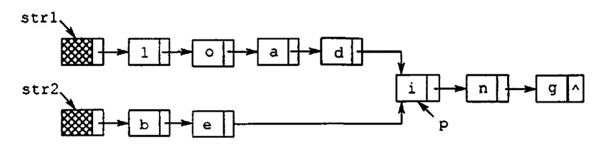

     ```c++
     /*
     两个链表的长度不同, 当长度一致时, 用两个指针pq同时遍历即可找到第一个公共结点
     1. 先计算两个链表的长度m和n
     2. 假设m>=n, 让p指针先走m-n+1步, 实现同步
     3. 两个指针同时遍历, 返回第一个相同的结点
     
     时间O(max(m, n))
     空间O(1)
     */
     
     typedef struct Node{
         char data;
         struct Node* next;
     }Linklist;
     
     // 求链表长度
     int getlen(Linklist *head){
         int len = 0;
         while(head->next != NULL){
             len++;
             head = head->next;
         }
         return len;
     }
     
     // 找到公共部分的起点 默认m>=n
     Linklist find_first_common(Linklist *str1, Linklist *str2){
         Linklist *p, *q;
         int m = getlen(str1);
         int n = getlen(str2);
         
         // 将p和q移动到相同相对位置的起点
         for(p = str1; m > n; m--)   // m>n 使p指向链表中第m-n+1个结点
             p = p->next;
         for(q = str2; m < n; n--)   // m<n 使q指向链表中第m-n+1个结点
             q = q->next;
         
         // 同时移动 当p的next是空或者p和q的下一个是相同结点为止
         while(p->next != NULL && p->next != q->next){
             p = p->next;
             q = q->next;
         }
         
         // 循环结束时p->next就是公共部分的开始结点
         return p->next;
     }
     ```

     

23. 【2015】用单链表保存m个整数，结点结构为 `[data][link]` 且data的绝对值小于等于n。设计一个时间上尽可能高效的算法，对于链表中data的绝对值相等的结点，仅保留第一次出现的结点

     要求：

     - 给出基本设计思想
     - 给出单链表结点的数据类型定义
     - 写代码
     - 说明时间、空间复杂度

     ```c++
     /*
     算法的基本设计思想
     空间换时间
     用用哈希表记录链表中已经出现的数组
     用扫描一遍链表
     如果某个值不在哈希表中, 保留, 并将该值保留在哈希表中
     如果某个值在哈希表中, 则将该结点删除
     
     时间复杂度O(n), 遍历一遍链表
     空间复杂度O(n), 需要一个哈希表
     
     */
     
     #include<unordered_set>
     
     // 单链表结点
     typedef struct node{
         int data;
         struct node* link;
     }Node;
     
     void func(Node* h, int n){
         // p->link表示当前工作的结点 r指向欲删除结点
         Node* p = h, r;
         
         // 哈希表
         unordered_set<int> st;
         
         while(p->link != NULL){
             // 如果p->link的值已经在哈希表中
             if(st.count(p->link->data)){
                 r = p->link;
                 p->link = p->link->link;
                 free(r);
             }
             // 如果p->link的值第一次出现
             else{
                 st.insert(p->link->data);
                 p = p->link;
             }
         }
         free(q);
     }
     ```

     

24. 【2019】设线性表 `L=(a1, a2, a3, ……，an)` ，设计一个原地算法重新排列使得 `L' = (a1, an, a2, an-1, a3,……)`

    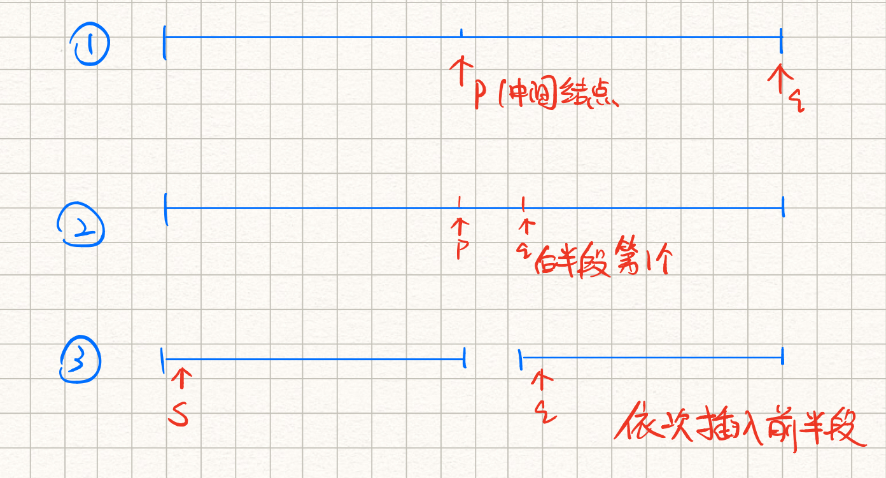

    

     ```c++
     /*
     算法思想：
     观察 L'是由L的第一个元素, 最后一个元素……依次拼接而成
     为了方便的取后半段元素, 将后半段原地逆置
         1. 找到L的中间结点。pq两个指针, p每次走一步, q每次走两步。当q到达链尾的时候 p刚好达到中间结点
         2. 将L的后半段原地逆置
         3. 将L的前半段和后半段分开, 每次从后半段取出一个元素插入前半段
         
         
     复杂度分析：
     1中找结点通过一次遍历O(n)
     2中逆置后半段O(n)
     3中双指针遍历O(n)
     因此总时间复杂度O(n)
     */
     
     void change_list(Node* h){
         // pq为两个工作指针,初始指向头结点
         node *p = h, *q = h, *r, *s;
         
         // 寻找中间节点 p每次走一步 q每次走两步 当q到达链尾的时候 p刚好达到中间结点
         while(q->next != NULL){
             p = p->next;
             q = q->next;
             if(q->next != NULL)
                 q = q->next;
         }
         
         q = p->next;    // 将q更新为后半段的第一个元素
         p->next = NULL; // 将p->next置空, 方便通过头插法插入p->next来实现逆置
         
         // 将链表后半段逆置
         while(q != NULL){
             r = q->next;
             q->next = p->next;
             p->next = q;
             q = r;
         }
         
         s = h->next;    // s指向前半段的第一个结点, 也就是插入点
         q = p->next;    // q指向后半段的第一个结点
         
         p->next = NULL; // 将前后段分开
         
         // 将链表的后半段的结点插入到指定位置
         while(q != NULL){
             r = q->next;    // r预存q的后一个结点
             q->next = s->next;
             s->next = q;
             s = q->next;    // s指向后半段的下一个插入点
             q = r;
         }
     }
     ```

     


<br>

<br>

<br>

# 第三章：栈、队列和数组

## 重点

- **选择题** ：
    - 基本概念：栈、循环队列

    - 出入栈过程、合法性，队列的操作和特征

    - 数组、特殊矩阵的压缩存储
- **应用题：**
    - 栈（基本是顺序栈，链栈需要定义结构体）和队列相关的代码题


## 3.1 栈

`栈（stack）` 是输入输出受限制的线性表，只允许在 **栈顶（Top）** 进行插入和删除。

栈的特性为 **后进先出（LIFO）** 

栈的数学性质：

- **卡特兰（Catalan）数** ：n个不同元素进栈，出栈元素的不同排列有： $\frac{1}{n+1}C_{2n}^{n}$

  


<br>

### 3.1.2 顺序栈

用一组地址连续的存储单元存放 **从栈底到栈顶** 的元素，同时用一个 指针top 指向当前的栈顶元素（若为指向栈顶的下一个元素，需要灵活变化）

```c++
#define Maxsize 50
typedef struct{
	Elemtype data[MaxSize];	// 存放元素
	int top;	// 栈顶指针
}SqStack;	// 顺序栈
```


- 初始化： `S.top = -1（如果为0的话，相当于top指向栈顶元素的下一个单元）` ；栈顶元素 `S.data[S.top]` 

- 进栈：当栈不满时，指针先+1，在赋值给栈顶 `S.data[++S.top]`
- 出栈：当栈不空时，先取值，指针再-1 `S.data[S.top--]`
- 栈空条件：`S.top == -1`
- 栈满条件：`S.top == MaxSize - 1`

 **注意：** 栈满还入是上溢，栈空还取是下溢


<br>


**共享栈**

让两个顺序栈共享一个一维数组的空间，两个栈底分别在数组的两段，栈顶向中间延伸。

 **特点** ：

- 能更有效地利用存储空间，只有整个存储空间慢才上溢
- 存取效率仍为O(1)


<br>

### 3.1.3 链栈

通常用 **单链表** 实现，规定所有的操作均在 **表头** 进行（对于带不带头结点的操作要灵活处理）

优点：

- 便于结点的插入删除
- 便于多个栈共享存储空间和提高效率
- 不存在栈满上溢

<br>


### 3.1.4 习题

 **选择题**

1. 栈和队列有相同的 `逻辑结构` 

   ```
   逻辑结构相同，只是运算不同，实际上都是线性结构
   ```

   

2. 采用非递归方式重写递归程序必须用到栈 **错误** 

    ```
    反例：计算斐波那契数列迭代实现只需要一个循环
    ```

    

3. 函数调用时，系统用栈保存必要的信息 **正确** 


<br>


 **应用题** 

1. 假设以I和O表示入栈和出栈。栈的初试和终态均为空，如果I和O组成的序列合法成为合法序列，否则非法。

   写出一个算法，判断给出的操作序列是否合法。

   ```c++
   /*
   一次扫描出入栈序列
   每次检查出栈次数是否大于入栈序列, 大于则非法
   扫描结束检查入栈和出栈次数是否相等，不等则非法
   */
   
   bool judge(char A[]){
       // i 下标 jk为入栈和出栈的次数
       int i = j = k = 0;
       
       while(A[i] != '\0'){	// 只要未到字符串末尾
           switch(A[i]){
               case 'I': 
                   j++; 
                   break;
               case 'O': 
                   k++;
                   if(k > j) {
                       return false;
                   }
           }
           i++;
       }
       if(j != k)  return false;
       return true;
   } 
   
   /*
   或者， 记录栈的长度
   入栈长度+1 出栈长度-1
   每次判断栈的长度是否小于0 是就返回false
   最后返回true
   */
   ```

   

2. 设单链表表头指针为L，结点结构由data和next两个域组成，其中data是字符型。设计算法判断该链表的全部n个字符是否中心对称。

   例如 `xyx` 、 `xyyx` 都是中心对称。

   ```c++
   /*
   前一半元素入栈，然后依次访问后半元素，每次栈中弹出一个, 对比, 直到链表尾
   
   时间O(n)，只需要扫描一遍链表
   空间O(n)
   */
   
   bool judge(LinkList L, int n){
       int i = 0;
       char s[n/2];    // 字符栈
       p = L->next;    // p指向第一个元素
       
       // 前一半元素入栈
       for(i = 0; i < n / 2; i++ ){
           s[i] = p->data;
           p=p->next;
       }
       i--;    //恢复i的值, i此时为中间下标
       
       if(n % 2 == 1)  p = p->next;    //是奇数就往后移动一位 因为最中间元素不需要比较
       while(p != NULL && s[i] == p->data){
           i--;    // i充当栈顶指针
           p=p->next;
       }
       if(i == -1) return true;
       return false;
   } 
   ```

   

3. 设有两个栈s1、s2共享一个存储区 `[0,…,maxsize-1]` 来构建 **共享栈** 。试设计s1、s2关于入栈和出栈的操作算法。

   ```c++
   #define MaxSize 100
   typedef struct{
       int stack[MaxSize];
       int top1, top2; //两个栈顶指针
   }stk;
   
   stk s;  // s是结构体变量, 为全局变量
   
   // 入栈操作 i为0表示左边的栈, 为1表示右边的栈 x为入栈元素
   int push(int i, int x){
       if(i != 0 || i != 1){
           printf("栈号非法!");
           exit(0);
       }
       if(s.top2 - s.top1 == 1){
           printf("共享栈已满!")
           return 0;
       }
       if(i == 0){
           s.stack[++s.top1] = x;
           break;
       }
       else{
           s.stack[--s.top2] = x;
       }
       return 1;
   }
   
   // 出栈操作
   int pop(int i){
       if(i != 0 || i != 1){
           printf("栈号非法!");
           exit(0);
       }
       if(i == 0){
           if(s.top1 == 0){
               print("左边栈空! 出栈失败!")
               return -1;
           }
           return s.stack[s.top1--];
       }
       else{
           if(s.top2 == 0){
               print("右边栈空! 出栈失败!")
               return -1;
           }
           return s.stack[s.top2++];
       }
   }
   ```

   


<br>

<br>

<br>


## 3.2 队列

队列（Queue）简称队，也是一种操作受限的线性表，只允许 **在队尾进行插入** ， **在队头进行删除** 

队的操作特性是 **先进先出（FIFO）** 

注意： **不允许读栈or队列的中间某个数据**


<br>


### 3.2.2 顺序队列

分配一块连续的存储单元存放队列中的元素。

-  **队头指针front** 指向队头元素
-  **队尾指针rear** 指向队尾元素的下一位置

 **注** ：front和rear的定义要结合题干

```c++
#define MaxSize 50
typedef struct{
	ElemType data[MaxSize];	// 存放元素
	int front, rear;	// 队头和队尾指针
}SqQueue;	// 顺序队列
```

- 初始状态（队空）： `Q.front == Q.rear == 0`
- 进队：当队不满时，先对队尾元素赋值，rear再+1
- 出队：当队不空时，先取出队头元素，front再+1

会有front追上rear的情况，这种是 **假溢出** ，明明还有空，看着却像满了


<br>


**循环队列**

将存储队列的表从逻辑上视为一个环，**能避免假溢出的缺点**

- `初始化` ： `Q.front = Q.rear = 0`
- `入队` ： 先判断队不满，front不变，rear往后1位 `Q.rear = (Q.rear + 1) % MaxSize `
- `出队` ： 先判断队不空，rear不变，front往后1位 `Q.front = (Q.front + 1) % MaxSize`

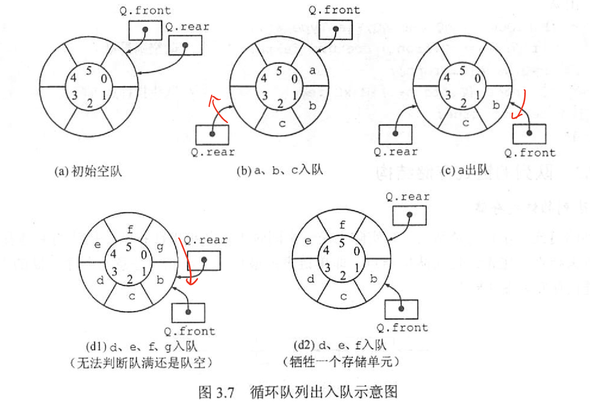

为了区分是队空还是队满：

1）**牺牲一个单元** 来区分队空还是队满，以 **front在rear的下一个位置作为队满的标志** 

- 队满：`(Q.rear + 1) % MaxSize == Q.front`
- 队空：`Q.front == Q.rear` 
- 队列中的元素个数：`（Q.rear-Q.front+MaxSize）% MaxSize`

2）struct中设置表示 **元素个数** 的数据成员

3）struct中设置 **tag标志** 数据成员，0表示因为出队导致，1表示因为入队导致


<br>


### 3.2.3 链队列

实际上是一个带 **队头指针** 和 **队尾指针** 的单链表，头指针指向队头结点（有头结点的话指向头结点），尾指针指向队尾结点。

往往带有 **头结点** 

特点：

- 适和数据元素变动较大的情形
- 不会队满溢出

链队列基本操作：

```c++
// 链队列结点
typedef struct LinkNode{
    int data;
    struct Linknode *next;
}LinkNode;

// 链队列
typedef struct{
    LinkNode *front, *rear;
}LinkQueue;


// 初始化
Q.front = Q.rear = (LinkNode*)malloc(sizeof(LinkNode));
Q.front->next = NULL;

// 队空条件 此时都指向虚拟头结点
Q.front == Q.rear

// 入队
Q.rear->next = s;
Q.rear = s;

// 出队
LinkNode *p = Q.front->next;
x = p->data;
Q.front->next = p->next;
if(Q.rear == p) // 队列中只有一个结点时
    Q.rear = Q.front;   
free(p);
```


<br>


### 3.2.4 双端队列

两端都可以出队入队，或者是有特殊规定的 **受限的双端队列** 


<br>


### 3.2.5 习题

 **选择题** 

1. 已知循环队列的存储空间为数组A[21] ，front指向队头元素的前一个位置，rear指向队尾元素，假设当前front和rear的值分别为8和3，则队列的长度为 `16`

   ```
   循环队列的长度 = (rear - front + MAX) % MAX
   ```

   

2. 用链队列进行出队时需要修改： `头尾指针都可能需要修改`

   ```
   通常出队只需要修改头指针。但当队中只有一个元素时，删除后队列为空。尾指针也需要进行修改： rear = front
   ```

   

3. 【2011】 已知循环队列存储在一位数组A[0…n-1]中，且队列非空时front和rear分别指向队头元素和队尾元素。若初始时队列为空，且要求第一个进入队列的元素存储在A[0]处，则初始时front和rear的值分别是： `0` ， `n-1` 

   ```
   第一个元素入队后在A[0]，此时front和rear都是0
   入队时因为要执行(rear + 1) % n操作，可知rear的初值为n-1。而入队不改变front，所以front的初值为0
   ```

   

4. 【2014】循环队列存放在一维数组A[0…M-1]中，end1指向队头，end2指向队尾元素的后一个位置。假设队列两端都可以进行出入队。队列中最多能容纳M-1个元素，初始为空。则队空和队满的条件是：`队空：end1 == end2	队满：end1 == (end2 + 1) mod M`

   ```
   画一个环形的循环队列的图
   队列最多只能容纳M-1个元素，说明有一个位置是用来判断队满还是队空的
   可知初始时end1 == end2 但不一定在0
   队满时，可假设end1在0, 则此时end2在M-1
   ```

   

<br>

<br>

<br>


**应用题**

1. 若希望循环队列中的元素都能得到利用，需要设置一个标志域tag（0或1区分是对空还是队满）。试编写此结构对应的入队和出队算法

    ```c++
    /*
    因为在循环队列中, 队空或者队满时, 都有front==rear, 因此设置一个tag
    入队时tag=1, 入队只能导致队满
    出队时tag=0，出队只能导致队空
    
    默认rear指向队尾的后一个元素
    */
    
    // 入队
    int EnQueue(Queue &Q, int x){
        // 队满
        if(Q.front == Q.rear && Q.tag == 1){
            printf("队满");
            return 0;
        }
        
        // 入队操作
        Q.data[Q.rear] = x;
        Q.rear = (Q.rear + 1) % Maxsize;
        Q.tag = 1;
        
        return 1;
    }
    
    // 出队
    int DeQueue(Queue &Q, int &x){
        // 队空
        if(Q.front == Q.rear && Q.tag == 0){
            printf("队空");
            return 0;
        }
        
        // 出队操作
        x = Q.data[Q.front];
        Q.front = (Q.front + 1) % Maxsize;
        Q.tag = 0;
        
        return 1;
    }
    ```

    

1. Q是一个队列，S是一个空栈，实现将队列中元素逆置的算法

    ```c++
    /*
    要将队列中元素逆置
    先将队列中的元素出队并依次入栈
    然后栈中的元素依次出栈入队
    */
    
    void Reverse_queue(Queue &Q, Stack &S){
        // 将队列中的元素入栈
        while(!Q.empty()){
            x = front(Q);
            Q.pop();
            S.push(x);
        }
        
        // 将栈中的元素入队
        while(!S.empty()){
            x = S.top();
            s.pop();
            Q.push(x);
        }
    }
    ```

    

1. 利用两个栈S1、S2来模拟一个队列

   ```c++
   /*
   已知栈的4个运算
   Push(S, x);
   Pop(S, x);
   StackEmpty(S);
   StackOverflow(S);
   
   要求实现队列的3个运算
   Enqueue;
   Dequeue;
   QueueEmpty;
   
   思路：
   S1用来入队 S2用来出队
   判队列空 两个栈都是空的
   入队：S1入栈, 若果S1满, 且S2空, 则将S1的所有元素入S2
   出队：S2出栈, 如果S2为空, 则将S1中的元素出栈并入S2
   */
   
   // 判断队列空
   bool QueueEmpty(Stack S1, Stack S2){
       if(StackEmpty(S1) && StackEmpty(S2))
           return true;
       return false;
   }
   
   // 入队
   int Enqueue(Stack &S1, Stack &S2, int k){
       // 如果S1没满
       if(!StackOverflow(S1)){
           Push(S1, k);
           return 1;
       } 
       
       // 如果S1满了但S2不为空 
       else if(StackOverflow(S1) && !StackEmpty(S2)) {
           printf("队列满");
           return 0;
       }
       
       // 如果S1满 且S2空
       if(StackOverflow(S1) && StackEmpty(S2)){
           // 将S1中的元素移动到S2中
           while(!StackEmpty(S1)){
               x = S1.top();
               Pop(S1, x);
               Push(s2, x);
           }
           Push(S1, k);
           return 1;
       }
   }
   
   // 出队
   int DeQueue(Stack &S1, Stack &S2){
       // S2不为空
       if(!StackEmpty(S2)){
           x = S2.top();
           Pop(S2, x);
           return 1;
       }
       
       // S1为空
       else if(StackEmpty(S2)){
           print("队为空");
           return 0;
       } 
       
       // S2空 但S1不空
       else {
           // 将S1中的元素移动到S2中
           while(!StackEmpty(S1)){
               x = S1.top();
               Pop(S1, x);
               Push(s2, x);
           }
           Pop(S2, x);
           return 1;
       }
   }
   ```

   

1. 【2019】请设计一个队列，要求满足：1）初始时队列为空  2）入队时，允许增加队列占用空间 3）出队后，出队元素所占空间可以重复使用 4）出队和入队都在O(1)，问：

   1. 该队列选择链式还是顺序？

      ```
      链式
      条件2 要求是链式存储
      条件3 出队后不释放空间，只是修改队头指针，为了重复利用空间，采用循环单链表
      条件4 需要队头和队尾指针
      ```
   
      
   
   2. 画出队列的初始状态，并给出判断队空和队满的条件
   
       ```
       参考循环队列
       采用虚拟头结点，值作为队满和队空的判断
       初始只有一个虚拟头结点 且有front和rear指向它
       
       队空：front == rear
       队满：front == rear->next
       ```
   
       
   
   3. 画出第一个元素入队之后的队列状态
   
   4. 给出入队操作和出队操作的基本过程
   
       ```c++
       // 入队
       if(front == rear->next){    //队满
           创建一个新节点X
           x接到rear的后面
           rear向后移动一个单位
       }
       
       // 出队
       if(front == rear){  // 队空
           返回失败
       }
       else{
           取出front的值x
           front向后移动一个单位
           返回x
       }
       ```
   
       


<br>

<br>

<br>


## 3.3 栈和队列的应用

**总结** ：

- `栈` ：递归、进制转换、迷宫求解
- `队列` ：缓冲区、页面替换算法、BFS


### 3.3.1 栈-括号匹配

判断输入的括号序列合不合法

```c++
bool judge(){
    stack<char> stk;
    
    bool flag = true;
    for(int i = 0; i < str.size(); i ++ ){
        char op = str[i];
        
        // 当前是左括号就入栈
        if(op == '<' || op == '(' || op == '{' || op == '[') stk.push(op);
        else{
            if(stk.empty()){
                flag = false;
                break;
            } 
            // 栈不为空就取出栈顶进行比较
            if(op == '>' && stk.top() == '<') stk.pop();
            else if(op == ')' && stk.top() == '(') stk.pop();
            else if(op == '}' && stk.top() == '{') stk.pop();
            else if(op == ']' && stk.top() == '[') stk.pop();
            else{
                flag = false;
                break;
            }
        }
    }
    // 最后栈不为空，也非法
    if(!stk.empty()) flag = false;
    
    return flag;
}
```


<br>

### 3.3.2 栈-表达式求值

**后缀表达式求值**

```c++
/*
称为逆波兰表达式, 也可看做表达式树的后序遍历

算法思路：
用一个栈来存储数字，遍历逆波兰表达式，如果遇到数字就入栈，遇到操作符就从栈中取出头两个数进行对应的操作，最终栈里剩下的数就是最后的结果
*/

栈nums存数字;

遍历字符串中的每个字符{
    if(是操作符){
        取出nums中的两个数（先b后a);
        操作完再放回nums;
    }
    else
        存入nums;
}

返回nums.top();
```


<br>


**中缀表达式求值**

```c++
/*
关键点：
怎么判断表达式树的一个子树已经遍历完？
当前运算符的优先级 <= 上一个运算符的优先级
*/

设置两个栈：op存操作符 num存数字;

遍历整个字符串{
    取出当前字符;
    
    当前字符是数字{
        取出该数字, 存入num;
    }
    
    如果是左括号
        存入op;
        
    如果是右括号{
        while(op.top()! ='('){
            依次从op中取出操作符 操作num顶的两个数;
            去掉左括号;
        }
        
    其他符号{
        while(op不为空 && 当前操作符优先级小于等于op顶优先级)
            从op中取出操作符 操作num顶的两个数;
        将操作符存入op
    }
        
        
    执行op中剩余的操作;
    最后返回num的栈顶元素;

}
```

**补充** ： 后缀表达式不需要括号 中缀表达式需要括号


<br>


将中缀表达式转换为后缀表达式


<br>


### 3.3.3 栈-递归

将递归算法转为非递归算法， **一般需要用到栈**

利用一个栈实现以下递归函数的非递归计算：

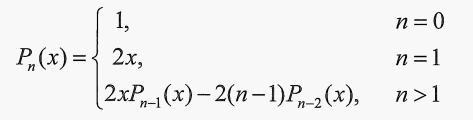

```c++
/*
当n>2时, 每个pn(x)的值都和前两个值挂钩
从栈底到栈顶存上n到2, 每次根据前面两个值求出当前的值, 并不断更新
最后栈底的值就是答案
*/

double p(int x, double x){
    // 栈中存n和对应的pn(x)
    struct stack{
        int no;          // 保存n
        double val;     // 保存pn(x)的值
    }st[Maxsize];
    
    int top = -1;    // top为栈顶指针
    double f1 = 1, f2 = 2 * x;  // f1f2为当前计算的两个值 初值为n=0和n=1时的pn(x)
    
    for(int i = n; i >= 2; i--){
        top++;
        st[top].no = i;  // 存入n
    }
    
    // 只要栈不为空 计算pn(x)的值
    while(top >= 0){
        st[top].val = 2 * x * f2 - 2 * (st[top].no - 1) * f1;
        
        // 将f1f2更新
        f1 = f2;
        f2 = st[top].val();
        top--;
    }
    
    // 最后返回栈底元素
    if(n == 0)
        return f1;
    return f2;
}
```


<br>


**但并非递归转非递归必须用到栈**

递归求斐波那契额数列转为非递归，可以用迭代实现：

```c++
// 斐波那契数列 递归
int fib(int n){
	if (n<2) { 
		return n;
	} else {
		return fib(n-1) + fib(n-2);
	}	
}

// 斐波那契数列 非递归（迭代）
int fib(int n){
	if(num == 1 || num == 2) {
		return 1;
	}
	int first = 1, second =1, third = 0;
	for(int i = 3; i<= n ;i++) {
		third = first + second;
		first = second;
		second = third;
	}
    return third;
}
```


<br>


### 3.3.4 队列-求层次遍历

例如求树的层次遍历


<br>


### 3.3.5 队列-计算机系统

关键词： **缓冲区** 

- 解决主机和外设之间速度不匹配的问题： **设置打印数据缓冲区**
- 解决多用户资源竞争的问题： **设置请求队列**


<br>


### 3.3.6 习题

 **选择题** 

1. 【2012】已知操作符包括 `+` 、 `-`  、 `*` 、 `/` 、 `(和)` 。将中缀表达式 `a+b-a*((c+d)/(e-f)+g)` 转化为后缀表达式 `ab+acd+e/f-*-g+` 时，用栈来存放暂时不能确定运算次序的操作符。初始栈为空，转换过程中同时保存在栈中的最大操作符个数是： **5** 
2. 【2014】假设栈为空，将中缀表达式 `a/b+(c*d-e*f)/g` 转换为等价的后缀表达式的过程中，当扫描到f时，栈中的元素依次是： **+(-*** 


<br>


#### 应用题

1. 一条单向铁道上有两种车厢，计作H和S，借助一个栈道实现所有的S都在H之前

    ```c++
    /*
    将火车序列看做一个字符型的链表
    遍历一遍
    是H就入栈, 遍历完成后链表中只剩下S
    最后再将栈中的元素接到链表的后面
    */
    
    void train_arrange(char *train){
        // 用p来遍历整个链表 q指向过滤后的S的最后一个元素 pq初始指向第一个元素
        char *p = train, *q = train, c;
        
        stack<int> s;
        while(*p){
            if(*p == 'H')
                s.push(*p); // H就入栈
            else
                *(q++) = *p;// 将q更新, 在链表前部形成已经完成过滤的部分
            p++;
        }
        
        // 最后将栈中的H都放出来
        while(!S.empty()){
            c = S.top();
            S.pop();
            *(q++) = c; // 接在后面
        }
    }
    ```

    

2. 某汽车轮渡口，过江渡船每次能载10辆车过江，过江车辆分为客车和货车。

    现规定：同类车先到先上船，客车先于货车上船，且每上4辆客车才允许上1辆货车。若等待客车不足4辆，则以货车代替，若无货车等待，允许客车都上船。

    设计一个算法模拟渡口管理

    ```c++
    /*
    用j来记录上渡船的队列
    用i来记录本次中客车的数量
    */
    
    Queue q;    // 上渡船的队列
    Queue q1;   // 客车队列
    Queue q2;   // 货车队列
    
    void manager(){
        int i = 0, j = 0;   // j记录上渡船的队列 i记录本次上客车的数量
        
        while(j < 10){
            // 如果还有客车 且未上满4量
            if(!QueueEmpty(q1) && i < 4){
                q1出队并入队q;
                i++;
                j++;
            }
            
            // 如果客车已经上满4量 且还有货车
            else if(i == 4 && !QueueEmpty(q2)){
                q2出队并入队q;
                i = 0;  // 上货车之后i重新计数
                j++;
            }
            
            // 没有客车或者没有货车了
            else{
                // 没有客车了但还有货车
                while(j < 10 && i < 4 && !QueueEmpty(q2)){
                    q2出队并入队q;
                    i++;    // 当i>4时会退出本循环
                    j++;
                }
                
                // 点睛之笔
                // 如果没有客车了, 则会一直执行上面的while, 让货车替代客车
                // 如果没有货车了, 第一个if执行完毕后, 将i赋值为0, 会继续执行第一个if, 即无货车等待, 允许客车全部上船
                i = 0;  
            }
            
            // 若加起来都不满10辆 直接赋值j=11跳出这个最外层循环
            if(QueueEmpty(q1) && QueueEmpty(q2))
    			j = 11;  
        }
        
        开船;
    }
    ```


<br>


## 3.4 数组和特殊矩阵

多维数组：按行优先、按列优先


<br>


### 3.4.3 特殊矩阵的压缩存储

`压缩存储` ：对多个值相同的元素只分配一个存储空间，对零元素不分配存储空间

- `对称矩阵` ：只存储上半或下半（包括对角线），按行或按列优先
- `三角矩阵` ：按行或按列优先
- `三对角矩阵` ：按行或按列优先


<br>


### 3.4.4 稀疏矩阵

稀疏矩阵的压缩存储方法：

- `三元组表` ：只记录非零元素的(行，列，值)，压缩存储之后会失去随机存取特性
- `十字链表`


<br>


### 习题

 **选择题** 

1. 若将n阶上三角矩阵A按列优先压缩存储在一维数组 `B[1…n(n+1)/2+1]` 中，则存放到B[k]中的非零元素 `aij(ij的范围[1, n])` 的下标i、j和k的关系是： **j(j-1)/2+i**

    ```
    按列优先, a下标从1开始, aij的前面有j-1列，共有1+2+…+j-1 = j(j-1)/2 个元素
    aij这一列里 是第i个元素
    B的下标从1开始，因此aij的下标 = j(j-1)/2+i
    ```

    

2. 若将n阶下三角矩阵A按列优先压缩存储在一维数组 `B[1…n(n+1)/2+1]` 中，则存放到B[k]中的非零元素 `aij` 的下标i、j和k的关系是： **(j-1)(2n-j+2)/2+i-j+1** 

    ```
    按列优先, a下标从1开始, aij的前面有j-1列，共有n+(n-1)+(n-2)+...+(n-(j-1)+1) = (j-1)(2n-j+2)/2 个元素
    aij是这一列中第i-j+1个元素
    B下标从1开始, 因此aij的下标 = (j-1)(2n-j+2)/2+i-j+1
    ```

    

3. 【2020】将一个10x10对称矩阵M的上三角部分的元素 `mij` （1<= i，j<=10）按列优先存入一维数组N中，元素  `m72` 在N中的下标是： **22** 

    ```
    首先对称矩阵只存储上三角部分，m72的值就是对应的m27
    又是按列优先，m27之前有6列，共有1+2+3+4+5+6 = 21个元素
    m27是在它的那列是第2个元素
    但一维数组下标从0开始，因此在一维数组的下标为：21+2-1=22
    ```

    

4. 【2021】二维数组A按行优先存储，每个元素占1个存储单元。若元素 `A[0][0]` 的存储地址是100， `A[3][3]`  的存储地址是220，则元素 `A[5][5]` 的存储地址是： **300**  

    ```
    假设二维数组一行有n个元素
    A[3][3]是二维数组按行优先的第3*n+4个元素
    从存储地址来看，A[3][3]是第121个元素
    3*n+4=121, 得到n=39
    
    因此A[5][5]的存储地址 = 100+5*39+6-1=300
    ```

    


<br>

<br>

<br>

# 第五章：树与二叉树

### 重点

**选择题：**

- 各种树的性质、哈夫曼树、哈弗曼编码、并查集

**应用题：**

- 树的各种遍历（算法题）

    

<br>


### 5.1 树

树是一种逻辑结构，树的定义是递归的，适合表示有层次结构的数据

补充：

-  **度** ： 孩子个数
-  **路径** ：两个结点之间的路径由这两个结点之间的经过的 **结点序列** 组成，树中的路径是 **从上向下** 的，**分支只能是父结点指向子结点**
-  **路径长度** ： 路径长经过的 **边** 的个数
-  **树的路径长度** ：从树根到每个结点的路径长度的 **总和** 


<br>


#### 5.1.3 树的性质

1.  **树中结点数**  =  **所有结点度数和  + 1** = **总分支数 + 1**


<br>


### 5.1.4 习题

#### 应用题

1. 含有n个结点的三叉树的最小高度是多少？

    ```
    结点数固定，要高度最小，必须是完全3叉树
    h层的完全3叉树，第h层最少有1个结点，最多有3^(h-1)个结点
    列出n的范围，然后反解出h的最小值
    ```

    

2. 已知一棵度为4的树中，度为0、1、2、3的结点数分别为14、4、3、2，求该树的结点总数n和度为4的结点个数

    ```
    总结点数 = 所有结点度数和 + 1
    14+4+3+2+n4 = 4*1+3*2+2*3+4*n4+1
    解出n4=2
    
    因此总结点数=14+4+3+2+2=25
    ```


<br>


### 5.2 二叉树

### 5.2.1 二叉树的定义及其主要特性

二叉树每个结点至多只有两颗子树，且子树有左右之分，是有序树。

**二叉树和度为2的有序树的区别** ：

1. 度为2的有序树至少有3个结点，二叉树可以是空树
2. 度为2的有序树中某个结点要是只有一个孩子，就无左右次序。但二叉树还是有结点次序。


<br>


**满二叉树** ： 

高度为h，且有2^(h)-1个结点的二叉树

**根结点的编号为1** ，此时能得到父结点和左右孩子编号的对应关系


<br>


**完全二叉树** ：

 每个结点都和对应的满二叉树结点一一对应的二叉树

就是对应相同高度的满二叉树缺失右下角的一些连续叶结点


<br>


**二叉排序树（BST）** ：

左子树的所有结点关键字都小于根结点关键字，右子树上所有结点关键字均大于根结点的关键字；

且左右子树均是二叉排序树


<br>


**平衡二叉树（AVL）** ： 任一结点左右子树深度差不超过1


<br>


**二叉树的性质** ： 

1. **重要!!!** 非空二叉树中叶子结点数等于度为2的结点数+1，即 **n0 = n2 + 1**
2. 非空二叉树第k层 **最多** 有2^k-1^个结点
3. 高度为h的二叉树 **最多** 有2^h^-1个结点，此时为满二叉树
4. 有n（n>0）个结点的完全二叉树高度为 log2n下取整再+1


<br>


### 5.2.2 二叉树的存储结构

1. `顺序存储结构` ：

    数组，下标反映结点之间逻辑关系

     适合完全、满

2. 链式存储结构 ：

    一般都采用这个

    **n个结点的二叉链表中，含有n+1个空链域**

    利用空链域可以组成 **线索链表**

    ```
    typedef struct BiTNode{
    	int data;
    	struct BiTNode *lchild, *rchild;
    }BiTNode, *BiTree;
    ```

    


<br>


### 5.2.3 习题

#### 选择题

1. 假设一棵二叉树的结点个数是50，则它的最小高度是 **6**

    ```
    构成完全二叉树是有最小高度
    ```

    

2. 设二叉树有 2n 个结点，且m<n，则不可能存在 **2m个度为1** 的结点

    ```
    n0=n2+1
    总结点数n=n0+n1+n2= 2*n2+n1+1
    可知n1=2(n-n2)-1，一定是奇数
    ```

    

3. 一棵完全二叉树上有1001个结点，其中叶结点的个数是 **501**

    ```
    法一
    由完全二叉树的性质
    最后一个分支结点的序号为1001/2下取整，结果是500
    因此在500之后的都是叶子结点
    
    法二
    n0=n2+1
    因此总数=2n0+n1-1 而完全二叉树n1只能取0和1
    结点数是整数，因此n1只能取0，此时n0=501
    ```

    

4. 一棵有124个叶结点的完全二叉树，最多有 **248** 个结点

    ```
    法一
    n0=n2+1	可知n2=123
    而完全二叉树，n1只能取0和1，取1是有最大结点
    此时最大结点：124+1+123=248
    
    法二
    124<128，因此第8层没满
    前7层为完全二叉树
    因此第八层可能有120个叶子结点，第7层最右4个为叶子结点
    最多请况下，这4个叶子结点最左边的那个可以有一个左孩子，不影响叶子结点个数
    结点总数为2^7-1+120+1=248
    ```

    

5. 已知一棵有2011个结点的树，其叶结点个数是116，则该树对应的二叉树中无有孩子的结点个数是 **1896**

    ```
    画图
    取特殊值，扫把型的树，1895个结点变成一条，最后一个结点有116个叶结点
    转换为二叉树后，只有前115个叶结点有右孩子
    ```

    

6. 【2020】对于任意一棵高度为5且有10个结点的二叉树，若采用顺序存储，每个结点占1个存储单元（仅存放结点的数据），则存放该二叉树需要的存储单元数量至少是 **31**

    ```
    因为二叉树的结构不固定，考虑存下高度为5的满二叉树即可应对所有可能
    高度为5的满二叉树的结点数：1+2+4+8+16=31
    ```

    


<br>


#### 应用题


<br>


### 5.3 二叉树的遍历和线索二叉树

**遍历** ： 按某条搜索路径访问树中的每个结点，使得每个结点均被访问一次

常见的遍历：先序(NLR)、中序(LNR)、后续(LRN)


<br>


 **先序遍历(PreOrder)** ：

```c++
// 先序遍历 递归
void PreOrder(BiTree T){
    if(T != NULL){
        visit(T);
        PreOrder(T->lchild);
        PreOrder(T->lchild);
    }
}
```

由于每个结点都恰好被访问一次，因此递归算法的 **时间复杂度** : **O(n)**

在递归过程中，递归工作栈的深度恰好为树的高度，最坏情况下树高为n，因此 **空间复杂度** : **O(n)**


<br>


 **中序遍历(InOrder)** :

递归写法只是访问结点的顺序不同，不再赘述

采用非递归写法需要用到 **栈** 

```c++
//中序遍历 非递归
void InOrder(BiTree T){
    
    //空树
    if (T == NULL) return;
    
    //树非空
    BiTree* p = T;
    stack<BiTree> s;
    while (!s.empty() || p){
        
        //一直遍历到左子树最下边，边遍历边保存根节点到栈中
        while (p){
            s.push(p);
            p = p->lchild;
        }
        
        //当p为空时，说明已经到达左子树最下边，这时需要出栈了
        if (!s.empty()){
            p = s.top();
            s.pop();
            visit(p);
            //进入右子树，开始新的一轮左子树遍历(这是递归的自我实现)
            p = p->rchild;
        }
    }
}
```


<br>


**后序遍历(PostOrder)** ： 

后序遍历的非递归实现起来是最难的。因为要保证左右孩子都已被访问才能访问根结点


**层次遍历**

层次遍历需要一个 **队列** 


<br>


### 5.3.2 线索二叉树

在含有n个结点的二叉树中，有 **n+1** 个空指针

引入线索二叉树的 **目的** ： **为了加快查找结点前驱和后继的速度**

增加两个标志域，并规定：

- 若无左子树，lchild指向其前驱
- 若无右子树，rchild指向其后继
- ltag为0表示左孩子，1表示前驱
- rtag为0表示右孩子，1表示后继

用二叉链表作为二叉树的存储结构，称为 **线索链表** 


<br>


## 5.4 树、森林

树可以用顺序存储，也可以链式存储。

常用的3种存储结构：

1. 双亲表示法
2. 孩子表示法
3. 孩子兄弟表示法


<br>


### 5.4.2 树、森林和二叉树的转换


<br>


### 5.4.3 树、森林的遍历

树的遍历主要有两种方式：

- 先根遍历
- 后根遍历

森林的遍历的两种方式：

- 先序遍历森林
- 后序遍历森林


<br>


## 5.5 树与二叉树的应用

### 5.5.1 哈夫曼树和哈夫曼编码

 **权** ：树中结点带有的的数值

 **结点** 的 **带权路径长度** ：从根到任意结点的路径长度（经过的 **边数** ）与该结点权值得乘积

 **树** 的 **带权路径长度（WPL）** ：所有叶结点的带权路径长度之 **和** 

在含有n个带权叶结点的二叉树中，WPL最小的二叉树称为 **哈夫曼树** （最优二叉树）


**哈夫曼树的构造** ： 


<br>


 **哈夫曼树的性质** ：

- 每个初始结点最后都是叶结点，且结点权值越小，到根结点的路径长度越大
- 构造过程中新建 `n-1` 个结点（双分支结点），结点总数为 `2n - 1`
- 树中不存在度为1的结点


<br>


**哈夫曼编码 ** ： 

从哈夫曼树得到的哈夫曼编码，可以将边标记为

- 0表示转向左孩子
- 1表示转向右孩子

从根结点到叶子结点的路径就是它的哈夫曼编码。

如果有若干个权值不同的结点，那么得到的哈夫曼树不唯一。但是WPL必定相同，且都是最小的


<br>


### 5.5.2 并查集

是一个集合，有3中操作：

- `Initial(S)` 将集合s中每个元素都初始化为只有一个单元素的子集合
- `Union(S, Root1, Root2)` : 把S中的子集合Root2并入Root1，要求互不相交
- `Find(S, x)` : 查找S中x所在自己和的根


**定义** ： 

```c++
#define MaxSize 100
// 集合元素数组（双亲指针数组）
int UFSets[MaxSize];    
```

**初始化** ： 

```c++
void Initial(int S[]){
    for(int i = 0; i < MaxSize; i++ ){
        s[i] = -1;
    }
}
```

**Find** ： 

```c++
int Find(int S[], int x){
    while(S[x] >= 0)
        x = S[x];
    return x;
}
```

**Union** ： 

```c++
void Union(int S[], int Root1, int Root2){
    // 要求Root1和Root2不同
    S[Root2] = Root1;
}
```


<br>

<br>

<br>

# 第六章 图

### 重点

- DFS、BFS
- 应用：拓扑排序、最小生成树、最短路径、关键路径


<br>


## 6.1 图的基本概念

图G由顶点集V和边集E组成，记为G=(V，E)

V(G)：图G中顶点的有限非空集，|V|表示顶点个数

E(G)：图G中边的有限非空集，|E|表示边的条数


注：线性表、树可以为空，但图不可为空（V非空，E可为空）


基本概念：

- 有向图：有向边也称为弧。 `<v, w>` 称为v到w的弧。其中v是弧尾，w是弧头
- 无向图：边： `(v, w)`
- 完全图：图中任意两个顶点之间都有边。类似的：有向完全图
- 子图：顶点集合边集都是原来图的子集。如果含原来图的全部顶点就是生成子图。注：并非任何子集都能组成子图
- 连通：有路径存在。类似的：强连通
- 连通图：无向图中任意两个顶点都是连通的
- 连通分量：无向图中的极大连通子图
- 强连通图：有向图中任意两个顶点都是强连通的
-  **生成树** ：包含图全部顶点的极小连通子图
- 生成森林：非连通图连通分量的生成树构成
- 度：无向图中一个顶点上边的条数。 入度ID、出度OD
- 权：带权的图也称为网
- 稠密图：边多。稀疏图：边少。
-  **路径** ：由顶点和相邻顶点序偶组成的 **边** 所形成的序列
-  **路径长度** ：路径上 **边的数目** 
- 环/回路：如果n个结点，有大于n-1条边
- 简单路径：顶点不重复出现。简单回路：除了起点和终点重复。
-  **距离** ：如果最短路径存在， **最短路径的长度** 。若不存在路径，则距离为无穷 ∞
- 有向树：顶点入度为0，其余顶点入度为1


<br>


补充：

- 无向图：全部顶点的度数和 = 边数的2倍
- 有向图：全部顶点的出度和 = 入度和 = 边数
- 极大连通子图：要求包含所有的边
- 极小连通子图：要求边数最少，少了一条就会非连通


<br>


### 习题

1. 强连通有向图任何顶点到其他所有顶点都有弧（ **错误** 

    **解释** ：强连通有向图的任何顶点到其他所有顶点都有 **路径** ，但未必有 **弧** 

2. 有向完全图一定是强连通有向图（ **正确** 

3. 一个有28条边的非连通无向图至少有顶点：**9**

    **解释** ：考虑非连通图最极端的情况：由一个完全图和一个独立的顶点组成，此时多一条边就是连通图。`28 = n(n-1)/2` 得到n = 8。再加上一个独立顶点得到9

4. 若一个具有n个顶点、e条边的无向图是一个森林。则森林中必有 **n-e** 棵树

    **解释** ：n个顶点的树有n-1条边。假设有x棵树组成森林，可以通过增加1个结点和x条边使森林组成一棵树。此时树有n+1个结点，e+x条边。列方程`n+1 = e + x + 1` ，解得 `x = n - e` 

5. 【2010】若无向图G=(V,E)中含7个顶点，要保证图G在任何情况下都是连通的，最少需要的边数 **16** 

    **解释** ：首先先让6个结点组成一个完全图，再加上一条边就必定能保证另一个结点也连通。6个结点的完全图需要 `6*(6-1)/2=15` ，再加上一条边得到16

7. 【2017】已知无向图G有16条边 ，其中度为4的顶点个数为3，度为3的顶点个数为4，其他顶点的度均小于3。图G所含顶点个数 **至少** 为 **11**

    **解释** ：至少的话，其余顶点都是度为2的顶点。 **无向图各顶点的度数之和 = 边数的2倍** 。列出方程：`4*3+3*4+2*x = 16*2`，得其他顶点为4。因此总顶点数`4+4+3=11`


<br>


## 6.2 图的存储及基本操作

### 6.2.1 邻接矩阵

用一个一维数组存储顶点，用一个二维数组（矩阵）存储边。存储顶点之间邻接关系的二维数组称为 **邻接矩阵** 

`A[I][J]` :  

- 1是边，0不是边
- 带权图：权Wij表示右边，0或∞表示不是边


<br>


**重点** ： 

- 有向图： **行是出，列是入** 。第i行非0元素（或者非∞元素）的个数为出度OD
- 无向图：一定是 **对称矩阵** ，且唯一。因此可以 **压缩存储** ，只存储一半
- 无向图：第i行或者i列非0元素（或者非∞元素）的个数为顶点i的度TD
-  **优点** ： **容易确定图中任意两个顶点之间是否有边** 
-  **缺点** ： **不容易确定图中有多少条边** 。需要遍历整个邻接矩阵，花费的时间很大
-  **适合** ： **稠密图** （边多）
- 设图G的邻接矩阵A，An的元素Anij等于 **从i到j的长度的长度为n的路径的数目** 


<br>


### 6.2.2 邻接表

对图G中每个顶点建立一个单链表，第i个单链表中 **结点** 表示依附于顶点Vi的 **边** （有向图则是弧），这个单链表就称为顶点Vi的 **边表** (有向图则是 **出边表** )

边表的头指针和顶点的数据信息采用 **顺序存储** （称为顶点表）

邻接表中有 **顶点表结点** 和 **边表结点** 


<br>


### 6.2.3 十字链表

### 6.3.4 邻接多重表


<br>


## 6.3 图的遍历

图的遍历指的是从图的某一顶点触发，按照某种搜索方法沿图中的边 **对图中所有结点访问一次且仅访问一次** 


<br>


### 6.3.1 广度优先搜索BFS

 **类似于二叉树的层序遍历** 。 **Dijkstra单源最短路径算法** 和 **Prim最小生成树算法** 也有类似的思想

BFS是一种分层查找的过程，不像DFS那样有回退的情况。因此它 **不是一个递归的算法** 

为了实现逐层访问，算法需要借助一个 **辅助队列** 


<br>


**BFS的伪代码：**

```c++
bool visited[MaxSize] = {false};  // 访问标记数组, 初始化都为false

void BFSTraverse(Graph G){
    
    初始化辅助队列Q;
    for(遍历v的每个结点)
        // 对每一个连通分量进行BFS
        if(结点i未被访问) 
            // 如果vi未访问, 从vi开始BFS
            BFS(G, i);  // BFS()调用的次数就是连通分量数
}

// 从顶点v开始, BFS遍历G
void BFS(Graph G, int v){
    访问v, 并标记已访问;
    
    v入队;
    
    while(队列非空){
        队头出队, 记作v;
        
        for(遍历所有v的邻接点w){
            if(w未被访问){
                访问w并标记;
                w入队;
            }
        }
    }
}
```


<br>


**1、BFS的复杂度分析：**

无论是邻接表还是邻接矩阵，BFS都需要一个辅助队列Q，n个顶点都需要入队一次， **空间复杂度：O(|v|)** 

采用 **邻接表** ：

- 每个顶点入队一次，时间复杂度O(|v|)
- 每条边都至少被访问一次，时间复杂度O(|E|)
-  **总的时间复杂度为O(|v| + |E|)** 

采用 **邻接矩阵** ：

- 需要遍历整个矩阵， **时间复杂度O()** 


<br>


**2、BFS解决单源最短路径问题：**

伪代码：

```c++
void BFS(Graph G, int u){
    // d[i]表示从u到i的距离    
    整个d[]数组初始为无穷;
        
    标记u已访问;
    d[u] = 0;
    u入队;
    while(队列非空){
        u出队;
        for(u的邻接结点w)
            if(未被访问){
                标记w已访问;
                d[w] = d[u] + 1;
                w入队;
            }
    }
}
```


<br>


### 6.3.2 深度优先搜索DFS

类似于树的 **先序遍历** ，策略是尽可能 **深** 地搜索一个图

从图的某一结点v出发，访问与v相邻且未被访问的任意结点w，再从w出发……重复过程。当不能再继续向下访问时，依次退回到最近被访问的结点，若它还有邻接结点未被访问，则从该点开始继续上述搜索过程，直到图中所有结点都被访问为止。


<br>


**递归形式DFS的伪代码：**

```c++
bool visited[MaxSize] = {false};  // 访问标记数组, 初始化都为false

void DFSTraverse(Graph G){
    for(从v0开始的每一个结点)	// 遍历每个连通分量
        if(未被访问)
            DFS(G, v);	// DFS()调用的次数就是连通分量数
}

void DFS(Graph G, int v){
    访问v, 并标记;
    
    for(和v相邻的所有结点w)
        if(w未被访问)
            DFS(G, w);
}
```


<br>


**1、DFS的复杂度分析：**

DFS是一个递归算法，需要用到一个递归工作栈，栈中存放所有结点，因此 **空间复杂度为O(|V|)** 

**时间复杂度花在查找每个结点的邻接点上**

采用 **邻接表** ：

- 访问每个顶点，时间复杂度O(|v|)
- 查找所有顶点的邻接点需要的时间复杂度O(|E|)，也就是边的数目
- **总的时间复杂度为O(|v| + |E|)** 

采用 **邻接矩阵** ：

- 查找每个结点临界点需要用时O(|V|)，总共有O(|V|)个结点。因此 **时间复杂度O()** 


<br>


### 广度、深度优先生成树

**注意** ：

- 邻接矩阵唯一，所以广度优先生成树唯一
- 邻接表不唯一，所以广度优先生成树不唯一
- 对连通图能生成树，否则就是生成森林


<br>


### 习题

**选择题：**

1. 图的广度优先生成树的树高比深度优先生成树的树高 **小或相等**

   **解释** ： 对于广度优先生成树，顶点到其他顶点的路径是图中对应的最短路径。树高最小。深度有点生成树因为是深，路径尽可能长，所以树比较高


**应用题：**

1. 写出图的DFS算法的非递归算法（图采用邻接表形式）

2. 设计一个算法， **判断一个无向图G是否是一棵树** ，是返回true，否返回false

   思路：判断G是树的条件是，G必须是 **无回路的连通图** ，或者是 **有n-1条边的连通图** ，采用后者

   因此，采用DFS，并在遍历过程中记录访问到的顶点个数和边的条数， **如果一次DFS就能访问到n个顶点、n-1条边，则说明是树** 

   

   ```c++
   bool isTree(Graph G){
       // 初始化访问数组
       for(int i = 1; i < G.vexnum; i++ )
           visited[i] = false;
       
       // 顶点数、边数初始化为0
       int Vnum = 0, Enum = 0;
       
       DFS(G, 1, Vnum, Enum, visited);
       
       // 判断是否满足是树的条件 一条边会被记录两次
       if(Vnum == G.vexnum && Enum == 2 * (G.vexnum - 1))
           return true;
       return false;
       
   }
   
   // DFS 记录遍历过程中的顶点数和边数
   void DFS(Graph& G, int v, int& Vnum, int& Enum, int visited[]){
       visited[v] = true;
       Vnum++;
       
       // w取v的第一个邻接点
       int w = FirstNeighbor(G, v);
       while(w != -1){
           // 有邻接点 边数+1
           Enum++;
           if(!visited[w])
               DFS(G, w, Vnum, Enum, visited);
           // w取下一个邻接点
           w = NextNeighbor(G, v, w);
       }
   }
   ```

   

<br>


## 6.4 图的应用

是重点，包括：最小生成树、最短路径、拓扑排序、关键路径


<br>


### 6.4.1 最小生成树

一个连通图的 **生成树** 包含图的全部顶点，和尽可能少的边。

- 如果少一条边，就会非连通
- 如果多一条边，就会有回路

对于一个 **带权连通图** 来说， **最小生成树（MST）** 是它的 **所有生成树中权值之和最小** 的那棵生成树

**最小生成树的性质：**

1. 树形不唯一，但若图G中各边权值互不相等，则最小生成树唯一。当G本身是一棵树（边数  = 顶点数 - 1），最小生成树是它本身
2. 最小生成树的权值和总是唯一的

通用的最小生成树算法：

```c++
get_MST(Graph G){
    T = NULL;
    while T未形成一棵树:
        do 找到一条 最小权值 且 加入不会产生回路 的边;
            加入T;
}
```


<br>


#### Prim算法

类似于 **最短路径的Dijkstra算法** 

Prim算法的思想：

1. 初始时任选一顶点加入树T
2. 每次选择一个 **与当前树T中顶点集合距离最近的顶点** ，将对应顶点和边加入T
3. 直到图G所有顶点都加入T

Prim伪代码：

```c++
void Prim(G, T){
    // T顶点集合 E边集合
    T = {};     // 初始化空树
    E = {w};    // 任意加入一个顶点w
    while(T中不含G的全部丁点)：
        找到权值最小的边(w, u)
        顶点、边加入对应集合
}
```


Prim复杂度分析：

-  **时间复杂度O()** ，和|E|无关，因此 **适合稠密图** ，（ **Prim选的是顶点，边多无所谓！** ）


<br>


#### Kruskal算法

 **Prim选择的是顶点，Kruskal选择的是边** ， **按边的权值递增次序** 选择合适的边来构造最小生成树

```c++
void Kruskal(v, T){
    T = {v};    // 初始化树T, 仅含顶点v 
    Snum = n;   // Snum连通分量数, 初始等于顶点数n
    
    while(Snum > 1){
        从E中取出权值最小的边(v, u);
        if(v 和 u属于不同的连通分量){
            边(v, u)加入生成树
            Snum--; // 连通分量数-1
        }
    }
}
```

通常在Kruskal算法中，采用 **堆** 来存放边的集合，因此每次选取最小权值的边只需O(log|E|)的时间。

用 **并查集** 来描述T，从而构建T的 **时间复杂度为O(|E|log|E|)** ，只和边有关，因此 **适合稀疏图**  ，( **Kruskal选择边，适合边少的图** )


<br>


### 6.4.2 最短路径

 **无权图** 找最短路径： **BFS** 

 **带权图** ：从一个顶点v0出发到图的某一顶点的路径（可能不只一条）经过的边的权值之和，定义为 **该路径的带权路径长度** 

带权路径长度最短的那条路径称为 **最短路径** 

求解最短路径的算法通常以来与一种 **性质** ： **两点之间的最短路径也包含了路径上其他中间顶点间的最短路径**

最短路径问题分为两类：

-  **单源最短路径问题** ：（即求某点到其他各顶点的最短路径） **Dijkstra算法**
-  **求每对顶点间的最短路径** ： **Floyd算法** 


<br>


#### Dijkstra算法

设置一个 **集合S** 记录已求得的最短路径的顶点。

初始时，源点v0放入S，S中每新加入一个结点就需要修改源点v0到集合中其他顶点的最短距离长度值。 **看看通过绕道能否是距离变得更短**

构造的时候设置了两个辅助数组：

-  **dist[ ]** ：  记录源点到其他各个顶点的 **当前的** 最短路径长度。初始化为dist[0] = 0，其他设置为无穷
-  **path[ ]** :  path[i] 表示从源点到顶点vi的最短路径的 **前驱结点**  ，算法结束时，可以追溯到源点v0到顶点vi的距离

用 **邻接矩阵arcs** 存储 **带权有向图** 

Dijkstra算法是 **基于贪心** 策略的


<br>


**Dijkstra算法的步骤：**

1. 初始化： S初始化为{0}，dist[ ] 初始化 `dist[0] = arcs[0][i]` ，就是从0出发 **直接** 到达其他顶点的距离
2. 从顶点集合中选出vj， **满足dist[j] 是当前dist中最小的那个** ，vj就是当前求得的从v0出发的最短路的终点， **将vj归入集合S** 
3. 根据vj，对其他dist[ ]进行更新： **如果绕道vj，能使得距离变小，就更新为小的距离** 

循环一次可以确定一个点的最短距离，循环n-1次完成，最终所有的顶点都在S中


<br>


**手动模拟Dijkstra：**


<br>


**注意：**

- 当边带有 **负权值** 时，Dijkstra算法并不使用

-  **只用考虑有向图的算法** ， 因为无向图可以看做是特殊的有向图，即两个方向都有弧


<br>


**Dijkstra复杂度分析：**

- 使用 **邻接矩阵** 存储时，时间复杂度为O()

- 使用 **带权的邻接表** 存储时，虽然修改dist[ ]的时间会减少，但在dist[ ]中找到最小分量的时间不变，时间复杂度还是时间复杂度为O()


---

<br>


#### Floyd算法

问题描述：已知一个各边权值均大于0的带权有向图，对任意两个顶点Vi != Vj，要求求出Vi和Vj之间的最短路径和路径长度


**Floyd算法的基本思想：**

Floyd的思想是基于 **动态规划DP** 的

首先对于邻接矩阵A，如果 `<i, j>` 存在，则 `A[i][j] = 边的权值` ，否则就是无穷。

随后对邻接矩阵递推n次， **递推到k次时，判断两个点之间的最短路能否通过绕行第k个点实现变小，如果可以就用新路径来代替原路径** 

```c++
// k代表递推的次数 可以省略
A[k, i, j] = min(A[k, i, j] , A[k-1, i, k] + A[k-1, k, j])
```

A[k, i, j] 可以认为是顶点i和顶点j在中间顶点是0~k情况下的最短路。n次迭代后，最后邻接矩阵中的结果就是所求的答案。


<br>


**Floyd算法的手动模拟：**

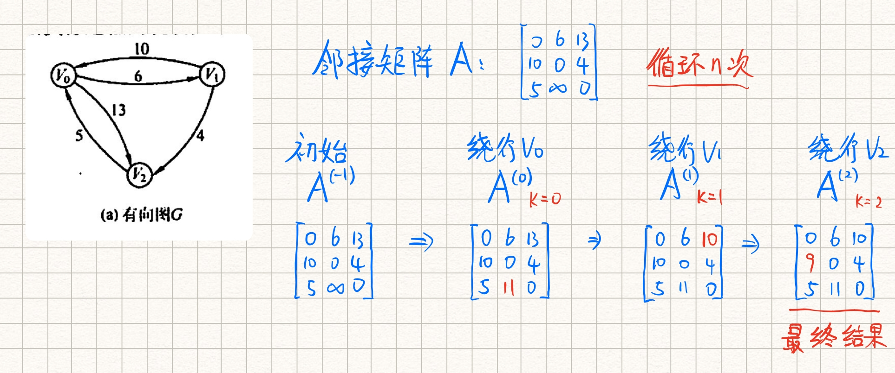


<br>


**Floyd算法的复杂度分析：**

时间复杂度为O()

Floyd算法 **允许带有负权值的边** ，但 **不能有负权值的边组成的回路** 

可以用于无向图（试做两边都有弧的特殊的有向图）


<br>


### 6.4.4 拓扑排序

有向无环图，也叫 **DAG图** ，是描述含有公共子式的表达式的有效工具

**AOV网** ： 若用DAG图表示一个工程，**顶点表示活动**， 用 **有向边** `<i, j>` 表示活动i必须先于活动j的 **先后次序** ，这种有向图称为用顶点表示活动的网络称为AOV网

 **拓扑排序** ：由一个有向无环图的顶点组成的序列，且满足：

1. 每个顶点出现且只出现一次
2. 若A在拓扑排序中在B之前，则图中不存在B到A的路径
3. 每个AOV网都有一个或者多个拓扑排序序列

**拓扑排序的用处：**

- 拓扑排序可以判断一个图中是否有环
- 可以确定顶点的前驱后继关系


<br>


 **对一个AOV网进行拓扑排序的算法步骤（重点）：**

1. 从AOV网中选择一个 **没有前序（入度为0）** 的顶点并输出
2. 从网络中 **删除该顶点和所有以它为起点的有向边** 
3. 重复1和2直到AOV网为空或者网中不存在无前驱的结点。后者说明有向图中必然有环。


<br>


**手动模拟求拓扑排序：**


<br>


**拓扑排序的代码：**

```c++
// 拓扑排序
bool TopologicalSort(Graph G){
    InitStack(S);   // 初始化栈S，用于存储入度为0的顶点
    for(int i = 0; i < G.vexnum; i++ )
        if(indegree[i] == 0)    // 入度为0就入栈
            Push(S, i);
            
    int count = 0;  // 记录已经输出的顶点个数
    while(!IsEmpty(S)){ // 只要栈非空
        Pop(S, i); // 栈顶出栈
        res[count++] = i;
        // 将i指向的结点的入度减1, 并且将入度减到0的顶点入栈
        for(p = G.vertices[i].firstarc; p; p = p->nextarc){
            v = p->adjvex;
            if((--indegree[v]) == 0)
                Push(S, v);
        }
    }
    
    // 拓扑排序中结点个数小于顶点数, 说明有环
    if(count < G.vexnum)
        return false;
    return true;
    
}
```

复杂度分析：

输出顶点的同时还需要删除以该顶点为起点的边，因此

- 采用 **邻接表** 存储时，求拓扑排序的 **时间复杂度为O(|V|+|E|)** 
- 采用邻接矩阵存储时，求拓扑排序的 **时间复杂度O()** 


<br>


**采用DFS来求拓扑排序：**

**思路：**

对于有向无环图中的两个结点u、v有三种关系：

- u是v的祖先：在调用DFS的过程中，v的DFS函数结束时间一定在u的DFS结束时间之前。可以添加一个 **时间标记** ，**子孙的结束时间一定早于祖先的结束时间**
- v是u的祖先：同理，反过来
- u和v没有关系：在拓扑序列中任意

因此可以按照结束时间从大到小（ `祖先->子孙` ）的顺序，得到拓扑排序序列。 **DFS算法和原版相比就多了个求 结点结束时间** 

```c++
bool visited[MAX_VERTEX_NUM]; // 标记访问数组
int time = 0;

// 对图G进行遍历, 访问函数为visit()
void DFSTraverse(Graph G){
    初始化访问数组为False;
    
    for(v = 0; v < G.vexnum; ++v )
        if(!visited[v]) DFS(G, v);
}

void DFS(Graph G, int v){
    visited[v] = True;
    visit(v);
    
    // 遍历v的所有未被访问的邻接结点u
    for(u = FirstNeighbor(G, v); w >= 0; w = NextNeighbor(G, v, u)){
        if(!visited[u])
            DFS(G, u);
    }
    time = time + 1;
    Time[v] = time;
}
```

最后 **按照结束时间从大到小** 就可以得到拓扑排序序列

可以用map记录（时间， 下标），然后按时间排序，输出下标


<br>


**逆拓扑排序：**

 **对一个AOV网进行逆拓扑排序的算法步骤：**

1. 从AOV网中选择一个 **没有后继（出度为0）** 的顶点并输出
2. 从网络中 **删除该顶点和所有以它为终点的有向边** 
3. 重复1和2直到AOV网为空或者网中不存在无后继的结点。后者说明有向图中必然有环。


<br>


**拓扑排序的补充：**

1.  **入度为0的顶点** ，是没有前驱活动或者前驱活动已经完成的顶点， **工程可以从这个顶点代表的活动开始或者继续** 
2. 若一个顶点有多个直接后继，拓扑排序结果通常不唯一
3. 若每一个顶点都有唯一的前驱和后继关系，则拓扑排序结果唯一
4. 对于一般的图来说， **若邻接矩阵是三角矩阵，则存在拓扑排序** ，反之不一定成立


<br>


### 6.4.5 关键路径

在带权有向图中，用 **边表示活动的网络** ，称为 **AOE网** 

-  **顶点** 表示 **事件** 
-  **有向边** 表示 **活动** 
- 边上的 **权值** 表示完成该 **活动的开销** 


**AOE网和AOV网的区别：**

- AOE网的边有权值，表示活动的开销
- AOV网的边无权值，只表示活动的先后次序


<br>


**AOE网的性质：**

- 只有某顶点代表的 **事件发生后** ， **从该顶点出发的弧代表的活动才能开始** 
- 只有以某顶点为终点的所有边代表的 **活动完成后** ， 该顶点代表的时间才能发生
- 只有一个源点（入度为0）和一个汇点（出度为0），汇点代表整个工程的结束


<br>


只有当一条从源点到汇点的路径上的活动都完成，整个工程才会结束。

因此，将所有从源点到汇点的路径中 **具有最大路径长度的路径** 称为 **关键路径** ，关键路径上的活动被称为 **关键活动** 。

关键活动影响了整个工程的时间，缩短关键活动（如果关键路径有很多条，那就取交集）可以缩短工程的完成时间。


<br>


**找到关键活动的几个参量：**

1、**事件Vk** 的 **最早发生时间ve(k)**  : 

**记忆：v指的顶点， e指的early**

指的是从源点V1到顶点Vk的最长路径长度， **事件Vk** 的最早发生时间决定了所有从Vk开始的活动的最早开始时间

```c++
// 递推公式
ve(源点) = 0
ve(k) = Max{ve(k的任意前驱j) + Weight(j, k)}
```


计算ve()时， **从源点开始从前往后** 的顺序计算，可以在 **拓扑排序** 的基础上计算

```c++
1. 开始时, 令ve[1…n] = 0
2. 在拓扑排序过程中, 输出一个入度为0的顶点Vj时, 计算它所有直接后继顶点Vk的ve值。以此类推直到输出所有顶点
   if(ve[k] < ve[i] + Weight(j, k)) ve[k] = ve[i] + Weight(j, k);
```


<br>


2、**事件Vk** 的 **最迟发生时间vl(k)**  : 

**记忆：v指的顶点， l指的late**

指的是在不推迟整个工程完成的前提下，能够保证他的后继事件Vl在它的最迟发生事件vl(l)能够发生的最迟发生时间

```c++
// 递推公式
vl(汇点) = ve(汇点)
vl(k) = Min{vl(k的任意后继l) - Weight(k, l)}
```


计算vl()时， **从汇点开始从后往前** 的顺序计算，可以在 **逆拓扑排序** 的基础上计算

```c++
1. 开始时, 令vl[1…n] = ve[n]
2. 用一个栈来记录拓扑排序，拓扑排序结束后从栈顶到栈底就是逆拓扑排序
   栈顶顶点Vl出栈, 计算它所有直接前驱顶点Vk的vl值。以此类推直到输出所有顶点
   if(vl[k] > vl[l] - Weight(k, l)) vl[k] = vl[l] - Weight(k, l);
```


<br>


3、 **活动ai** 的 **最早开始时间e(i)** :

指的是 **有向边(它代表活动)**  的 **起点** 所代表的的 **事件的最早开始时间** 。

如果 `<k, l>` 表示活动ai，则有`e(i) = ve(k)`


<br>


4、 **活动ai** 的 **最迟开始时间l(i)** :

指的是 **有向边(它代表活动)**  的 **终点** 所代表的的 **事件的最迟开始时间** 和 **该活动所需时间** 之差。

如果 `<k, l>` 表示活动ai，则有`l(i) = vl(l) - Weight(k, l)`


<br>


5、 **活动ai** 的 **最迟开始时间l(i)** 和 **最早开始时间e(i)** 的 **差值 d(i) = l(i) - e(i)** :

指的是该活动完成的 **时间余量** ，即在不增加整个工程的总时间下， **活动ai可以拖延的时间** 

如果一个活动的时间余量为0，说明该活动必须如期完成，否则就会拖延整个工程的进度。

称 `l(i) = e(i)` 的活动为 **关键活动** 


<br>


**求关键路径的步骤：**

1.  **从源点出发** ，令 **ve(源点) = 0** ， 按 **拓扑排序** 求所有顶点的 **最早发生时间ve()** 
2.  **从汇点出发** ，令 **vl(汇点) = ve(汇点)** ， 按 **逆拓扑排序** 求所有顶点的 **最迟发生时间vl()** 
3. 根据各 **顶点的最早发生时间ve()** 求出所有 **弧的最早开始时间e()** 
4. 根据各 **顶点的最迟发生时间vl()** 求出所有 **弧的最迟开始时间l()** 
5. 求出AOE网中所有活动的 **时间余量d()** ，找出所有 `d() = 0` 的活动组成关键路径


<br>


**手动模拟求关键路径：**


<br>


### 习题

**选择题：**

1. 可以 **判断一个有向图是否有环** 的方法有： **DFS** 、 **拓扑排序** 、 **求关键路径** 
2. 在拓扑排序算法中暂存入度为0的顶点可以用栈，也可以用队列（ **正确** 
3. 在图G的最小生成树T中，某条边的权值可能会超过未选边的权值（ **正确** 
4. 若有向无环图的拓扑序列唯一，则可以唯一确定该图（ **错误** 
5. 一个事件的最迟发生时间是以该事件为尾的弧的活动的最迟开始时间与该活动的持续时间的差（ **错误** 

<br>


**应用题：**

1. 下面是一种被称为 **破圈法** 的求解最小成生成树的方法：

   "任取一圈去掉圈上权值最大的边"， 重复执行，直到没有圈为止。

   判断是否正确，并给出理由

   答： **正确** 

   因为破圈法最终一定没有环，因此它 **一定能够形成一个生成树** 。下面证明它 **最小** ：

   **王道用的反证法，感觉写的并不是很清楚，以后再补充吧- =**

   

2. 已知有向图：

   1）写出该图的邻接矩阵表示并据此给出从顶点1出发的深度优先遍历序列

   2）求该有向图的强连通分量的数目

   3）给出该图的任意两个拓扑序列

   4）若将该图视为无向图，分别用Prim算法和Kruskal算法求最小生成树


<br>


## 第七章 查找

### 重点

- 散列查找：构造、冲突处理办法、成功和失败的平均查找长度、特征、性能分析
- 二分查找：过程、判定树、平均查找长度
- B树：插入、删除、查找
- B+树：概念、性质，B树和B+树的比较


<br>


 **平均查找长度（ASL）：** 是所有查找过程中 **关键字比较次数的平均值** 


<br>


### 7.2.1 顺序查找

也称为线性查找，实用于 **顺序表** 和 **链表** ，通常分为

- 一般的线性表的顺序查找
- 按关键字有序的线性表的顺序查找


<br>


**1、一般的线性表的顺序查找**

从一端开始，逐个进行关键字比较

```c++
int search(Table t, int key){
    t.elem[0] = key;    // 哨兵
    for(int i = t.len; t.elem[i] != key; --i )
        return i;   // 当i到0时会自动退出循环
}
```

 **引入哨兵的作用** ：减少判断是否越界的判断语句

对于n个元素的表：

- 查找成功时：当每个元素查找概率都相等也就是1/n时，此时 `ASL = (n+1)/2` 
- 查找失败时：比较次数n+1次，此时 `ASL = n+1` 

性能分析：

- 缺点：n较大时，ASL较大，效率低
- 优点：对存储没有要求


<br>


**2、有序表的顺序查找**

可以降低查找失败的ASL

可以用一个 **判定树** 来描述有序表的查找过程

- 查找成功：查找长度为它（圆形结点）的层数
- 查找失败：查找长度为它（矩形结点，实际不存在）的父节点的层数


<br>


### 7.2.2 折半查找

也称 **二分查找** ， **仅适用于有序的顺序表** 

 **基本思想：** 

将给定key值与表中间位置的元素比较，相等则查找成功，失败则查找中间元素 **以外** 的前半或后半部分，重复直到查找成功或者失败为止。

```c++
// 二分查找
int Binary_Search(SeqList l, int key){
    int low = 0, high = l.size() - 1, mid;
    while(low <= high){
        mid = (low + high) / 2;
        
        // 查找成功
        if(l.elem[mid] == key)
            return mid;
        else if(l.elem[mid] > key)
            high = mid - 1;
        else
            low = mid + 1;
    }
    // 查找失败
    return -1;
}
```

二分查找的时间复杂度：O(logn)，就是判定树的树高


<br>


**手动模拟求给定判定树的成功和失败的ASL：**


<br>


### 7.2.3 分块查找

也称 **索引顺序查找** ，既有动态结构，也适于快速查找

 **基本思想：** 

将查找表分为若干 **子块** ：块内可以无序，但块间有序。（即第二个块中最小的都比第一个块中最大的大）

再建立一个索引表：索引表中的元素包括每块的最大关键字和每块的第一个元素的地址。索引表按照关键字有序排列

 **分块查找的过程：** 

1. 在索引表中确定待查记录所在的块（顺序或折半）
2. 块内顺序查找


<br>


**重点：**

- 长度为n的查找表，当每块中含有 **根号n** 个记录时，有ASL取到最小值 **根号n + 1**


<br>


### 习题

**选择题：**

1. 对于长度为n的有序单链表进行查找，查找表中任一元素的成功的ASL为： **(n+1) / 2** 

2. 对于表长为n的有序表进行折半查找，判定树的高度为： **log(n+1)向上取整** 

3. 具有12个关键字的有序表中，对每个关键字的查找概率相同，折半查找算法查找成功的ASL为 **37/12** ，折半查找失败的ASL为 **49/13** 

   解释：

4. 为提高查找效率，对有65025个元素的有序顺序表简历索引顺序结构，在最好情况下查找到表中已有元素 **最多** 需要执行 **16** 次关键字比较

   解释：

5. 【2017】下列二叉树中，可能成为折半查找判定树（不含外部结点）的是： **A** 

   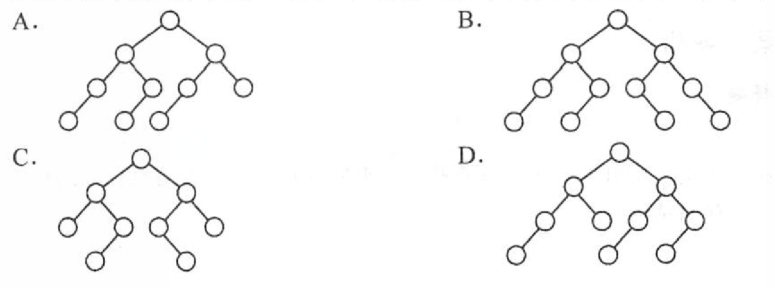
   
   解释：
   
   符合折半查找的判定树实际上是二叉排序树，重点在于 **求mid = (low + high) / 2 的时候是向上取整还是向下取整，整棵树应该保持一致**


<br>


**应用题：**

1. 有序顺序表中元素依次为017、094、154、170、275、503、509、512、553、612、677、765、897、908

   1）画出其对应的折半查找的判定树

   2）若查找275或者684的元素，将依次与表中的哪些元素进行比较？

   3）分别计算查找成功和失败的ASL

   解：

   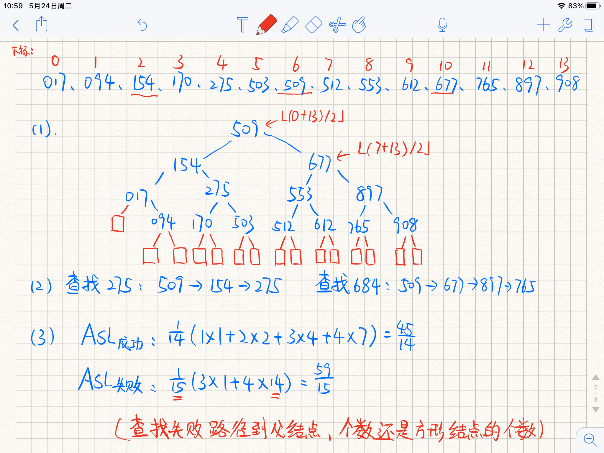

   

2. 写出折半查找的递归算法。初始调用时，`low = i,  high = ST.length` 

   ```c++
   /*
   基本思想: 根据查找的起始和终止位置, 将序列一分为二
   然后对新的起始和终止位置递归求解
   
   时间复杂度:O(logn)
   空间复杂度:O(logn), 递归调用栈的深度
   */
   
   // 查找表
   typedef struct{
       int* elem;  // 存储空间基质
       int length; // 表长
   }SSTable;
   
   // 二分查找的递归实现
   int BinSearch(SSTable st, int key, int low, int high){
       if(low > high)
           return 0;
       
       int mid = (low + high) / 2;
       if(key > st.elem[mid])
           return BinSearch(st, key, mid + 1, high);
       else if(key < st.elem[mid])
           return BinSearch(st, key, low, mid - 1);
       else
           return mid;
   }
   
   
   ```

3. 线性表中各结点的检索概率不等时，可用如下策略提高顺序检索的效率：若找到指定的结点，则将该结点和其前驱（若存在）交换，使得经常被检索的结点尽量位于表的前端。试设计在顺序结构和链式结构的线性表上实现上述策略的顺序检索算法。

   ```c++
   // 顺序查找线性表, 找到后和其前面的元素互换
   int SeqSearch(int a[], int k){
       int i = 0;
       while((a[i] != k) && (i < n))
           i++;
       
       // 如果有前驱结点, 交换    
       if(i < n && i > 0){
           swap(a[i], a[i - 1]);
           // 返回交换后的下标
           return --i;
       }
       else 
           return -1;
   }
   
   // 链式存储区别主要就在 交换 那一步
   ```

   

3. 【2013】设包含4个数据元素的集合S = {'do', 'for', 'repeat', 'while'}，各元素的查找概率依次为p1 = 0.35， p2 = 0.15， p3 = 0.15， p4 = 0.35。将S保存在一个长度为4的顺序表中，采用折半查找法，查找成功的ASL = 2.2

   1）若采用顺序结构保存S，且要求ASL更短，则元素应该如何排列？应使用何种查找方法？查找成功的ASL？

   2）若采用链式结构……

    **解：** 
   
   1）采用顺序查找时，元素按其查找概率降序排列时，查找长度最小
   
   此时 `ASL成功 = 0.35 * 1 + 0.35 * 2 + 0.15 * 3 + 0.15 * 4 = 2.1`
   
   2）链式结构，只能采用顺序查找，性能和上面一样， `ASL成功 = 2.1` 
   
   还可以用二叉链表组成二叉排序树，（类似以哈夫曼树的感觉）， `ASL成功 = 2.0`


<br>


## 7.3 树型查找

### 7.3.1 二叉排序树（BST）

 **定义** ：或者是一棵空树，或者是具有以下特性的二叉树：

- 左 < 根 < 右
- 左右子树也分别是一棵二叉排序树


<br>


 **BST的查找：** 

从根结点开始，沿某个分支逐层往下的过程。是一个 **递归** 的过程：

```c++
// 二叉排序树的非递归查找算法
BSTnode* BST_Search(BiTree t, int key){
    while(t != NULL && key != t->data){
        if(key < t->data)   t = t->lchild;
        else t = t->rchild;
    }
    return t;
}
```


<br>


 **BST的插入：** 

1. 若原BST为空，则直接插入结点
2. 否则，当关键字小于根结点，则插入左子树，当关键字大于根结点，则插入右子树

插入的结点一定是个 **叶节点** 

```c++
// 二叉排序树的插入
int BST_Insert(Bitree &t, int k){
    // 原树为空, 新插入的结点作为根结点
    if(t == NULL){
        t = (Bitree)malloc(sizeof(BSTNode));
        t->data = k;
        t->lchild = t->rchild = NULL;
        return 1;
    }
    // 有相同结点, 插入失败
    else if(k == t->data)
        return -1;
    
    else if(k < t->data)
        return BST_Insert(t->lchild, k);
    else if(k > t->data)
        return BST_Insert(t->rchild, k);
}
```


<br>


**BST的建树：**

```c++
// 二叉排序数的建树 依次插入的过程
void BST_Create(BiTree &t, int str[], int n){
	t = NULL;	// 初始为空树
	for(int i = 0; i < n; i++ )
		BST_Insert(t, str[i]);
}
```


<br>


 **BST的删除：** 

分类讨论：

1. 如果删除结点z是 **叶节点** ： **直接删除** 
2. 如果结点z只有一棵左子树或者右子树， 则让 **z的子树代替z的位置** 
3. 如果结点z有两棵子树，则令z的直接后继（或直接前驱）代替z，然后从BST中删除这个直接后继（或直接前驱）回到1或2的情况

```c++
// 二叉排序树的删除
TreeNode* deleteNode(TreeNode* root, int k) {
	// 没有找到该结点
	if (root == NULL) return root;
	
	// 找到结点
	if (root->val == k) {
	    // 该节点是叶子结点 直接删除
		if (root->left == NULL && root->right == NULL) {
			delete root;
			return NULL;
		}
		
		// 只有左/右子树 删除该结点后 用他的右/左孩子代替他的位置
		else if (root->right == NULL) {
			TreeNode* tmp = root->left;
			delete root;
			return tmp;
		}
		else if (root->left == NULL) {
			TreeNode* tmp = root->right;
			delete root;
			return tmp;
		}
		
		// 左右孩子都有
		else {
		    // 找到比目标结点大的最小结点(右子树的最左边)来代替目标结点
			TreeNode* cur = root->right;
			while (cur->left != NULL) {
				cur = cur->left;
			}
			cur->left = root->left;
			TreeNode* tmp = root;
			root = root->right;
			delete tmp;
			return root;
		}
	}
	
	// 递归左右子树
	if (root->val > key) 
		root->left = deleteNode(root->left, key);
	if (root->val < key)
		root->right = deleteNode(root->right, key);
		
	return root;
}

```


<br>


 **补充：在BST中删除再插入一个结点，得到的BST和原来的不一定相同** 

如果是叶节点就是相同


<br>


 **BST的查找效率分析：** 

最好情况下，BST是完全二叉树，此时查找的时间复杂度为O(lognn)

最坏情况下，退化成单链表，此时查找的时间复杂度为O(n)


<br>


### 7.3.2 平衡二叉树（AVL）

平衡二叉树是任意结点的左右子树高度差绝对值不超过1的二叉树， **一般默认它也是二叉排序树**

最核心的操作在于 **调整**


#### 插入

#### 删除


<br>


### 7.3.3 红黑树


<br>


## 7.4 B树和B+树

### 7.4.1 B树

又称 **多路平衡查找树** ， B树中所有 **结点的孩子个数的最大值** 称为B树的 **阶** ，记作 **m** 

一棵m阶B树或为空树，或为满足以下性质的m叉树：

- 结点 **最多有m棵子树** （ **m-1个关键字** ）
- 如果 **根结点** 有孩子， **至少有两棵子树** 
- 除根结点外，所有非叶结点至少有 **m/2上取整棵子树** （ **m/2上取整-1个关键字** ）
- 非叶结点由 **指向子树的指针** 和 **关键字** 交错组成，且有递增次序，关键字左边子树的关键字都小于它，右边都大于它
- 所有叶结点均在同一层，且无信息，类似于查找失败结点（指针是空指针），实际上不存在

下图是一棵5阶B树：


<br>


**1、B树的高度（磁盘存取次数）**

**B树的高度不包含最下面的叶结点**

B树的操作所需的 **磁盘存取次数** 和 **B树** 的高度 **成正比** 


<br>


**2、B树的查找**

和二叉排序树类似，但是B树的 **每个结点都是包含多个关键字的有序表** ，且 **进入其子结点需要走多路分支** 

B树的查找过程：

1. 在B树中找结点：在 **磁盘** 中进行，因为B树多存储在磁盘上
2. 在结点中找关键字：找到结点后，会将结点信息存入内存，在 **内存** 中进行，采用顺序或者折半查找
3. 查找到叶结点时（对应指针是空指针），查找失败


<br>


**3、B树的插入**


<br>


### 7.4.2 B+树


<br>


## 7.5 散列表

**散列函数** ：把查找表中的关键字映射成该关键字对应的地址，记为 `Hash(key) = Addr` ， 可以是内存地址，数组下标，索引等。

**散列表** ： `<关键字, 地址>` 直接映射的数据结构

补充：

- 冲突无法避免
- 理想情况下O(1)查哈希表
- 会发生冲突的关键词称为 **同义词**


<br>


### 7.5.2 散列函数的构造方法

直接定址法 ：线性 `H(hash) = a * key + b`，会浪费空间

**除留余数法** ：去不大于m且最接近或等于m的质数p `H(key) = key % p`

数字分析法 ：适合已知关键字的集合

平方取中法 ：取关键字的平方值的中间几位作为散列地址

 

<br>


### 7.5.3 处理冲突的方法

也就是找一个新的空闲地址

开放地址法（也就是空地址对同义词和非同义词都开放）：`H新 = （H旧 + d） % m `

- **线性探测法** ：顺序去找下一个空单元。  **聚集现象** 
- **平方探测法** ：`d = 0、1方、-1方、2方、-2方…` 避免了堆积，但只能探测一半单元
- 双散列法：冲突的时候用另一个hash函数算增量d **最多m-1次就会遍历表中的全部位置**
- 伪随机法

开址法删除不能直接删除，要打标记，且定期维护


<br>


**链地址法** ：

将所有同义词存储在一个线性链表中，适合于经常需要插入和删除的情况


<br>


### 7.5.4 散列查找及性能分析

查找和构造基本一样

**装填因子：**

```
α =记录数n / 表长m
ASL和装填因子α相关，但和nm不直接相关，α越大 表越满
```


#### 求成功和失败的ASL

```
ASL成功 = 成功查找次数 / 元素个数
ASL失败 = 失败查找次数 / 模的大小
```

**总结：**

- **线性再探测法**
    - 成功：
    - 失败查找次数：该位置向后探测到第一个没有关键字的地址位置之间的距离
- **链地址法**
    - 成功：
    - 失败查找次数：∑（当前位置所带的结点个数+1）

**补充：**

- ASL成功是对 **元素** 而言的
- ASL失败是对 **位置** 而言的
- 失败的查找次数有另一个观点：认为只有和关键字的比较才算次数，和空值的比较不算


<br>


### 7.5.5 习题

#### 选择题

1. 采用线性探测法处理冲突时，所有同义词在散列表中一定相邻  `错误`

    ```
    散列地址为i的关键字和再探测得到i的关键字并非同义词
    ```

2. 设有一个含有200个表项的散列表，用线性探测法解决冲突，按关键字查询时找到一个表项的平均探测次数不超过1.5，则散列表项应该能容纳 `400` 个表项（假设ASL成功 = [1+1/(1-α)]/2）

    ```
    根据公式：
    线性探测法ASL成功 = (1 + 1 / (1 - α)) / 2 <= 1.5 以及α = n / m
    解出m >= 400
    ```

3. 假定有K个关键字互为同义词，若用线性探测法把这K个关键字填入散列表，至少要进行 `K(K+1)/2` 次探测

    ```
    第一个关键字不会冲突，探测1次。后面的都会冲突
    1 + 2 + … + k 
    ```

4. 【2018】现有长度为7、初始为空的散列表HT，散列函数H(K) = k % 7，用线性探测再散列法解决冲突。将关键字22、43、15依次插入HT后，ASL成功 =  `2`

5. 【2019】现有长度为11且初始为空的散列表HT，散列函数为H(key) = key % 7，采用线性探测再散列法解决冲突。将87、40、30、6、11、22、98、20依次插入HT后，ASL失败 = `6`


<br>


#### 应用题

1. 假设关键字为`{26, 36, 41, 38, 44, 15, 68, 12, 6, 51, 25}` ，采用 **链地址法** 解决冲突，设装填地址 `α=0.75` ，散列函数为 `H(key)=key%P`， 求等概率情况下成功和失败的ASL（失败只将和关键字的比较计算在内）

    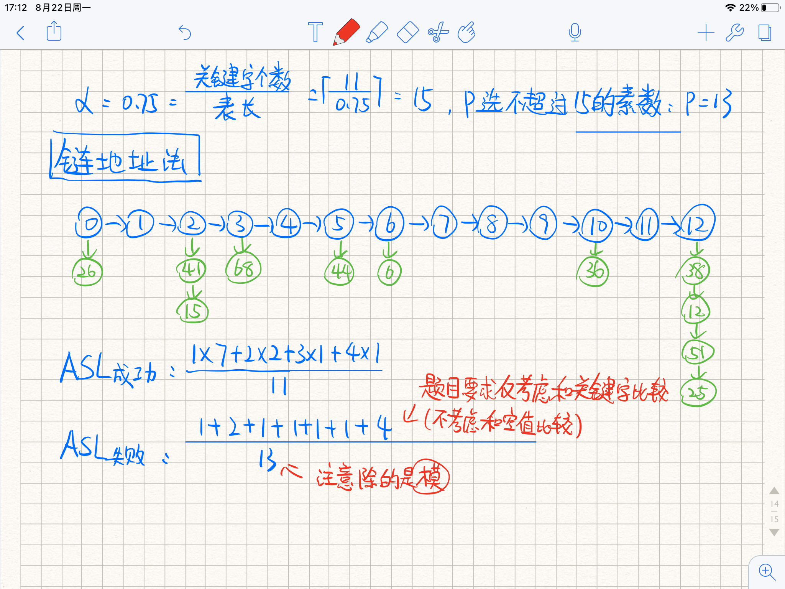

1. 


<br>

# 第八章 排序


### 重点

- 堆排序、快排、归并排序
- 各种算法的思想、手动模拟过程、性质（初态的影响、 **复杂度** 、稳定性、适用性）
- 各种算法的对比，能根据情况选择最佳算法
- 代码实现


<br>


### 8.1.1 排序的基本概念


 **算法的稳定性** ： 如果两个关键字相同的元素，在排序之后顺序不变，则称为 **稳定** ，否则就是 **不稳定** 

 **内部排序** ：排序期间元素全部存放在内存中
 **外部排序** ：排序过程中，元素需要在内、外存之间移动的排序


内部排序：

- 插入排序： **直接插入排序** 、 **折半插入排序** 、 **希尔排序** 
- 交换排序： **冒泡排序** 、 **快速排序** 
- 选择排序： **简单选择排序** 、 **堆排序** 
- 归并排序
- 基数排序

外部排序：


<br>


### 习题

 **选择题** ：

1. 对任意7个关键字进行基于比较的排序，至少需要进行 **13** 次关键字之间的两两比较

   **解释** ： 

   

<br>


## 8.2 插入排序

 **基本思想** ： 

将一个待排序的记录按其关键字大小插入 **前面已经排好序的子序列** ，直到所有记录插入完成


<br>


### 8.2.1 直接插入排序

**算法的步骤：**

对A[1~n]进行排序（默认是按非递减顺序）， A[0]作为临时变量用于暂存

循环 i 从 2 ~ n（ **将A[1]视作已经完成排序的子序列** ）

1. 将A[i]暂存到A[0]
2. 循环已经完成排序的子序列的A[1~i-1]，找到合适的插入位置 k
3. 将A[j~i-1]中所有元素依次 **向后移动一位** ，将A[0]的值复制到A[k]

<br>


**c++代码：**

```c++
// 直接插入排序
void InsertSort(int a[], int n){
    
    for(int i = 2, j; i <= n; i++ ){
        if(a[i] < a[i-1]){
            // a[0]作为临时变量, 用于保存a[i]
            a[0] = a[i];
            
            // 第二重循环, 在已排好序的子序列中从后往前找到插入位置
            for(int j = i-1; a[0] < a[j]; --j ){
                // 向后挪一位
                a[j+1] = a[j];
            }
            // 插入到合适的位置
            a[j+1] = a[0];
        }
    }
}
```


<br>


**直接插入排序的手动模拟：**

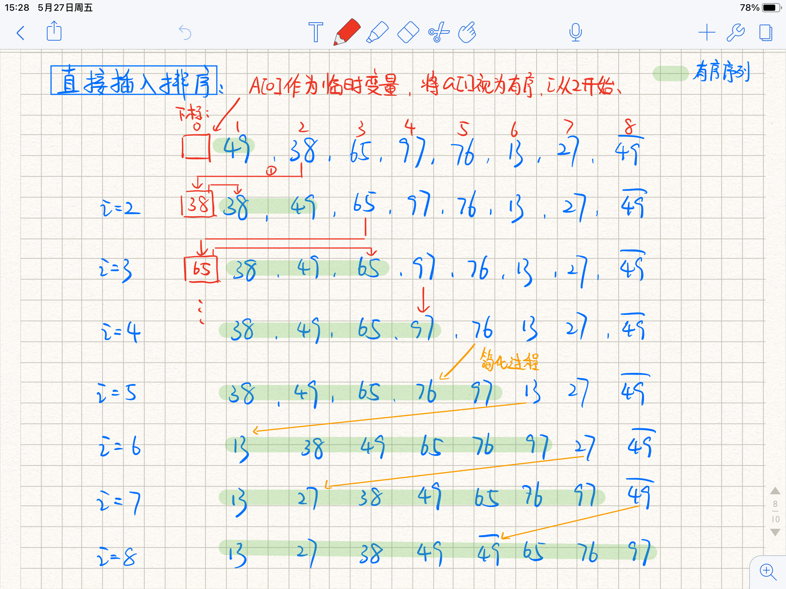

<br>


 **直接插入排序的性能分析：** 

- 空间复杂度：只用了一个临时变量A[0]， **空间复杂度O(1)** 
- 时间复杂度：总共循环了n-1趟，每趟都需要执行 **比较** 和 **移动** ，比较和移动次数和 **初始状态相关** 
  -  **最好情况下** ：表中元素 **已经有序** ， 此时只需要比较一次而不需要移动， **时间复杂度O(n)** 
  -  **最坏情况下** ：表中元素逆序， **时间复杂度O()**  
  -  **平均情况下** ： 两重循环， **时间复杂度O()**  
- 稳定性：稳定
- 适用性：适用于 **顺序存储** 和 **链式存储** 的线性表，适用于 **基本有序的排序表或者数据量不大的排序表**


<br>


### 8.2.2 折半插入排序

 **是在直接插入排序的基础上的改进** 

直接插入排序的 **从已完成排序的子序列中查找插入位置** ，这一步 **从顺序查找改为折半查找** 


<br>


**c++代码：**

```c++
// 折半插入排序
void InsertSort_2(int a[], int n){
    
    for(int i = 2, j; i <= n; i++ ){
        // 将a[i]暂存到a[0]
        a[0] = a[i];
        
        // 折半查找到合适的插入位置
        int low = 1, high = i - 1;
        while(low <= high){
            int mid = (low + high) / 2;
            if(a[mid] > a[0])
                high = mid - 1;
            else
                low = mid + 1;
        }
        
        // 向后移动一位, 然后将a[0]插入
        for(int j = i - 1; j >= high + 1; --j )
            a[j+1] = a[j];
        a[high + 1] = a[0];
    }
}
```


<br>


 **折半插入排序的性能分析：** 

- 空间复杂度：只用了临时变量a[0]，空间复杂度O(1)
- 时间复杂度：减少了比较次数，元素移动次数没有改变。 **时间复杂度O()**  
- 稳定性： **稳定** 


<br>


### 8.2.3 希尔排序

又称 **缩小增量排序** ， 是对 **直接插入排序** 的改进

**基本思想：**

将待排序表分为若干个 **组** ，每个字表由相隔某个 **增量** 的记录组成，然后 **对每个组进行直接插入排序** 

然后缩小增量（一般是除以二），当最后增量为1时，相当于对整个表进行一次直接插入排序


<br>


**c++代码：**

```c++
// 希尔排序
void Shell_Sort(int a[], int n){
    
    // 步长变化
    for(int dk = n / 2; dk >= 1; dk /= 2){
        for(int i = dk + 1; i <= n; ++i ){
            if(a[i] < a[i - dk]){
                a[0] = a[i];
                // 记录后移, 找到插入的位置
                for(int j = i - dk; j > 0 && a[0] < a[j]; j -= dk)
                    a[j + dk] = a[j];
                // 插入
                a[j + dk] = a[0];
            }
        }
    }
    
}
```


<br>


**希尔排序的手工模拟：**

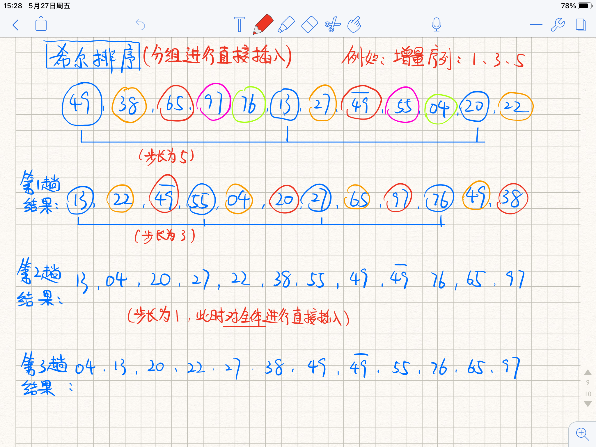


<br>


**希尔排序的性能分析：**

- 空间效率：只用了a[0]作为临时变量， **空间复杂度O(1)** 
- 时间效率：最坏情况下 **时间复杂度O()**  ，一般情况下和增量序列的函数有关
- 稳定性： **不稳定** 
- 适用性： **仅适合于用线性表的顺序存储** 


<br>


## 8.3 交换排序

指的是根据两个元素的关键字值的大小对这两个元素的位置进行对换。重点在 **快速排序** 


<br>


### 8.3.1 冒泡排序

**基本思想：**

 **从前往后（或者从后往前）** 两两比较相邻元素的值，如果是逆序，就进行交换，这个过程称为 **一趟冒泡** ，一趟冒泡能使得 **将未排序序列中最大的（或者最小的）放到它的位置** ，已完成排序的元素不参与下一趟排序。

**一趟冒泡能使一个元素确定它的位置，最多需要n-1趟将所有元素排序完成** 


<br>


**冒泡排序的手动模拟：**


<br>


**c++代码：**

```c++
// 冒泡排序 将小的冒泡到前面
void bubble_sort(int a[], int n){
    // 总共n-1趟冒泡
    for(int i = 0; i < n - 1; i++ ){
        bool flag = false;  // 本轮是否发生交换的标志
        
        for(int j = n - 1; j > i; j-- ){
            if(a[j - 1] > a[j]){
                swap(a[j - 1], a[j]);
                flag = true;
            }
        }
        // 本趟没有交换 说明已经有序, 提前退出循环
        if(flag == false)   return;
    }
}
```


<br>


**冒泡排序的性能分析：**

- 空间复杂度： **空间复杂度O(1)** 
- 时间复杂度：
    -  **最好** ：当循环初始有序，第一趟冒泡之后，没有发生交换，直接跳出循环，比较次数为n - 1， **时间复杂度O(n)**
    -  **一般** ： 两重循环， **时间复杂度O()**  
    -  **最坏**：初始逆序，  **时间复杂度O()**  
- 稳定性：当两个元素相等时，不会触发交换的条件，所以 **稳定** 


<br>


**补充：** 冒泡排序产生的有序子序列一定是全局有序的（直接插入排序的是相对的）

<br>


### 8.3.2 快速排序

**基本思想：**

快速排序基于 **分治** ，每次从待排序表 `a[l, r]` 中选择一个元素作为枢轴 `pivot` ，**一趟快速排序（也称为划分）结束后，pivot左边的元素都小于等于它，pivot右边的元素都大于等于它，pivot放到了它的最终位置上** 。

然后递归对两个子表进行操作，直到每个字表只有一个元素或者为空为止， 最终排序完成。

一趟快速排序是 **搜索+交换** 的过程


<br>


**快速排序的手工模拟：**


<br>


**快速排序的c++代码：**

```c++
// 一趟划分, 返回最终pivot的位置
int Partition(int a[], int low, int high){
    int pivot = a[low]; // pivot可以选择左边界、右边界或者中点
    
    while(low < high){
        // 将比pivot小的元素都移动到左端, 比pivot大的都移动到右端
        while(low < high && a[high] >= pivot) --high;
        a[low] = a[high];
        while(low < high && a[low] <= pivot) ++low;
        a[high] = a[low];
    }
    a[low] = pivot; // 将pivot放到最终位置
    return low;
}

// 快速排序
void quick_sort(int a[], int low, int high){
    if(low < high){
        // 枢轴的位置
        int pivot_pos = Partition(a, low, high);
        
        // 递归两个子区间
        quick_sort(a, low, pivot_pos);
        quick_sort(a, pivot_pos + 1, high);
    }
}
```


<br>


**快速排序的性能分析：**

- 空间复杂度：和递归工作栈的深度成正比。
    - 最好情况：O(logn)
    - 最坏情况：进行n-1次递归，O(n)
    - 平均情况：O(logn)
- 时间复杂度：运行时间和划分是否对称有关，当表初始有序或者逆序时，最坏的 **时间复杂度O()**  
- 稳定性： **不稳定** ，例如右边有两个值相等的小于pivot的元素，交换到左边时，次序已经发生了变化


<br>


注意：快速排序不产生有序序列，但 **每趟能将一个元素（枢轴）放到最终位置上** 


<br>


**快速排序的改进：**

提高算法的效率，可以通过尽量选取一个能将区间中分的pivot，例如可以从左边界元素、中间元素、右边界元素中选择中间值作为pivot


<br>


## 8.4 选择排序

 **基本思想** ： 每一趟（例如第i趟）从后面的 `n-i+1` 个待排序元素中选取关键字最小的元素，作为有序子序列的第i个元素。最终n-1趟之后，排序完成

 **重点** ： **堆排序** 


### 8.4.1 简单选择排序

**基本思想：**

初始序列为a[1…n]， 假设当前是第i趟排序，从a[i…n]中选择关键字最小的元素与 `a[i]` 交换，每趟排序可以确定一个元素的最终位置，n-1趟后整个排序表有序


<br>


**c++代码：**

```c++
// 简单选择排序
void Select_sort(int a[], int n){
    // 需要n-1趟排序
    for(int i = 0; i < n - 1; i++ ){
        // min记录待排序序列中最小元素的下表
        int min = i;

        // 找到待排序区间[i, n-1]中的最小元素的下标
        for(int j = i + 1; j < n; j++ ){
            if(a[j] < a[min])
                min = j;
        }

        if(min != i) swap(a[i], a[min]);
    }
}
```


<br>


**简单选择排序的效率分析：**

- 空间效率：时间复杂度O(1)

- 时间效率：swap()函数会移动元素3次，因此最坏情况下元素会移动 `3(n-1)` 次，最好情况（表已经有序）下移动0次；但比较次数始终是 `n(n-1)/2` ， 因此  **时间复杂度O()**  

- 稳定性：不稳定


<br>


### 8.4.2 堆排序

**堆的定义：**

如果将一维数组视为一棵完全二叉树，满足任一非根结点的关键字都小于等于其双亲的结点值，此时树中最大元素是是树的根结点，此时称这个数据结构为 **大顶堆** ，反过来可以定义 **小顶堆** 

**堆排序的基本思路：**

1. 将 `a[1…n]` 组建大顶堆，此时a[1]就是整个堆中的最大值
2. 交换 `a[1]` 和 `a[n]` （也就是将堆顶输出），此时讲 `a[n]` 视为完成排序的序列，将 `a[1…n-1]` 调整为堆，再输出堆顶
3. 重复，直到堆中只剩一个元素为止，此时完成排序

**堆排序的重点：如何自上而下调整为堆？** 


<br>


**堆的调整的手工模拟：**


<br>


**堆排序的c++代码：**

```c++
// 将以k为根的子树调整为堆
void HeapAdjust(int a[], int k, int len){
    // a[0] 暂存根结点
    a[0] = a[k];

    // 沿key较大的子结点向下筛选
    for(int i = 2 * k; i <= len; i *= 2){
        // 选取key较大的子结点的下标
        if(i < len && a[i] < a[i + 1])
            i++;

        // 筛选结束
        if(a[0] >= a[i]) break;
        else{
            // 将a[i]的值换到双亲结点上, 修改k的值, 方便向下筛选
            a[k] = a[i];
            k = i;
        }
    }
    // 将筛选结点放到最终位置
    a[k] = a[0];
}

// 建立大顶堆: 从 len/2 往前反复调整堆
void BuildMaxHeap(int a[], int len){
    for(int i = len / 2; i > 0; i-- )
        HeapAdjust(a, i, len);
}

// 堆排序
void heap_sort(int a[], int len){
    // 建立大顶堆
    BuildMaxHeap(a, len);
    
    // n-1趟交换和调整为堆的过程
    for(int i = len; i > 1; i-- ){
        // 输出堆顶（和堆底元素交换, 加入完成排序的序列）
        swap(a[1], a[i]);
        // 将未排序序列 a[1, i-1]调整为堆
        HeapAdjust(a, 1, i-1);
    }
}
```


<br>


**堆排序的性能分析：**

- 空间效率：仅使用了常数个辅助单元，空间复杂度 **O(1)** 
- 时间效率：建堆的时间是O(n)，然后有n-1次调整操作，每次调整的时间复杂度和树高有关：O(logn)，总的时间复杂度： **O(nlogn)** 
- 稳定性： **不稳定** 


<br>


## 8.5 归并排序和基数排序


### 8.5.1 归并排序

**基本思想：**

 **归并** 是将2个或者两个以上的有序表组合成一个新的有序表。

待排序序列可以视为n个长度为1的有序子表，可以通过两两归并，得到 `n/2上取整` 个子表。重复操作，直到合成一个长度为n的有序表为止（像合成大西瓜-=）。一次合并两个子表的排序称为 **2路归并排序** ，它也是基于 **分治** 的

**步骤：**

1. 确定分界点mid： `mid = (l + r) / 2` 
2. 递归左右两个子区间： `[l,mid]` 和 `[mid+1, r]` 
3.  **重点** 归并，将两个有序数组合二为一。循环，每次用 **双指针** 找到两个有序数组当前的最小值，放入临时数组中


<br>


**二路归并排序的手工模拟：**


<br>


**c++代码：**

```c++
// 归并排序
void merge_sort(int a[], int l, int r){
    if(l >= r) return;
    
    int mid = (l + r) / 2;
    
    merge_sort(a, l, mid), merge_sort(a, mid + 1, r);
    
    // k是辅助数组的下标 ij是双指针, 每次选两个数组中当前更小的元素加入tmp中
    int k = 0, i = l, j = mid + 1;
    while(i <= mid && j <= r){
        if(a[i] < a[j]) tmp[k++] = a[i++];
        else tmp[k++] = a[j++];
    }
    
    // 如果有表未检测完, 补上去 两个while最多只要一个会执行
    while(i <= mid) tmp[k++] = a[i++];
    while(j <= r) tmp[k++] = a[j++];
    
    // 最后把元素从tmp中拿回来
    for(int i = l, j = 0; i <= r; i++, j++) a[i] = tmp[j];
    
}
```


<br>


**2路归并排序的性能分析：**

- 空间效率：需要一个 `tmp[]` 临时数组来保存所有元素， **空间复杂度O(n)** 
- 时间效率：每趟归并时间复杂度O(n)，（两个数组每次找最小的放进临时数组），总共需要 `log2n上取整` 次归并，因此时间复杂度O(nlogn)
- 稳定性：归并操作不会改变相同关键词的元素的相对次序，因此 **稳定** 


<br>


### 8.5.2 基数排序

 **基本思想：**

基数排序基于 **关键字各位的大小** 进行排序。基数排序的思想借助了 **多关键字排序** ，来对单关键字进行排序


<br>


**基数排序的手工模拟：**


<br>


**基数排序的性能分析：**

- 空间效率：一趟排序需要的辅助空间为 `r` ， (r个队列：r个队头指针和r个队尾指针)，之后每趟排序也是用这些队列， **空间复杂度O(r)** 
- 时间效率：d趟分配和收集，一趟分配需要O(n)，一趟收集需要O(r)，基数排序的 **时间复杂度O(d(n+r))** 。  **和初始状态无关** 
- 稳定性：按位排序保证了 **稳定** 


<br>


## 内部排序算法的比较

一般比较三个因素： **时空复杂度** 、 **稳定性** 、 **算法的过程特征** 

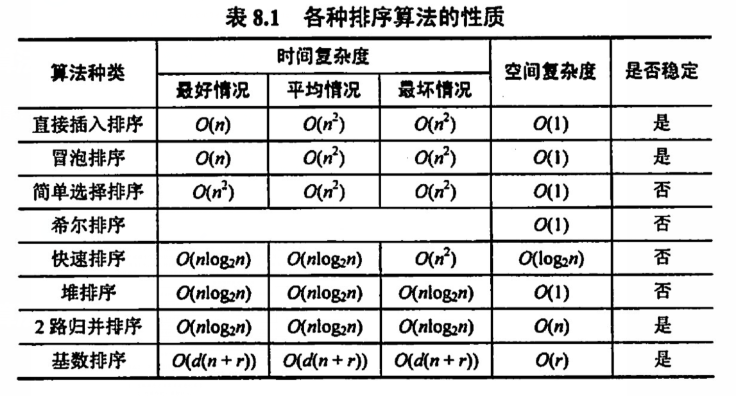


<br>


## 内部排序算法的应用

通常情况下，选择排序算法需要考虑：

1. 待排序元素数目n
2. 元素本身信息量的大小
3. 关键字的结构及其分布
4. 稳定性
5. 语言、存储结构和辅助空间大小


<br>


**总结：**

- 当 **n较小** 时，可选 **直接插入** 或 **简单选择** ，且简单选择的元素移动次数比直接插入少，当 **元素本身信息量较大** 时，选 **简单选择** 

- 当 **初始状态已经按关键字基本有序** ，选 **直接插入** 或者 **冒泡** 

- 当 **n较大** 时，应该采用 **时间复杂度O(nlogn)** 的算法： **快排** 、 **堆排序** 、 **归并排序** 

    - 快排是基于比较的排序中性能最好的，当 **待排序的关键字随机分布** 时，选 **快排** ，最快
    - 若要 **辅助空间最小** ，选择 **堆排序** 。且 **堆排序不会有最坏情况** 
    - 若要求排序 **稳定** ，选 **归并排序** 
    - 若 **记录的关键字位数较少且可分解** 时，采用 **基数排序** 

- 任何基于 **比较** 的排序算法，至少需要 **O(nlogn)** 的时间

- 记录本身信息量较大时，可以用 **链表** 来存储来减少移动元素所需要的大量时间

    


<br>


### 习题

**选择题：**


<br>


**应用题：**

1. 设关键字序列为 `{3, 7, 6, 9, 7, 1, 4, 5, 20}` ，对其进行排序的最小 **交换** 次数是多少？

     **解答** ： 元素个数少，选直接插入或者简单选择。 **简单选择的交换次数比直接插入少。** 

    ```c++
    // 用简单选择排序
    初序列: 3 7 6 9 7 1 4 5 20
    第一次: 1 7 6 9 7 3 4 5 20		交换3、1
    第二次: 1 3 6 9 7 7 4 5 20		交换7、3
    第三次: 1 3 4 9 7 7 6 5 20		交换6、4
    第四次: 1 3 4 5 7 7 6 9 20		交换9、5   
    第五次: 1 3 4 5 6 7 7 9 20		交换7、6
    // 此时最小交换次数 : 5
    ```

    

2. 顺序表用数组 `A[]` 表示，表中元素存储在下标 `1~m+n` 。前m个元素递增有序，后n个元素递增有序，设计一个算法，使得整个顺序表有序。

    1）说明基本思想

    2）用c/c++描述算法

    3）说明时空复杂度

    **解答** ： 

    1）将数组 `A[1…m+n]` 视为 **已经进行过m趟直接插入排序的表** （前m个元素有序），则从m+1趟开始继续用直接插入排序，能使得整个表有序

    2）算法的实现如下：

    ```c++
    void insert_sort(int a[], int m, int n){
        // 从m+1趟开始
        for(int i = m + 1, i < m + n; i++ ){
            // a[0]暂存a[i]的关键字
            a[0] = a[i];
            // 从已排序序列的后往前找, 找到比a[j]小的元素为止
            for(int j = i - 1; a[j] > a[0]; j-- )
                a[j + 1] = a[j];	// 后移一位
            a[j + 1] = a[0];
        }
    }
    ```

    3）时间复杂度和m和n有关。最坏情况下元素的比较次数为O(mn), 移动次数为O(mn), 总的时间复杂度：O(mn)。直接插入排序的空间复杂度：O(1)

     **补充** ： 两段有序序列合二为一，也可以用 **归并排序** 。时间复杂度O(m+n)， 空间复杂度O(m+n)

    ​		

3. 有一种简单的排序算法，称为 **计数排序** （count sort）。对一个待排序的表进行排序，结果存到另一个表中。（保证没有重复元素）计数排序针对表中的每一条记录，扫描待排序的表一趟，假设统计出c个元素比当前元素小，那就将这个关键字放到c表的下标c的位置上

    1）设计实现计数排序的算法

    2）对于有n个记录的表，关键字的比较次数是多少？

    3）和简单选择排序相比，计数排序是否更好？为什么？

     **解答** ：

    1）算法的思想：对于每个元素，统计关键字比它小的元素个数c，然后将他放入另一个数组下标c的位置上

    ```c++
    void count_sort(int a[], int b[], int n){
        // 用i遍历每个元素
        for(int i = 0; i < n; i++ ){
            int cnt = 0;
            // 用j来统计关键字比a[i]小的元素个数
            for(int j = 0; j < n; j++ )
                if(a[j] < a[i])	cnt++;
            // 放入b的对应位置
            b[cnt] = a[i];
        }
    }
    
    
    // 如果进行优化, 任意两个元素只进行一次比较 增加一个count数组 count[i]表示比i小的元素个数, 比较次数降为 n(n-1)/2
    void count_sort(int a[], int b[], int n){
        // 用i遍历每个元素
        for(int i = 0; i < n; i++ ){
            // 用j来遍历i之后的元素 进行对比
            for(int j = i + 1; j < n; j++ ){
                if(a[j] < a[i])	count[i]++;
            	else count[j]++;
            }
                
            // 放入b的对应位置
            for(int i = 0; i < n; i++ ){
                b[count[i]] = a[i];
            }
        }
    }
    ```

    2）每个元素都要和表中的所有元素（包括自己）进行比较。比较次数 **n方** 

    3）简单选择更好。简单选择比较次数 `n(n-1)/2` 而且只需要一个辅助空间。计数排序的时间和空间都不如简单选择。

    

4. 设有一个数组中存放了一个无序的序列 `k1~kn` 。现在要求将kn放在元素排序之后的正确位置上，试编写实现该功能的算法，要求关键字比较次数不超过n

     **解答** ：将kn放到正确位置，那就 **以kn为pivot，做一次快速排序** 
   
   ```c++
   // 一趟快速排序 将kn放到排序之后的正确位置上, 返回它的下标
   int quick_sort(int k[], int l, int r){
       // kn作为枢轴
       int pivot = k[n];
       
       while(l < r){
           // 将比pivot小的元素都移动到左端, 比pivot大的都移动到右端
           while(l < r && k[r] >= pivot) --r;
           k[l] = k[r];
           while(l < r && k[l] <= pivot) ++l;
           k[r] = k[l];
       }
       // 循环结束时, l=r
       k[l] = pivot; // 将pivot放到最终位置
       return l;
   }
   ```
   
5. 【2021】已知某排序算法如下：

    ```c++
    void cmpCountSort(int a[], int b[], int n){
        int i, j, *count;
        
        // c++语言: count = new int[n];
        count = (int *)malloc(sizeof(int)*n);
        
        for(i = 0; i < n; i++ ) count[i] = 0;
        for(i = 0; i < n - 1; i++ )
            for(j = i + 1; j < n; j++ )
                if(a[i] < a[j]) count[j++];
                else count[i++];
                
        for(i = 0; i < n; i++ ) b[count[i]] = a[i];
        
        // c++语言: delete count
        free(count);
    }
    ```

    请回答一下问题：

    1）若有 `int a[] = {25, -10, 25, 10, 11, 19}, b[6]` ，则调用 `cmpCountSort(a, b, 6)` 后数组b中的内容是多少？

    2）若a中有n个元素，则在算法执行过程中，元素的比较次数是多少？

    3）算法稳定吗？是则说明理由，否则修改为稳定算法。

     **解答** ：

    该算法基于计数排序的思想，count[i]表示序列中比a[i]大的元素个数。例如 `count[1] = 3` 指的就是有3个元素比a[1]大，a[1]也就是

    1）b[6] = {-10, 10, 11, 19, 25, 25}

    2）看一看两个循环，每个元素都要和它后面的所有元素比较一次。因此比较次数是 `n(n-1)/2` 

    3）不稳定。需要将双重循环中的if语句修改为：

    ```c++
    if(a[i] <= a[j]) count[j]++;
    else count[i]++;
    ```

    如果没有等号，两个相等元素的后面那个的count会+1，最后会放到前面


<br>


## 8.7 外部排序

考查概念、方法、排序过程， **一般不会考查算法** 

**主要内容：**

- 外部排序一般待排序文件较大，内存放不下， **需存放在外存** 的文件的排序
- 为减少平衡归并中外存读写次数采用的算法： **增大归并路数** 和 **减少归并段个数** 
- 利用 **败者树** 增大归并路数
- 利用 **置换-选择排序** 增大归并段长度来减少归并段个数
- 由长度不等的归并段，进行多路平衡归并，需构造 **最佳归并树** 


**概念：**

对大文件进行排序时，没法讲文件都放入内存中。排序时候需要将数据一部分一部分放入内存进行排序，排序过程中有内存和外存的交换，这种排序方法称为 **外部排序** 


<br>


### 8.7.2 外部排序的方法

磁盘读写需要的时间远远超过内存运算的时间，因此在外部排序过程中，时间代价只要考虑 **I/O次数** ，忽略内存运算时间

外部排序通常采用 **归并排序法** ，有以下两个独立的阶段：

1. 根据 **内存缓冲区大小** ，将外存上的文件分成若干长度为 `L` 的子文件，以此读入内存经内部排序后重新写回外存，这些文件称为 **归并段** 或者 **顺串** 
2. 对归并段进行逐趟归并，使得有序子文件从小到大，直到整个文件有序

例如：一个含有2000个记录的文件，每个磁盘块可容纳124个记录，首先通过8次内部排序得到8个初始归并段 R1 ~ R8 ，每段含有250个记录。最后对这8个归并段做3次两两归并，最终得到一个完整的有序文件。

内存工作区分为2个输入缓冲区和1个输出缓冲区


<br>


在外部排序实现两两归并时，由于不可能同时将两个归并段和结果都存放在内存中，需要不停将数据读出、写入磁盘：

```
外部排序总时间 = 内部排序时间 + 外存I/O时间 + 内部归并时间
```

显然，时间主要花在 **外存I/O时间** 上。


一般来说， **增大归并路数** 可以减少归并趟数，从而 **减少总的磁盘I/O时间** 

归并的过程可以视为一棵归并树，且满足：

```
数的高度 - 1 = log以k为底r的对数向上取整 = 归并趟数S
```

**重点：**

因此 **提高外部排序速度** ，就要考虑减少读写磁盘次数，主要方法有：

-  **增大归并段数k** 
-  **减少初始归并段个数r **


<br>


### 8.7.3 多路平衡归并与败者树

使用败者树之后，内部归并的比较次数与k无关了


<br>


### 8.7.4 置换-选择排序

**目的：生成初始归并段**


<br>


### 8.7.5 最佳归并树

**特征：总的I/O次数最少**

类似于哈弗曼树推广到m叉树的思想：在归并树中，让记录少初始归并段优先归并，可以建立总的I/O时间最少的 **最佳归并树** 

建立最佳归并树的例子：


<br>


### 习题

**选择题：**

1. 设在磁盘上存放有375000个记录，做5路平衡归并排序，内存工作区能容纳600个记录，为把所有记录排好序，需要 **4** 趟归并排序


<br>


**应用题：**

1. 多路平衡归并排序时外部排序的主要方法，问多路平衡归并排序包括哪两个相对独立的阶段？每个阶段完成何种工作？

    **解答** ： 包括 **生成初始归并段阶段** 和 **多趟归并排序阶段** 

     **生成初始归并段阶段** ：根据内存工作区的大小，将有n个记录的磁盘文件分批存入内存。用内部排序方法进行排序，生成若干的初始归并段（即有序子文件）

     **多趟归并排序阶段** ：多路归并将初始归并段归并成一个有序文件。

2. 

    

    


<br>


---


### 小工具

```

```

