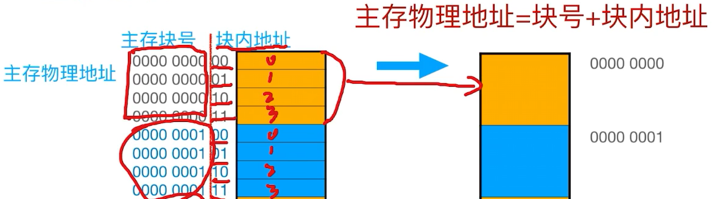
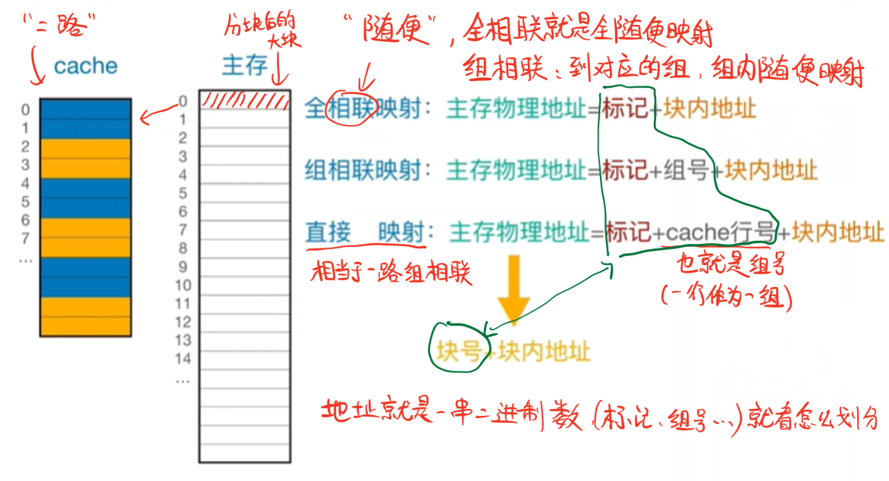
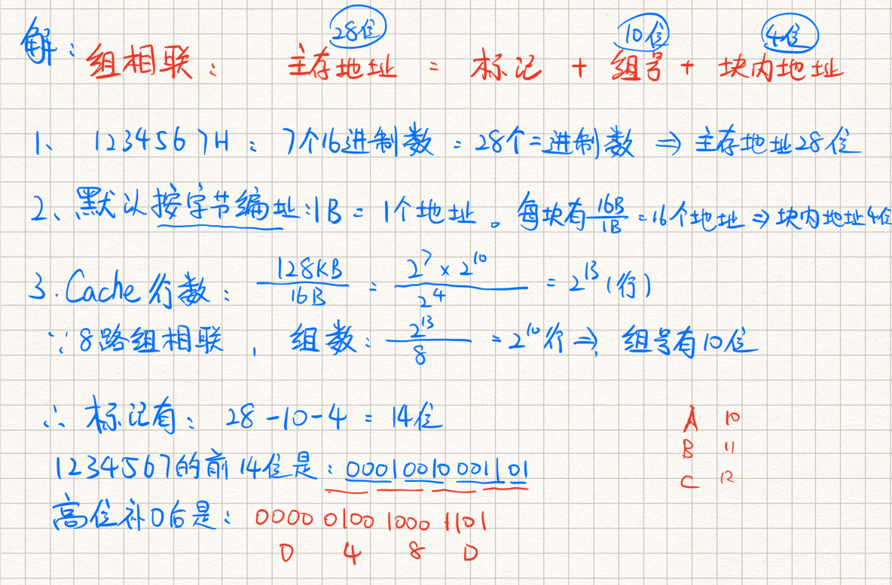
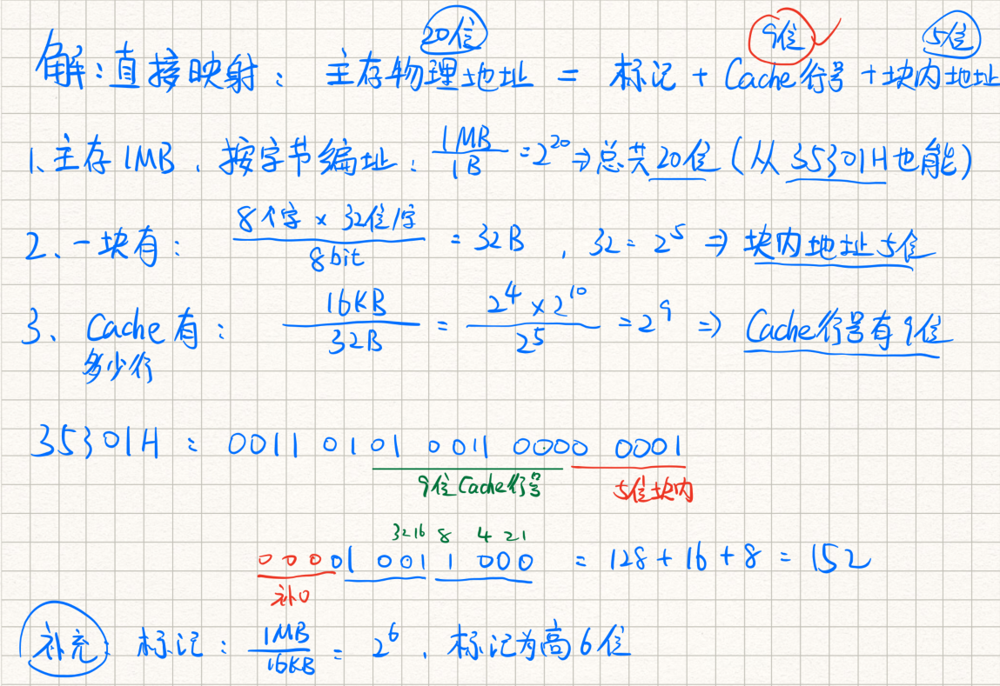
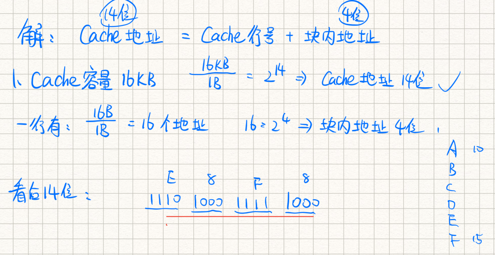
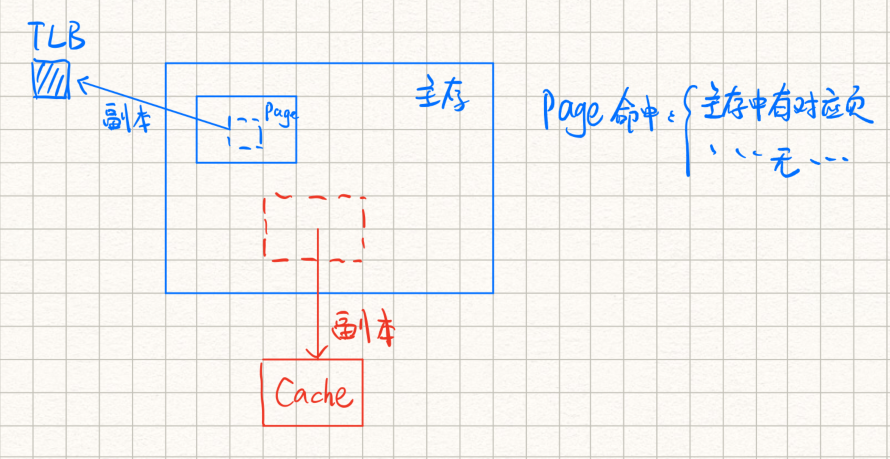

# 第一章：计算机系统概述

## 重点：

- 概念、性能指标相关的选择题

## 1.1 计算机发展历程

世界上第一台(通用)数字电子计算机： **ENIAC**  (无存储程序)

- 进制：十进制
- **缺点** ：存储器容量太小 变成采用线路连接方式

电子计算机发展经历了4代，主要元件分别为：

1. 电子管
2. 晶体管
3. 中小规模集成电路
4. 大规模集成电路

微型计算机的发展，以 **微处理器技术** 为标志


<br>


## 1.2 计算机系统层次结构

**计算机系统的组成：**

```
计算机系统 = 硬件系统 + 软件系统
```

对于某功能来说，既可以用软件实现，也可以用硬件实现。则称在软件和硬件 **在逻辑上是等效的** ，一般来说如果使用频繁且软硬件等效的话，用硬件解决效率高


<br>


### 1.2.2 计算机硬件

**存储程序的基本思想** ： 将实现写好的程序和原始数据存入主存后执行，程序开始执行后无须操作人员的操作，计算机会 **自动逐条执行指令，直到程序结束** 。

#### 冯·诺依曼计算机 

以 **存储程序** 思想为基础的各类计算机的通称，特点如下：

- 采用 **存储程序** 的工作方式
- 计算机硬件系统由 **运算器** 、 **存储器** 、 **控制器** 、 **输入设备** 、 **输出设备** 五大部件组成
- **指令** 和 **数据** 以同等地位存储在存储器中，但计算机能区别，**可按地址寻访**
- 指令和数据均采用 **二进制代码** 表示。指令由 **操作码** （指出操作的类型）和 **地址码** （指出操作的地址）组成
- 以 **运算器** 为中心（现在一般以 **存储器** 为中心）


<br>


#### 存储器

**作用** ：存储程序和数据

可以分为：

- 主存：也称内存储器，CPU能直接访问
- 辅存：一般指外部设备，辅存中的信息必须调入主存后才能为CPU访问

主存的工作方式是按存储单元的地址进行存取，这种方式也称为 **按地址存取方式** 


存储器的基本组成包括：

- **存储体** ：存放二进制信息。存储体由若干个 **存储单元** 构成，每个存储单元由多个 **存储元** 构成，每个存储元存储一位 `0` 或 `1` 。因此存储单元可以存储一串二进制代码，称为 **存储字（word）** ，存储字的长度称为 **存储字长** ，可以是1B(8bit)或者字节的偶数倍
- **地址寄存器（MAR）** ：存放访存地址，地址译码后找到所选的存储单元。 **MAR的位数对应着存储单元的个数** ，如果MAR有10位，则有2的10次 = 1024个存储单元，计作 `1k` 。 **MAR的长度 = PC的长度**
- **数据寄存器（MDR）** ：用于暂存要从存储器中读和写的信息。 **MDR的位数和存储字长相等** ，一般为字节的二次幂的整数倍
- 时序控制逻辑：用于产生存储器操作需要的各种时序信号

**补充：**

1. 存储器按地址访问，访问地址为存储单元地址。存储器外部引脚包括地址引脚、命令引脚、数据引脚
2. MAR和MDR虽然是存储器的一部分，但在现代计算机中 **存在于CPU中** ， **高速缓存Cache也存在CPU中** 


<br>


#### 运算器

**作用** ：进行 **算术运算** （加减乘除）和 **逻辑运算** （与或非、异或、比较、移位等）

存储器的基本组成包括：

- **算术逻辑单元（ALU）** ： 处理 **整型数据** ，需要处理实数时增设 **浮点运算部件（FPU）** 。ALU的核心是 **加法器** ，能实现加、减等双目运算和与、或、非等逻辑运算，因此有两个数据入端，一个数据出端。
- 若干通用寄存器：用于暂存操作数和中间结果，包括：（前3个是必选的）
    - 累加器（ACC）
    - 乘商寄存器（MQ）
    - 操作数寄存器（X）
    - 变址寄存器（IX）
    - 基址寄存器（BR）
- 程序状态寄存器（PSW），也称标志寄存器。用于存放ALU运算得到的一些标志信息或状态信息，例如结果是否溢出、有无进位或错位，结果是否为负等


<br>


#### 控制器

**作用** ： 指挥和控制各部件协调工作来实现程序的自动执行

控制器的基本组成包括：

- 程序计数器（PC）：**存放下一条指令的地址** ，可以 **自动+1** 来得到下一条指令的地址。和主存和MAR之间有直接通路
- 指令寄存器（IR）： **存放当前欲执行的指令** ， 内容来自于主存的MDR
    - 指令中的操作码OP送至CU，用来分析并产生微操作命令序列
    - 指令中的地址码AD送到MAR，用来取操作数
- 指令译码器（ID）：识别IR中的指令操作类型和操作数信息
- 控制单元（CU）(核心)：产生相应的部件控制信号

程序执行过程是 **循环的指令执行过程** ，循环变量为指令地址，下条指令地址由当前指令产生

一条指令执行过程：

1. PC取指令
2. IR分析指令
3. CU执行指令


<br>


#### I/O设备

**功能：** 实现信息的输入、输出以及外部媒体信息和内部二进制信息的格式转换。

通常运算器、控制器、存储器只有一个，外设可有多个


<br>


一般将 **运算器** 和 **控制器** 集成到同一芯片上，称为 **中央处理器（CPU）** 。CPU和主存属于主机，出了主机外的硬件（外存、I/O设备）等统称为外设。

CPU和主存之间通过 **总线** 相连，总线中有 **地址** 、 **控制** 和 **数据** 3组信号线。

- MAR中的地址信息送到地址总线，用于指向I/O操作的主存存储单元
- 控制总线中有读写信号线，指明是 **从CPU写入主存（将MDR中的数据送到数据总线）** 还是 **从主存读出到CPU（将数据线上的数据接收到MDR中）** 


<br>


### 1.2.3 计算机软件

根据功能，可分为两类：

- 系统软件：操作系统OS、数据库管理系统DBMS、语言处理程序、分布式软件系统化、网络软件系统、标准库程序、服务型程序等
- 应用软件

三个级别的语言：

- **机器语言** ： 也称二进制代码语言， **是计算机唯一可以直接识别和执行的语言** 
- **汇编语言** ： 用助记符编写的二进制指令代码，汇编语言必须进过 **汇编程序（系统软件）** 的翻译，转换为机器语言程序后，才能在硬件上执行
- **高级语言** 

翻译程序： **将高级语言源程序转化为机器语言程序（也就是说下面三个都是）** (目标代码)，翻译程序有以下3类

- **汇编程序** ： 将汇编语言翻译成机器语言
- **编译程序** ：将源程序一次性翻译成目标程序，只要源程序不变，无需再次编译： c、 c++
- **解释程序** ： **读一条，翻译一条，立即执行** ，不会生成目标程序， 速度一般比编译程序慢： python、JavaScript


目前为止，计算机中信息任用二进制存储的原因是：由物理器件的性能（逻辑电路中的 **高低电平** ）决定


<br>


### 1.2.4 计算机系统的层次结构

五层结构，上三层是 **虚拟机** ， **《组成原理》关注下两层** 。下层是上层的基础，上层是下层的扩展


<br>


### 1.2.5 计算机系统的工作原理

#### 存储程序的工作方式

#### 高级语言和机器语言的转换

#### 程序和指令执行过程


<br>


### 习题

**选择题：**

1. 冯诺依曼计算机的基本工作方式是：**控制流驱动方式**

     **解释** ：早起的冯诺依曼计算机 **以运算器为中心** ，且是 **单处理机** 。  **多处理机** 的基本工作方式才是 **多指令多数据流方式**

2. 存放欲执行指令的寄存器是：**IR**

    **解释** ：PC用来存放下一条指令的地址

    MAR用来存放欲访问的存储单元地址

    MDR存放从存储单元取来的数据

3. CPU不包括： **地址译码器**

    **解释** ：地址译码器属于主存，不属于CPU。此外，地址寄存器虽然一般属于主存， **现代CPU绝大多数集成了地址寄存器** 

4. 关于CPU存取速度的比较中：正确的是 **寄存器 > Cache > 内存**

    **解释** ：寄存器在CPU内部，速度最快

    Cache采用高速的SRAM制作，内存采用DRAM制作，速度比Cache慢

5. 若一个8位计算机系统以16位来表示地址，则该计算机系统有 **65536** 个地址空间

    **解释** ：8位计算机 = 计算机字长8位，即一次性可以处理8位的数据，和本题无关属于干扰作用

    16位表示地址 = 地址码长度16位，因此有地址空间2^16 = 65536

6. 关于相联存储器说法正确的是：**即可按地址寻址又可按内容寻址**

    **解释** ：相联存储器也称按内容寻址的存储器，这是它和传统存储器的区别

7. 【2016】将高级语言源程序转换成机器语言目标代码文件的程序是 **编译程序**

    **解释** ：把用高级程序语言编写的程序转换成另一种用低级语言编写的目标程序语言。编译程序属于翻译程序


<br>


**应用题：**

1. 什么是存储程序原理？按照此原理，计算机应该有哪些功能？

    **解释** ：

    1）指的是将指令以代码的形式实现输入计算机主存储器，庵后按照首地址执行第一条指令，然后顺序执行其他指令，直到程序执行结束

    2）应该有5大功能：数据传送、数据存储、数据处理、操作控制、操作判断

    

<br>


### 1.3 计算机的性能指标


吞吐量和响应时间：

-  **吞吐量** ： 指 **单位时间内计算机完成的总工作量** ， 主要取决于 **主存的存取周期** 

    单位可以是 **MIPS** 、 **MFLOPS** 等（既是单位，也是性能指标）

-  **响应时间** ： 指一个任务从 **提交到完成** 所花的全部时间，包括`cpu运算`、`主存访问`、`I/O操作（磁盘访问）`、`操作系统开销`等等


<br>


主频和CPU时钟周期：

- **CPU时钟周期** ： 也叫 **节拍脉冲** 或者 **T周期** ，是CPU中 **最小的时间单位** ，执行指令的每个动作至少需要一个时钟周期。是 **主频的倒数** 

- **主频（CPU时钟频率）** ： 机器内部主时钟的频率。主频越高，时钟周期越小，执行指令的速度越快。常见的有1.8 GHz 、 2.8 GHz等

    ```
    CPU时钟周期 = 1 / 主频
    主频单位通常是Hz, 1Hz表示每秒一次, 计算的时候通常用Hz
    1GHz = 10^3MHz = 10^6KHz = 10^9Hz
    1s = 10^3 ms = 10^6 μs = 10^9 ns
    ```


<br>


**CPI（Clock cycle Per Instruction）** :  执行一条指令所需的时钟周期数

对于一个程序或者一台机器来说，指令集是一样的。此时CPI指的是 **该程序或机器的指令集中所有指令所需的时钟周期数的平均值** 


<br>


**CPU执行时间** ： 指运行一个程序花费的时间，通常计作 `Tcpu` ， 反映出CPU的性能

```
Tcpu = (指令数In x CPI) x 时钟周期Tc = 程序总时钟周期数 x 时钟周期Tc
```

可以看出，CPU性能取决于三个因素，但这三个因素互相制约：

1. 主频
2. CPI
3. 指令条数（指令集）


<br>


**MIPS（Million Instruction Per Second）** :  每秒执行多少百万条数据

```
MIPS = 指令条数 / (执行时间 * 10^6) = 主频 / (CPI * 10^6)
```

 **MFLOPS** ：每秒执行多少百万次浮点运算

```
MFLOPS = 浮点操作次数 / (执行时间 * 10^6)
```


补充：

- 描述容量， **文件大小** 时，K、M、G、T(通常大写)表示2的幂次，例如 `1Kb = 2^10 b` 

- 描述 **速率** ，频率时，K、M、G、T（通常小写）表示10的幂次，例如 `1Kb/s = 10^3 b/s` 

-  **M** mega，百万，10^6

    **G** giga，千兆，十亿，10^9

    **T** tera，兆，10^12

    **P** peta，千万亿，10^15


<br>


**基准程序：**

可以再不同机器上运行相同的基准程序来比较运行时间

 **但是** ，基准程序也和指令集中不同指令出现的频度有关，因此不准确

补充：

-  **系列机** ： 使用相同基本指令系统的多个不同型号的计算机组成的一个产品系列
- **兼容** ： 两台计算机在软件或硬件上存在兼容性
- **固件** ： 将程序固化在ROM中组成的部件。是一种具有软件特性的硬件


<br>


### 习题

**选择题**

1. 若一台计算机的机器字长位4字节，则表明该机器： **在CPU中能够作为一个整体处理32位的二进制代码** 

    **解释** ：4字节(B) = 28位(bit)

2. 在CPU的寄存器中， **指令寄存器** 对用户是完全透明的

    **解释** ：汇编程序员可以通过指令来设置PC的值，状态寄存器、通用寄存器只有汇编程序员可见。 **而IR、MAR、MDR是CPU内部的工作寄存器，均不可见** 

3. 计算机中，CPU的CPI和下列的 **时钟频率** 无关

    **解释** ：时钟频率不影响CPI，但可以加快指令的执行速度。

    干扰选项：系统结构、指令集、计算机组织（它们都会影响CPI）

4. 从用户观点来看，评价计算机系统性能指标的综合参数是 **吞吐率**

    **解释** ：主频、主存容量和指令系统(间接影响CPI)不能体现综合性能。吞吐率指系统在单位时间内处理请求的数量

5. 当前设计高性能计算机的重要技术途径是 **采用并行处理技术**

    **解释** ：其他选项：提高CPU主频、扩大主存容量对性能的提升有限

6. 决定计算机计算精度的主要技术指标是计算机的字长（ **正确**

7. 利用大规模集成电路基数把计算机的运算部件和控制部件做到一块集成芯片上，称为单片机（**错误**

    **解释** ：这是CPU，单片机是采用超大规模集成电路技术CPU、RAM、ROM、I/O口和中断系统等集成到一块硅片上构成的一个小而完善的微型计算机系统

8. 在微型计算机的广泛应用中，会计电算化属于科学计算方便的应用（ **错误**

    **解释** ：属于计算机数据处理方便的应用

9. 【2012】假设基准程序A在某计算机上的运行时间为100s，其中90s为CPU时间，其余为I/O时间。若CPU速度提高50%，I/O速度不变，则运行基准程序A耗费的时间是 **70s**

    **解释** ：后面记得补充！！！！

10. 【2017】假设计算机M1和M2有相同的指令集，主频分别为1.5 GHz和1.2 GHz。在M1和M2上运行某基准程序P，平均CPI分别为2和1，则程序P在M1和M2上运行时间的比值是 **1.6**

    **解释** ：**运行时间 = 指令数 * CPI / 主频**

    M1的时间 = 指令数 * 2 / 1.5

    M2的时间 = 指令数 * 1 / 1.2

11. 【2020】下列部件中，其位数（宽度）一定与机器字长相同的是： **ALU和通用寄存器** 

    **解释** ：机器字长指的是CPU内部用于整数运算的数据通路的宽度。因此 **CPU内部进行运算、存储、传送的部件宽度都要和机器字长匹配** 。因此机器字长等于CPU内部用于整数运算的ALU和通用寄存器的宽度。

    干扰选项：指令寄存器、浮点寄存器

12. 【2021】神威·太湖之光的浮点运算速度为93.0146 PFLOPS，说明该计算机每秒完成浮点操作次数约为：**9.3亿亿次**

    **解释** ：P指的是千万亿，也就是10^15，93.0146 PFLOPS也就是约等于9.3*10^16，也就是9.3亿亿次


<br>


**填空题：**


<br>

# 第二章：数据的表示和运算

## 重点：


## 2.1 数制和编码

计算机系统中，采用二进制进行编码的原因：

- 二进制只有0和1两种状态，物理器件的 **高低电平** 或电荷的正负极都可以方便的表示0或1
- 1和0正好对应 **真和假** ，计算机能够方便的进行逻辑运算和逻辑判断
- 二进制的编码和运算的规则简单， **逻辑门电路** 能方便地实现算术运算


<br>


**进位记数法**

每个数位用到的不同数码的个数称为 **基数（r）** 。十进制的基数r = 10（0~9），每个数位逢十进一

每个数位有一个常数称为 **位权** ，整个数的值大小就是他的各位按权相加


<br>


**不同进制数之间的转换**

1. 二进制数转换为八进制数或十六进制数：

    以小数点往左右两边，数的最左边和最右边可以补0。然后以3位（八进制）或4位（十六进制）为一组，用对应的八进制数或十六进制数来取代

2. 任意进制数转换为十进制数：

    各位乘权值再相加，这种方法也称为 **按权展开相加法**

3. 十进制转换为任意进制数：

    **除基取余法（整数部分）** ：整数部分除基取余，最先取得的余数为数的最低位，最后取得的余数是数的最高位（也就是说结果要倒过来读），商为0时结束

    **乘积取整法（小数部分）** ：  

注意：

- 计算机中，小数是离散的，因此不是每个十进制小数都可以准确地用二进制表示，例如0.3。但任意一个二进制小数都可以用十进制小数表示
- 十六进制： `0x` 开头，或者 `H` 结尾
- 十进制： `D` 结尾  
- **大端模式：** 最高有效地址存放在低地址中（高位先存）


<br>


**真值和机器数**

- 真值是机器数所代表的实际值
- 在计算机中，将正负号用1和0表示的数称为机器数，常用的有原码、补码和反码表示法。例如 `1,101` 表示-5


<br>


### 2.1.3 定点数的编码表示

根据小数位数是否固定可以分为 **定点数** 和 **浮点数** 

现代计算机通常（ **考研考点基本也就这个范围** ）：

- 用 **定点补码整数** 表示 **整数** 
- 用 **定点原码小数** 表示 **浮点数的尾数部分**
- 用 **移码** 表示 **浮点数的阶码部分**


<br>


**机器数的定点表示**

- 定点小数：是纯小数，规定小数点在符号位之后
- 定点整数：是纯整数，规定小数点在有效数值部分的最低位之后


<br>


定点数编码表示法有4种：原码、补码、反码和移码

#### 原码

机器数的最高位表示符号（正0负1），其余表示数的绝对值

- 纯小数：

    - [x]原 = x，当x为大于等于0的小数，x是真值
    - [x]原 = 1 + |x|，当x为小于等于0的小数

    当字长为n+1时，原码小数的范围为 `[ , (1-2^-n)]` 关于原点对称

- 纯整数（了解）：

    当字长为n+1时，原码整数的范围为 `[ , (2^n - 1)]` 关于原点对称

- **注意** ： 

    - 真值0的原码有正0和负0
    - 优点：和真值对应关系简单，原码乘除法简单
    - 缺点：0的表示不唯一，原码加减比较复杂


<br>


#### 反码

反码是原码到补码的中间过程

**正数同原码，负数为原码符号不变，数值取反**

- **注意** ：
    - [0]反表示不唯一： `0,0000` 和 `1,0000`


<br>


#### 补码（重点）

**正数同原码，负数为原码符号不变，数值取反再+1**

原码实现减法时，需要比较两个数的绝对值大小， 用绝对值大的减去小的，并需要选择结果的符号

**补码能够用统一的加法实现加减运算**

- 纯小数（了解）：

    当字长为n+1时，补码小数的范围在原码的基础上将左端点改成 `-1` 

- 纯整数：

    - [x]补 = x，当x为大于等于0的小数，x是真值
    - [x]补 = [x]原取反再+1

    当字长为n+1时，补码整数的范围为 `[-2^n , 2^n - 1]`

- **注意** ：

    - 补码小数比原码多表示 `-1` 
    - 补码整数比原码多表示 `-2`

- 特点：

    1. [0]补是唯一的：`1.0000`
    2. 符号位可以和数值部分一起参与运算
    3. 减法可以用加法实现
    4. **使用补码表示时，若符号位相同，数值位越大码值越大**

- 变形补码（模4补码）：

    - 双符号位00表示正，11表示负，常用在完成算术运算的ALU中 
    - 将[x]补的符号位和数值为一起右移，且符号位不变，可以实现除法

    


<br>


#### 移码

常用来表示 **浮点数的阶码** ， **移码只能表示整数** 

移码在真值x的基础上加上一个 **常数（偏置值）** ，一般是 **2^n** ，因此移码有x在数轴正方向上移动了若干单位的含义

- [x]移 = x + 2^n ，x的范围 `[-2^n , 2^n)` ，机器字长为

- **注意** ： 

    - [0]移唯一，2^n + 0 = `1,0000…` 有n个0
    - **对[x]补的符号位取反得到[x]移，反过来也成立**
    - 移码全0时，有最小真值 `-2^n` ；移码全1时，有最大真值`2^n - 1`
    - 移码保持了数据原有的大小顺序：**移码越大，真值越大**

    


<br>


#### 原反补移的总结

- 原、反、补的符号位相同，正数的三码相同
- 原、反的表示范围在数轴上对称，都存在+0和-0
- 补、移的表示范围在数轴上不对称，0的表示唯一，它们比原、反能多表示一个数
- 整数的补、移符号位相反，数值位相同
- 负数的反、补相差1
- 负数的反、补判断真值大小：数值部分越大，绝对值越小，真值越大


<br>


### 2.1.4 整数的表示

- 无符号整数：

    没有符号位，默认是正数。因此在字长相同的情况下，能表示更多的数。通常用于不会出现负数的场景，比如 **地址运算** 

- 带符号整数：

    原、反、补、移都可以用来表示带符号的整数，但计算机中的带符号整数都用补码表示。

    **补码的优势** ：

    - 与原码和反码比，0的补码表示唯一
    - 与原码和移码相比，补码规则简单，而且符号位参与运算
    - 与原码和反码相比，补码比原码和反码多表示一个最小负数

    

<br>


### 2.1.5 习题

**选择题**

1. 若十进制数位 `137.5` ，则其八进制数为 **211.4**

    **解答** ： 

    整数部分采用 **除基取余法** ，将整数除以8，所得的余数就是个位商的值；再将商除以8，所得的余数就是百位上的值；重复直到商为0为止

    小数部分采用 **乘基取整法** ，将小数乘以8，所得积的整数部分即为八进制数十分位上的值；再将积的小数部分再乘以8，得到百分位上的值；重复直到积为1.0为止。

2. 对于相同位数（假设N位，不考虑符号位）的二进制补码小数和十进制小数，二进制小数能表示的数的个数 / 十进制小数所能表示的数的个数为 `(0.2)^N`

    **解答** ： 

    N位二进制小数能表示的个数：2^N

    N位十进制小数能表示的个数：10^N

    商为(0.2)^N 这也表示了只有(0.2)^N概率的十进制数可以精确的用二进制表示

3. 若定点整数位64位，含一位符号位，则采用 **补码** 表示的绝对值最大的负数是 `-2^63`

    **解答** ： 

    对于长度位n+1的定点整数，补码表示时，绝对值最大的负数也就是左边界是 `-2^n`

4. 零的补码和移码表示相同（错误）

    **解答** ： 

    设机器字长5位，[0]补 = `00000` ，[0]移 = 2^4 + 0 = `10000`

    但补码或移码中表示形式是唯一

5. 若[x]补 = `1,x1x2x3x4x5` 若要x>-32，应满足：`x1必须为1, x2 ~ x5任意`

    **解答** ： 

    [x]补的符号位为1，所以x是负数。负数绝对值越小，数值越大。x>-32则x的绝对值小于32。x的原码小于`1,10000`，则x1必须为0，x2 ~ x5任意。转换为补码后，x1必须为1，x2 ~ x5任意

6. 设x为整数，[x]补 = `1,x1x2x3x4x5`，若要x < -16，应满足： `x1必须为0, x2 ~ x5任意`

    **解答** ： 

    -16的原码是 `1,10000` ，则小于-16的数的原码中，x1肯定是1，x2 ~ x5中至少有一个为1。此时再对数值位取反加1转为补码，有x1必须为0，x2~x5任意

7. 假设一个十进制数为-66，按补码形式放在一个8位寄存器中，该寄存器的内容用十六进制表示为 `BEH`

    **解答** ： 

    ` -66 = (1100 0010)原 = (1011 1110)补 = (BEH)16`

8. 下列为8位移码机器数[x]移，求[-x]移时， `00000000` 会发生溢出

    **解答** ： 

    八位移码的表示范围是 `[-128, 127]` 。 `00000000` 表示 `-128` ，因此 `128` 会溢出

9. 【2015】由3个 `1` 和5个 `0` 组成的8位二进制补码，能表示的最小整数是 `-125`

    **解答** ： 

    要想获得最小值，符号位应该是 `1` 。除符号位以外越大，说明这个数越小。可以确定该二进制补码为`1,0000011`  ，转化为十进制数为 `-125`

11. 【2018】冯诺依曼计算机中数据采用二进制表示是因为：

    1. 二进制规则简单
    2. 制造两个稳态的物理器件比较容易（这个选项犹豫了，记得是高低电平，其实和两个稳态是同一个说法）
    3. 便于用逻辑门电路实现算术运算

12. 【2021】已知带符号整数用 **补码** 表示，变量x、y、z的机器数分别为 `FFFDH`、`FFDFH`、`7FFCH` 下列结论中，正确的是 **若x、y、z是带符号整数，则y<x<z**

    **解答** ： 

    当xyz均为无符号整数时，显然 `x>y>z` 

    当xyz均为有符号整数时，x和y最转换为二进制后最高位均为1，是负数。z转换为二进制后最高位为0，是正数。

    对于x和y，对数值位取反+1转换为原码，可知 `x = -3H` ，`y = -33H` 则 x > y

    

    

<br>


## 2.2 运算方法和电路

运算器由 **算术逻辑单元ALU** 、 **移位器** 、 **状态寄存器** 和 **通用寄存器** 等组成

基本功能包括：加减乘除、与或非、异或、移位、求补等

ALU的核心是 **加法器**

1. 一位全加器

2. 串行进位加法器

3. 并行进位加法器

4. 带标志加法器

5.  **算术逻辑单元ALU** 

    ALU的核心是带标志加法器， **Cin** 为输入端， **ALUop** 是操作控制端，它的位数决定了操作的种类。例如当 **ALUop** 是3位时，最多可以有2^3=8种操作

    

    补充： **MUX** 是多路选择开关（ **多路选择器** ），从很多个输入信号中选择一个送到输出端


<br>


### 2.2.3 定点数的加减运算

在运算过程中，可以不用考虑是小数还是整数，只需要关心符号位和数值位即可

#### 补码加减法运算

设机器字长为n+1：

- [A + B]补 = [A]补 + [B]补（mod 2^(n+1)）
- [A - B]补 = [A]补 + [-B]补（mod 2^(n+1)）

特点：

- 按二进制规则，逢二进一
- 若做加法，两数补码直接相加；若做减法，转换为加法来实现
-  **符号位参与运算，结果的符号位从运算中得到** 
-  **如果最高位进位，则舍弃** 。运算的结果也是补码

例：设机器字长8位（含一位符号位），A=15，B=24，求[A+B]补和[A-B]补

**解答**： 

A原：`0,0001111`  A补： `0,0001111`	（正数的补码同原码）

B原：`0,0011000`  B补：`0,0011000`

-B原：`1,0011000` -B补：`1,1101000`

[A+B]补 = `0,0100111` 也就是真值 39

[A-B]补 = `1,1110111` 也就是真值-9


<br>


#### 补码加减运算电路

假设一个数的补码是Y，那么它的负数就是Y拔+1

因此输入端Y可以加上n个反向器来实现各位取反。用一个 **控制端Sub** 来控制 **2路选择器MUX** 来选择输入Y，还是Y的负数

控制端Sub同时也可以作为低位进位送到加法器

- 当Sub为0时，做[X]补+[Y]补的加法
- 当Sub为1时，做[X]补-[Y]补（X+Y拔+1）的减法


通过 **标志信息** 来区分有符号整数还是无符号整数的运算结果

- **零标志ZF** = 1表示 **结果F** 为0

- **溢出标志OF** = 1表示带符号整数运算时发生溢出。（对于 **无符号整数运算** OF无意义）

- **符号标志SF** 表示结果的符号，即结果F的最高位。（对于 **无符号整数运算** SF无意义）

- **进/借位标志CF** 表示 **无符号整数** 运算时候的进/借位，判断是否溢出。（对于 **带符号整数运算** SF无意义）

    加法时，CF=1表示溢出，此时CF= **进位输出Cout**

    减法时，CF=1表示有借位 ，即不够减，此时CF= **进位输出Cout取反**

    因此， **CF=Sub⊕Cout** （异或）
    
    

<br>


#### 溢出判断方法

当 **两个符号相同的数相加** 或 **两个符号不同的数相减** 才会产生溢出

补码定点数加减溢出判断有3种：

1. 一位符号位

    当参加操作的两个数符号位相同，且和结果的符号位不同，表示结果溢出

2. **双符号位（重要）**

    双符号位也称为 **模4补码** 

    运算结果的两个符号位S1和S2 **相同说明未溢出，不同说明溢出** 。此时 **最高位的符号位代表真正的符号** 

    - 01表示正溢出
    - 10表示负溢出

3. 一位符号位 + 数据位是否进位

    当符号位的进位Cs和最高数位C1相同，说明无溢出，否则溢出


<br>


### 2.2.4 定点数的乘除运算

乘法由 **累加** 和 **右移** 实现，可以分为 **原码一位乘法** 和 **补码一位乘法**

#### 原码一位乘

**特点** ： **符号位和数值位分开计算**

- 符号位由两个数的符号 **异或** 得到
- 数值部分是两个数的绝对值的乘积
- 右移都是 **逻辑右移**

**步骤** ： 

1. 被乘数和乘数均 **取绝对值** 当无符号数参与运算， **符号位由两个符号位异或得到** 
2. 存放在ACC中的是 **部分积** ，是运算的中间结果，初始为0
3. 根据被乘数（存放在MQ当中）的最低位进行判断：
    - 最低位是1，部分积加上被乘数的绝对值，然后右移一位
    - 最低位是0，部分积加上0，然后右移一位
4. 被乘数是n位，需要重复步骤3 n次（直到把初始的MQ中的数全都移出去为止）


<br>


#### 补码一位乘（Booth算法）

是一种带符号的乘法，采用 **相加** 和 **相减** 来计算补码的乘积


<br>


### 2.2.7 习题

**选择题**


<br>


**填空题**


<br>


### 2.3 浮点数的表示与运算

### 2.3.1 浮点数的表示

目的：为了在数位有限的情况下，能扩大数的表示范围，又能保持数的有效精度

浮点数可以表示为：	`N = (-1)^S * M * R^E`

- S决定符号
- M是 **尾数** ，是一个二进制 **定点小数** ，用 **原码** 表示
- R是 **基数** （隐含），例如2、4、16
- E是 **阶码** ，是一个二进制 **定点整数** ，用 **移码** 表示


这是一个32为的短浮点数格式

<br>


#### 浮点数的表示范围

表示范围 **关于原点对称** ，且

- 大于最大正数称为 **正上溢** ；小于最小负数称为 **负上溢** 。上溢是真正的溢出，计算机需要 **中断处理** 
- 在0到能表示的最小正数之间称为 **正下溢** ；在能表示的最大负数到0之间称为 **负下溢** 。下溢当做 **机器零** 处理 


<br>


#### 浮点数的规格化

规格化：通过调整一个浮点数的尾数和阶码大小，使得非零的浮点数在 **尾数的最高数位上保证是一个有效值**

- 左规：

    当尾数的最高数位不是有效位时

    尾数每左移一位、阶码减1（基数为2时），直到尾数规格化为止。

    左规会进行多次

- 右规：

    当运算结果的尾数的有效位在小数点之前时

    尾数每右移一位、阶码加1（基数为2时）

    右规只会进行一次


<br>


原码表示的规格化尾数M的绝对值满足属于 `[1/R, 1]` 。例如当R=2时，M的范围是 `[1/2, 1]` 

- 正数是 `0.1xxxx` 的形式，最大时xxx全1，最小时xxx全0
- 负数是 `1.1xxxx` 的形式，最大时xxx全0，最小时xxx全1

浮点数的规格化形式和 **基数** 也有关。

当基数为2时，原码规格化尾数最高位一定是1

当基数为4时，尾数最高位不全为0


<br>


#### IEEE 754标准

IEEE 754 标准的浮点数（除临时浮点数外）是尾数 **采用隐藏位的原码** 表示，阶码用 **移码** 表示的浮点数


IEEE 754标准浮点数格式有短浮点数、长浮点数、临时浮点数， **基数隐含为2** ，下图为IEEE 754浮点数的格式：


以短浮点数为例，可以看到总共有32位：

- 1位符号位
- 8位阶码，阶码用移码表示，移码的偏置值为2^(8-1) = 127。存储阶码时，先将偏置值加到阶码的真值上，转为移码
- 基数为2，这是隐含的
- 23位尾数。且23位尾数是纯小数，因为规格化的纯小数总是以 `1` 开头，因此隐含了这个 `1` (也称为隐含位)，因此23位尾数其实代表24位数字

 **注意** ： 短浮点数和长浮点数都隐藏了尾数最高数位，因此可以多表示一位尾数


<br>


**对于IEEE 754格式的浮点数，阶码全0或者全1有特殊含义：**

- 阶码和尾数全0：代表正负零（根据符号位）
- 阶码全1尾数全0：代表正无穷或负无穷（根据符号位）


<br>


**定点、浮点表示的区别：**

1. 当字长相等时，浮点表示能表示更大的范围，但精度会低
2. 浮点数的运算包括阶码和尾数部分，而且结果要规格化
3. 浮点运算中，结果超过尾数的表示范围不一定溢出，只有规格化后阶码超过范围才发生溢出


<br>


### 2.3.2 浮点数的加减

特点：阶码运算和尾数运算分开进行

1.  **对阶**

    使得两个数的阶码相等，原则是 **小阶向大阶看齐** ，阶码小的尾数右移一位，阶码加1（基数为2），直到两个数阶码相等。尾数右移时，舍弃有效位会减少精度，产生误差。

2.  **尾数求和**

    两个尾数按定点数加减

3.  **规格化**

    IEEE 754规格化尾数形式为 `±1.xxx` ， 那个1是隐藏的（右规相当于乘2，左规相当于除2）

    - 右规：当结果为 `±1x.xxx` 时，需要右规。将尾数右移，阶码加1。 **右规只需要进行一次** 。完成规格化后，小数点前面那个1是隐藏的。 **最后一位移出时，需要考虑舍入**  
    - 左规：当结果为 `±0.0xxx` 时，需要左规。将尾数左移，阶码减1。 **左规可能需要进行多次** ，直到小数点前面一位是 `1` 为止

4.  **舍入**

    右规时，有一部分会移出去，这时候为了保证运算的精度，一般会将低位移出的两位保留，来判断是舍还是入，最后还原成IEEE 754标准

    - **0舍1入法** ： 运算结果保留位最高数位是0就舍弃，最好数位是1就在尾数末尾加1。这样可能导致 **溢出** ，需要再进行一次右规
    -  **恒置1法** ： 只要移出去的位中有1，就把尾数末置为1，无论原来是多少
    -  **截断法** ：直接截取所需位数，将后面的都舍弃

5.  **溢出判断**

    上面的操作会对阶码进行加减，因此需要考虑 **指数的溢出问题** 

    当一个正数超过了最大值（127或1023），就产生指数上溢，异常

    当一个附属超过了最小值（-149或-1074），就发生了指数下溢，结果通常当做机器零

    - 右规和尾数舍入：

        当尾数很大，且发生了舍入时，导致了尾数溢出。此时会通过右规来调整，尾数向右移动，阶码加1。此时就需要判断指数是否发生了指数上溢。如果指数本身是 `11111110` ，右规使得阶码加1变成了 `11111111` 就发生了指数上溢

    - 左规：

        左规时，阶码会减1。此时需要判断阶码是否全0来确定是否发生了指数下溢


<br>


**注意** ： 

- 由此可见，尾数的溢出不一定真正发生了溢出。因为可以通过右规进行修正。**指数的溢出才是真的溢出**

- 有些题目可能会要求尾数或者阶码用 **补码** 表示，通常是双符号位。运算结束时，

    当出现溢出（尾数是 `10.xxx` 或者 `01.xxx` ）时，需要进行右规

    当出现 `00.0xxx` 或者 `11.1xxx` 时，需要左规，直到变成 `00.1xxx` 或者 `11.0xxx`


<br>

# 第三章：存储器层次结构


### 3.1.1 存储器的分类

按照 **在计算机中的作用** （层次分类）：

1. 主存储器（ **主存** ）：存放运行时候的程序和数据，CPU可以直接随机访问，主存可以和Cache以及辅存交换数据

    特点：容量 **小** 、速度 **快** 、价格高 

2. 辅存（ **外存** ）：外存的内容 **需要调入内存后才能被CPU访问** 

    特点：容量 **大** 、速度 **慢** 、价格低 

3. 高速缓冲存储器（ **Cache** ）：位于主存和CPU之间，存放CPU经常使用的指令和数据以便CPU能高速访问

    特点：容量 **小** 、速度**快**（能和CPU匹配）、价格高。现代计算机通常做在CPU里


<br>


按照 **介质** （材料）分：

- **磁表面存储器** ：磁带、磁盘、磁芯存储器、半导体存储器（MOS型、双极型）
- **光存储器** ：光盘


<br>


按照 **存储方式** 分：

1. 随机存储器（ **RAM** ）：可以 **随机存取** ，用来制作主存或Cache

    分为静态RAM和动态RAM

2. 只读存储器（ **ROM** ）：可以 **随机存取** ，断电后内容保存，通常也是主存的一部分

    现代ROM已经可以写入，但是写入速度比读取慢得多

3. 串行访问存储器：需要按照物理位置先后寻址，包括：

    - 顺序存取存储器（磁带）

    - 直接存取存储器（磁盘、光盘）：介于RAM和顺序存取存储器之间。特点是先寻找一个小区域（例如磁道），再在小区域内顺序查找


<br>


按照 **信息是否能保存** 分：

- 易失性存储器：断电后内容消失，例如RAM
- 非易失性存储器：例如ROM


<br>


### 3.1.3 多级层次的存储系统

存储系统的层次结构主要体现在：

- **Cache-主存** ：解决CPU和主存速度不匹配问题
- **主存-辅存** ：解决存储系统容量问题


注意：

- CPU和Cache之间还有寄存器

- 上一层存储器作为低一级存储器的高速缓存，Cache（或主存）中的内容是主存（或辅存）中内容的 **副本**

- 速度接近于上层，但容量和价格接近于低一层

- `主存-Cache` 之间的数据由 **硬件** 完成， **对所有程序员透明**
- `主存-辅存` 之间的数据由 **硬件+OS** 完成， **对应用程序员透明**
- 虚拟存储系统能使编程时的地址空间远大于主存空间


<br>


### 3.1.4 习题


<br>


## 3.2 主存储器

### 3.2.1  SRAM和DRAM

SRAM和DRAM都是 **易失性半导体存储器**

**存储元** ：存储一个二进制位的物理器件

**存储单元** ：地址码相同的若干个存储元的集合

**存储体** ：若干存储单元的集合


<br>


 **静态随机存储器(SRAM)** 的存储元是双稳态 **触发器** （六晶体管 **MOS** ）来存储信息，特点：

- 用双稳态电路的两个稳态来存储0和1
- MOS
- 非破坏性读出
- 速度快、 **集成度低** 、价格高，一般用于 **Cache**


<br>


**动态随机存储器(DRAM)** 利用 **电容** 的电荷来存储信息，特点：

- 利用电荷来存储0和1
- 电荷维持时间短，需要 **刷新** ，刷新 **对于CPU是透明的** 
- 刷新的单位是 **行**
- 刷新不需要选片
- 速度较慢、 **集成度高** 、价格低，一般用于 **主存系统**

刷新的方式：

- 集中刷新
- 分散刷新
    - 优点： **没有死时间** （也称访存死区）
- 异步刷新


<br>


### 3.2.2 只读存储器ROM

ROM也支持随机存取，但它 **掉电不丢失信息** ，特点：

- 位密度比可读写存储器高
- 非易失性


<br>


ROM的类型：

- **MROM** ：制造时写入信息
- **PROM** ：一次性编程的ROM
- **EPROM** ：可擦拭可编程的ROM，可读写，但不能代替RAM，因为次数有限且速度慢
- **FLASH存储器** ：U盘等
- **SSD**


<br>


### 3.2.3 主存储器的基本组成


<br>


### 3.2.4 多模块存储器（先跳过）

采用多个结构完全相同的存储模块并行工作来提高吞吐率

#### 单体多字存储器


<br>


#### 多体并行存储器


<br>


### 3.2.5 习题

**选择题**

1. 某一SRAM芯片，容量为 1024 x 8位，除电源和接地线外，该芯片的引脚的最小数目为 `21`

    **解答：**

    1024 = 2^10，说明地址线是10根

    8位说明数据线是8根

    再加上一位片选线，读写控制线加起来3根

    总共是21根。（读写控制线也可以为1根，但题目中并没有20的选项）

2. 某存储器容量为 32K x 16位，则 `地址线位15根，数据线为16根`

    **解答：**

    32K = 2^15，地址线是15根

    16位说明数据线是16根

3. 若RAM中每个存储单元为16位，则 `数据线是16位`

    **解答：**

    地址线之和RAM的存储单元个数有关，和存储字长无关

4. 某一DRAM芯片， **采用地址复用技术** ，容量为1024 x 8位，除电源线和接地线外（读写控制线为2根），该芯片的引脚数最少是 `17`

    **解答：**

    1024 B = 2^10 B，地址线应该为10根，按字节寻址。采用地址复用技术时，通过行通选和列通选分行、列 2次传送地址信号，因此地址线减半为5根

    数据线不变，任为8根

    行通选、列通选、读写信号线总共是4根（片选线由行通选代替）

    因此总共是17根

    

<br>


## 3.3 主存储器和CPU的连接

### 3.3.1 连接原理


- 地址总线的位数决定了可寻址内存空间的大小
- 数据总线的位数和工作频率的乘积和数据传输率成正比


<br>


### 3.3.2 主存容量的扩展（先跳过）

单个芯片的容量是有限的，在 `字数` 和 `字长` 都和实际的存储器有差距

扩充主存容量的方法主要有 **位扩展法** 、 **字扩展法** 、 **字位扩展法**

- 当 **数据位数不够** 时，进行 **位扩展** ，多个存储器件对字长扩充， **增加存储字长** 
- 当 **字的数量不够** 时，进行 **字扩展** ， **增加存储字数量** 


<br>


### 3.3.3 存储芯片的地址分配合片选


<br>


### 3.3.4 存储器和CPU的连接


<br>


### 3.3.5 习题

**选择题：**

1. 用存储容量为16K x 1位的存储器芯片来组成一个64K x 8位的存储器，则 **在字方面扩展了4倍，在位方面扩展了8倍**

    **解答：**

    字方面：64K/16K = 4倍

    位方面：8bit/1bit = 8倍

2. 80386DX是32位系统，以4B作为编址单位，当在该系统中用8KB（8K x 8位）的存储芯片构造32KB的存储体时，应当完成 **位扩展**

    **解答：**

    4B为编址单位，要扩展到32KB，即8K x 32bit，只需要进行位扩展

3. 

    

    


<br>


## 3.4 外部存储器

### 3.4.1 磁盘存储器

优点：

- 容量大，价格低
- 重复使用
- 非破坏性读出

缺点：

- 速度慢


<br>


**磁盘存储器的组成：**

- 磁盘驱动器、磁盘控制器等组件
- **盘片** ：一块硬盘有多个 **记录面** ，每个面划分为多个 **磁道** ，每个磁道又划分为多个 **扇区** （也叫 **块** ），扇区是磁盘读写的最小单位（即 **磁盘按块存取** ）
    - **磁头数** ： 就是记录面数，一个磁头对应一个记录面
    - **柱面数** ： 硬盘每片盘面上有多少磁道。不同盘但相同位置的磁道构成一个柱面
    - **扇区数** ： 每条磁道上有多少扇区


<br>


**磁盘的性能指标：**

- **记录密度** ：单位面积上记录的二进制信息量。有 **道密度（沿磁盘半径方向单位长度的磁道数）** 、**位密度（磁道单位长度上二进制代码位数）** 、 **面密度（道密度 * 位密度）**
- **平均存取时间** ： `寻道时间 + 旋转延迟时间 + 传输时间`
- **数据传输率** ：设磁盘r转/秒，每条磁道容量为N字节。则 `数据传输率Dr = r * N`


<br>


**RAID（独立冗余磁盘阵列）：**

将多个独立的物理磁盘组成一个独立的逻辑盘，数据在多个物理盘上交叉分割存储，并行访问。

RAID的分级从0~5， **RAID 5为最高等级**  

RAID0是无冗余和无校验的磁盘阵列，而1~5是增加了冗余（镜像）或校验的磁盘阵列


<br>


### 3.4.2 固态硬盘 SSD

SSD基于闪存技术，和U盘没有本质的差别，但是容量更大，性能更好

**闪存翻译层** 充当磁盘控制器的角色

一个闪存由B块组成，每个块有P页组成， **数据以页为单位读写** 

优点：

- **随机写很慢（因为擦除块很慢）**
- 没有磁头移动，访问时间快
- 没有噪音，抗震性好，安全

缺点：

- 容易磨损


<br>


补充：

- 磁盘的格式化容量比非格式化容量小：非格式化容量就是标签上的容量，实际上还会有坏掉的扇区，格式化之后还要分扇区，实际能用的容量就变小了


<br>


### 3.4.3 习题

**选择题：**

1. 一个磁盘的转速为 7200转/分 ，每个磁道有160个扇区，每个扇区有512字节，则理想情况下，数据传输率为：

    ```
    解答：
    7200转/分 = 120转/秒
    数据传输率 = 转速 * 每磁道字节数： 120 * 160 * 512B= 9600KB/s 
    ```

    

2. RAID可以提高磁盘的磁记录密度和磁盘利用率（ **错误** ）

3. 【2013】某磁盘的转速为1000转/分，平均寻道时间是6ms，磁盘传输速率为20MB/s，磁盘控制器延迟0.2ms，则读取一个4KB的扇区的平均时间为：

    

    ```
    解答：
    转速是1000转/分，转一圈的时间是6ms，则平均查询扇区（就是半圈）的时间是3ms
    平均寻道时间为6ms
    读取4KB扇区信息的时间为4KB / (20MB/s) = 0.2ms
    延迟0.2ms
    总时间为3 + 6 + 0.2 + 0.2 = 9.4ms
    ```

    

4. 【2019】磁盘存储器的最小读写单位 ： **(扇区)块**

5. 【2015】磁盘的转速是7200转/分，平均寻道时间是8ms，每个磁道包含1000个扇区，则访问一个扇区的平均存取时间为：12.2ms

    ```
    解答：
    存取时间 = 寻道 + 延迟 + 传输
    存取一个扇区的平均延迟时间为旋转半周的时间： （60 / 7200）/ 2 = 4.17ms
    传输时间为 ( 60 / 7200 ) / 1000 = 0.01ms
    所以访问一个扇区的平均存取时间： 8 + 4.17 + 0.01 = 12.18ms
    ```

    

    

<br>


## 3.5 高速缓冲器Cache（重点）

### 3.5.1 程序访问的局部性原理

时间局部性：循环中，将来用的信息

空间局部性：最近未来要用到的信息和当前的信息在存储空间是相邻的，因为指令通常是顺序存放、顺序执行的

高速缓冲技术就是用到了 **空间局部性原理**


<br>


### 3.5.2 Cache的基本工作原理

Cache位于存储器层次的最顶层，通常由 **SRAM** 构成，**Cache仅保存主存中最活跃的若干块的副本**

为了实现Cache，需要解决的问题：

1. 快速判断数据是否在Cache中
2. 主存块如何放到Cache中，主存地址如何转换为Cache地址
3. Cache满时的替换策略
4. 写入时主存块和Cache块的一致性问题：全写法、写回法


<br>


为了Cache和主存交换信息，Cache和主存都被划分为相等的 **块** （也称为 **Cache行** ，由若干字节组成），块的长度也称为块长

当CPU发出读请求时：

- 若访存地址在Cache命中：将地址转换为Cache地址，读Cache
- 若Cache未命中：
    - 当Cache未满：访问主存，将此字所在的块一次性从主存调入Cache
    - 当Cache已满：通过替换算法，将此字所在的块和Cache中的某块替换

注意：

- CPU和Cache之间的数据交换单位： **字**
- Cache和主存之间的数据交换单位： **Cache块**
- 某些计算机也采用 **同时访问Cache和主存** 的方式，Cache命中则终止访问主存


<br>


**Cache的命中率：**

CPU要访问的信息在Cache中的比率

```
命中率H = Cache命中次数 / （Cache命中次数 + 访问主存次数）

Cache-主存系统的平均访问时间Ta = 命中率 * 命中时Cache访问时间 + （1 - 命中率）  * 未命中时Cache访问时间
```

未命中Cache访问时间就是访问Cache + 访问主存的时间


<br>


【例3.3】假设Cache的速度是主存的5倍，且Cache命中率为95%。则采用Cache后，存储器性能提高了多少？（假设Cache和主存同时被访问，且Cache命中就中断访问主存）

```
设Cache存取周期为t，则主存的存取周期为5t
H = 95%，则平均访问时间Ta = 0.95 * t + 0.05 * 5t = 1.2t
原来需要5t，现在需要1.2t，提高了（5 / 1.2  - 1） = 3.17倍

如果先访问Cache再访问主存
平均访问时间Ta = 0.95 * t + 0.05 * (t + 5t) = ...
...
```


<br>


### 3.5.3 Cache和主存的映射方式

**Cache行** 的信息是 **主存中某块的副本**

**地址映射** ： 将主存地址空间映射到Cache地址空间，也就是把存放在主存中的信息装入Cache

需要再Cache中为每行添加一个 **标记** ，来标识它是主存中哪块的副本（相当于主存中 **块的编号** ）

还需要添加一个 **有效位** ，来说明Cache行中的信息是否有效

地址映射的方法：


<br>


#### 直接映射

主存中每块根据编号mod来得到Cache行号，也就是说 **主存中块只能装入Cache中对应的唯一地址**

```
Cache行号 = 主存块号 mod Cache总行数
```


<br>


#### 全相联映射


<br>


#### 组相连映射


<br>

#### 总结

- 主存分块：

    ```
    主存物理地址 = 块号 + 块内地址
    类似的有: Cache地址 = Cache行号 + 行内地址
    为什么主存要分块呢？	考虑到局部性原理
    ```

    

- 一图流：

    


#### Cache映射的相关例题

1. 有效容量为


<br>


### 3.5.4 Cache中主存块的替换算法

直接映射时，每个主存块都有唯一的对应的Cache行，因此当Cache行被占满时，直接将老的那个主存块替换掉即可，不需要考虑替换算法。

而全相联、组相联方式，需要使用替换算法

当用的替换算法：

- 随机算法（RAND）：没有局部性原理，命中率低
- 先进先出（FIFO）：容易实现，没有局部性原理
- **重点 最近最少使用（LRU）** ：根据局部性原理，性能比FIFO高
- 最不经常使用（LFU）：也是设置一个计数器，每次满的时候将计数器最小的行换出


<br>


LRU替换过程的手动模拟：


<br>


### 3.5.5 Cache写策略

Cache中的内容是主存中一部分的副本。

当Cache中内容进行更新时，需要用写策略来使得 **Cache中的内容和主存中的内容保持一致**

**当写命中时：**

1. **全写法：**

    当CPU对Cache写命中时， **把数据同时写入Cache和主存** 

    因此替换的时候直接替换即可。

    **优点** ：简单、且始终保持Cache和主存内容的一致

    **缺点** ：访存次数增加、Cache效率降低。

    增加一个 **写缓冲** ，CPU将内容写到Cache和写缓冲中，写缓冲再FIFO的将内容写到主存中。

    当写频繁时，写缓冲可能溢出。

2. 回写法：

    当CPU对Cache写命中时， **只把数据写入Cache，当此块被换出时才写回主存**

    **优点** ： 减少了访存次数

    **缺点** ：存在不一致的隐患

    增加一个 **脏位** ，当脏位为1时，说明修改过，替换的时候需要写回主存


<br>


当写不命中时：

1. 写分配法

    **加载主存的块到Cache中，然后更新这个Cache块**

    **缺点** ：每次不命中都要从主存读一个块

2. 非写分配法

    **只写入主存，不调块**


<br>


一般是：

- 全写法 + 写分配法
- 回写法 + 非写分配法

现代计算机一般有采用 **多级Cache** ，来 **避免频繁写造成的写缓冲溢出**


<br>


### 3.5.6 习题

**选择题：**

1. 有效容量为128KB的Cache，每块16B，采用8路组相连。字节地址为1234567H的单元调入该Cache，其Tag为：`084DH`

    

    

2. 有一主存-Cache层次的存储器，主存容量为1MB，Cache容量为16KB，每块有8个字，每字32位，采用直接映射，若主存地址为35301H，且CPU访问命中，则在Cache的第 `152`（十进制）字块中。（Cache起始字块为第0字块）

    

3. 某32位计算机的Cache容量为16KB，Cache行的大小是16B，若主存和Cache地址采用直接映射，则主存地址为 0x1234E8F8 的单元装入的Cache地址是 `10 1000 1111 1000`

    

4. 


<br>


## 3.6 虚拟存储器

对应用程序员透明

具有主存的速度、辅存的容量

### 3.6.1 虚拟存储器的基本概念

虚拟存储器将主存或辅存的地址空间统一编制，形成一个庞大的地址空间

- **逻辑地址** ： 用户编程允许的地址，对应的是虚拟空间

- **物理地址** ：实际的存储单元地址，对应的是主存地址空间

CPU使用虚地址时，用硬件找到虚地址和实地址的对应关系，并判断这个虚地址对应的存储单元是否已经装入主存

1. 已在主存：
    - 地址变换，CPU访问对应的实际单元
2. 不在主存：
    - 主存未满：将包含这个字的一页或一段调入主存，CPU访问
    - 主存已满：用 **替换算法** 置换主存中的页面


<br>


虚拟存储器将辅存中经常访问到的数据副本存在主存中（类似于Cache）

为了提高命中率，虚拟存储器采用 **全相联映射** ，进行写操作时采用 **回写法**


<br>


### 3.6.2 页式虚拟存储器

以 **页** 作为基本单位

虚拟空间和逻辑空间分成大小相同的页

- **实页、页框** ： 主存的页
- **虚页** ： 虚存的页

```
虚拟地址 = 虚页号 + 页内地址
```

**页表** 实现虚拟地址到物理地址的转换，它是长期存在主存中的虚页号和实页号的对照表

#### 页表

```
页表项（一行数据） = 有效位 + 脏位 + 引用位 + 物理页/磁盘地址
```

- **有效位（装入位）** ： 判对应页面是否在主存中

    1说明已经调入主存，页表项为 **主存中的物理页号**

    0说明未调入主存，页表项为 **磁盘地址（辅存）**

- **脏位** ： 说明是否修改，回写法要用

- **引用位（使用位）** ：配合替换算法，比如FIFO、LRU等


<br>


页式虚拟存储器

- **优点** ：长度固定、页表简单、调入方便
- **缺点** ：程序大小不是页面的整数倍，会有浪费


<br>


#### 快表TLB

因为访存时需要去主存查页表，还有缺页、替换、回写等，访问主存的次数变多了

根据程序执行的 **局部性原理** ，在一段时间内经常访问某些页时，将这些也对应的 **页表项** 存放在高速缓冲组成的 **快表TLB** 中，可以提高效率

对应的存在主存中的页表为 **慢表Page** 

地址转换时，先查快表，命中后无需访问主存中的慢表

快表采用 **全相联** 或 **组相联**


<br>


#### TLB - Cache - Page命中关系小结

**CPU根据虚地址访存流程**

1. 访问虚地址读取虚页号 → 访问基址寄存器读取页表起始地址 → 拼接起始地址和虚页号得到页表地址 → 依据页表地址访问对应的页表项 → 根据装入位判断是否命中

2. 命中 → 对应的实页号 + 页内地址 = 实地址 → 执行Cache的映射操作

3. 未命中 → 利用 I/O 系统将页调入主存 → 执行第2步

<hr>


三者的关系：

- Cache未命中，与TLB、Page是否命中无关

- Cache命中，Page必然命中 ，TLB不一定命中

    Cache命中 意味着虚拟存储器访存流程进入了最后一步——执行Cache的映射操作，则所在页面必然已调入主存  则Page必然命中，而TLB是Page小副本，故不一定命中

- TLB命中，Page必然命中；Page命中，TLB不一定命中

- Page不命中，Cache不命中

    Page未命中，一位这主存中没有对应的页，而Cache是主存的副本，肯定未命中

<hr>

总结：

- TLB在Cache中，Page在主存中，TLB是Cache一个很小的副本
- Cache命中 ：意味着虚拟存储器访存流程进入了最后一步——执行Cache的映射操作，则所在页面必然已调入主存 → Page必然命中，而TLB是位于Cache内的Page小副本，故不一定命中
- Cache未命中：意味着Cache内没有与CPU请求页面相同的页，无法直接进行映射操作——但虚存访存流程前几步（查找页表地址、访问页表项、判断装入位）并不受影响 → 与TLB、Page无关
- TLB是Page的子集，根据数学集合关系可知：TLB命中是Page命中的充分不必要条件
- Page命中：意味着访存流程进行到 执行Cache映射操作 一步，但之后Cache映射能否命中与Page无关
    Page未命中：Page位于主存，Page未命中意味着主存内没有对应的页，Cache自然无法执行 主存→Cache 的映射操作，故Cache不命中


<br>


### 3.6.3 段式虚拟存储器

段根据 **程序的逻辑结构** 进行划分，每个段的长度和程序有关

```
虚拟地址 = 段号 + 段内地址
```

通过 **段表** 来实现虚地址到实地址的转换，是程序的逻辑段和主存中存放位置的对照表

段表的每行记录 **段号** 、 **装入位** 、 **段起点** 、 **段长** 等信息

CPU访存时：

1. 根据段号和段表基地址拼接得到对应的 **段表行** 
2. 根据段表行的 **装入位** 判断该段是否已经调入主存
3. 已经在主存中时，将段起点同段内地址（偏移量）相加，得到实地址

优缺点：

- 优点：段的分界和程序的分界对应，具有 **逻辑独立性**
- 缺点：段长度不一，可能会导致 **外部碎片**


<br>


### 3.6.4 段页式虚拟存储器

将程序按照逻辑结构分段，每段再划分为固定大小的页，主存页划分为相同大小的页

程序对主存的调入、调出仍以 **页** 为基本单位

一个程序对应一个段表，每个段对应一个页表，段长是页长的整数倍，段的起点是某一页的起点

```
虚地址 = 段号 + 段内页号 + 页内地址
```

CPU访存时：

1. 根据段号得到段表地址
2. 从段表中取出该段的页表起始地址，与虚地址段内页号合成，得到页表地址
3. 最后从页表中取出实页号，和页内地址（偏移量）拼接得到实地址

优缺点：

- 优点：段式和页式的优点都有，按段实现共享和保护

- 缺点：需要两次查表（段表和页表）

    

<br>


### 3.6.5 虚拟存储器和Cache的比较

**相同：**

- 都是为了提高系统性能
- 都将数据分块
- 都考虑到了映射、替换算法、更新策略等问题
- 都依据程序的局部性原理，将活跃的数据放在相对高速的部件中

**不同：**

- Cache解决系统速度、虚拟存储器解决主存容量
- Cache全由硬件实现，是硬件，对所有程序员均透明，虚拟存储器由OS和硬件实现，是 **逻辑上的存储器** ，对系统程序员不透明，对应用程序员透明
- 虚拟存储器不命中影响更大
- Cache未命中时，CPU能直接和主存通信，将数据调入Cache；但虚拟存储器未命中，只能先有硬盘调入主存，再和CPU通信


<br>


### 3.6.6 习题

选择题：

1. 虚拟存储系统的基础是程序访问的局部性原理，该理论的基本含义是： `在程序的执行过程中，程序对主存访问是不均匀的`

    ```
    其余选项：时间局部性、空间局部性、代码的顺序执行都是局部性原理的一部分，而非基本含义
    ```

    

2. 【2015】假设编译器将赋值语句x=x+3转换为指令"add xaddr, 3"，其中xaddr是x对应的存储单元地址。若执行该指令的计算机采用页式虚拟存储，并配有相应的TLB，且Cache使用直写方式，则完成该指令功能需要访问的主存次数至少是 `1`

    ```
    访存最少情况下
    取数阶段：从Cache取，不访存
    运算阶段：不访存
    写回阶段：采用写直通，同时写入Cache和主存，访问1次
    ```

    

3. 【2015】假定主存地址32位，按字节编址，主存和Cache之间采用直接映射，主存块大小为4个字，每字32位，采用回写方式，则能存放4K字数据的Cache的   **总容量** 的位数至少是 `148K`

    **解答：**

    ```
    直接映射：主存物理地址 = 标记 + Cache行号 + 块内地址
    按字节编址：1B 1地址，则每块有4 * 32位 = 16B = 2^4B, 说明块内地址占4位
    能存放4K字数据的Cache：Cache存储容量为4K字，一个块有4个字，则一共有1k = 2^10个Cache行，说明Cache行号占10位
    则标记占 32 - 10 - 4 = 18位
    
    总容量 = 存储容量 + 标记阵列容量(有效位、标记位、脏位、替换算法控制位)
    有效位和标记位一定有，脏位、替换算法控制位看题目
    题目说了回写法，则脏位一定有
    替换算法控制位没说，就认为没有
    
    因此Cache行标记为18+1+1 = 20位，标记阵列为2^10 * 20 = 20K位
    存储容量为4K * 32位 = 128K位
    总共有20 + 128 = 148K位
    ```

    

4. 【2019】错误的是：`缺页处理完成之后回到发生缺页指令的下一条指令执行`

    ```
    解答:
    回到发生缺页指令继续执行
    ```

    

5. 【2020】错误的是：TLB和Cache都由DRAM存储器组成

    ```
    解答:
    TLB由SRAM组成
    TLB由相联存储器组成（可以按内容查找），也可以用SRAM组成
    ```

    

<br>


# 第四章 指令系统

### 重点：

## 4.1 指令格式

```
一条指令 = 操作码 + 地址码
```

指令的长度 ： 一条指令包含的二进制代码的位数

注意：

- 指令长度和机器字长无固定关系
- 主存一般是按字节编址，指令字长一般为字节的整数倍

指令格式：

- 零地址指令
- 一地址指令
- 二地址指令
- 三地址指令
- 四地址指令


<br>


当操作码商都固定时，n为操作码指令系统最大能表示2^n条指令


<br>


### 4.1.3 扩展操作码指令格式

在指令字长固定的情况下，可以拓展操作码的位数（同时地址码位数会相应减少）来实现装下更多的指令

注意：

- 短码不能是长码的前缀
- 对使用频率高的指令分配短的操作码；对使用频率低的指令分配长的操作码，来减少译码、分析的时间


<br>


### 4.1.4 指令的操作类型

1. **数据传输指令**
    - MOV ： 寄存器之间传输
    - LOAD ： 内存单元读数据到CPU寄存器
    - STORE ： 从CPU寄存器写数据到内存单元
2. **算术和逻辑运算指令**
    - 算术 ： ADD、SUB、CMP、MUL、DIV、INC（+1）、DEC（-1）
    - 逻辑 ： AND、OR、NOT、XOR（异或）
3. **移位指令**
    - 算术移位
    - 逻辑移位
    - 循环移位
4. **转移指令**
    - 无条件转移JMP
    - 条件转移BRANCH ：满足条件时（一个或几个标志位的值）才执行转移 
    - 调用CALL ： 调用指令执行完之后返回主程序继续执行（因此需要保存下一条指令的地址），而转移指令不返回
    - 返回RET
    - 陷阱TRAP
5. **输入输出操作**


<br>


### 4.1.5 习题

**选择题**

1. 指令系统是一台计算机硬件能执行的指令全体（ **正确**

2. 指令系统和机器语言是无关的（ **错误**

    ```
    指令系统就是计算机硬件的语言系统，显然与机器语言有关
    ```

    

3. 设机器字长为32位，一个容量为16MB的存储器，CPU按半字寻址，其寻址单元数是 `2^23`

    ```
    16MB = 2^24
    字长32位，按半字寻址也就是16位
    相等于有2^23 = 8M个存储单元，每个存储单元放16位
    ```

    

4. 一个计算机系统采用32位单字长指令，地址码12位，若定义了250条二地址指令，则还可以有 `24K` 条单地址指令

    ```
    地址码12位，二地址指令的操作码长度为32 - 12 * 2 = 8位
    因此总共可以有2^8 = 256条指令
    然后已经定义了256条，因此有6条可以拿来扩展
    6 * 2^12 = 24K条（不同地址算不同指令）
    ```

    

5. 【2017】某计算机按字节编址，指令字长固定且只要2种指令格式，其中三地址指令29条，二地址指令107条，每个地址字段为6位，则指令字长至少应该是 `24位`

    ```
    三地址指令29条，2^5 > 29，因此操作码至少有5位
    以5位来计算，剩余32 - 29 = 3种操作码给二地址
    而二地址另外多给了6位给操作码，因此数量最大为3 * 64 = 192
    所以指令字长最少为23位，又因为是按字节编址，因此需要是8的整数倍，所以指令字长至少为24位
    ```

    

6. 


<br>


## 4.2 指令的寻址方式

寻址方式分为指令寻址、数据寻址

指令中地址码是形式地址A，根据不同的寻址方式，可以得到操作数在存储器中的真实地址，也就是有效地址EA

例如 `EA = (A)` 意思就是有效地址是地址A中的值

### 指令寻址

#### 顺序寻址

根据程序计数器PC加1（1个指令字长）得到下一条指令的地址

#### 跳跃寻址

通过转移类指令实现，当前指令修改PC值，下一条指令仍由PC给出


<br>


### 数据寻址

指令的格式：

```
指令 = 操作码 + 寻址特征 + 形式地址A
```

#### 隐含寻址

隐含操作数的地址

例如单地址指令以 **累加器ACC** 作为第二操作数的地址

**优点** ：有利于缩短指令字长

**缺点** ：需要增加存储隐含地址的硬件


<br>


#### 立即（数）寻址

指令的地址字段不是操作数的地址而是 **操作数本身** ，用补码表示

**优点** ：执行时不用访问主存

**缺点** ：立即数受到A的位数的限制


<br>


#### 直接寻址

形式地址A是操作数的真实地址EA

```
EA = A
```

**优点** ：简单，仅访问一次主存

**缺点** ：有效地址受到A的位数的限制，操作数地址不易受到修改


<br>


#### 间接寻址

指令中的地址字段是操作数所在存储单元的地址

```
EA = (A)
```

可以是一次间接，也可以是多次间接寻址

**优点** ：可以托大寻址范围 EA的位数可以大于A的位数

**缺点** ：指令执行时需要多次访存

**一般问到扩大寻址范围，一般指的是寄存器间接寻址**


<br>


#### 寄存器寻址

指令中的地址为操作数所在的寄存器的编号Ri

```
EA = Ri
```

**优点** ：不访问主存，只访问寄存器（所以快啊）；支持向量、矩阵运算

**缺点** ：价格贵，数量少


<br>


#### 寄存器间接寻址

寄存器Ri给出的是操作数所在主存单元的地址

```
EA = （Ri）
```

特点：

- 比间接寻址要快，需要访问主存


<br>


#### 相对寻址

把PC中的内容加上指令中的形式地址A（作为偏移量）来得到有效地址

```
EA = （PC） + A
```

A可正可负，补码表示

**优点** ：操作数的地址不是固定的，便于 **程序浮动** ，广泛应用于转移指令


<br>


#### 基址寻址

将CPU中的 **基址寄存器BR** 的内容加上指令中的形式地址A来得到有效地址

```
EA = （BR） + A
```

其中基址寄存器可以用专用寄存器BR，也可以用通用寄存器

注意：

-  **基址寄存器面向操作系统** ，内容由操作系统确定。程序执行过程中 **基址寄存器内容不变** ， **形式地址A可变**

- 采用通用寄存器时，用哪个用户定，但内容还是操作系统确定

**优点** ：可以扩大寻址范围（BR位数大于A），有利于 **多道程序设计** ，可用于浮动程序

**缺点** ：A的位数较短


<br>


#### 变址寻址

将 **变址寄存器IX** 的内容加上指令中的形式地址A来得到有效地址

```
EA = (IX) + A
```

其中变址寄存器IX是专用寄存器，也可以用通用寄存器

注意：

- **变址寄存器面向用户** ， 程序执行过程中 **变址寄存器内容可被用户改变** ， **形式地址A不变**

**优点** ：可扩大寻址范围，适合编制 **循环程序** ，适合处理 **数组问题** 。IX（偏移量）的位数足以表示整个存储空间


<br>


#### 堆栈寻址

堆栈为存储器（或者专用寄存器组）中一块满足栈 **后进先出** 性质的存储区

读写单元的地址用一个被称为 **堆栈指针SP** 的特定寄存器给出

硬堆栈：寄存器堆栈

软堆栈：主存中划出一块区域来做堆栈

特点：

- 指令表现为无操作数，因为隐含的使用了SP


<br>


### 4.2.2 常见的数据寻址方式


<br>


### 4.2.3 习题


<br>


## 4.3 程序的机器级代码表示（新增）

### 4.3.1 常用汇编指令


<br>


### 4.3.2 过程调用的机器级表示


<br>


### 4.3.4 循环语句的机器级表示


<br>


## 4.4  CISC和RISC的基本概念

- CISC：增强指令功能，设置复杂新指令实现软件功能硬化（x86架构）
- RISC：减少指令种类，简化指令功能，提高指令速度（ARM、MIPS架构）

注意：CISC和RISC只是影响CPU结构，而不影响整个计算机的结构

### 4.4.1  复杂指令系统计算机CISC

特点：

- 指令系统复杂庞大
- 长度不固定、格式多、寻址方式多
- **访存方式不加限制**
- 使用频度相差大，执行时间相差大
- 控制器大多数采用 **微程序控制**
- **可以，但不一定要实现流水线** 
- 通用寄存器数目少


<br>


### 4.4.2  精简指令系统计算机RISC

特点：

- 选取使用频率最高的简单指令，复杂指令由简单指令组合实现
- 指令长度固定、格式少、寻址方式少
- **只有Load/Store访存**
- CPU中通用寄存器数量相当多
- **一定采用流水线技术** ， 大多指令能在一个周期内完成
- 控制方式 **以硬布线控制为主，组合逻辑空子** ，少用微程序控制
- 重视编译优化
- 通用寄存器数目多


<br>


### 4.4.4 习题

**选择题：**

1. 【2011】下列选项中有利于实现指令流水线的是：`全选`

    ```
    I.格式、长度一致
    II.指令数据按边界对齐
    III.只有Load/Store指令能对操作数进行存储访问
    
    虽然不知道III为什么也对，但答案说III也是RISC的主要特征，因此有利于实现指令流水线
    ```

2. 为了实现兼容，新设计的RISC从原来的CISC系统指令中挑选一部分实现 `错误`

    ```
    RISC不可能兼容CISC
    ```

    

<br>

# 第五章 中央处理器

## 5.1 CPU的功能和基本结构

```
CPU = 运算器（计算） + 控制器（执行指令 协调、控制）
```


### 5.1.1 CPU的功能

1. 指令控制 ： 取、分析、执行
2. 操作控制 ： 生成每条指令的操作信号
3. 时间控制
4. 数据加工 ： 算术、逻辑
5. 中断处理


<br>


### 5.1.2 CPU的基本结构

#### 运算器

- 算术逻辑单元ALU 
- 暂存寄存器 ： 暂存，对用户透明
- 累加寄存器ACC ： 可暂存ALU的结果，可作为加法器的输入端
- 通用寄存器组 ： AX ~ DX、SP等
- **程序状态字寄存器PSW** ： 保留状态信息，例如溢出标志OF、符号标志SF、零标志ZF、进位标志CF，参与微操作的形成
- 移位器
- 计数器


<br>


#### 控制器

有 **硬布线** 和 **微程序** 两种

- **程序计数器PC** ： 存放 **下一条指令** 在主存中的地址
- **指令寄存器IR** ： 存放 **当前** 正在执行的那条指令
- 指令译码器 ： 仅对操作码进行译码
- 存储器地址寄存器MAR
- 存储器数据寄存器MDR
- 时序系统
- 微操作信号发生器


<br>


补充：

- 对用户可见 ： 通用寄存器组、PC

- 对用户不可见：MAR、MDR、IR

- ```
    PC的位数 = MAR的位数 ，取决于存储区容量
    ```

    


<br>


### 5.1.3 习题

**选择题**

1. n位CPU中的n指的是， `数据总线线数`

    ```
    处理器的位数 = 数据总线的位数
    表示CPU一次能处理的数据的位数
    ```

    

2. 转移指令时，PC的值总是修改为转移指令的目标地址 `错误`

    ```
    转移指令转移成功时，PC修改为转移指令的目标地址
    否则，下一条指令的地址仍是PC自增后的地址
    ```

    

3. 在一条无条件转移指令的指令周期内，PC的值被修改了 `2` 次

    ```
    取值周期结束后，PC自动+1
    执行周期中, PC的值修改为要跳转到的地址
    ```

    

4. PC的位数取决于 `存储器容量`

    ```
    PC中的内容 ： 指令在主存中的地址
    PC的位数 = 存储器的地址的位数 , 取决于存储器的容量（例如1024 = 2^10, 就需要10位）
    ```

    

5. 间址周期结束时，CPU内寄存器MDR中的内容为 `操作数地址`

    ```
    间址周期: 取操作数的有效地址
    ```

    

6. 【2016】某计算机主存空间4 GB，字长32位，按字节编址，采用32位字长指令格式。若指令 **按字边界对齐** 存放，则程序计数器PC和指令寄存器IR的位数至少分别为 `30 32`

    ```
    IR: 指令位数, 32位
    PC: 看一下指令数来判断PC:
        主存空间 / 字长 = 4GB / 32bit = 2^30 30位
        令按字边界对齐存放，就是一个字里面只有一条指令。如果没有这句话，指令就可能在两个字里面，这时pc要定位到每个字节上了。
    ```

    


<br>


## 5.2 指令执行过程

### 5.2.1 指令周期

**指令周期** ：CPU从主存中取出并执行一条指令的时间

**时钟周期** ：节拍、T周期，最小单位

**CPU周期（机器周期）** ：包含若干时钟周期

**存取周期** ： 两次独立存储器操作（例如读和读之间）的最小时间间隔

```
指令周期 = n个机器周期 = n*m个时钟周期（个数都可以不等）
一个指令周期通常包括：取值、间址、执行、中断

为了区分，设置4个标志出发器，1表示有效：
取值：1->FE
间址：1->IND
执行：1->EX
中断：1->INT
```

- 无条件转移指令 `JMP X` ， **执行时不需要访问主存** ，只包含取值和执行
- 间接寻址的指令，取操作数需要先访问主存1次取出操作数的地址，再访问主存1次取操作数
- CPU采用中断方式实现主机和I/O设备交换数据时， **在每条指令执行结束前** ，都发出中断查询信号，有则进入中断响应阶段（中断周期）

四个周期都有CPU访存：

- **取值**
- **间址** ： 取有效地址
- **执行** ： 取操作数
- **中断** ： 保存程序断点


<br>


### 5.2.2 指令周期数据流

**数据流** ： 根据指令要求依次访问的数据序列

#### 取值周期

根据PC中的内容从主存取出指令存放在IR中

注意 ： **取值操作自动进行，控制器不需要得到指令**


<br>


#### 间址周期

取操作数有效地址


<br>


#### 执行周期

取操作数


<br>


#### 中断周期

处理中断请求，程序断点存入堆栈


<br>


### 5.2.3 指令执行方案

- 单指令周期 ： 所有指令执行时间相同，指令之间 **串行**
- 多指令周期 ： 指令需要几个周期就给他几个周期，指令之间 **串行**
- 流水线方案 ： **并行**


<br>


### 5.2.4 习题

#### 选择题

1. 采用DMA方式传输数据时，每传送一个数据就要占用 `存取周期`

2. 在取值操作后，PC中存放的是 `下一条指令的地址`

    ```
    取值操作后, PC中内容就更改为下一条指令的地址
    ```

3. CPU响应中断的时间是 `一条指令执行结束`

    ```
    若有中断，则在指令的执行周期后进入中断周期
    ```

4. 【2011】如果不采用Cache和指令预取技术，机器处于开中断状态，则

    空操作指令的指令周期中任何寄存器的内容都不会被改变 `错误`

    ```
    不采用Cache = 取值时至少要访问内存一次（指令字长和存储字长相等且按边界对齐时）
    不采用指令预存 = 每个指令周期都要取指令
    
    即使是空操作, 取值之后PC也会自动+1
    ```

    

<br>


## 5.3 数据通路的功能和基本结构

**数据通路** ： 数据在功能部件之间传送的路径，包括部件：ALU、通用寄存器、状态寄存器、异常和中断处理逻辑等

### 5.3.2 数据通路的基本结构

数据通路的基本结构：

- CPU内部单总线：简单、多冲突、性能低
- CPU内部三总线：效率高
- 专用数据通路：性能高，硬件多


补 ： 内部总线是同一部件内部，系统总线是一台计算机系统内各部件


<br>


### 5.3.3 习题

#### 选择题：

1. 在单总线CPU中，`ALU只能有一个输入端可与总线相连, 另一输入端需要通过暂存器与总线相连`

    ```
    单总线，只能得到一个操作数，为了得到两个不同的数，需要暂存器
    同理，输出也需要过一个暂存器，否则输出又会通过总线影响输入端
    ```

    

2. 【2016】单处理器中所有指令的指令周期为一个时钟周期，下列关与单周处理器的叙述中，错误的是 `可以采用单总线结构数据通路`

    ```
    单周处理器 = 所有指令的指令周期为一个时钟周期
    
    可以得到CPI = 1, 时钟频率较低
    因为单总线数据通路，所有寄存器的输入输出都连在一根公共总线上，一个时钟周期只能一次操作的话，无法完成全部操作，因此不能采用单总线
    控制信号会根据操作码进行改变，单周处理器一个周期内控制信号不会变
    ```

    

3. 


<br>


## 5.4 控制器的功能和工作原理（先跳过）

### 5.4.1 控制器的结构和功能


<br>


### 5.4.2 硬布线控制器


<br>


### 5.4.3 微程序控制器


<br>


### 5.4.4 习题


<br>


## 5.5 异常和中断机制

### 5.5.1 基本概念

**异常（内中断）** ：CPU内部， **和指令有关** ，由CPU自身检测出来

**中断（外中断）** ：CPU外部，输入输出设备， **和指令无关** ，通过中断请求线得到中断的信息


<br>


中断或异常处理过程：

第i条指令执行过程中（或者执行结束），检测到异常，跳到中断处理程序执行， **不是每次都能回来继续执行！也有不能解决的情况！**

- 能解决 ，则在中断处理程序的最后返回第i条（或者i+1条）指令继续执行

- 不能解决 ，则终止用户程序


<br>


### 5.5.2 异常和中断的分类

#### 异常的分类

- 硬故障中断：存储器校验错、总线错误等
- 程序性异常：也称软件中断，例如整除0、溢出、断点、非法指令、地址越界、缺页等

按发生原因和返回方式分类：

- **故障Fault（软）**

    在引起故障的指令启动后、执行前被检测到

    例如：非法操作码、缺段、缺页、整除0等

    缺页等是可以中断处理后回到该指令继续执行

    整除0这种必须终止进程

- **自陷Trap（软）**

    陷阱、陷入

    **预先写好** ，设置特殊控制标志来进入陷阱，根据陷阱类型进行处理，当陷阱指令是 **转移指令时，不返回原地，返回到转移目标地址指令执行**

- **终止Abort（硬）**

    无法继续执行的硬件故障，例如控制器出错、存储器校验错误等

    随机发生


<br>


#### 中断的分类

中断来自CPU外部，通过特定的中断请求信号线向CPU提出中断请求

CPU每执行完一条指令就检查中断处理信号线

分为：

- **可屏蔽中断** ：通过可屏蔽中断请求线 INTR
- **不可屏蔽中断** ：通过不可屏蔽中断请求线 NMI


<br>


### 异常和中断响应过程

1. **关中断**

    设置 **中断允许触发器IF** 为0，不允许响应其他中断

2. **保存断点和程序状态**

    将程序断点（返回地址）和被中断时 **程序状态字寄存器中PSWR** 的内容保存到栈或者特定寄存器中，在返回时要用

3. **识别并转移到对应的处理程序**

    异常大多采用软件识别

    中断采用软件识别和硬件识别

    软件识别：设置一个异常装填寄存器来检测异常的类型，再转到内核的处理程序

    硬件识别：也称向量中断，中断处理程序的首地址称为 **中断向量** ，存放在中断向量表中，根据中断向量号找到对应的处理程序

    响应过程不可打断，处理过程 **软、硬协同实现**


<br>


### 5.5.4 习题

#### 选择题：

1. 一下给出的事件中，无须异常处理程序进行处理的是：`B`

    ```
    A缺页 BCache确实 C地址越界 D除数0
    
    Cache缺失直接由CPU硬件实现, 其他都需要异常处理程序进行处理
    ```

    

2. 


<br>


## 5.6 指令流水线

### 5.6.1 基本概念

单周期处理器采用串行方法，效率低

时间上 ： 现代计算机采用指令流水线技术，同时有多条指令在不同部件并发执行，效率高

空间上 ： 设置多个相同部件——超标量处理机

一条指令流水线分为多个阶段（流水段）：

- **取值（IF）** ：指令存储器、Cache中取值
- **译码 、读寄存器（ID）** ：译码，同时从寄存器堆中取操作数
- **执行、计算地址（EX）** ：运算或计算地址
- **访存（MEM）** ：读写存储器
- **写回（WB）** ：结果写回寄存器堆


<br>


流水线的表示方法： **时空图**

**时空图中每格应该是所有流水段中最大的那个**


<br>


### 5.6.2 流水线的基本实现（先跳过）


<br>


### 5.6.3 流水线的冒险和处理

注意 ： **Cache缺失也会引起流水线阻塞**

流水线冒险：使得流水线阻塞的情况，分为：

#### 结构相关

多条指令同时争取统一资源，也称资源冲突

解决办法：

- 访存时使 **后一条指令暂停一个时钟周期** 
- 设置 **单独的数据存储器和指令存储器** （例如数据Cache和指令Cache分离），避免资源冲突


<br>


#### 数据相关（最严重）

下一条指令用到当前指令计算出的结果，多条指令重叠处理会冲突，分为：

- 写后读RAW相关：

    **按序流动的流水线只会出现这个**

    不能再写之前读，这样读到的就是老数据

- 读后写WAR相关：

- 写后写WAW相关：

感觉就是后面的指令跑的比前面的指令快，导致的问题，类似于数据库的幻读

解决办法：

- 遇到数据相关指令都暂停若干个时钟周期：硬件阻塞stall、软件插入NOP指令
- 设置专用通路，直接把前一条指令的ALU计算结果作为输入来计算，称为 **数据旁路技术**
- 优化编译， **调整指令顺序** 


<br>


#### 控制相关

转移、调用或返回指令时，会改变PC值，引起断流，进而引起控制冒险

解决办法：

- 对转移指令进行 **分支预测** （静态、动态）
- **预取** 转移成功和不成功两个分支的目标 **指令**
- 提前形成条件码
- 提高转移方向的猜测率


<br>


### 5.6.4 流水线的性能指标

#### 吞吐率

单位时间完成的任务数量

```
TP = 任务数n / 总时间Tk
总时间Tk = (流水线段数k + 任务数n - 1) * 时钟周期t
```

#### 加速比

完成同样任务，不用流水线和使用流水线的时间之比

```
S = 不用流水线T0 / 用流水线Tk = kn / (k + n -1)
分子分母的时钟周期t都约掉了
```


<br>


### 5.6.5 高级流水线技术

- 多发射技术：采用多个部件
- 超长指令字技术
- 超流水线技术：增加流水线级数


<br>


### 5.6.6 习题

#### 选择题

1. 流水CPU是一种经济实用的时间并行计数 `正确`

    ```
    其余选项：
    流水CPU以空间并行性为原理	应该是时间并行，空间并行是多个部件执行同一任务，例如多处理机
    流水CPU一定是多媒体CPU	无关联
    ```

2. 采用常规单流水线处理器连续执行12条指令，需要 `14t`  ，若采用度为4的超标量流水线处理机，连续执行20条指令，需要 `7t`

    （指令有取值、分析、执行3个部分）

    ```
    单流水线处理机
    (3 + (12 - 1)) * t = 14t
    
    超标量流水线，可以发送4条指令
    (3 + (20 - 4) / 4) * t = 7t
    ```

3. 设指令流水线把一条指令分为取值、分析、执行3部分，且3部分的时间分别为2、2、1，则100条指令全部执行完毕需要 `203`

    ```
    功能段中最长部分是2
    第一条指令在5时执行完毕
    而后99条指令每隔2完成一条
    所以完成100条指令需要：（5 + 99 * 2） = 203
    ```

4. 采用转发（旁路）技术，可以解决部分控制相关 `错误`

    ```
    解决的是数据相关
    ```

5. 【2018】若某计算机最复杂指令的执行需要完成5个子功能，分别由A~E实现，各功能部件所需的时间分别为80、50、50、70、50。采用流水线方式执行指令，流水段寄存器延时为20，则CPU时钟周期至少为 `100`

    ```
    选最长的执行时间80，再加上延迟20
    ```

6. 【2013】某CPU主频 1.03 GHz，采用4级指令流水线，每个段需要1个时钟周期。假设CPU执行了100条指令，在执行过程中，没有流水线阻塞，此时吞吐率为`1.0 * 10^9 条指令/秒`

    ```
    采用4级流水线执行100条指令
    执行过程中有4+（100-1）=103个时钟周期
    主频为1.03GHz，即每秒有1.03G个时钟周期
    吞吐率 = 任务数 / 时间 = 100 / （103 / 1.03G）= 1 * 10^9 条指令/秒
    ```

    这儿应该画个图

7. 【2016】在无转发机制的五段基本流水线（取指、译码/读存储器、运算、写回）中，存在数据冒险的指令对是：`2和3`

    ```
    1.  ADD R1,R2,R3; (R2)+(R3)->R1
    2.  ADD R5,R2,R4; (R2)+(R4)->R5
    3.  ADD R4,R5,R3; (R5)+(R3)->R4
    4.  ADD R5,R2,R6; (R2)+(R6)->R5
    
    
    ```

    

8. 


<br>


## 5.7 多处理器的基本概念

### 5.7.1 SISD、SIMD、MIMD

I指的是指令流	D指的是数据流，处理器按Flynn分类法分为：

- SISD：单指令流单数据流结构

    **常规的单处理器**

    **串行**

    仅包含一个处理器和一个存储器（一段时间内只执行一条指令）

    有些SISD计算机采用流水线方式（设置多个功能部件，采用多模块交叉方式组织存储器）

- SIMD：单指令流多数据流

    **数据级并行**

    一个指令控制部件，多个处理单元（ **每个单元有自己的地址寄存器** ），一个指令流同时对多个数据流进行处理

    使用 **for循环处理数组最有效** （同时运行在多个ALU上）， **使用case、switch语句效率最低** 

- MISD：多条指令处理同一条数据

    **实际上并不存在**

- MIMD：多条指令处理多个数据，分为两种

    **常规的多处理器**

    线程级及以上并行

    多计算机系统（消息传递MIMD）：每个计算机结点 **有各自的私有存储器** ，有独立的主存地址空间，通过 **消息传递进行数据传送** （存取指令不能访问别的私有存储器）

    多处理器系统（共享存储MIMD）： **共享存储多处理器SMP** 的简称，共享一个地址空间，用 **存取指令** 访问所有存储器

    向量处理器（MIMD的变体）：实现了直接操作一位数组（向量）指令集的CPU，数据按顺序放到向量存储器中，用流水化依次操作，再协会寄存器，在数值模拟上性能优秀

基于空间并行原理，分为SISD和MIMD两类机


<br>


### 5.7.2 硬件多线程的基本概念

硬件多线程为了减少线程切换过程中的开销

为每个线程单独提供通用寄存器、PC等，切换只需要激活选中的寄存器，因此减少了开销

- 细粒度多线程：多个线程可以乱序并行执行， **能在每个时钟周期切换进行** 
- 粗粒度多线程： **大阻塞才切换线程** ，比如 **Cache缺失** ，会清除被阻塞的流水线
- 同时多线程：在指令级并行的同时，实现线程级并行，也就是 **一个时钟周期内既有A线程的指令，也有B线程的指令**


<br>


### 5.7.3 多核处理器的基本概念

一个处理单元称为一个 **核（core）** ，多核处理器就是多个处理单元集成到一个CPU中

**共用一组内存，数据共享**

可以共享Cache也可以有自己的Cache

多核处理器上的多线程（或多进程）才是真并行


<br>


### 5.7.4 共享内存多处理器的基本概念

共享的单一物理地址空间（仍可以在自己的虚拟地址空间单独运行）的多处理器称为 **共享内存多处理器SMP** ，通过共享变量互相通信，所有处理器都能用存取指令取任何数，可以分为两种：

- 统一存储访问多处理器UMA：

    **访问时间和处理器、访问哪个字无关**

    **要解决的重要问题是Cache一致性**

    又可分为基于总线、基于交叉网络开关、基于多级交换网络连接等几种

    早期计算机。内存控制器没有整合进CPU，访存通过 **北桥芯片**

- 非统一存储访问多处理器NUMA：

    **访问时间和处理器、访问哪个字有关**

    **运算扩展性比UMA更强**

    没有Cache：NC-NUMA

    有Cache：CC-NUMA

    CPU直连的部分称为本地内存，CPU通过QPI总线可以访问其他CPU的内存（远程内存）， **加锁** 实现共享变量的互斥访问


<br>


### 5.7.5 习题

#### 选择题

1. 超线程（HT）模拟出的每个CPU核都具有独立资源，各自工作不干扰 `错误`

    ```
    内部仅复制必要的线程资源，共享Cache和功能部件，但同时需要某个资源时，其中一个会暂时挂起
    超线程只是模拟双核心
    
    超线程CPU需要芯片组、OS、和应用软件的支持
    ```

2. 双核频率多少，那么其中每个核心的频率也是多少 `正确`

3. 所有程序在多核CPU上运行速度都快 `错误`

    ```
    不支持多线程的程序在多核CPU上就很慢
    ```


<br>


# 第6章 总线


