# 第一章：计算机系统概述

## 重点：

- 概念、性能指标相关的选择题

## 1.1 计算机发展历程

世界上第一台(通用)数字电子计算机： **ENIAC**  (无存储程序)

- 进制：十进制
- **缺点** ：存储器容量太小 变成采用线路连接方式

电子计算机发展经历了4代，主要元件分别为：

1. 电子管
2. 晶体管
3. 中小规模集成电路
4. 大规模集成电路

微型计算机的发展，以 **微处理器技术** 为标志


<br>


## 1.2 计算机系统层次结构

**计算机系统的组成：**

```
计算机系统 = 硬件系统 + 软件系统
```

对于某功能来说，既可以用软件实现，也可以用硬件实现。则称在软件和硬件 **在逻辑上是等效的** ，一般来说如果使用频繁且软硬件等效的话，用硬件解决效率高


<br>


### 1.2.2 计算机硬件

**存储程序的基本思想** ： 将实现写好的程序和原始数据存入主存后执行，程序开始执行后无须操作人员的操作，计算机会 **自动逐条执行指令，直到程序结束** 。

#### 冯·诺依曼计算机 

以 **存储程序** 思想为基础的各类计算机的通称，特点如下：

- 采用 **存储程序** 的工作方式
- 计算机硬件系统由 **运算器** 、 **存储器** 、 **控制器** 、 **输入设备** 、 **输出设备** 五大部件组成
- **指令** 和 **数据** 以同等地位存储在存储器中，但计算机能区别，**可按地址寻访**
- 指令和数据均采用 **二进制代码** 表示。指令由 **操作码** （指出操作的类型）和 **地址码** （指出操作的地址）组成
- 以 **运算器** 为中心（现在一般以 **存储器** 为中心）


<br>


#### 存储器

**作用** ：存储程序和数据

可以分为：

- 主存：也称内存储器，CPU能直接访问
- 辅存：一般指外部设备，辅存中的信息必须调入主存后才能为CPU访问

主存的工作方式是按存储单元的地址进行存取，这种方式也称为 **按地址存取方式** 

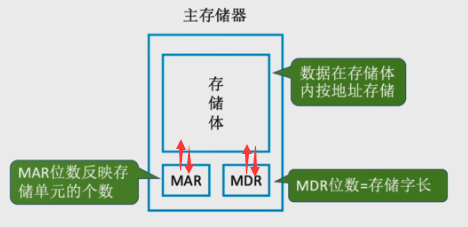

存储器的基本组成包括：

- **存储体** ：存放二进制信息。存储体由若干个 **存储单元** 构成，每个存储单元由多个 **存储元** 构成，每个存储元存储一位 `0` 或 `1` 。因此存储单元可以存储一串二进制代码，称为 **存储字（word）** ，存储字的长度称为 **存储字长** ，可以是1B(8bit)或者字节的偶数倍
- **地址寄存器（MAR）** ：存放访存地址，地址译码后找到所选的存储单元。 **MAR的位数对应着存储单元的个数** ，如果MAR有10位，则有2的10次 = 1024个存储单元，计作 `1k` 。 **MAR的长度 = PC的长度**
- **数据寄存器（MDR）** ：用于暂存要从存储器中读和写的信息。 **MDR的位数和存储字长相等** ，一般为字节的二次幂的整数倍
- 时序控制逻辑：用于产生存储器操作需要的各种时序信号

**补充：**

1. 存储器按地址访问，访问地址为存储单元地址。存储器外部引脚包括地址引脚、命令引脚、数据引脚
2. MAR和MDR虽然是存储器的一部分，但在现代计算机中 **存在于CPU中** ， **高速缓存Cache也存在CPU中** 


<br>


#### 运算器

**作用** ：进行 **算术运算** （加减乘除）和 **逻辑运算** （与或非、异或、比较、移位等）

存储器的基本组成包括：

- **算术逻辑单元（ALU）** ： 处理 **整型数据** ，需要处理实数时增设 **浮点运算部件（FPU）** 。ALU的核心是 **加法器** ，能实现加、减等双目运算和与、或、非等逻辑运算，因此有两个数据入端，一个数据出端。
- 若干通用寄存器：用于暂存操作数和中间结果，包括：（前3个是必选的）
    - 累加器（ACC）
    - 乘商寄存器（MQ）
    - 操作数寄存器（X）
    - 变址寄存器（IX）
    - 基址寄存器（BR）
- 程序状态寄存器（PSW），也称标志寄存器。用于存放ALU运算得到的一些标志信息或状态信息，例如结果是否溢出、有无进位或错位，结果是否为负等


<br>


#### 控制器

**作用** ： 指挥和控制各部件协调工作来实现程序的自动执行

控制器的基本组成包括：

- 程序计数器（PC）：**存放下一条指令的地址** ，可以 **自动+1** 来得到下一条指令的地址。和主存和MAR之间有直接通路
- 指令寄存器（IR）： **存放当前欲执行的指令** ， 内容来自于主存的MDR
    - 指令中的操作码OP送至CU，用来分析并产生微操作命令序列
    - 指令中的地址码AD送到MAR，用来取操作数
- 指令译码器（ID）：识别IR中的指令操作类型和操作数信息
- 控制单元（CU）(核心)：产生相应的部件控制信号

程序执行过程是 **循环的指令执行过程** ，循环变量为指令地址，下条指令地址由当前指令产生

一条指令执行过程：

1. PC取指令
2. IR分析指令
3. CU执行指令


<br>


#### I/O设备

**功能：** 实现信息的输入、输出以及外部媒体信息和内部二进制信息的格式转换。

通常运算器、控制器、存储器只有一个，外设可有多个


<br>


一般将 **运算器** 和 **控制器** 集成到同一芯片上，称为 **中央处理器（CPU）** 。CPU和主存属于主机，出了主机外的硬件（外存、I/O设备）等统称为外设。

CPU和主存之间通过 **总线** 相连，总线中有 **地址** 、 **控制** 和 **数据** 3组信号线。

- MAR中的地址信息送到地址总线，用于指向I/O操作的主存存储单元
- 控制总线中有读写信号线，指明是 **从CPU写入主存（将MDR中的数据送到数据总线）** 还是 **从主存读出到CPU（将数据线上的数据接收到MDR中）** 


<br>


### 1.2.3 计算机软件

根据功能，可分为两类：

- 系统软件：操作系统OS、数据库管理系统DBMS、语言处理程序、分布式软件系统化、网络软件系统、标准库程序、服务型程序等
- 应用软件

三个级别的语言：

- **机器语言** ： 也称二进制代码语言， **是计算机唯一可以直接识别和执行的语言** 
- **汇编语言** ： 用助记符编写的二进制指令代码，汇编语言必须进过 **汇编程序（系统软件）** 的翻译，转换为机器语言程序后，才能在硬件上执行
- **高级语言** 

翻译程序： **将高级语言源程序转化为机器语言程序（也就是说下面三个都是）** (目标代码)，翻译程序有以下3类

- **汇编程序** ： 将汇编语言翻译成机器语言
- **编译程序** ：将源程序一次性翻译成目标程序，只要源程序不变，无需再次编译： c、 c++
- **解释程序** ： **读一条，翻译一条，立即执行** ，不会生成目标程序， 速度一般比编译程序慢： python、JavaScript

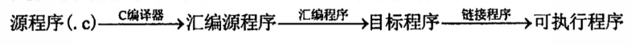

目前为止，计算机中信息任用二进制存储的原因是：由物理器件的性能（逻辑电路中的 **高低电平** ）决定


<br>


### 1.2.4 计算机系统的层次结构

五层结构，上三层是 **虚拟机** ， **《组成原理》关注下两层** 。下层是上层的基础，上层是下层的扩展

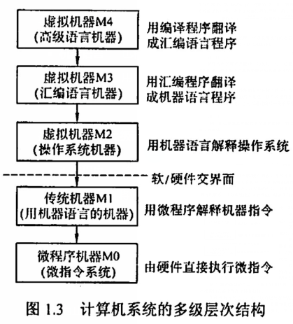


<br>


### 1.2.5 计算机系统的工作原理

#### 存储程序的工作方式

#### 高级语言和机器语言的转换

#### 程序和指令执行过程


<br>


### 习题

**选择题：**

1. 冯诺依曼计算机的基本工作方式是：**控制流驱动方式**

     **解释** ：早起的冯诺依曼计算机 **以运算器为中心** ，且是 **单处理机** 。  **多处理机** 的基本工作方式才是 **多指令多数据流方式**

2. 存放欲执行指令的寄存器是：**IR**

    **解释** ：PC用来存放下一条指令的地址

    MAR用来存放欲访问的存储单元地址

    MDR存放从存储单元取来的数据

3. CPU不包括： **地址译码器**

    **解释** ：地址译码器属于主存，不属于CPU。此外，地址寄存器虽然一般属于主存， **现代CPU绝大多数集成了地址寄存器** 

4. 关于CPU存取速度的比较中：正确的是 **寄存器 > Cache > 内存**

    **解释** ：寄存器在CPU内部，速度最快

    Cache采用高速的SRAM制作，内存采用DRAM制作，速度比Cache慢

5. 若一个8位计算机系统以16位来表示地址，则该计算机系统有 **65536** 个地址空间

    **解释** ：8位计算机 = 计算机字长8位，即一次性可以处理8位的数据，和本题无关属于干扰作用

    16位表示地址 = 地址码长度16位，因此有地址空间2^16 = 65536

6. 关于相联存储器说法正确的是：**即可按地址寻址又可按内容寻址**

    **解释** ：相联存储器也称按内容寻址的存储器，这是它和传统存储器的区别

7. 【2016】将高级语言源程序转换成机器语言目标代码文件的程序是 **编译程序**

    **解释** ：把用高级程序语言编写的程序转换成另一种用低级语言编写的目标程序语言。编译程序属于翻译程序


<br>


**应用题：**

1. 什么是存储程序原理？按照此原理，计算机应该有哪些功能？

    **解释** ：

    1）指的是将指令以代码的形式实现输入计算机主存储器，庵后按照首地址执行第一条指令，然后顺序执行其他指令，直到程序执行结束

    2）应该有5大功能：数据传送、数据存储、数据处理、操作控制、操作判断

    

<br>


### 1.3 计算机的性能指标


吞吐量和响应时间：

-  **吞吐量** ： 指 **单位时间内计算机完成的总工作量** ， 主要取决于 **主存的存取周期** 

    单位可以是 **MIPS** 、 **MFLOPS** 等（既是单位，也是性能指标）

-  **响应时间** ： 指一个任务从 **提交到完成** 所花的全部时间，包括`cpu运算`、`主存访问`、`I/O操作（磁盘访问）`、`操作系统开销`等等


<br>


主频和CPU时钟周期：

- **CPU时钟周期** ： 也叫 **节拍脉冲** 或者 **T周期** ，是CPU中 **最小的时间单位** ，执行指令的每个动作至少需要一个时钟周期。是 **主频的倒数** 

- **主频（CPU时钟频率）** ： 机器内部主时钟的频率。主频越高，时钟周期越小，执行指令的速度越快。常见的有1.8 GHz 、 2.8 GHz等

    ```
    CPU时钟周期 = 1 / 主频
    主频单位通常是Hz, 1Hz表示每秒一次, 计算的时候通常用Hz
    1GHz = 10^3MHz = 10^6KHz = 10^9Hz
    1s = 10^3 ms = 10^6 μs = 10^9 ns
    ```


<br>


**CPI（Clock cycle Per Instruction）** :  执行一条指令所需的时钟周期数

对于一个程序或者一台机器来说，指令集是一样的。此时CPI指的是 **该程序或机器的指令集中所有指令所需的时钟周期数的平均值** 


<br>


**CPU执行时间** ： 指运行一个程序花费的时间，通常计作 `Tcpu` ， 反映出CPU的性能

```
Tcpu = (指令数In x CPI) x 时钟周期Tc = 程序总时钟周期数 x 时钟周期Tc
```

可以看出，CPU性能取决于三个因素，但这三个因素互相制约：

1. 主频
2. CPI
3. 指令条数（指令集）


<br>


**MIPS（Million Instruction Per Second）** :  每秒执行多少百万条数据

```
MIPS = 指令条数 / (执行时间 * 10^6) = 主频 / (CPI * 10^6)
```

 **MFLOPS** ：每秒执行多少百万次浮点运算

```
MFLOPS = 浮点操作次数 / (执行时间 * 10^6)
```


补充：

- 描述容量， **文件大小** 时，K、M、G、T(通常大写)表示2的幂次，例如 `1Kb = 2^10 b` 

- 描述 **速率** ，频率时，K、M、G、T（通常小写）表示10的幂次，例如 `1Kb/s = 10^3 b/s` 

-  **M** mega，百万，10^6

    **G** giga，千兆，十亿，10^9

    **T** tera，兆，10^12

    **P** peta，千万亿，10^15


<br>


**基准程序：**

可以再不同机器上运行相同的基准程序来比较运行时间

 **但是** ，基准程序也和指令集中不同指令出现的频度有关，因此不准确

补充：

-  **系列机** ： 使用相同基本指令系统的多个不同型号的计算机组成的一个产品系列
- **兼容** ： 两台计算机在软件或硬件上存在兼容性
- **固件** ： 将程序固化在ROM中组成的部件。是一种具有软件特性的硬件


<br>


### 习题

**选择题**

1. 若一台计算机的机器字长位4字节，则表明该机器： **在CPU中能够作为一个整体处理32位的二进制代码** 

    **解释** ：4字节(B) = 28位(bit)

2. 在CPU的寄存器中， **指令寄存器** 对用户是完全透明的

    **解释** ：汇编程序员可以通过指令来设置PC的值，状态寄存器、通用寄存器只有汇编程序员可见。 **而IR、MAR、MDR是CPU内部的工作寄存器，均不可见** 

3. 计算机中，CPU的CPI和下列的 **时钟频率** 无关

    **解释** ：时钟频率不影响CPI，但可以加快指令的执行速度。

    干扰选项：系统结构、指令集、计算机组织（它们都会影响CPI）

4. 从用户观点来看，评价计算机系统性能指标的综合参数是 **吞吐率**

    **解释** ：主频、主存容量和指令系统(间接影响CPI)不能体现综合性能。吞吐率指系统在单位时间内处理请求的数量

5. 当前设计高性能计算机的重要技术途径是 **采用并行处理技术**

    **解释** ：其他选项：提高CPU主频、扩大主存容量对性能的提升有限

6. 决定计算机计算精度的主要技术指标是计算机的字长（ **正确**

7. 利用大规模集成电路基数把计算机的运算部件和控制部件做到一块集成芯片上，称为单片机（**错误**

    **解释** ：这是CPU，单片机是采用超大规模集成电路技术CPU、RAM、ROM、I/O口和中断系统等集成到一块硅片上构成的一个小而完善的微型计算机系统

8. 在微型计算机的广泛应用中，会计电算化属于科学计算方便的应用（ **错误**

    **解释** ：属于计算机数据处理方便的应用

9. 【2012】假设基准程序A在某计算机上的运行时间为100s，其中90s为CPU时间，其余为I/O时间。若CPU速度提高50%，I/O速度不变，则运行基准程序A耗费的时间是 **70s**

    **解释** ：后面记得补充！！！！

10. 【2017】假设计算机M1和M2有相同的指令集，主频分别为1.5 GHz和1.2 GHz。在M1和M2上运行某基准程序P，平均CPI分别为2和1，则程序P在M1和M2上运行时间的比值是 **1.6**

    **解释** ：**运行时间 = 指令数 * CPI / 主频**

    M1的时间 = 指令数 * 2 / 1.5

    M2的时间 = 指令数 * 1 / 1.2

11. 【2020】下列部件中，其位数（宽度）一定与机器字长相同的是： **ALU和通用寄存器** 

    **解释** ：机器字长指的是CPU内部用于整数运算的数据通路的宽度。因此 **CPU内部进行运算、存储、传送的部件宽度都要和机器字长匹配** 。因此机器字长等于CPU内部用于整数运算的ALU和通用寄存器的宽度。

    干扰选项：指令寄存器、浮点寄存器

12. 【2021】神威·太湖之光的浮点运算速度为93.0146 PFLOPS，说明该计算机每秒完成浮点操作次数约为：**9.3亿亿次**

    **解释** ：P指的是千万亿，也就是10^15，93.0146 PFLOPS也就是约等于9.3*10^16，也就是9.3亿亿次


<br>


**填空题：**


<br>

# 第二章：数据的表示和运算

## 重点：


## 2.1 数制和编码

计算机系统中，采用二进制进行编码的原因：

- 二进制只有0和1两种状态，物理器件的 **高低电平** 或电荷的正负极都可以方便的表示0或1
- 1和0正好对应 **真和假** ，计算机能够方便的进行逻辑运算和逻辑判断
- 二进制的编码和运算的规则简单， **逻辑门电路** 能方便地实现算术运算


<br>


**进位记数法**

每个数位用到的不同数码的个数称为 **基数（r）** 。十进制的基数r = 10（0~9），每个数位逢十进一

每个数位有一个常数称为 **位权** ，整个数的值大小就是他的各位按权相加


<br>


**不同进制数之间的转换**

1. 二进制数转换为八进制数或十六进制数：

    以小数点往左右两边，数的最左边和最右边可以补0。然后以3位（八进制）或4位（十六进制）为一组，用对应的八进制数或十六进制数来取代

2. 任意进制数转换为十进制数：

    各位乘权值再相加，这种方法也称为 **按权展开相加法**

3. 十进制转换为任意进制数：

    **除基取余法（整数部分）** ：整数部分除基取余，最先取得的余数为数的最低位，最后取得的余数是数的最高位（也就是说结果要倒过来读），商为0时结束

    **乘积取整法（小数部分）** ：  

注意：

- 计算机中，小数是离散的，因此不是每个十进制小数都可以准确地用二进制表示，例如0.3。但任意一个二进制小数都可以用十进制小数表示
- 十六进制： `0x` 开头，或者 `H` 结尾
- 十进制： `D` 结尾  
- **大端模式：** 最高有效地址存放在低地址中（高位先存）


<br>


**真值和机器数**

- 真值是机器数所代表的实际值
- 在计算机中，将正负号用1和0表示的数称为机器数，常用的有原码、补码和反码表示法。例如 `1,101` 表示-5


<br>


### 2.1.3 定点数的编码表示

根据小数位数是否固定可以分为 **定点数** 和 **浮点数** 

现代计算机通常（ **考研考点基本也就这个范围** ）：

- 用 **定点补码整数** 表示 **整数** 
- 用 **定点原码小数** 表示 **浮点数的尾数部分**
- 用 **移码** 表示 **浮点数的阶码部分**


<br>


**机器数的定点表示**

- 定点小数：是纯小数，规定小数点在符号位之后
- 定点整数：是纯整数，规定小数点在有效数值部分的最低位之后


<br>


定点数编码表示法有4种：原码、补码、反码和移码

#### 原码

机器数的最高位表示符号（正0负1），其余表示数的绝对值

- 纯小数：

    - [x]原 = x，当x为大于等于0的小数，x是真值
    - [x]原 = 1 + |x|，当x为小于等于0的小数

    当字长为n+1时，原码小数的范围为 `[ , (1-2^-n)]` 关于原点对称

- 纯整数（了解）：

    当字长为n+1时，原码整数的范围为 `[ , (2^n - 1)]` 关于原点对称

- **注意** ： 

    - 真值0的原码有正0和负0
    - 优点：和真值对应关系简单，原码乘除法简单
    - 缺点：0的表示不唯一，原码加减比较复杂


<br>


#### 反码

反码是原码到补码的中间过程

**正数同原码，负数为原码符号不变，数值取反**

- **注意** ：
    - [0]反表示不唯一： `0,0000` 和 `1,0000`


<br>


#### 补码（重点）

**正数同原码，负数为原码符号不变，数值取反再+1**

原码实现减法时，需要比较两个数的绝对值大小， 用绝对值大的减去小的，并需要选择结果的符号

**补码能够用统一的加法实现加减运算**

- 纯小数（了解）：

    当字长为n+1时，补码小数的范围在原码的基础上将左端点改成 `-1` 

- 纯整数：

    - [x]补 = x，当x为大于等于0的小数，x是真值
    - [x]补 = [x]原取反再+1

    当字长为n+1时，补码整数的范围为 `[-2^n , 2^n - 1]`

- **注意** ：

    - 补码小数比原码多表示 `-1` 
    - 补码整数比原码多表示 `-2`

- 特点：

    1. [0]补是唯一的：`1.0000`
    2. 符号位可以和数值部分一起参与运算
    3. 减法可以用加法实现
    4. **使用补码表示时，若符号位相同，数值位越大码值越大**

- 变形补码（模4补码）：

    - 双符号位00表示正，11表示负，常用在完成算术运算的ALU中 
    - 将[x]补的符号位和数值为一起右移，且符号位不变，可以实现除法

    


<br>


#### 移码

常用来表示 **浮点数的阶码** ， **移码只能表示整数** 

移码在真值x的基础上加上一个 **常数（偏置值）** ，一般是 **2^n** ，因此移码有x在数轴正方向上移动了若干单位的含义

- [x]移 = x + 2^n ，x的范围 `[-2^n , 2^n)` ，机器字长为

- **注意** ： 

    - [0]移唯一，2^n + 0 = `1,0000…` 有n个0
    - **对[x]补的符号位取反得到[x]移，反过来也成立**
    - 移码全0时，有最小真值 `-2^n` ；移码全1时，有最大真值`2^n - 1`
    - 移码保持了数据原有的大小顺序：**移码越大，真值越大**

    


<br>


#### 原反补移的总结

- 原、反、补的符号位相同，正数的三码相同
- 原、反的表示范围在数轴上对称，都存在+0和-0
- 补、移的表示范围在数轴上不对称，0的表示唯一，它们比原、反能多表示一个数
- 整数的补、移符号位相反，数值位相同
- 负数的反、补相差1
- 负数的反、补判断真值大小：数值部分越大，绝对值越小，真值越大


<br>


### 2.1.4 整数的表示

- 无符号整数：

    没有符号位，默认是正数。因此在字长相同的情况下，能表示更多的数。通常用于不会出现负数的场景，比如 **地址运算** 

- 带符号整数：

    原、反、补、移都可以用来表示带符号的整数，但计算机中的带符号整数都用补码表示。

    **补码的优势** ：

    - 与原码和反码比，0的补码表示唯一
    - 与原码和移码相比，补码规则简单，而且符号位参与运算
    - 与原码和反码相比，补码比原码和反码多表示一个最小负数

    

<br>


### 2.1.5 习题

**选择题**

1. 若十进制数位 `137.5` ，则其八进制数为 **211.4**

    **解答** ： 

    整数部分采用 **除基取余法** ，将整数除以8，所得的余数就是个位商的值；再将商除以8，所得的余数就是百位上的值；重复直到商为0为止

    小数部分采用 **乘基取整法** ，将小数乘以8，所得积的整数部分即为八进制数十分位上的值；再将积的小数部分再乘以8，得到百分位上的值；重复直到积为1.0为止。

2. 对于相同位数（假设N位，不考虑符号位）的二进制补码小数和十进制小数，二进制小数能表示的数的个数 / 十进制小数所能表示的数的个数为 `(0.2)^N`

    **解答** ： 

    N位二进制小数能表示的个数：2^N

    N位十进制小数能表示的个数：10^N

    商为(0.2)^N 这也表示了只有(0.2)^N概率的十进制数可以精确的用二进制表示

3. 若定点整数位64位，含一位符号位，则采用 **补码** 表示的绝对值最大的负数是 `-2^63`

    **解答** ： 

    对于长度位n+1的定点整数，补码表示时，绝对值最大的负数也就是左边界是 `-2^n`

4. 零的补码和移码表示相同（错误）

    **解答** ： 

    设机器字长5位，[0]补 = `00000` ，[0]移 = 2^4 + 0 = `10000`

    但补码或移码中表示形式是唯一

5. 若[x]补 = `1,x1x2x3x4x5` 若要x>-32，应满足：`x1必须为1, x2 ~ x5任意`

    **解答** ： 

    [x]补的符号位为1，所以x是负数。负数绝对值越小，数值越大。x>-32则x的绝对值小于32。x的原码小于`1,10000`，则x1必须为0，x2 ~ x5任意。转换为补码后，x1必须为1，x2 ~ x5任意

6. 设x为整数，[x]补 = `1,x1x2x3x4x5`，若要x < -16，应满足： `x1必须为0, x2 ~ x5任意`

    **解答** ： 

    -16的原码是 `1,10000` ，则小于-16的数的原码中，x1肯定是1，x2 ~ x5中至少有一个为1。此时再对数值位取反加1转为补码，有x1必须为0，x2~x5任意

7. 假设一个十进制数为-66，按补码形式放在一个8位寄存器中，该寄存器的内容用十六进制表示为 `BEH`

    **解答** ： 

    ` -66 = (1100 0010)原 = (1011 1110)补 = (BEH)16`

8. 下列为8位移码机器数[x]移，求[-x]移时， `00000000` 会发生溢出

    **解答** ： 

    八位移码的表示范围是 `[-128, 127]` 。 `00000000` 表示 `-128` ，因此 `128` 会溢出

9. 【2015】由3个 `1` 和5个 `0` 组成的8位二进制补码，能表示的最小整数是 `-125`

    **解答** ： 

    要想获得最小值，符号位应该是 `1` 。除符号位以外越大，说明这个数越小。可以确定该二进制补码为`1,0000011`  ，转化为十进制数为 `-125`

11. 【2018】冯诺依曼计算机中数据采用二进制表示是因为：

    1. 二进制规则简单
    2. 制造两个稳态的物理器件比较容易（这个选项犹豫了，记得是高低电平，其实和两个稳态是同一个说法）
    3. 便于用逻辑门电路实现算术运算

12. 【2021】已知带符号整数用 **补码** 表示，变量x、y、z的机器数分别为 `FFFDH`、`FFDFH`、`7FFCH` 下列结论中，正确的是 **若x、y、z是带符号整数，则y<x<z**

    **解答** ： 

    当xyz均为无符号整数时，显然 `x>y>z` 

    当xyz均为有符号整数时，x和y最转换为二进制后最高位均为1，是负数。z转换为二进制后最高位为0，是正数。

    对于x和y，对数值位取反+1转换为原码，可知 `x = -3H` ，`y = -33H` 则 x > y

    

    

<br>


## 2.2 运算方法和电路

运算器由 **算术逻辑单元ALU** 、 **移位器** 、 **状态寄存器** 和 **通用寄存器** 等组成

基本功能包括：加减乘除、与或非、异或、移位、求补等

ALU的核心是 **加法器**

1. 一位全加器

2. 串行进位加法器

3. 并行进位加法器

4. 带标志加法器

5.  **算术逻辑单元ALU** 

    ALU的核心是带标志加法器， **Cin** 为输入端， **ALUop** 是操作控制端，它的位数决定了操作的种类。例如当 **ALUop** 是3位时，最多可以有2^3=8种操作

    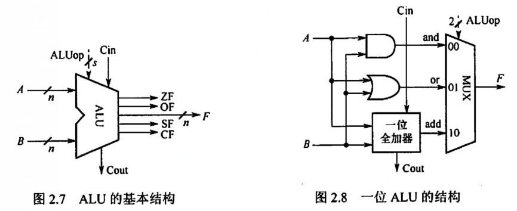

    补充： **MUX** 是多路选择开关（ **多路选择器** ），从很多个输入信号中选择一个送到输出端


<br>


### 2.2.3 定点数的加减运算

在运算过程中，可以不用考虑是小数还是整数，只需要关心符号位和数值位即可

#### 补码加减法运算

设机器字长为n+1：

- [A + B]补 = [A]补 + [B]补（mod 2^(n+1)）
- [A - B]补 = [A]补 + [-B]补（mod 2^(n+1)）

特点：

- 按二进制规则，逢二进一
- 若做加法，两数补码直接相加；若做减法，转换为加法来实现
-  **符号位参与运算，结果的符号位从运算中得到** 
-  **如果最高位进位，则舍弃** 。运算的结果也是补码

例：设机器字长8位（含一位符号位），A=15，B=24，求[A+B]补和[A-B]补

**解答**： 

A原：`0,0001111`  A补： `0,0001111`	（正数的补码同原码）

B原：`0,0011000`  B补：`0,0011000`

-B原：`1,0011000` -B补：`1,1101000`

[A+B]补 = `0,0100111` 也就是真值 39

[A-B]补 = `1,1110111` 也就是真值-9


<br>


#### 补码加减运算电路

假设一个数的补码是Y，那么它的负数就是Y拔+1

因此输入端Y可以加上n个反向器来实现各位取反。用一个 **控制端Sub** 来控制 **2路选择器MUX** 来选择输入Y，还是Y的负数

控制端Sub同时也可以作为低位进位送到加法器

- 当Sub为0时，做[X]补+[Y]补的加法
- 当Sub为1时，做[X]补-[Y]补（X+Y拔+1）的减法


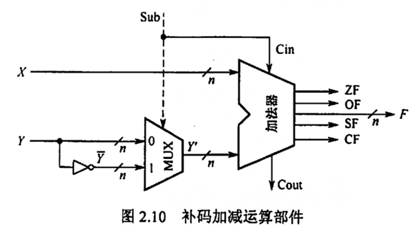


通过 **标志信息** 来区分有符号整数还是无符号整数的运算结果

- **零标志ZF** = 1表示 **结果F** 为0

- **溢出标志OF** = 1表示带符号整数运算时发生溢出。（对于 **无符号整数运算** OF无意义）

- **符号标志SF** 表示结果的符号，即结果F的最高位。（对于 **无符号整数运算** SF无意义）

- **进/借位标志CF** 表示 **无符号整数** 运算时候的进/借位，判断是否溢出。（对于 **带符号整数运算** SF无意义）

    加法时，CF=1表示溢出，此时CF= **进位输出Cout**

    减法时，CF=1表示有借位 ，即不够减，此时CF= **进位输出Cout取反**

    因此， **CF=Sub⊕Cout** （异或）
    
    

<br>


#### 溢出判断方法

当 **两个符号相同的数相加** 或 **两个符号不同的数相减** 才会产生溢出

补码定点数加减溢出判断有3种：

1. 一位符号位

    当参加操作的两个数符号位相同，且和结果的符号位不同，表示结果溢出

2. **双符号位（重要）**

    双符号位也称为 **模4补码** 

    运算结果的两个符号位S1和S2 **相同说明未溢出，不同说明溢出** 。此时 **最高位的符号位代表真正的符号** 

    - 01表示正溢出
    - 10表示负溢出

3. 一位符号位 + 数据位是否进位

    当符号位的进位Cs和最高数位C1相同，说明无溢出，否则溢出


<br>


### 2.2.4 定点数的乘除运算

乘法由 **累加** 和 **右移** 实现，可以分为 **原码一位乘法** 和 **补码一位乘法**

#### 原码一位乘

**特点** ： **符号位和数值位分开计算**

- 符号位由两个数的符号 **异或** 得到
- 数值部分是两个数的绝对值的乘积
- 右移都是 **逻辑右移**

**步骤** ： 

1. 被乘数和乘数均 **取绝对值** 当无符号数参与运算， **符号位由两个符号位异或得到** 
2. 存放在ACC中的是 **部分积** ，是运算的中间结果，初始为0
3. 根据被乘数（存放在MQ当中）的最低位进行判断：
    - 最低位是1，部分积加上被乘数的绝对值，然后右移一位
    - 最低位是0，部分积加上0，然后右移一位
4. 被乘数是n位，需要重复步骤3 n次（直到把初始的MQ中的数全都移出去为止）

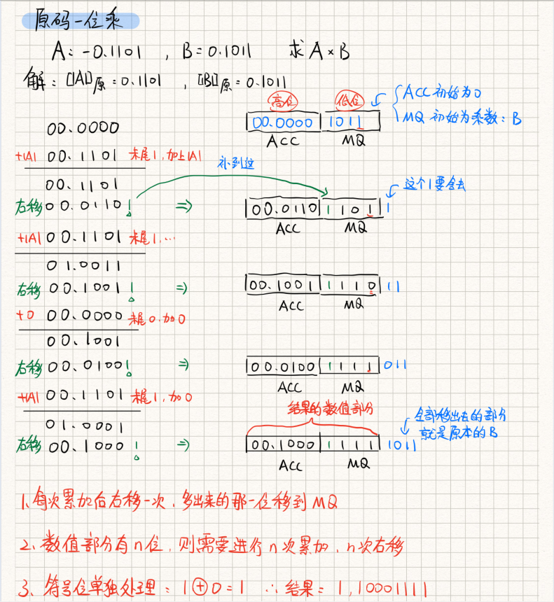


<br>


#### 补码一位乘（Booth算法）

是一种带符号的乘法，采用 **相加** 和 **相减** 来计算补码的乘积


<br>


### 2.2.7 习题

**选择题**


<br>


**填空题**


<br>


### 2.3 浮点数的表示与运算

### 2.3.1 浮点数的表示

目的：为了在数位有限的情况下，能扩大数的表示范围，又能保持数的有效精度

浮点数可以表示为：	`N = (-1)^S * M * R^E`

- S决定符号
- M是 **尾数** ，是一个二进制 **定点小数** ，用 **原码** 表示
- R是 **基数** （隐含），例如2、4、16
- E是 **阶码** ，是一个二进制 **定点整数** ，用 **移码** 表示

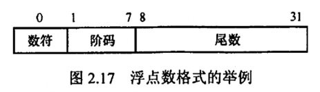

这是一个32为的短浮点数格式

<br>


#### 浮点数的表示范围

表示范围 **关于原点对称** ，且

- 大于最大正数称为 **正上溢** ；小于最小负数称为 **负上溢** 。上溢是真正的溢出，计算机需要 **中断处理** 
- 在0到能表示的最小正数之间称为 **正下溢** ；在能表示的最大负数到0之间称为 **负下溢** 。下溢当做 **机器零** 处理 


<br>


#### 浮点数的规格化

规格化：通过调整一个浮点数的尾数和阶码大小，使得非零的浮点数在 **尾数的最高数位上保证是一个有效值**

- 左规：

    当尾数的最高数位不是有效位时

    尾数每左移一位、阶码减1（基数为2时），直到尾数规格化为止。

    左规会进行多次

- 右规：

    当运算结果的尾数的有效位在小数点之前时

    尾数每右移一位、阶码加1（基数为2时）

    右规只会进行一次


<br>


原码表示的规格化尾数M的绝对值满足属于 `[1/R, 1]` 。例如当R=2时，M的范围是 `[1/2, 1]` 

- 正数是 `0.1xxxx` 的形式，最大时xxx全1，最小时xxx全0
- 负数是 `1.1xxxx` 的形式，最大时xxx全0，最小时xxx全1

浮点数的规格化形式和 **基数** 也有关。

当基数为2时，原码规格化尾数最高位一定是1

当基数为4时，尾数最高位不全为0


<br>


#### IEEE 754标准

IEEE 754 标准的浮点数（除临时浮点数外）是尾数 **采用隐藏位的原码** 表示，阶码用 **移码** 表示的浮点数

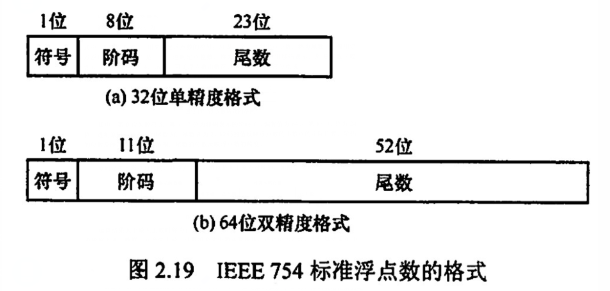


IEEE 754标准浮点数格式有短浮点数、长浮点数、临时浮点数， **基数隐含为2** ，下图为IEEE 754浮点数的格式：

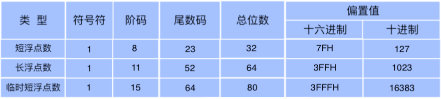

以短浮点数为例，可以看到总共有32位：

- 1位符号位
- 8位阶码，阶码用移码表示，移码的偏置值为2^(8-1) = 127。存储阶码时，先将偏置值加到阶码的真值上，转为移码
- 基数为2，这是隐含的
- 23位尾数。且23位尾数是纯小数，因为规格化的纯小数总是以 `1` 开头，因此隐含了这个 `1` (也称为隐含位)，因此23位尾数其实代表24位数字

 **注意** ： 短浮点数和长浮点数都隐藏了尾数最高数位，因此可以多表示一位尾数


<br>


**对于IEEE 754格式的浮点数，阶码全0或者全1有特殊含义：**

- 阶码和尾数全0：代表正负零（根据符号位）
- 阶码全1尾数全0：代表正无穷或负无穷（根据符号位）


<br>


**定点、浮点表示的区别：**

1. 当字长相等时，浮点表示能表示更大的范围，但精度会低
2. 浮点数的运算包括阶码和尾数部分，而且结果要规格化
3. 浮点运算中，结果超过尾数的表示范围不一定溢出，只有规格化后阶码超过范围才发生溢出


<br>


### 2.3.2 浮点数的加减

特点：阶码运算和尾数运算分开进行

1.  **对阶**

    使得两个数的阶码相等，原则是 **小阶向大阶看齐** ，阶码小的尾数右移一位，阶码加1（基数为2），直到两个数阶码相等。尾数右移时，舍弃有效位会减少精度，产生误差。

2.  **尾数求和**

    两个尾数按定点数加减

3.  **规格化**

    IEEE 754规格化尾数形式为 `±1.xxx` ， 那个1是隐藏的（右规相当于乘2，左规相当于除2）

    - 右规：当结果为 `±1x.xxx` 时，需要右规。将尾数右移，阶码加1。 **右规只需要进行一次** 。完成规格化后，小数点前面那个1是隐藏的。 **最后一位移出时，需要考虑舍入**  
    - 左规：当结果为 `±0.0xxx` 时，需要左规。将尾数左移，阶码减1。 **左规可能需要进行多次** ，直到小数点前面一位是 `1` 为止

4.  **舍入**

    右规时，有一部分会移出去，这时候为了保证运算的精度，一般会将低位移出的两位保留，来判断是舍还是入，最后还原成IEEE 754标准

    - **0舍1入法** ： 运算结果保留位最高数位是0就舍弃，最好数位是1就在尾数末尾加1。这样可能导致 **溢出** ，需要再进行一次右规
    -  **恒置1法** ： 只要移出去的位中有1，就把尾数末置为1，无论原来是多少
    -  **截断法** ：直接截取所需位数，将后面的都舍弃

5.  **溢出判断**

    上面的操作会对阶码进行加减，因此需要考虑 **指数的溢出问题** 

    当一个正数超过了最大值（127或1023），就产生指数上溢，异常

    当一个附属超过了最小值（-149或-1074），就发生了指数下溢，结果通常当做机器零

    - 右规和尾数舍入：

        当尾数很大，且发生了舍入时，导致了尾数溢出。此时会通过右规来调整，尾数向右移动，阶码加1。此时就需要判断指数是否发生了指数上溢。如果指数本身是 `11111110` ，右规使得阶码加1变成了 `11111111` 就发生了指数上溢

    - 左规：

        左规时，阶码会减1。此时需要判断阶码是否全0来确定是否发生了指数下溢


<br>


**注意** ： 

- 由此可见，尾数的溢出不一定真正发生了溢出。因为可以通过右规进行修正。**指数的溢出才是真的溢出**

- 有些题目可能会要求尾数或者阶码用 **补码** 表示，通常是双符号位。运算结束时，

    当出现溢出（尾数是 `10.xxx` 或者 `01.xxx` ）时，需要进行右规

    当出现 `00.0xxx` 或者 `11.1xxx` 时，需要左规，直到变成 `00.1xxx` 或者 `11.0xxx`


<br>


## 第三章：存储器层次结构

### 3.1.1 存储器的分类

按照 **在计算机中的作用** （层次分类）：

1. 主存储器（ **主存** ）：存放运行时候的程序和数据，CPU可以直接随机访问，主存可以和Cache以及辅存交换数据

    特点：容量 **小** 、速度 **快** 、价格高 

2. 辅存（ **外存** ）：外存的内容 **需要调入内存后才能被CPU访问** 

    特点：容量 **大** 、速度 **慢** 、价格低 

3. 高速缓冲存储器（ **Cache** ）：位于主存和CPU之间，存放CPU经常使用的指令和数据以便CPU能高速访问

    特点：容量 **小** 、速度**快**（能和CPU匹配）、价格高。现代计算机通常做在CPU里


<br>


按照 **介质** （材料）分：

- **磁表面存储器** ：磁带、磁盘、磁芯存储器、半导体存储器（MOS型、双极型）
- **光存储器** ：光盘


<br>


按照 **存储方式** 分：

1. 随机存储器（ **RAM** ）：可以 **随机存取** ，用来制作主存或Cache

    分为静态RAM和动态RAM

2. 只读存储器（ **ROM** ）：可以 **随机存取** ，断电后内容保存，通常也是主存的一部分

    现代ROM已经可以写入，但是写入速度比读取慢得多

3. 串行访问存储器：需要按照物理位置先后寻址，包括：

    - 顺序存取存储器（磁带）

    - 直接存取存储器（磁盘、光盘）：介于RAM和顺序存取存储器之间。特点是先寻找一个小区域（例如磁道），再在小区域内顺序查找


<br>


按照 **信息是否能保存** 分：

- 易失性存储器：断电后内容消失，例如RAM
- 非易失性存储器：例如ROM


<br>


### 3.1.3 多级层次的存储系统

存储系统的层次结构主要体现在：

- **Cache-主存** ：解决CPU和主存速度不匹配问题
- **主存-辅存** ：解决存储系统容量问题

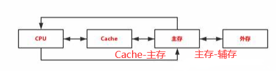


注意：

- CPU和Cache之间还有寄存器

- 上一层存储器作为低一级存储器的高速缓存，Cache（或主存）中的内容是主存（或辅存）中内容的 **副本**

- 速度接近于上层，但容量和价格接近于低一层

- `主存-Cache` 之间的数据由 **硬件** 完成， **对所有程序员透明**
- `主存-辅存` 之间的数据由 **硬件+OS** 完成， **对应用程序员透明**
- 虚拟存储系统能使编程时的地址空间远大于主存空间


<br>


### 3.1.4 习题


<br>


## 3.2 主存储器

### 3.2.1  SRAM和DRAM

SRAM和DRAM都是 **易失性半导体存储器**

**存储元** ：存储一个二进制位的物理器件

**存储单元** ：地址码相同的若干个存储元的集合

**存储体** ：若干存储单元的集合


<br>


 **静态随机存储器(SRAM)** 的存储元是双稳态 **触发器** （六晶体管 **MOS** ）来存储信息，特点：

- 用双稳态电路的两个稳态来存储0和1
- MOS
- 非破坏性读出
- 速度快、 **集成度低** 、价格高，一般用于 **Cache**


<br>


**动态随机存储器(DRAM)** 利用 **电容** 的电荷来存储信息，特点：

- 利用电荷来存储0和1
- 电荷维持时间短，需要 **刷新** ，刷新 **对于CPU是透明的** 
- 刷新的单位是 **行**
- 刷新不需要选片
- 速度较慢、 **集成度高** 、价格低，一般用于 **主存系统**

刷新的方式：

- 集中刷新
- 分散刷新
    - 优点： **没有死时间** （也称访存死区）
- 异步刷新


<br>


### 3.2.2 只读存储器ROM

ROM也支持随机存取，但它 **掉电不丢失信息** ，特点：

- 位密度比可读写存储器高
- 非易失性


<br>


ROM的类型：

- **MROM** ：制造时写入信息
- **PROM** ：一次性编程的ROM
- **EPROM** ：可擦拭可编程的ROM，可读写，但不能代替RAM，因为次数有限且速度慢
- **FLASH存储器** ：U盘等
- **SSD**


<br>


### 3.2.3 主存储器的基本组成


<br>


### 3.2.4 多模块存储器（先跳过）

采用多个结构完全相同的存储模块并行工作来提高吞吐率

#### 单体多字存储器


<br>


#### 多体并行存储器


<br>


### 3.2.5 习题

**选择题**

1. 某一SRAM芯片，容量为 1024 x 8位，除电源和接地线外，该芯片的引脚的最小数目为 `21`

    **解答：**

    1024 = 2^10，说明地址线是10根

    8位说明数据线是8根

    再加上一位片选线，读写控制线加起来3根

    总共是21根。（读写控制线也可以为1根，但题目中并没有20的选项）

2. 某存储器容量为 32K x 16位，则 `地址线位15根，数据线为16根`

    **解答：**

    32K = 2^15，地址线是15根

    16位说明数据线是16根

3. 若RAM中每个存储单元为16位，则 `数据线是16位`

    **解答：**

    地址线之和RAM的存储单元个数有关，和存储字长无关

4. 某一DRAM芯片， **采用地址复用技术** ，容量为1024 x 8位，除电源线和接地线外（读写控制线为2根），该芯片的引脚数最少是 `17`

    **解答：**

    1024 B = 2^10 B，地址线应该为10根，按字节寻址。采用地址复用技术时，通过行通选和列通选分行、列 2次传送地址信号，因此地址线减半为5根

    数据线不变，任为8根

    行通选、列通选、读写信号线总共是4根（片选线由行通选代替）

    因此总共是17根

    

<br>


## 3.3 主存储器和CPU的连接

### 3.3.1 连接原理

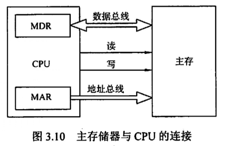


- 地址总线的位数决定了可寻址内存空间的大小
- 数据总线的位数和工作频率的乘积和数据传输率成正比


<br>


### 3.3.2 主存容量的扩展（先跳过）

单个芯片的容量是有限的，在 `字数` 和 `字长` 都和实际的存储器有差距

扩充主存容量的方法主要有 **位扩展法** 、 **字扩展法** 、 **字位扩展法**

- 当 **数据位数不够** 时，进行 **位扩展** ，多个存储器件对字长扩充， **增加存储字长** 
- 当 **字的数量不够** 时，进行 **字扩展** ， **增加存储字数量** 


<br>


### 3.3.3 存储芯片的地址分配合片选


<br>


### 3.3.4 存储器和CPU的连接


<br>


### 3.3.5 习题

**选择题：**

1. 用存储容量为16K x 1位的存储器芯片来组成一个64K x 8位的存储器，则 **在字方面扩展了4倍，在位方面扩展了8倍**

    **解答：**

    字方面：64K/16K = 4倍

    位方面：8bit/1bit = 8倍

2. 80386DX是32位系统，以4B作为编址单位，当在该系统中用8KB（8K x 8位）的存储芯片构造32KB的存储体时，应当完成 **位扩展**

    **解答：**

    4B为编址单位，要扩展到32KB，即8K x 32bit，只需要进行位扩展

3. 

    

    


<br>


## 3.4 外部存储器

### 3.4.1 磁盘存储器

优点：

- 容量大，价格低
- 重复使用
- 非破坏性读出

缺点：

- 速度慢


<br>


**磁盘存储器的组成：**

- 磁盘驱动器、磁盘控制器等组件
- **盘片** ：一块硬盘有多个 **记录面** ，每个面划分为多个 **磁道** ，每个磁道又划分为多个 **扇区** （也叫 **块** ），扇区是磁盘读写的最小单位（即 **磁盘按块存取** ）
    - **磁头数** ： 就是记录面数，一个磁头对应一个记录面
    - **柱面数** ： 硬盘每片盘面上有多少磁道。不同盘但相同位置的磁道构成一个柱面
    - **扇区数** ： 每条磁道上有多少扇区


<br>


**磁盘的性能指标：**

- **记录密度** ：单位面积上记录的二进制信息量。有 **道密度（沿磁盘半径方向单位长度的磁道数）** 、**位密度（磁道单位长度上二进制代码位数）** 、 **面密度（道密度 * 位密度）**
- **平均存取时间** ： `寻道时间 + 旋转延迟时间 + 传输时间`
- **数据传输率** ：设磁盘r转/秒，每条磁道容量为N字节。则 `数据传输率Dr = r * N`


<br>


**RAID（独立冗余磁盘阵列）：**

将多个独立的物理磁盘组成一个独立的逻辑盘，数据在多个物理盘上交叉分割存储，并行访问。

RAID的分级从0~5， **RAID 5为最高等级**  

RAID0是无冗余和无校验的磁盘阵列，而1~5是增加了冗余（镜像）或校验的磁盘阵列


<br>


### 3.4.2 固态硬盘 SSD

SSD基于闪存技术，和U盘没有本质的差别，但是容量更大，性能更好

**闪存翻译层** 充当磁盘控制器的角色

一个闪存由B块组成，每个块有P页组成， **数据以页为单位读写** 

优点：

- **随机写很慢（因为擦除块很慢）**
- 没有磁头移动，访问时间快
- 没有噪音，抗震性好，安全

缺点：

- 容易磨损


<br>


补充：

- 磁盘的格式化容量比非格式化容量小：非格式化容量就是标签上的容量，实际上还会有坏掉的扇区，格式化之后还要分扇区，实际能用的容量就变小了


<br>


### 3.4.3 习题

**选择题：**

1. 一个磁盘的转速为 7200转/分 ，每个磁道有160个扇区，每个扇区有512字节，则理想情况下，数据传输率为：

    ```
    解答：
    7200转/分 = 120转/秒
    数据传输率 = 转速 * 每磁道字节数： 120 * 160 * 512B= 9600KB/s 
    ```

    

2. RAID可以提高磁盘的磁记录密度和磁盘利用率（ **错误** ）

3. 【2013】某磁盘的转速为1000转/分，平均寻道时间是6ms，磁盘传输速率为20MB/s，磁盘控制器延迟0.2ms，则读取一个4KB的扇区的平均时间为：

    

    ```
    解答：
    转速是1000转/分，转一圈的时间是6ms，则平均查询扇区（就是半圈）的时间是3ms
    平均寻道时间为6ms
    读取4KB扇区信息的时间为4KB / (20MB/s) = 0.2ms
    延迟0.2ms
    总时间为3 + 6 + 0.2 + 0.2 = 9.4ms
    ```

    

4. 【2019】磁盘存储器的最小读写单位 ： **(扇区)块**

5. 【2015】磁盘的转速是7200转/分，平均寻道时间是8ms，每个磁道包含1000个扇区，则访问一个扇区的平均存取时间为：12.2ms

    ```
    解答：
    存取时间 = 寻道 + 延迟 + 传输
    存取一个扇区的平均延迟时间为旋转半周的时间： （60 / 7200）/ 2 = 4.17ms
    传输时间为 ( 60 / 7200 ) / 1000 = 0.01ms
    所以访问一个扇区的平均存取时间： 8 + 4.17 + 0.01 = 12.18ms
    ```

    

    

<br>


## 3.5 高速缓冲器Cache

### 3.5.1 程序访问的局部性原理

时间局部性：循环中，将来用的信息

空间局部性：最近未来要用到的信息和当前的信息在存储空间是相邻的，因为指令通常是顺序存放、顺序执行的

高速缓冲技术就是用到了 **空间局部性原理**


<br>


### 3.5.2 Cache的基本工作原理

Cache位于存储器层次的最顶层，通常由 **SRAM** 构成，**Cache仅保存主存中最活跃的若干块的副本**

为了实现Cache，需要解决的问题：

1. 快速判断数据是否在Cache中
2. 主存块如何放到Cache中，主存地址如何转换为Cache地址
3. Cache满时的替换策略
4. 写入时主存块和Cache块的一致性问题：全写法、写回法


<br>


为了Cache和主存交换信息，Cache和主存都被划分为相等的 **块** （也称为 **Cache行** ，由若干字节组成），块的长度也称为块长

当CPU发出读请求时：

- 若访存地址在Cache命中：将地址转换为Cache地址，读Cache
- 若Cache未命中：
    - 当Cache未满：访问主存，将此字所在的块一次性从主存调入Cache
    - 当Cache已满：通过替换算法，将此字所在的块和Cache中的某块替换

注意：

- CPU和Cache之间的数据交换单位： **字**
- Cache和主存之间的数据交换单位： **Cache块**
- 某些计算机也采用 **同时访问Cache和主存** 的方式，Cache命中则终止访问主存


<br>


**Cache的命中率：**

CPU要访问的信息在Cache中的比率

```
命中率H = Cache命中次数 / （Cache命中次数 + 访问主存次数）

Cache-主存系统的平均访问时间Ta = 命中率 * 命中时Cache访问时间 + （1 - 命中率）  * 未命中时Cache访问时间
```

未命中Cache访问时间就是访问Cache + 访问主存的时间


<br>


【例3.3】假设Cache的速度是主存的5倍，且Cache命中率为95%。则采用Cache后，存储器性能提高了多少？（假设Cache和主存同时被访问，且Cache命中就中断访问主存）

```
设Cache存取周期为t，则主存的存取周期为5t
H = 95%，则平均访问时间Ta = 0.95 * t + 0.05 * 5t = 1.2t
原来需要5t，现在需要1.2t，提高了（5 / 1.2  - 1） = 3.17倍

如果先访问Cache再访问主存
平均访问时间Ta = 0.95 * t + 0.05 * (t + 5t) = ...
...
```


<br>


### 3.5.3 Cache和主存的映射方式

**Cache行** 的信息是 **主存中某块的副本**

**地址映射** ： 将主存地址空间映射到Cache地址空间，也就是把存放在主存中的信息装入Cache

需要再Cache中为每行添加一个 **标记** ，来标识它是主存中哪块的副本（相当于主存中 **块的编号** ）

还需要添加一个 **有效位** ，来说明Cache行中的信息是否有效

地址映射的方法：


<br>


#### 直接映射

主存中每块根据编号mod来得到Cache行号，也就是说 **主存中块只能装入Cache中对应的唯一地址**

```
Cache行号 = 主存块号 mod Cache总行数
```


<br>


### 3.5.4 Cache中主存块的替换算法（重点）


<br>


### 3.5.5 Cache写策略


<br>


### 3.5.6 习题


<br>


## 3.6 虚拟存储器

