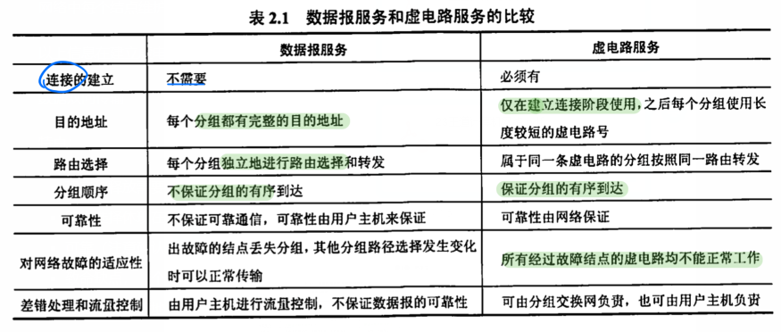

参考资料：《23王道计算机网络》

<hr>

# 第一章 计算机网络体系结构

## 1.1 计算机网络概述

### 重点

### 1.1.1 计算机网络概念

**计算机网络** ： 能够以相互共享资源的方式互联起来的自治计算机系统的集合

- `目的` ： 资源共享
- `组成单元` ： 多台多里的自治计算机
- `规则` ： 网络协议


<br>


### 1.1.2 计算机网络组成

按 **组成成分** 可以分为：

- `硬件` ：主机、通信链路、通行处理机（网卡）等
- `软件` ： 网络操作系统、FTP程序等
- `协议`

按 **工作方式** 可以分为：

- 边缘部分 ：用户用的主机
- 核心部分 ：大量网络和路由器

按 **功能组成** 可以分成：

- `通信子网` ： 传输介质、通信设备、网络协议
- `资源子网` ： 实现资源共享功能的软硬件集合


<br>


### 1.1.3 计算机网络功能

主要有五大功能：

1. 数据通信
2. 资源共享
3. 分布式处理
4. 提高可靠性
5. 负载均衡


<br>


### 1.1.4 计算机网络分类

按 **分布范围** 可分为：

- 广域网WAN ： 也叫远程网，长距离通信，使用 **交换技术**
- 城域网MAN ： 覆盖一个城市，采用 **以太网技术** ，有时也在局域网的范围
- `局域网LAN` ： 使用 **广播技术**
- 个人区域网PAN ： 一个人的设备，也叫无线个人区域网WPAN


<br>


按 **传输技术** 可分为：

- `广播式网络` ：局域网，广域网中的无线、卫星通信网络
- `点对点网络` ：广域网

区分广播和点对点 ：是否采用 **分组存储转发** 和 **路由选择机制**


<br>


按 **拓扑结构** 可分为：

- 网状 

- 总线形 

- `星形` ： 通信必须经过中央设备（路由器或交换机）

- 环形 ： 令牌环局域网，环中信号单向

网状一般是广域网，其他是局域网


<br>


按 **交换技术** 可分为：

- **电路交换网络** 
    - 传统电话网路
    - 优 ： 直接传送，时延小
    - 缺 ： 线路利用率低、不能差错控制
- **报文交换网路**
    - 也叫 `存储-转发网络`
    - 优 ： 充分利用线路，可以实现格式转换、差错控制
    - 缺 ： 增加了缓冲时延，缓冲区难以管理
- **分组交换网络**
    - 也叫 `包交换网络` ，现在的主流
    - 优 ： 缓冲便于管理、包的平均时延小，更标准化
    - 缺 ： 附加信息开销大


<br>


### 1.1.6 计算机网络的性能指标

#### 带宽Bandwidth

网络的通信线路所能传送数据的能力，比特/秒（b/s）


<br>


#### 时延Delay

指数据（报文或分组）从链路的一段到另一端所需的总时间，总时延包括四部分：

- **发送时延（传输时延）**

    将分组的所有比特 传输到链路 所需的时间（发送分组的第一个比特到最后一个比特发送完毕）

    ```
    发送时延 = 分组长度 / 信道宽度
    ```

    

- **传播时延**

    一个比特从链路的一端到另一端所需的时间

    ```
    传播时延 = 信道长度 / 电磁波在信道上的传播速率
    ```

    

- **处理时延**

    数据在 交换结点 中处理存储转发的准备时间

    比如拆分组的首部、从分组中提取数据部分、差错检验、查找合适的路由等

- **排队时延**

    分组以进入路由器后排队等待转发的过程

注意 ： 

- `处理时延` 和 `排队时延` 一般可忽略不计
- 高速链路提高的是 `数据发送速率` 而非比特在链路上的传播速率，因此只能 `减少数据的发送时延`


<br>


#### 时延带宽积

发送端发送第一个比特即将到达终点时，发送端已经发出了多少比例

也称 **以比特为单位的链路长度**

```
时延带宽积 = 传播时延 * 信道带宽

将链路想象成一根圆柱
长度就是传播时延
横截面就是链路带宽
圆柱的体积就是时延带宽积，也就是能容纳的比特的数量
```


<br>


#### 往返时延RTT

指从发送端发送一个短分组，到发送端接收接收端的确认（假设接收后立马发送确认）总共经历的时间


<br>


#### 吞吐量Throughput

单位时间内通过某个网络的数据量


<br>


#### 速率Speed

连接到计算机网络的主机在数字信道上传输数据的速率

也称为 **数据传输率** 、 **数据率** 、 **比特率**

kb/s	Mb/s	Gb/s

最高数据传输率也称为 **带宽**


<br>


#### 信道利用率

指有百分之多少的时间是有数据通过的

```
信道利用率 = 有数据通过时间 / (有+无)数据通过时间
```


<br>


### 1.1.7 习题

#### 选择题

1. 计算机网络最基本的功能室 `数据通信`

2. 广播式网络不需要服务结点 `错误`

    ```
    广播式网络共享广播信道（如总线），通常是局域网（工作在数据链路层）中的一种通信方式，因此不需要网络层，也不存在路由选择问题
    但必须使用物理层的服务，必须要通过服务访问点实现
    ```

    

3. 世界上最早出现的计算机网络是 `ARPnet`


<br>


## 1.2 计算机网络体系结构与参考模型

### 1.2.1 计算机网络分层结构

网络的体系结构 ： 计网各层及协议的集合

体系结构是抽象的，实现是具体的

在分层结构中，第n层中的活动元素称为 `第n层实体` ，实体指任何可发送或接受信息的硬件或软件进程

不同机器同一层称为 `对等层` ，同一层的实体称为 `对等实体`

**协议数据单元PDU：**

- 对等层之前传送的数据单位称为该层的PDU，第n层为 n-PDU
- PDU的通称 ：物理层-比特、数据链路层-帧、网络层-分组、传输层-报文段

每层中，报文（也就是PDU）分为：

- `服务数据单元SDU` ： 读n层的服务数据单元记为 n-SDU，数据部分
- `协议控制信息PCI` ：第n层的协议控制信息记为 n-PCI，控制信息部分

```
n-SDU + n-PCI = n-PDU = (n-1)-SDU
第n层的报文PDU作为下一层的数据部分SDU
依次往下传
最后到物理层就是一个层层嵌套的PDU，再进行传送，接收方再层层接触嵌套
```

补充：

- 只能通过接口使用下一层的服务，且细节是透明的
- 两台主机通信事，对等层在逻辑上有一条直接信道，表现为不经过下层就能传送信息


<br>


### 1.2.2 协议、接口、服务

#### 网络协议Network Protocol 

是对等实体之间的协议，包括：

- 语法 ：规定了传输数据的格式
- 语义 ：规定了要完成的功能、控制信息等
- 同步 ：规定了顺序


<br>


#### 接口

同一结点相邻两层的实体通过 **服务访问点SAP（逻辑上的）** 进行交互

服务通过SAP提供给上层使用，第n层的SAP就是n+1层访问n层服务的地方 


<br>


#### 服务

服务是垂直的，下层为上层提供的功能调用

服务原语 ： 上层使用下层的服务时必须与下层交换的命令

OSI模型中的服务原语：

- 请求request
- 响应response
- 指示indication
- 证实confirmation

有应答服务包括4种，无应答服务只有请求和指示

是否面向连接：

- **面向连接服务** ： 包含建立连接、传输数据、释放连接三阶段    `TCP`
- **无连接服务** ：尽最大努力交付  `IP` 、 `UDP`

是否可靠：

- **可靠服务**
- **不可靠服务** ： 尽力而为，有时候可在用户的帮助下变为可靠

有无应答：

- **有应答服务** ：系统实现，不是用户实现	`文件传输服务`
- **无应答服务** ： 也可以由更高层实现应答    `WWW服务`


<br>


### 1.2.3 OSI参考模型和TCP/IP模型

#### OSI七层模型 

**物数网传会表应** 

低三层为 ： `通信子网`

高三层为 ： `资源子网`

- **物理层 Physical Layer**

    传输单位： `比特`

    在物理媒体（双绞线、光缆等，在物理层下面，也被称为第0层）上为数据端设备透明地传输 `原始比特流`

    定义了 `数据终端设备DTE` 和 `数据通信设备DCE` 的物理和逻辑链接方法

    物理层协议也称为 `物理层接口标准` 或者 `物理层规程`

    典型的协议 ： `EIA-232C` 、 `EIA/TIA RS-449` 、 `CCITT的X.21` 等

- **数据链路层 Data Link Layer**

    传输单位： `帧`

    任务是 将网络层传来的IP数据报组装成帧

    **点对点（主机和主机之间）** 

    功能 ： 成帧、差错控制、流量控制、传输管理

    `介质访问子层` ： 控制对共享信道的访问

    典型的协议 ： `SDLC` 、`HDLC` 、 `PPP` 、 `STP` 、 `帧中继`

- **网络层 Network Layer**

    传输单位： `数据报`

    任务是 把网络层的协议数据单元（分组）从源端发送到目的端，提供通信服务给分组交换网上的主机

    功能 ： 路由选择、流量控制、拥塞控制、差错控制、网际互联

    Internet的网络层也称为 `网际层` or `IP层`

    典型的协议： `IP` 、 `IPX` 、 `ICMP` 、 `ARP` 、 `RARP` 、 `OSPF`

- **传输层 Transport Layer**

    也称 `运输层` ，传输单位： `报文段(TCP)或者用户数据报(UDP)`

    功能 ： 为 **端对端（进程和进程之间）** 提供可靠的传输服务，而忽略通信子网

    且有复用和分用的功能：

    - `复用` ： 多个应用层进程可以同时使用传输层的服务

    - `分用` ： 传输层把收到的信息分贝交付给应用层中相应的进程 

- **会话层Session Layer**

    允许不同主机的进程进行对话

    利用传输层提供的端对端服务，向表示层提供增值服务

    为表示层实体或用户进程建立链接并在链接上有序传输数据（就是会话），也称 **建立同步SYN**

- **表示层 Presentation Layer**

    处理两个通信系统中交换信息的表示方式

    数据压缩、加密、解密等

- **应用层 Application Layer**

    是用户和网络的界面

    典型的协议 ：  `文件FTP` 、 `邮件SMTP` 、 `HTTP`


<br>


#### TCP/IP模型

ARPA研究 `ARPAnet` 时提出

**事实上的国际标准**

- **应用层（会 + 表 + 应）**

    用户-用户

    包含所有的高层协议 ： `虚拟终端协议Telnet` 、 `文件传输协议FTP` 、`域名解析服务DNS` 、 `电子邮件协议SMTP` 、 `超文本传输协议HTTP`

- **传输层**

    `应用-应用` 或 `进程-进程`

    传输层的两个主要协议：

    - `传输控制协议TCP` ： 面向 `连接` ，传输 `报文段` ， `可靠`
    - `用户数据报协议UDP` ：面向 `无连接` ，传输 `用户数据报` ，`不可靠` ， 尽最大努力交付

- **网际层**

    关键

    将分组发送到任何网络，并为之独立选择合适的路由，但不保证分组有序到达

    分组的有序交付由高层负责

    定义了标准的分组格式和协议： `IP` ，现在的版本就是 `IPv4`

    ```
    IP协议是因特网的核心协议
    ```

    

- **网络接口层（物 + 数）**

    表示与物理网络的接口， **实际上并未真正描述**

    具体的物理网络可以是各种局域网，例如以太网、令牌环网、电话网

    作用 ： 从主机或结点接受IP分组，并发送到指定的物理网络上


<br>


#### TCP/IP和OSI的比较

相似点：

- 都是分层结构
- 基于独立的协议栈的概念
- 都能解决异构网络的互联

差异点：

- OSI精确定义了三个主要概念：服务、协议、接口，符合面向对象的思想。而TCP/IP没有

- OSI先有模型再有协议，而TCP/IP现有IP协议再有模型

- 重点：

    **OSI模型** 在 `网络层` 支持 `面向连接` 和 `无连接` 的通信，在 `传输层` 只有 `面向连接` 的通信

    **TCP/IP模型** 在 `网际层` 只有 `无连接` 的通信，在 `传输层` 支持 `面向连接` 和 `无连接` 的通信

《计算机网络》一般采用折中的方法，采用5层结构：

- 物理层
- 数据链路层
- 网络层
- 传输层
- 应用层


<br>


#### 协议栈封装


<br>


### 1.2.4 习题

#### 选择题：

1. `定义功能执行的方法` 不是对网络模型进行分层的目标

2. OSI模型中数据链路层不具有 `拥塞控制` 功能

3. 最好描述OSI模型汇总数据链路层功能的是 `保证数据正确的顺序和完整性`

4. OSI模型中，两台计算机进行文件传输时，为防止中间出现网络故障而重传整个文件，通过在文件中插入同步结点。这个动作发生在 `会话层`

5. 正确描述了OSI参考模型中数据的封装过程的是 `网络层将高层协议产生的数据封装成分组，并增加第三层的地址和控制信息`

6. OSI模型中，提供流量控制的是 `2、3、4` 层

7. TCP/IP模型中， `传输层` 处理关于可靠性、流量控制、错误校正等问题

8. 【2016】在OSI参考模型中，路由器、交换机switch、集线器hub实现的最高功能层分别是 `2、2、2`

    


# 第二章 物理层

## 2.1 信道基础

### 2.1.1 基础概念

数据 ： 传送信息的实体

信号 ： 数据的电气或电磁表现，是数据在传输过程中的存在形式

- 连续变化 ： 模拟XX
- 离散 ： 数字XX

码元 ： 用一个固定时长（码元宽度）的数字脉冲表示一位K进程数，代表不同离散值的基本波形，是数字信号的基本计量单位


<br>


信源 ： 起点

信宿 ： 终点

信道 ： 信号的传输媒介，一条线路的逻辑部件，一般通信线都有一条发送信道和一条接受信道


<br>


`基带信号` ： 将数字信号1和0用不同电压表示，在 `数字信道` 上传输（基带传输）

`宽带信号` ： 基带信号调制后形成 `频分复用模拟信号` ，在 `模拟信道` 上传输（宽带传输）


<br>


信息交互方式又可以分为：

- `单向通信` ：一条信道，单向
- `半双工通信` ：两条信道，但不能同时发送和接受
- `全双工通信` ：两条信道，可同时发送和接受

信道的极限容量 ： 信道的 `最高码元传输速率` or `信道的极限数据传输速率` 


<br>


速率（数据率） ： 单位时间内传输的数据量，可以用下面两个来表示：

- `码元传输速率（波特率、调制速率、波形速率、符号速率）`
    - 单位 ： 波特baud ， 一波特为每秒传一个码元（码元速率和进制数k无关）
- `信息传输速率（比特率、信息速率）` 
    - 单位 ： 比特每秒b/s ， 单位时间传输的 `二进制码元` （也就是比特数）个数

```
两个速率概念不同，但数量上有一定的关系
若一个码元带n比特信息，
在数值上， 比特率 = 波特率 * 每符号含的比特数（若1码元=n比特，则波特率=n比特率）

比特率 = 波特率 * log(2为底)N ， N为有效离散值的个数，log(2为底)N也就是二进制位数
```


<br>


带宽 ： 单位b/s ， 单位时间内从网络一点到另一点能通过的 `最高数据率`


<br>


### 2.1.2 奈奎斯特定理和香农定理

`码间串扰` ： 信号中的高频分量往往不能通过信道，否则会在传输中衰减，导致接收端的信号波形失去码元间的清晰界限

#### 奈氏准则 ：限制码元传输速率

具体信道能通过的频率范围是有限的

在理想低通（没有噪声、带宽有限）的信道中，为了避免码间串扰，极限码元传输速率为2W（W是该信道带宽）波特

```
理想低通信道下的 极限数据传输速率 = 2Wlog（2为底）V， 单位b/s

V表示每个码元离散电平的数目（有多少种组合，比如4个二进制位可以表示16种不同的码元，此时数据传输率是码元数据传输率的4倍）
```

结论：

- 任何信道，码元传输速率有上限
- 频带越宽（通过的信号高频分量越多），可用更好的速率进行码元的有效传播
- 奈式准则没有对 `一个码元对应多少二进制位，也就是上面的V` 做出限制


<br>


#### 香农定理 ：计算数据传输速率

给出了带宽有限且有噪声的信道的极限数据传输速率，此时能做到不会有误差

```
信道的极限数据传输速率 = Wlog(2为底)(1 + S/N) 	单位b/s

W为信道带宽
S为信道传输信号的平均攻略
N为信号内部的高速噪声功率
信噪比 = 10log(10为底)(S/N) 单位dB 
```

结论：

- 带宽或信噪比越大，极限传输速率越高
- 一定带宽和一定信噪比，上限是固定的
- 只要地域极限传输速率，就能做到无差错的传输
- 一个码元对应的二进制位数是有限的


<br>


### 2.1.3 编码与调制（先跳过）

数字/模拟数据必须转化为信号来传输

`编码` ： 数据变为数字信号

`调制` ： 数据变为模拟信号

- 数字数据 ：转数字信号（数字发送器）、转模拟信号（调制器）
- 模拟数据 ：转数字信号（PCM编码器）、转模拟信号（放大器调制器）

因此就有下面四中编码方式：

**数字数据编码为数字信号**

用于 `基带传输`

不改变数字数据信号频率，直接传输数字信号

编码 ： 以某种规则区分0和1

常用的编码规则：

- 归零编码

- 非归零编码

- 反向非归零编码

- 曼切斯特编码 **重点**

    将一个码元等分为二：前高后低表示1，反之表示0

    特点 ： `每个码元中间电平跳变`

    跳变既可作为同步用的时钟信号，也能作为数据信号

    **占频带宽度是原始基带宽度的2倍**

    **以太网使用的就是曼切斯特编码**

- 差分曼切斯特编码

    讲一个码元等分为二：1前半部分和上半个部分相同，0和前半部分相反，都在中间跳变

    可以实现自同步

    **抗干扰性较好**

    **常用于局域网**

- 4B/5B编码


<br>


数字数据调制为模拟信号

模拟数据编码为数字信号

模拟数据调制为模拟信号


<br>


### 2.1.4 电路交换、报文交换、分组交换

此处的交换就是按某种方式，动态分配传输线路的资源

#### 电路交换

先建立一条专用（双方独占）的物理链路（经过很多中间节点），知道通信结束才释放

分为 `建立连接` 、 `数据传输` 、 `链接释放` 三个阶段

传输过程中 ， `用户始终占用端到端的固定传输带宽`

任何结点都是直通接受和发送， `不存在存储转发消耗的时间`

优点：

- 时延小
- 有序传输
- 没有冲突
- 范围广：模拟和数字都可以
- 实时性强：建立通道后随时通信
- 控制简单

缺点：

- 建立连接时间长
- 线路独占，使用率低
- 灵活性差
- 难以规格化：不同终端难以通信


<br>


#### 报文交换（早期电报）

数据交换的单位是 `报文` ，有目标地址、源地址等信息

在交换结点采用 `存储转发` 传输方式

优点：

- 无需建立连接
- 动态分配路线（也同时提高了可靠性和利用率）
- 提供多目标服务：可以AOE了

缺点：

- 存储转发引起的时延：接受、校验、排队、发送等时间
- 网络结点需要右较大的缓存空间


<br>


#### 分组交换（更先进）

数据交换的单位是 `分组Packet` ，是将大报文分成了小块再加上控制信息组成的

在交换结点采用 `存储转发` 传输方式，根据控制信息选择下一结点

优点：

- 无需建立连接
- 线路利用率高
- 简化了存储管理：（因为分组长度固定，缓冲区好设置）
- 加速传输（和报文交换比）：流水线方式
- 可靠性高

缺点：

- 传输时延
- 额外信息量
- 采用数据报服务时，失序、丢失、重复分组问题
- 采用虚电路服务是，建立、传输、释放的时间消耗


<br>


总结：

- 数据量大、传送时间远大于呼叫时间时：选电路交换
- 端对端的通路由多段链路组成 ： 选分组交换


<br>


### 2.1.5 数据报和虚电路

是 `分组交换` 的两重方式，都由 `网络层` 提供

#### 数据报方式（无连接）

端系统中，高层协议将报文拆成若干带序号的有序单元，在网络层加上控制信息后组成 `数据报分组（网络层的PDU）`

中间节点查看 转发表 找到最佳路由后，尽快转发每个分组，路径和达到顺序均不固定，最终到达终点

采用 存储转发技术

特点：

- 不需要链接，不独占链路，利用率高

- 尽最大努力交付

- 分组中包含发送端和接收端的完整地址，能独立传输

- 存储转发会带来排队，交换结点可能根据情况丢弃部分分组

- 冗余链路：对故障的适应力强

- 存储转发的延时小，网络吞吐量提高

    


<br>


#### 虚电路方式（面向连接）

结合了数据报方式和电路交换的优点

分组发送之前，建立一条 `逻辑上相连的虚电路` ，建立后就固定了物理路径

也有建立、传输、释放三个阶段

建立虚电路时，选择一个 `未使用的虚电路号` 用于区别其他虚电路

每个数据分组有分组号、校验、控制、虚电路号等信息

网络中每个结点维护一个 `虚电路表` 

以上信息在建立虚电路过程中确定

数据双向传输

特点：

- 建立和释放需要开销，对于长时间、频繁的交换 效率高
- 路由选择体现在建立阶段
- 可靠（注意确认消息的传输时高层实现，和网络层无关）
- 致命缺点，一个结点故障，则所有经过该结点的都故障
- 分组不含目的地址，只有虚电路标识符





<br>


### 2.1.6 习题

#### 选择题：

1. `并行传输` 常用于计算机内部的数据传输
2. 可以把语音信号数字化的技术是 `脉冲编码调制`
3. 利用模拟通信信道传输数字信号的方法称为 `频带传输`
4. 波特率等于 `每秒可能发生的信号变化数`
5. 测得一个以太网的数据波特率是 40MBaud ，那么其数据率是 `20Mb/s`
6. 某信道的波特率为 1000Baud，若令其数据传输率达到4kb/s，则一个信号码元所取的有效离散值个数为 `16`


<br>


## 2.2 传输介质

传输介质也叫传输媒体，是数据传输系统中发送设备和接收设备之间的物理通路

### 2.2.1 双绞线、同轴电缆、光纤、无线传输介质

**双绞线**

由两根用一定规则并排绞合的、相互绝缘的铜导线组成

- `绞合的目的` ： 减少对相邻导线的电磁干扰
- `屏蔽双绞线STP` ： 双绞线外层还有一根金属屏蔽层
- `非屏蔽双绞线UTP` ： 没有屏蔽层
- 在局域网和传统电话网中普遍使用
- 距离太远时：
    - 模拟传输：用放大器放大信号
    - 数字传输：用中继器整形再生


<br>


**同轴电缆**

从里到外分别是：内导体、绝缘层、网状编织屏蔽层、塑料外层

- 50欧 ： 主要用于传输基带数字信号， `基带同轴电缆`
- 75欧 ： 主要用于传输宽带模拟信号， `宽带同轴电缆` ，主要用于有限电视系统
- 和双绞线比，抗干扰能力强，但比较贵


<br>


**光纤**

利用光导纤维传递光脉冲来进行通信，有表示1，无表示0

- `多模光纤` ：利用 **光的全反射特性** ，光源为 **发光二极管** ，只适用于近距离传输
- `单模光纤` ：光纤的直径减少到只有一个光的波长，就能一直向前，不会多次反射，因此衰减较少，适合远距离传输

光纤的优点：

- 传输损耗少，中继距离长
- 抗雷电和电磁干扰性强
- 无串音干扰，保密性好
- 体积小，重量轻


<br>


**无线传输介质**

- 无线电波：WLAN
- 微波、红外线、激光：需要起点和重点存在一条视线通路，有方向性，直线传播，因此也称为 `视线介质`
- 卫星通信：优点是容量大、距离远、覆盖广。缺点是保密性差、端对端时延长


<br>


### 2.2.2 物理层接口的特性

物理层需要屏蔽硬件、线路、通信方式的差异，让数据链路层值需要考虑如何完成本层的协议和服务

物理层主要任务为描述接口的一些特性：

- 机械特性 ： 物理器件的形状、尺寸、引脚数据、排列等
- 电气特性 ： 各条线的电压范围
- 功能特性 ： 指出某条线的某一电平是什么意义
- 过程特性 ： 也叫 `规程特性` ， 先后顺序

常用的物理层接口标准：

- EIA RS-232-C
- ADSL
- SONET/SDH


<br>


### 2.2.3 习题

#### 选择题

1. 同一根同轴电缆互连主机组成以太网，则主机的通信方式为： `半双工`

    ```
    传统以太网采用广播方式发送消息，同时只有一台主机发送消息，因此是半双工
    
    全双工：可以同时发送和接收消息
    单工：只有一个方向的通信，没有反方向
    ```

    

2. 同轴电缆比双绞线传输速率更快，得益于 `同轴电缆具有更好的屏蔽性，同时有更好的抗噪声性`

3. 卫星通信的好处在于不受气候影响，误码率很低 `错误`

    ```
    卫星通信的缺点：成本高、传输时延长、受气候影响大、保密性差、误码率高
    ```

    

4. 某网络在物理层规定，信号的电平用+10V ~ +15V表示0，用-10V ~ +15V表示1，电线长度在15m以内，体现了物理层接口的 `电气特性`

    ```
    有电压范围的是电气特性
    ```

    


<br>


## 2.3 物理层设备

### 2.3.1 中继器

主要功能是将信号 `整形放大再转发` ，来消除信号的失真和衰减

- `原理` ： 信号再生而非简答放大

- 有两个端口（输入和输出），端口仅作用于 `信号的电气部分` ，不管是否有数据或不适于网段的数据

- 中继器两端 **是网段而不是子网** ，且 **两端的网段必须是同一个协议** 
- 因为工作在物理层， **不能连接两个具有不同速率的局域网**
- `5-4-3规则` ：相互串联的中继器不能超过4个，划分出来的5段中只有中间3段能挂载计算机，外面两段只能用于扩展通信范围的链路断


补充：如果一个设备有存储转发功能，认为可以连接两个不同的的协议，中继器恰好没有存储转发功能


<br>


### 2.3.2 集线器Hub

实质上是一个多端口的中继器

当一个端口收到信号后，经过整形放大再生，紧接着转发到其他所有工作状态的端口（除了输入端口）

- 只在网络中起到信号放大和转发作用，扩大网络的传输范围，而 **不具备信号的定向传送能力**
- 主要使用 双绞线 组建共享网络
- hub直接与交换机相连，将所有结点的通信集中在以其为中心的结点上，但 **逻辑上仍是一个总线网**
- hub的每个端口连接的网络部分是 **同一个网络的不同网段**
- 只能 **半双工**
- **所有端口同属一个冲突域** ，一个带宽为10Mb/s的集线器上有8太计算机，每台计算机上带宽为1.25Mb/s


<br>


### 2.3.3 习题

#### 选择题：

1. 转发器的作用是 `放大信号`

    ```
    转发器是物理层设备，不能识别数据链路层的帧，无寻址功能，只能放大信号
    ```

    

2. 


<br>


# 第三章 数据链路层

## 重点

选择题：

- 局域网、广域网的各种协议


## 3.1 数据链路层的功能

在物理层的基础上向网络层提供服务， **将物理层提供的可能出错的物理连接改造为逻辑上无差错的数据链路**

### 3.1.1 为网络层提供服务

对网络层来说，数据链路层的基本任务 ： 将源机器中来自网络层的数据传输到目标机器的网络层

具体的服务有三种：

- `无确认的无连接服务` 

    丢失的帧不重发，由上层处理

    适合 ： 实时通信或误码率低的通信信道，以太网

- `有确认的无连接服务` 

    目的机器收到帧后必须发回确认

    如果在规定时间内未收到确认，就重传帧

    适合 ： 误码率较高的通信信道，如无线通信

- `有确认的面向连接的服务` 

    分为建立链路、传输帧、释放链路三个阶段

    对每一帧都要确认后才发送下一帧，可靠性最高

    适合 ： 对可靠性、实时性要求高的情况

补充： **只要有连接，就一定有确认**


<br>


### 3.1.2 链路管理

`链路管理` ： 数据链路层连接的建立、维持、释放过程，主要用于 **面向连接的服务**

要通信要先确认对方处于就绪状态


<br>


### 3.1.3 帧定界、帧同步和透明传输

网络层的分组封装成帧后，才能在两台主机之间传输信息

一段数据加上首部和尾部就构成了帧，首部和尾部包含了控制信息

其中就有

- `帧定界` ：确定帧的界限 
- `帧同步` ： 接收方能从比特流中区分出帧的起始和终止（两个结束标志和他们中间的部分就是一个帧）

数据部分占比要尽量大， `最大传送单元MTU` 就是规定的帧的数据部分的长度上限

`透明传输` ：当数据中出现结束标识时，不会误认为传输结束。也就是不管数据有什么，都能传输


<br>


### 3.1.4 流量控制

**流量控制** ： 限制发送方的数据流量，使其不超过接收方的接受能力

根据某种机制，判断什么时候暂停，什么时候继续

对于 `数据链路层（OSI模型）` ， 控制的是 **相邻两结点之间数据链路上的流量**

对于 `运输层(TCP/IP模型)` ，控制的是 **从源端到目的端之间的流量**


<br>


### 3.1.5 差错控制

**差错控制** ： 用来使发送方确定接收方是否正确收到数据

错误分为：

- `位错` ： 帧中某些位出现了差错

    采用 `循环冗余校验CRC` 发现位错

    通过 `自动重传请求ARQ` 来重传出错的帧

    具体 ： 将帧和CRC冗余检错码一并发送，如果发现错误就丢弃，超时重传该帧。也称为 `ARQ法`

    只需返回很少的控制信息就能进行校验

- `帧错`

    帧的丢失、重复、失序等

    引入 `定时器超时重发` 和 `编号机制` 来保证


<br>


### 3.1.6 习题

#### 选择题：

1. 数据链路层协议不包括 ： `为终端结点隐蔽物理传输的细节`

    ```
    这个应该是物理层的功能
    
    数据链路层的功能：
    1. 将比特流组织成帧————帧定界
    2. 控制帧在物理信道上的传输，包括如何处理差错————差错检验
    3. 链路的建立、维护、释放————链路管理
    4. 控制帧的传输速率—————流量控制
    ```

    

2. 对于信道比较可靠且实时性要求高的网络，适合采用 `无确认的无连接服务`

    ```
    题目说了，信道比较可靠因此不确认也可以
    同时实时性要求高的话，有连接回浪费时间
    
    对于实时性要求高的需求来说，数据来的慢比数据损坏还要严重
    ```

    

3. `ICMP` 不是数据链路层的标准

    ```
    国际控制报文协议ICMP是网络层的
    
    错误选项SLIP
    PPP就是在SLIP上发展而来的，因此他们都是数据链路层的
    ```

    

4. 假设物理信道的传输成功率是 95% ，而平均一个网络分组需要10个帧来发送。若数据链路层采用无确认的无连接服务，则发送网络层分组的成功率为 `60%`

    ```
    要全部成功才算成功
    (0.95) ^ 10 , 约等于0.6
    ```

    


<br>


## 3.2 组帧

将比特组合成帧来传输的 **目的**  ： 出错时是需要重传出错的帧不必重传全部数据

**组帧** ： 发送方按一定规则把网络层的分组封装成帧的过程

组帧主要需要解决的问题有 `帧定界` 、 `帧同步` 、 `透明传输` 等

补充 ：

-  组帧要加首部和尾部，因为帧是信息传输的最小单位
- 而分组（IP数据报）只是帧中的数据部分，因此不需要加尾部

下面是4种常用的组帧方法

### 3.2.1 字符计数法

在 `帧头部` 用一个 `计数字段` 来标明帧内字符数（包含计数字段本身的那一字节）

缺点：

- 如果计数字段出错，就失去同步


<br>


### 3.2.2 字符填充的首位界定符法

使用 `特定字符` 来定界一帧的开始和结束

- `SOH` 放在帧首部前面
- `EOT` 放在帧尾部后面
- 为了防止内容误判，加上转义字符 `ESC` ，如果内容中有 `ESC` ，则在 `ESC` 前面加上 `ESC`


<br>


### 3.2.3 零比特填充的首位标志法

允许数据帧包含任意个数的比特，允许每个字符的编码包含任意个数的比特

用 `01111110` (两个0中间有6个1) 来标志帧的开始和结束

比特流中每遇到连续五个1，就自动在后面加一个0。这样就能避免因为内容误认为帧的结束

接收方采用反操作，将数据复原

容易用 `硬件` 实现，性能比字符填充法好


<br>


### 3.2.4 违规编码法

在 `物理层` 进行比特编码时，常采用

例如曼切斯特编码只有 `高-低` 和 `低-高` 电平（来代表1和0）

那么 `高-高` 和 `低-低` 就是违规的，可以用来定界

**局域网 IEEE 802** 就采用了此方法

不需要任何填充技术就能实现透明传输

但只适用于 `采用冗余编码` 的特殊编码环境


<br>


**总结：**

- 字节计数法 ： 脆弱
- 字符填充法 ： 复杂、不兼容
- 常用的组帧方法 ： 比特填充法、违规编码法


<br>


### 3.2.5 习题

#### 应用题

1. 在一个数据链路协议中使用一些字符编码

    ```bash
    A 01000111        B 11100011        ESC 11100000        FLAG 01111110
    ```

    在使用下面成帧方法情况下，说明传送4个字符A、B、ESC、FLAG所组织的帧而实际发送的二进制位序列（FLAG是首位标志 ESC是转义字符）

    1）字符计数法

    2）使用字符填充的首位定界法

    3）使用比特填充的首位标志法


<br>


## 3.3 差错控制

`比特差错` ： 比特在传输过程中，1变0和0变成1，是传输差错中的一种

使用编码技术进行差错控制，主要有两类

- `自动重传ARQ` ： 接收方检测到差错时，就设法通知发送端重传
- `前向纠错FEC`

差错控制又可分为：

- `检错编码`
- `纠错编码`

### 3.3.1 检错编码

检错编码都采用 `冗余编码技术`

在有效数据附加一定的冗余位再发送，接收端根据收到的码字是否符合规范来判断是否出错

#### 奇偶校验码

由n-1位信息元和1为校验组成

- `奇校验码` ： 加上校验元后，长度为n的码字中1的个数为奇数
- `偶校验码` ： 加上校验元后，长度为n的码字中1的个数为偶数

奇偶校验码只能检测 **奇数位** 的数据是否出错

**而且不知道哪儿错了**


<br>


#### 循环冗余码 CRC（先跳过）

也称 **多项式码**


<br>


### 3.3.2 纠错编码

根据冗余信息，推导出正确的应该是什么样的

#### 海明码（先跳过）


<br>


### 3.3.3 习题（先跳过）


<br>


## 3.4 流量控制和可靠传输机制

### 3.4.1 流量控制、可靠传输与滑动窗口机制

流量控制的基本方法是 **接收方控制发送发的速率**

常用的流量控制方法：

**停止-等待**

- 发送一帧，就要等待接收方的应答，然后再发送下一帧
- 效率低

**滑动窗口**

- 发送方维持一组允许发送的帧的序号 —— `发送窗口` ， `发送窗口大小WT`表示在未收到确认情况下还能发送多少个数据帧
- 接收方维持一组允许接收的帧的序号 —— `接收窗口`
- 发送端收到确认帧，就往后滑动一个帧的位置，当窗口内都是已发送等确认的帧时，停止
- 接收端收到数据帧后，将窗口向后滑动一个帧的位置，并发回确认帧，收到窗口外的帧都丢弃
- 接收窗口为1时，能保证有序接收帧
- 数据链路层的滑动窗口，传输过程中 **窗口大小固定** （和传输层的滑动窗口不同）


<br>


从滑动窗口的角度看：

- 停止-等待协议 ：发送窗口=1，接收窗口=1 
- 后退N帧协议 ： 发送窗口>1，接收窗口=1
- 选择重传协议 ： 发送窗口>1，接收窗口>1


<br>


**可靠传输机制**

数据链路层可靠性的实现：

- `确认` ： 无数据的控制帧，有些情况是 `捎带确认`
- `超时重传` ： 计时器

自动重传请求ARQ ： 接收方请求发送方重传出错的数据帧来恢复出错的帧，请求分为三种：

- `停止-等待协议`
- `后退N帧协议`
- `选择性重传协议`

其中后两种在窗口足够的时候可以连续流动，也称为 `连续ARQ` ，是滑动窗口和超时重传技术的结合

数据链路层中 `流量控制机制` 和 `可靠传输机制` 交织在一起


<br>


### 3.4.2 停止-等待协议

发送方发送1帧后必须等待确认

从滑动窗口的角度来看，停止-等待协议相当于 **发送窗口和接收窗口都是1的滑动窗口协议**

除了帧丢失外，还有可能有 两种差错

1. 帧被破坏

    利用差错检测技术检测出后，丢弃，等待超时重传

    直到正确达到为止

2. 帧正确但确认帧被破坏

    发送方收不到确认帧，会一直重传

    接收方收到同样的帧会丢弃，并重传确认帧（交替用 `ACK0` 和 `ACK1` 来表示）

    - 当出现相同序号的帧，说明进行了超时重传
    - 当出现了序号相同的确认帧，说明收到了重复帧

    双方设置一个帧缓冲区，发送方发送的同时保留一个副本用于重传，收到确认帧时才将副本删除

    **停止-等待协议信道利用率低**


<br>


### 3.4.3 后退N帧协议GBN

发送方可以连续发送帧， **接收方只允许按顺序接受帧**

从滑动窗口的角度来看，GBN协议相当于 **发送窗口大于1且接收窗是1的滑动窗口协议**

- 发送窗口大于等于1且小于2^n - 1
- 接收窗口1保证了有序接收

当发送方发了N个帧后，发现第1个帧在计时器超时后仍未返回确认帧，此时发送方需要重传该帧和该帧后的N-1个帧

每发送一个帧就设置一个计时器

且接收方可以 **在收到多个正确帧后只对最后一个帧做确认**

只要有帧出错，他后面的（哪怕是正确的）帧都要进行重传

当误码率较大时，GBN不一定优于停止-等待


<br>


### 3.4.4 选择重传协议SR

设法只重传出错的帧或者计时器超时的帧， **避免重传正确的帧** ，因此需要一个缓冲区，数量等于窗口大小

**加大接收窗口** ， 先收下序号不连续但是在窗口中的帧，

等所缺序号的帧收到后在一并送交主机

从滑动窗口的角度来看，SR协议相当于 **发送窗口和接收窗口都大于1的滑动窗口协议**

**每个发送缓冲区对应一个计时器** ， 计时器超时，将缓冲区的帧重传

此外，还有比上面两个 **更有效的差错处理策略** ：一旦怀疑帧出错，就发送一个 `否定帧NAK` 给发送方，要求对NAK中指定的帧进行重传

**发送窗口和接受窗口的大小相等，且最大值都是序号范围的一半**

**注意：SR协议的确认帧没有累积确认作用！！！**


<br>


#### 信道计算相关（重点）

`信道利用率` ： 发送方在一个发送周期的时间内，有效发送数据时间占整个发送周期的比率

`发送周期T` ： 开始发到收到第一个确认帧为止

```
发送方发送了L比特的数据 数据传输率为C （L也就是帧长）
则发送方用于发送有效数据的时间是L / C
发送周期T = L / C + 2 * 单向延时R

信道利用率为(L / C) / T
信道吞吐率 = 信道利用率 * 发送速率
```


<br>


### 3.4.5 习题

#### 选择题

1. 一个信道的数据传输率为 4kb/s ，单向传播时延为 30ms ，如果使用停止-等待协议的信道最大利用率达到百分之80，那么要求的数据帧长度至少为 `960bit`

    ```
    设C为数据传输速率 L为帧长 R为单程传播时延
    停止-等待协议的信道最大利用率为
    (L / C) / (L / C + 2R) = 0.8
    求出L = 960bit
    ```

    

2. 数据链路层采用后退N帧协议来进行流量控制和差错控制，发送方已经发送了编号为0~6的帧，计时器超时时，只收到了1、3、5帧的确认，发送方需要重传的帧的数目是 `1`

    ```
    GBN采用累积确认
    当收到第5帧的确认说明了0~5帧，只需要重传编号为6的帧
    ```

    

3. 数据链路层采用GBN协议，如果发送窗口的大小是32，那么至少需要 `6` 位的序列号才能保证协议不出错

    ```
    GBN协议中，序列号个数不小于MAX_SEQ + 1
    发送窗口大小是32，那么序列号个数最少应该是33
    因此需要6位序列号
    ```

    

4. 对于窗口大小为n的滑动窗口，最多可以有 `n-1` 帧已发送但没确认

5. 【2020】假设甲采用停止-等待协议向乙发送数据帧，数据帧和确认帧长均为 1000B ，数据传输速率是 10kb/s，单向传播延时为 200ms ，则甲的最大信道利用率为 `40%`

    ```
    发送数据帧或确认帧的时间： t = 1000 * 8b / 10kb/s = 800ms
    发送周期： T = 800ms + 200ms + 800ms + 200ms = 2000ms
    信道利用率：t / T = 800 / 2000 = 40%
    ```

    

6. 【2019】对于滑动窗口协议，若分组序号采用3比特编号，发送窗口大小为5，则接收窗口最大是 `3`

    ```
    停止-等待和后退N帧协议的接收窗口大小都是1，要接收窗口最大，得是选择重传协议
    
    在选择重传协议中，需要满足：
    1. 发送窗口大小 + 接收窗口大小 < 2^n
    2. 且接收窗口不应该超过发送窗口
    
    因此接收窗口大小不应该超过序号范围的一半 <= 2^(n-1)
    带入此时n = 3
    根据上面的1
    5 + x < 2^3
    得到x最大值为3
    ```

    

7. 【2018】甲采用停止-等待协议向乙发送数据，数据传输速率是 3kb/s ，单向传输时延是 200ms ，忽略确认帧的传播时延。当信道利用率等于 40% 时，数据帧长度为 `800bit`

8. 【2015】甲采用滑动窗口协议向乙发送数据，数据传输速率是 128kb/s ，单向传输时延是 250ms ，帧长1000字节。不考虑确认帧的开销，为使链路利用率不小于 80% ，帧序号的比特数至少是 `4`

    ```
    发送周期T = 第一个帧传播时间 + 确认帧的传播时间 + 2段传播时延（题目忽略确认帧，因此少了一段确认帧和一段传播时延）
    T = 1000B / 128kb/s + RTT = 0.5625s
    设帧长L
    （L / 128kb/s） /  T >= 0.8 
    得到L >= 7200B
    也就是一个周期至少发7.2个帧
    设需要的比特数（也就是位数）为n
    则2^n - 1 >= 7.2
    因此n至少为4
    ```

    

9. 【2011】数据链路层采用选择重传协议传输数据，发送方发送0~3号数据帧，已经收到1号帧的确认，而0和2号帧依次超时，此时需要重传的帧数是 `2`

    ```
    SR协议中，接收方逐个确认正确接收的分组，不管接收到的分组是否有序，只要正确接收就发送选择ACK分组进行确认，因此ACK分组不再具有累积确认的作用
    因此需要重传0和2号帧
    ```

    

10. 【2012】两台主机之间数据链路层采用后退N帧协议传输数据，数据传输速率为 16kb/s ，单向传播时延为 270ms ，数据帧的长度范围是128~512字节，接收方总是以与数据帧等长的帧进行确认。为使信道利用率最高，帧序号的比特数至少为 `4`

    ```
    为了使信道利用率最高，采用最短的帧长来计算
    
    发送一帧的时间： 128 * 8 / （16 * 10^3） = 64ms
    发送一帧到收到确认的时间： 64 + 270 * 2 + 64 = 668ms
    这段时间可以发送：668 / 64 = 10.4帧
    发送这么多帧需要4位比特来编号
    ```

    

11. 【2014】主机甲和乙之间使用后退N帧协议传输数据，甲的发送窗口尺寸为1000，数据帧长为1000字节，信道带宽为 100Mb/s ，乙每收到一个数据帧立即用一个短帧（忽略其传输延迟）进行确认，若甲、乙之间的单向传输时延是 50ms ，则甲可以达到的最大平均数据传输率为 `80Mb/s`

     ```
     考虑制约甲数据传输速率的因素，有两个，他们中的最小值就是答案
     1. 传输速率一定不超过信道带宽
     2. 甲、乙主机采用后退N帧协议，考虑发送一个数据到接收到确认之前，最多能发送多少数据
     
     甲的窗口大小是1000，也就是收到第一个数据的确认帧之前，最多能发送1000个数据帧，也就是发送1000 * 1000B = 1MB的内容
     而发送第一个帧到收到它的确认帧的时间： 1000B/100Mb/s + 2 * 50ms = 0.10008s
     此时最大数据传输速率：1MB / 0.10008s = 10MB/s = 80Mb/s
     
     而信道带宽是100Mb/s
     答案就是min(80, 100) = 80Mb/s
     ```

     


<br>


## 3.5 介质访问控制

介质访问控制就是 **防止信道上两对结点的通信受到其他通信的干扰**

决定信道中信道分配的协议属于数据链路层中的 `介质访问控制（MAC）子层`

常见的介质访问控制方法：

- `信道划分`
- `随机访问`
- `轮训访问`

### 3.5.1 信道划分介质访问控制

将设备和其他设备的通信分隔开来，把时域或频域资源合理分配

`多路复用技术` ：把多个信号组合在一条物理信道上传输，使得多个设备共享信道（在逻辑上划分互不干扰的子信道），提高信道的利用率

#### 频分多路复用FDM

将物理信道带宽分割成若干子信道，每个字信道传输一种信号

子信道的总和不超过总带宽

且为了防止子信道干扰，还加入保护频带

优点：

- 充分利用带宽
- 系统效率较高


<br>


#### 时分多路复用TDM

按时间 **分时间片** ，轮流给多个信号用

**统计时分多路复用（异步时分多路复用）STDM** 是TDM的改进，采用STDM帧，按需 **动态分配时隙** ，提高线路利用率


<br>


#### 波分多路复用WDM

根据光的波长不同，各路光信号互不干扰


<br>


#### 码分多路复用CDM

采用不同的编码来区分不同路的信号

同一个车上既运黄豆也运绿豆，到了再分开

既共享信道的频率，又共享时间

其中用的更多的是 **码分多址CDMA** ： 将每个比特时间分成码片

优点：

- 频谱利用率低
- 抗干扰能力强
- 主要用于无线通信


<br>


### 3.5.2 随机访问介质访问控制

随机访问协议中，不集中控制次序，用户能根据自己意愿发送信息，占用整个信道，也称 `争用型协议`

```
争取信道发送权，胜利者独占信道
```

总线型网络中，多个用户同时发送信息时会造成帧的冲突

为了解决碰撞，每个用户按照一定规则（也就是随机访问介质控制协议）重传他的帧来，直到无碰撞通过

#### ALOHA 协议

```
不进行任何检测就发数据，如果一段时间没收到确认，等待一段时间再法，直到成功
```

也可以进一步分为

- `纯ALOHA协议`

    需要发送数据时，不检测就发送

    当一段时间未收到确认，等待一段时间再发送，直到发送成功

    **吞吐量很低**

- `时隙ALOHA协议`

    把所有站在时间上同步起来，并分成一段段的时隙，每个时隙开始时才能发送一个帧

    提高了信道的利用率， **比纯ALOHA的吞吐量大了1倍**


<br>


#### CSMA 协议

ALOHA协议每个站点都是随心所欲发送数据，因此碰撞概率大

**载波侦听多路访问CSMA协议** 的思想 ： 发送前先侦听一下信道，发现空闲了再发送

是ALOHA协议的改进，多了一个载波侦听装置

根据 **侦听方式** 和 **侦听到信道忙后的处理方式** ，可分为

- `1-坚持CSMA`

    侦听到信道忙就坚持侦听，侦听到信道空闲后，发送帧的概率为1

    **传播延迟** 的影响较大

- `非减持CSMA`

    侦听到信道忙，放弃侦听，一段时间后再侦听，帧听到信道空闲后，立即发送数据

    放弃侦听减少了冲突概率，但增加了数据在网络中的平均延迟

    **信道利用率的提高以数据延迟时间增加作为代价**

- `p-减持CSMA`

    用于时分信道

    侦听到信道忙就继续侦听，帧听到信道空闲，发送帧的改路为p，否则就推迟到下个时隙

    是上面两个的折中方法


<br>


#### CSMA/CD 协议

`载波侦听多路访问/碰撞检测(CSMA/CD)` 是CSMA的改进，适用于与 `总线形网络` 或 `半双工环境`

- 碰撞检测就是边发送边侦听，判断自己发送数据时，其他站点是否也在发送数据

```
先听后发，边听边发，冲突停发，随机重发
```

应用于 `有线连接的局域网`


<br>


#### CSMA/CA 协议

是 **802.11标准** 定义的适用于 `无线网` 的协议

将 `碰撞检测` 改为 `碰撞避免` ，尽可能降低发生碰撞的概率

规定所有站在发送完之后必须再等待一段很短的时间（称为 `帧间间隔IFS` ）才能发送帧

802.11规定的3中IFS：

- SIFS（短IFS）
- PIFS（点协调IFS）
- DIFS（分布式协调IFS）

```
在发送数据前先广播其他站，让其他节点在某段时间不要发送数据，以避免碰撞
```


<br>


#### CSMA/CD 和 CSMA/CA 的区别

- CD可以检测冲突，但无法避免；CA发送数据的同时不能检测冲突，只能尽量避免
- 传输介质不同。CD适用总线形以太网，CA适用于无线局域网
- 检测方式不同。CD童工电压变化来检测，CA通过能量检测、载波检测、能量载波混合检测来检测信道空闲


<br>


### 3.5.3 轮询访问

主要用在 `令牌环局域网` 中，逻辑上必须是个环，实际可以不是

不能随机发送消息，由集中控制的监控站以循环方式轮训每个结点来决定信道的分配

某点使用信道的同时，其他节点都不能使用信道

令牌（token，一个特殊的MAC控制帧，本身不带信息，仅控制信道使用权）在环形总线上依次传递

拿到令牌的人就有发送权，发送完一帧后就释放令牌，因此 **不会发生冲突**

1. 空闲时，令牌在循环传递
2. 要发送时，修改令牌的标志位，并在令牌上加上要传输的数据使令牌变成一个数据帧，发送出去
3. 如果到了接收站，将数据帧复制为了进一步处理
4. 到了源站点，检验返回的帧，如果出错就重传，否则就不再转发
5. 源站点传完数据后产生一个新的令牌

适合负载很高的广播信道

不共享时间也不共享空间，因为一次只能有一个人有权力发

广播用点对点的方式实现


<br>


### 3.5.4 习题

#### 选择题

1. TDM所用的传输介质的特性是 `介质的位速率大于单个信号的位速率`

    ```
    时分复用TDM分时利用信道，每个用户占用TMD帧中固定信号的时隙
    ```

    

2. 更多用TDM而不是FDM的原因是 `TDM可用于数字传输而FDM不行`

    ```
    TDM和FDM比，抗干扰能力强密切数字信号比较容易实现自动转换
    
    TDM适合传输数字信号
    FDM适合传输模拟信号
    ```

    

3. CSMA/CD协议的定义中，争议期指的是 `信号在最远两个端点之间往返传输的时间`

    ```
    争议期就是冲突检测时间
    ```

    

4. 在以太网中，当数据传输率提高是，帧发送的时间也会缩短。为了有效监测冲突，可使用的解决办法有 `减少电缆介质的长度或增加最短帧长`

    ```
    最短帧长 = 争用期内发出的比特数
    
    当传输效率提高时，可减少电缆介质的长度（减少争用期时间，以太网端对端的时延减小），或增加最短帧长
    ```

    

5. 长度为10km ，数据传输率为10Mb/s的CSMA/CD以太网，信号传播速率为200m/us。则该网络的最小帧长为 `1000bit`

6. 以太网中介质访问冲突时，采用二进制指数回退算法来决定下一次重发的时间的原因是 `该算法考虑了网络负载对冲突的影响`


<br>


## 3.6 局域网

### 3.6.1 局域网基本概念和体系结构

局域网LAN ： 在小范围组成的资源和信息共享的计算机网络

- 一个单位所有
- 共享较高的总带宽
- 较低的时延和误码率
- 各站平等关系
- 能广播和组播

局域网的特性由三要素决定：

- 拓扑结构 ： 星形、环形、总线形、复合
- 传输介质 ： 主要是双绞线
- 介质访问控制方式（最重要） ： CSMA/CD、令牌总线、令牌环

三种特殊的局域网拓扑：

- 以太网 ： 使用范围最广的局域网，逻辑总线形，物理星形或者拓展星形
- 令牌环（IEEE 802.5） ： 逻辑环形，物理星形
- 光纤分布数字接口FDDI（IEEE 802.8）  ：  逻辑环形，物理双环形


<br>


**IEEE 802定义的局域网模型** 对应 **OSI模型中的数据链路层和物理层**

并将数据链路层拆分为：

- `逻辑链路控制子层LLC` 

    和传输媒体无关，向网络层提供无确认无连接、面向连接、带确认无连接、高速传送4种连接服务类型

- `媒体接入控制子层MAC` ： 

    和介入传输媒体相关的内容都在MAC子层

    向上层屏蔽物理层的东西，提供物理层的统一访问接口

    功能：组帧和拆卸帧、比特传输差错检测、透明传输

现在以太网几乎垄断局域网，LLC子层作用已经不大


<br>


###  3.6.2 以太网与 IEEE 802.3

`IEEE 802.3标准` 是一种基带总线形的局域网标准，描述物理层和数据链路层的MAC子层的实现方法

802.3局域网简称为 `以太网` 

以太网逻辑总线形，信息以广播方式发送

使用 `CSMA/CD` 来对总线进行访问控制

以太网简化通信的措施：

- 无连接，尽最大努力交付，纠错在高层
- 都采用曼彻斯特编码的信号

以太网常用的传输介质：


- 10BSASE-T虽然是星形（中心是集线器），但逻辑上是总线形，属于同一个冲突域


<br>


计算机和外界局域网的连接是通过网卡（网络适配器Adapter或网络接口卡NIC）实现的

网卡装有处理器和存储器，是 **工作在数据链路层** 的网络组件

网卡的功能

- `数据的串并转换` (计算机内是并行，局域网上是串行)
- 和局域网介质之间物理连接和电信号匹配
- 帧的发送和接收
- 帧的封装和拆封
- 介质访问控制
- 数据的编码和解码
- 数据缓存功能

每个网卡都有唯一的 `介质访问控制MAC地址` ，数据链路层设备（网桥、交换机等）都是用网卡的MAC地址，网卡控制着主机对介质的访问，因此 **网卡也工作在物理层** ，只关心比特，不关注协议


<br>


#### 以太网的MAC帧

每块网卡中的MAC地址也称为物理地址

MAC地址长6字节，用连字符/冒号分隔的12个十六进制数，是每个站的标识符

高24位是厂家代码，低二十四位是厂家分配的网卡序列号

总线采用广播通信，当收到一个MAC帧，判断是否是自己的MAC地址，是就收下否则丢弃

MAC帧常用的两种标准：

- 以太网V2的MAC帧格式
- IEEE 802.3 MAC帧格式

**以太网V2的MAC帧格式（先跳过）**


<br>


#### 高速以太网

达到 100Mb/s 的以太网

- `100BASE-T以太网`

    在 `双绞线` 上传送 100Mb/s 的基带信号的星型拓扑结构以太网

    使用CSMA/CD协议

    支持全/半双工（全双工下不使用CSMA/CD协议）

- `吉比特以太网（千兆比特网）`

    1Gb/s

    使用CSMA/CD协议

    支持全/半双工（全双工下不使用CSMA/CD协议）

- `10吉比特以太网`

    **只使用光纤**

    **只全双工** ，因此没有争用，不使用CSMA/CD

以太网扩展性好，灵活性好，易于安装，稳定性好


<br>


### 3.6.3 IEEE 802.11 无线局域网

可分为：

- 固定基础实施（固定基站这样的）的无线局域网
- 无固定基础设施的移动自组织网络

#### 有固定基础设施无线局域网（WIFI）

`IEEE 802.11系列标准协议`

使用星形拓扑，中间点称为 `接入点AP`  ，就是基站

在MAC层使用 `CSMA/CA 协议`

802.11标准规定无线局域网的最小构件 ： `基本服务集BSS` ， 包括一个AP和若干移动站

要为AP分配一个不超过32字节的 `服务集标识符SSID` 和一个信道

一个BSS覆盖的地理范围称为一个 `基本服务区BSA` ，也可以通过AP连接到分配系统DS后再连接到另一个基本服务集，构成一个 `扩展的服务集ESS` ，分配系统可以使得上层看下层就像一个BSS一样

```
A和另一个BSS的移动站B通信
A -> AP1 -> (有线) -> AP2 -> B

A也可以漫游到B所在的BSS变成A'
```


<br>


#### 无固定基础设施移动自组织网络

没有AP，只有平等状态的移动站相互通信组成的临时网络

各个节点都是转发结点，都有路由功能

自组网络和移动IP的区别：

- 自组网络 ： 把移动性扩展到无线领域中的自治系统，有自己的路由选择协议，可以不连因特网
- 移动IP技术 ： 使漫游的主机可以用多种方法连接到因特网，因为核心仍然是固定网络中一直使用的路由选择协议


<br>


#### 802.11 局域网的MAC帧（先跳过）

有三种  ： 数据帧、控制帧、管理帧


<br>


### 3.6.4 VLAN基本概念和基本原理

当一个以太网中主机太多时：

- 以太网中有大量的广播帧，尤其是经常使用的ARP和DHCP协议
- 同一个单位的不同部门共享一个局域网，不安全

`虚拟局域网VLAN` （只是一种服务，并非新型局域网） 就能解决上述的问题

将一个局域网分割成若干个和地理位置无关的VLAN，每个VLAN是一个小广播域

在以太网帧中插入一个4字节的VLAN标签（源地址字段和类型字段之间），用来标识发送该帧的计算机属于哪个VLAN

这样的帧称为 `802.1Q帧`


- VLAN标签的前两个字节为 0x8100 ，表明是一个802.1Q帧
- 控制信息的后12位是VLAN标识符VID，标识该帧属于哪个VLAN（插入VID后，FCS需要重新计算）


<br>


- A向B发送 ： 交换机1识别帧首部的目标MAC地址，同一个VLAN，直接转发
- A向E发送 ： 交换机1插入VLAN标签变为 **802.1Q帧** ，然后把帧转发给交换机2，交换机2取出VLAN标签，以 **标准以太网帧** 格式发给E
- A向C发送 ： 不同的网络，需要上层的路由器来解决


<br>


### 3.6.5 习题

#### 选择题：

1. 在以太网中，大量的广播会降低整个网络性能的原因是 `网络中的每台计算机都必须处理每个广播信息`

    ```
    处理信息要花费时间, 此外广播信息本身也占带宽, 可能会形成广播风暴
    
    错误选项：
    必须为每个广播信息发送确认（错误）	以太网无确认无连接, 不需要确认
    广播信息被路由器自动路由到每个网段（错误）	路由器可以隔绝广播域
    ```

    

2. 同一局域网中两个设备有相同的静态MAC地址，会发生 `在网络上这两个设备都不能正确通信`

    ```
    三个方面：
    1. 目的地址等于本机地址的帧不会发送到网络上
    2. 会处理不属于本设备的帧
    3. 正确的ARP软件会禁止把同一个MAC地址绑定到2个不同的IP地址，导致相同MAC地址的设备在会话时会时断时续
    ```

    

3. 802.3标准定义的以太网中，实现给帧加序号功能的层次是 `LLC子层`

4. 快速以太网仍然使用CSMA/CD协议，它采用 `保持最短帧长不变` 而将最大电缆长度减少到100m的方法来提高以太网的数据传输率

5. 在一个以太网中，有ABCD四台主机，当A向B发送消息，则 `四台主机都能接收到数据`

    ```
    以太网以广播方式发送数据，所有结点（包括发送结点）都能收到
    ```

    

6. 吉比特以太网采用曼切斯特编码，利用光纤进行数据传输 `错误`

    ```
    吉比特以太网的物理层标准有两种，一种是光纤，一种是UTP5类线
    ```

    

7. VLAN通过硬件实现逻辑分组与管理 `不正确`

8. `基于用户名划分` 不是正确的划分VLAN方式

    ```
    其余选项：基于交换机端口、基于网卡地址（MAC地址）、基于网络层地址(IP地址)
    ```

    

9. 


<br>


## 3.7 广域网

### 3.7.1 基本概念

覆盖远超一个城市的产距离网络

- 广域网不等于互联网（互联网可以连接不同类型的网络）

- 广域网由 `节点交换机` （结点交换机在 **单个** 网络中转发分组，而路由器在 **多个** 网络组成的互联网中转发分组） 和链路组成，

    实际上为了可靠，一个交换机和多个交换机相连

- 广域网采用的传输方式是 `存储转发方式` （通过交换机实现）

- 广域网协议主要在网络层，局域网协议主要在数据链路层，少量在物理层

- 广域网的通信子网主要使用 `分组交换技术`

广域网的重要问题是：

- `路由选择` ： 搜索最佳路由来构造路由表，路由表再构造出转发表
- `分组转发` ： 通过转发表来转发分组


<br>


### 3.7.2 PPP协议

使用 `串行线路` ， `面向字节` ，应用在 `直接连接的两个结点的链路` 上的协议

就是拨号

在SLIP协议上发展而来，可在同步、异步线路上传输

补充：

- SLIP协议只能发送IP分组，因此上层只能是IP协议，PPP就是SLIP的改进

PPP协议的三个组成部分：

- `链路控制协议LCP` ： 用于管理链路
- `网络控制协议NCP` ： PPP协议能同时采用多个网络层协议，每个协议用一个NCP来配置
- `将一个IP数据报封装到串行链路的方法` ： PPP帧中 **数据部分** 就是IP数据报，长度受到 `最大传送单元MTU` 的限制


补充：

- PPP面向字节，帧的长度都是字节的整数倍
- PPP是点对点的，因此不采用CSMA/CD，就没有最短帧，信息段占 0~1500 字节
- PPP能检错（硬件CRC）但不能纠错，是不可靠的传输协议，因此也不使用序号和确认机制
- 仅支持点对点
- 仅支持全双工
- 两段可以运行不同的网络层协议
- 为了实现透明传输，在 **异步** 线路（默认是这个）采用 `字节填充法(或者说字符填充法)` ，在SONET/SDH等 **同步** 线路采用 `硬件来完成比特填充`


<br>


### 3.7.3 HDLC协议（不考）

**高级数据链路控制HDLC协议**


PPP协议和HDLC协议的区别：

- PPP面向字节，HDLC面向比特
- PPP比HDLC多一个2字节的协议字段，0x0021表示数据部分是IP数据报
- PPP不使用信号和确认机制（只有CRC保证无差错接收）；HDLC使用了编号和确认机制，能可靠传输


<br>


### 3.7.4 习题

#### 选择题

1. 下列选项中，不属于TCP/IP协议族的是 ：`HDLC`

    ```
    TCP/IP协议族包括：TCP、IP、ICMP、ARP、RARP、UDP、DNS、FTP、HTTP等
    HDLC是ISO提出的面向比特的数据链路层协议
    ```

    

2. 


<br>


## 3.8 数据链路层设备

### 3.8.2 局域网交换机

局域网交换机，也称为 `以太网交换机`

**本质是一个多端口的网桥** ，工作在数据链路层， 将网络分成小的冲突域

检测收到的数据帧的源和目的地的MAC地址，和系统内的 `动态查找表` 比较，源不在查找表中就将源地址加入查找表，并发送给对应的目标端口

**交换机对工作站透明**

能方便地实现VLAN， **VLAN能隔绝冲突域、广播域**

传统以太网，N个用户，每个人只能有N分之1的总带宽；而用交换机时，每个用户通信时独占带宽，因此N个端口能实现N倍的总带宽

特点：

- 每个 **端口直接连接主机** （网桥端口连接到网段）， **全双工**
- 能同时连通多对端口，实现无碰撞
- 即插即用，转发表也是 **自学习** 的
- 交换效率高
- **独占带宽**

两种交换模式：

- `直通式` ： 只检查目的地，马上转发。无法支持不同速率的端口的交换
- `存储转发式` ： 存到高速缓存中，并检查。出错则丢弃

交换机的自学习：

1. 收到帧先检查交换表，没有目的地，就广播（除了起点），会记录下起点和对应的端口
2. 如果目的地在交换表中，就不需要转发
3. 定期更新，删除过期的表项


<br>


**关于隔绝冲突域和隔绝广播域：**

- `物理层设备（中继器和集线器） `：都不能隔绝
- `数据链路层设备（交换机）` ：能隔绝冲突域，但不能隔绝广播域
- `网络层设备（路由器）` ： 都能隔绝


<br>


### 3.8.3 习题

#### 选择题

1. 网桥可互联不同物理层、不同MAC子层及不同速率的以太网 `正确`

2. `缩小了广播域的范围` 不是网桥分割网路的好处

    ```
    网桥隔绝信息，将网络划分多个网段（减少了冲突域的范围），隔离出安全网段防止非法用户，且一个网段的故障不影响另一个网段，在一定程度上增加了网络的带宽
    和广播域没关系
    ```

    

3. 下面设备中传输时延最大的是 `路由器`

    ```
    其余选项：局域网交换机、网桥、集线器
    
    路由器要根据接收的分组报头中的IP地址决定是否转发，有软件实现，延迟大
    局域网交换机和网桥的转发都由硬件实现，延迟小
    集线器的每个端口都由收发功能，收到立刻转发，延迟最下
    ```

    

4. 交换机比集线器提供更好的网络性能的原因是 `交换机支持多对用户同时通信`

    ```
    交换机能隔绝冲突域，能全双工，使多对结点同时通信
    ```

    

5. 若一个网路采用一个有24个 10Mb/s 端口的半双工交换机作为连接设备，则每个连接点平均获得的带宽为  `10Mb/s` ，该交换机的总容量为 `120Mb/s`

    ```
    交换机的端口，能像独占通信一样，实现无冲突传输数据
    10的半双工，端口带宽10，如果是全双工，速率不变情况下，端口带宽20
    N对端口的交换机能实现N对结点同时半双工通信，总容量为N倍带宽。24个端口能组成12对端口
    ```

    

6. 假设以太网A中大部分通信都在局域网内，少量在局域网和因特网之间，以太网B正好相反。现在有一个集线器，一个交换机，用交换机的应该是 `A`

    ```
    以太网A内通信量很大，用集线器的话仍然还是一个冲突域，效率低。而交换机可以隔绝冲突域
    ```

    

7. 【2013】对于 100Mb/s 的以太网交换机，当输出端口无排队，以直通交换方式转发一个以太网帧（不包括前导码）时，转发时延至少是 `0.48us`

8. 

<br>


#### 应用题


<br><br><br>


# 第四章 网络层

## 概览

**重中之重**

**核心** ： `IPv4` 和 `路由` 的相关知识点

结合3、5、6章出 **综合题** 的概率很大

## 4.1 网络层的功能

向上只提供 **灵活、无连接、尽最大努力交付** 的数据报服务

如果要实现可靠，由 `传输层` 实现

### 4.1.1 异构网络互联

网络层的任务之一就是实现异构的网络通过中间设备（中继系统）互相连接来构成更大的网络系统

中继系统可分为：

- 物理层：转发器、集线器
- 数据链路层：网桥、交换机
- 网络层：路由器
- 网络层以上：网关

注意：

- 物、数层的中继只是吧一个网络扩大了，从网络层来看仍然是一个网络
- 网络互连通常指的是使用 `路由器（可看做专用计算机）` 进行网络互连和路由选择，也就是网络层的事
- TCP/IP体系中， 参加互连的计算机网络都是用IP协议，互联后的网络也成为一个虚拟IP网络（实际上是异构的，但在网络层上看起来好像是一个统一的网络，通信时看不到各网络的具体异构细节），简称IP网络


<br>


### 4.1.2 路由与转发

路由器的两个功能：

- `路由选择` ： 确定路径

    根据特定的路由选择协议来构造 `路由表` ，并定期维护

- `分组转发` ： 分组到达后采取的动作

    查询 `转发表` 、转发、相关的队列管理任务调度等

注意：

- 转发表由路由表得到，讨论原理时一般统称为路由表


<br>


### 4.1.3 SDN的基本概念

网络层可以抽象的划分为：

- `数据层面（转发层面）` ： 实现转发
- `控制层面` ： 实现路由选择

**软件定义网络SDN** 采用集中式的控制层面和分布式的数据层面

- 远程控制器掌握每个主机和整个网络的状态， **集中管理** , 通过Openflow协议将转发表（SDN中称为 `流表` ）下发给路由器
- **路由器不需要交换信息**

优点：

- 集中式管理 **有利于全局优化** ，分布式数据层面有利于高性能的网络转发
- 灵活可编程性
- 降低成本
- 适合大型的数据中心之间的广域网

缺点：

- 集中管理 **安全性低**
- 控制器可能成为网络性能的瓶颈


<br>


### 4.1.4 拥塞控制

`拥塞` ： 通信子网中，过量的分组引起网络性能下降的现象

**判断** ：观察吞吐量和网络负载的关系来判断轻度、拥塞、死锁三个状态

**拥塞控制方法：**

- `开环控制`

    **静态预防方法**

    预先考虑力求工作时不发生拥塞，并确定何时接收流量、何时丢掉分组等。 

    **做决定时不需要考虑当前网络的状态**

- `闭环控制`

    **动态方法**

    随时监控网络，基于反馈环路的概念

**流量控制和拥塞控制的区别：**

- `流量控制` ： 控制 **端对端之间** 点对点的通信量。抑制发送速率确保接收端来得及接收
- `拥塞控制` ： 确保通信子网能传送需要传的数据， **全局性** ， 涉及网络中所有主机、路由器等


<br>


### 4.1.5 习题

#### 选择题

1. 在路由器互联的多个局域网的结构中，要求每个局域网 `物、数、网层协议可以不同，网络层以上的高层协议必须相同`

    ```
    路由器是第三层设备，向传输层及以上屏蔽下层的差异 因此物、数、网均可不同
    
    而高层的不同协议不是路由器能处理的，因此网络层以上的协议必须相同
    ```

    

2. 在因特网中，IP分组传输需要经过源主机和中间路由器到达目的的主机，通常 `源和中间路由器都不知道完整路径`

    ```
    每个路由器都根据路由表选择IP分组的下一跳地址
    
    主机仅知道到达本地网络的路径，到达其他网络的IP分组均转发到路由器。源主机也只是把IP分组发给网管
    ```

    

3. 下列协议属于网络层协议的是 `IP和ICMP`

    ```
    其余选项：
    TCP属于传输层协议
    FTP属于应用层协议
    ```

    

4. `Openflow取代了路由协议` 不是软件定义网络SDN的特点

    ```
    openflow协议是控制层面和数据层面的接口。SDN中路由器之间不再交换信息，由远程控制器计算出最佳路由
    
    其余选项军事SDN的特点
    控制和转发功能分离、控制层面集中化、接口开放可编程
    ```

    


<br>

<br>

<br>


## 4.2 路由算法

### 4.2.1 静态路由与动态路由

路由器根据 `路由表` 来转发分组，而路由表是通过路由算法来得到的，可分为：

- `静态路由算法（非自适应路由算法）` 

    网络管理员手工配置陆游信息

    适合小型网络

    反应较慢，会影响路由的一致性

- `动态路由算法（自适应路由算法）`

    路由表项是通过相互连接的路由器之间彼此交换信息，按照一定算法优化得到

    会不断更新

    反应太快可能会引起震荡

常用的动态路由算法：

- 距离-向量路由算法
- 链路状态路由算法


<br>


### 4.2.2 距离-向量路由算法

所有结点都定期地将他们 **整个路由选择表表传送给他们的邻居**

所有结点都监听从其他结点传来的路由选择更新信息

迭代计算一条路中的站数or延迟时间，从而得到一个目标的最短（最小代价）通路

要求每个结点在更新时都将它的全部路由表发送给所有邻居， **所有结点参与路由选择信息交换**

常见的距离-向量路由算法是 `RIP算法` ，采用 `跳数` 作为距离

路由选择表包括：

- 每条路径的目的地（另一结点）
- 路径的代价（距离），例如跳数


<br>


### 4.2.3 链路状态路由算法

每个参与该算法的结点都有 **完全的网络拓扑信息**

执行2项任务：

- 主动测试所有临接结点的状态
- 定期将链路状态传播给所有其他结点（路由结点）

典型的链路状态路由算法是 `OSPF算法`

一个结点检查所有直接链路的状态，并将所得状态发送给 **网上的所有其他结点**

当链路状态报文到达时，路由结点就根据这些装填信息去更新自己的网络拓扑和状态，一旦链路装填变化，就对更新的网络图利用 `Dijkstra最短路径算法` 重新计算路由，单源出发计算到达所有目的结点的最短路径

链路状态路由的三个特征：

1. 使用 **泛洪法** 向本自治系统中所有路由器发送消息（路由器通过所有端口向相邻路由器发送消息，除了传过来的那个）
2. 发送的信息是与路由器相邻的所有路由器的 **链路状态** （费用、距离、时延、带宽等）
3. 只要链路状态变化时，才向所有路由器发送信息

因为链路装填只涉及相邻路由器，和整个互联网规模无直接联系，因此适合 **大型的或者陆游信息变化聚敛的互联网**

优点：

- 每个路由结点用同样的原始装填数据独立计算路径，不依赖与中间节点
- 链路状态报文传播过程中不改变， **因此易于找错误**
- 比距离-向量算法有更好的规模可扩展性


<br>


**两者的区别**

- `距离-向量路由算法` ：每个结点 **只和直接邻居交谈** ，提供自己到网络中其他所有结点的费用估计
- `链路状态路由算法` ：每个结点广播方式 **和其他所有结点交谈** ，但仅告诉他们与它直接相连的链路的费用
- 距离-向量路由算法有可能遇到 **路由环路** 等问题


<br>


### 4.2.4 层次路由

网络扩大时，路由表也会成比例变大，开销更多

因此需要按层次的方法来进行路由选择

因特网将整个互联网划分为多个小的自治系统（自治系统里又有很多局域网），每个自治系统能自己撅腚用什么路由选择协议

因此需要一种在两个自治系统中间的协议来屏蔽差异

因特网将路由选择协议划分为两大类：

- `内部网关协议IGP（域内路由选择）` ： 

    一个自治系统内部的

    `RIP` 、 `OSPF`

- `外部网关协议EGP（域间路由选择）` ： 

    不同自治系统之间的路由器之间交换路由信息

    `BGP`

使用层次路由时，OSPF将一个自治系统再划分为若干个区域 `AREA`

**采用分层路由后，路由器被划分为区域，每个路由器不用知道其他区域内的路由细节**

**分层划分可以使得每个区域内部交换路由信息的通信量减少**

OSPF **适合规模很大的自治系统**


<br>

路由选择分为：

- `直接交付` ： 发送站和目的站在同一网段，（同一网段内不涉及路由器）
- `间接交付` ： 间接交付的最后一个路由器肯定是直接交付


<br>


### 4.2.5 习题

1. 在距离-向量路由协议中，最可能导致路由回路问题的是 `由于路由器不知道整个网络的拓扑结构信息，当收到一个路由更新信息时，又将该更新信息发回向自己发送该信息的路由器`

    ```
    好消息传得快，坏消息传的慢
    当路由信息变化时，该变化不能及时被所有路由器知道，仍在路由器之间传播 也就是"慢收敛"现象
    慢收敛是导致发生路由回路的根本原因
    ```

     

2. （未使用CIDR）当一个IP分组进行直接交付时，要求发送方和目的站具有相同的 `子网地址`

    ```
    判断一个IP分组是直接交付还是间接交付，路由器根据分组的目的IP地址和路由器的接收端口的IP地址是否属于同一个子网来判断
    相同子网，就是直接交付，否则就是间接
    ```

    

3. 

<br>


## 4.3 IPv4


